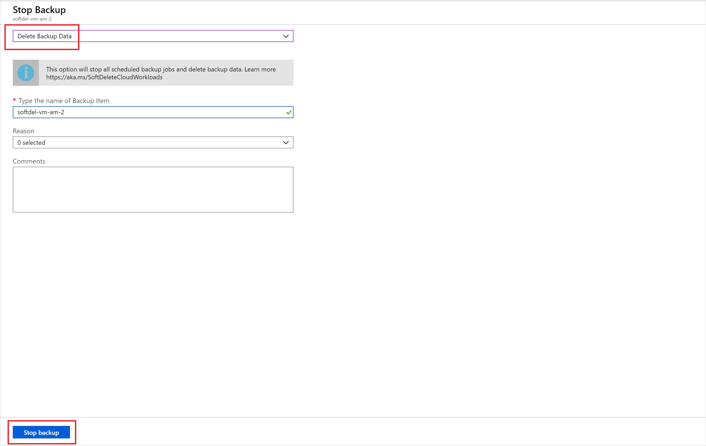
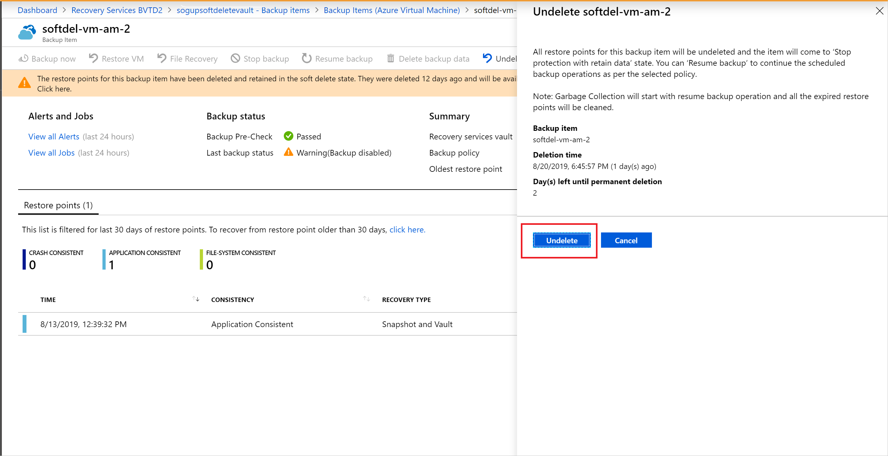
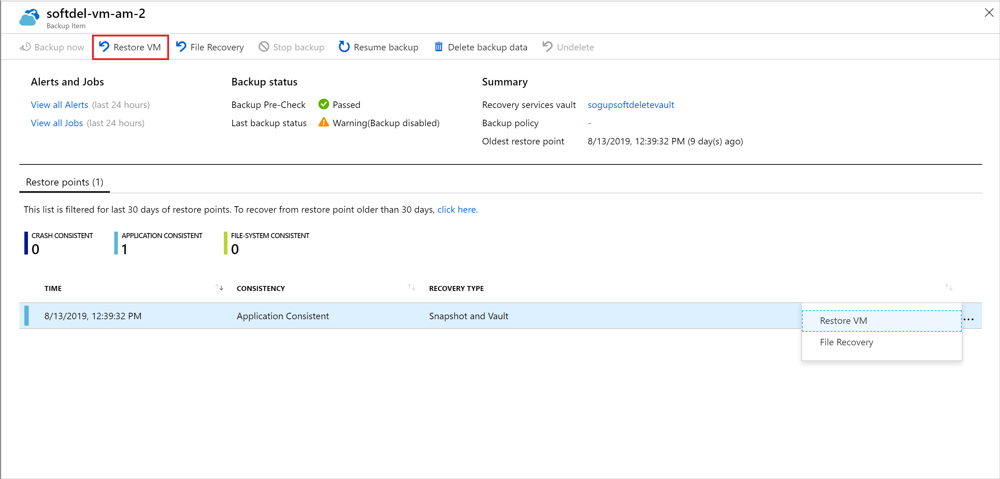
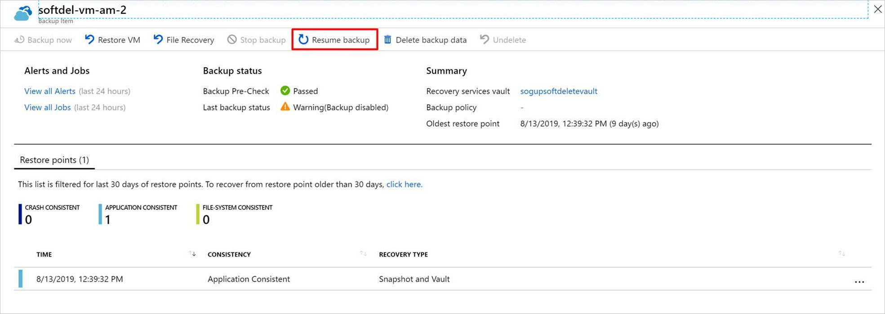

# Soft delete for virtual machines

Soft delete for VMs protects the backups of your VMs from unintended deletion. Even after the backups are deleted, they're preserved in soft-delete state for 14 additional days.

> [!NOTE]
> Soft delete only protects deleted backup data. If a VM is deleted without a backup, the soft-delete feature will not preserve the data. All resources should be protected with Azure Backup to ensure full resilience.
>

## Supported regions

Soft delete is currently supported in the West Central US, East Asia, Canada Central, Canada East, France Central, France South, Korea Central, Korea South, UK South, UK West, Australia East, Australia South East, North Europe, West US, West US2, Central US, South East Asia, North Central US, South Central US, Japan East, Japan West, India South, India Central, India West, East US 2, Switzerland North, Switzerland West, Norway West, Norway East, and all National regions.

## Soft delete for VMs using Azure portal

1. To delete the backup data of a VM, the backup must be stopped. In the Azure portal, go to your Recovery Services vault, right-click on the backup item and choose **Stop backup**.

   

2. In the following window, you'll be given a choice to delete or retain the backup data. If you choose **Delete backup data** and then **Stop backup**, the VM backup won't be permanently deleted. Rather, the backup data will be retained for 14 days in the soft deleted state. If **Delete backup data** is chosen, a delete email alert is sent to the configured email ID informing the user that 14 days remain of extended retention for backup data. Also, an email alert is sent on the 12th day informing that there are two more days left to resurrect the deleted data. The deletion is deferred until the 15th day, when permanent deletion will occur and a final email alert is sent informing about the permanent deletion of the data.

   

3. During those 14 days, in the Recovery Services vault, the soft deleted VM will appear with a red "soft-delete" icon next to it.

   

   > [!NOTE]
   > If any soft-deleted backup items are present in the vault, the vault cannot be deleted at that time. Try deleting the vault after the backup items are permanently deleted, and there is no item in soft deleted state left in the vault.

4. To restore the soft-deleted VM, it must first be undeleted. To undelete, choose the soft-deleted VM, and then select the option **Undelete**.

   

   A window will appear warning that if undelete is chosen, all restore points for the VM will be undeleted and available for performing a restore operation. The VM will be retained in a "stop protection with retain data" state with backups paused and backup data retained forever with no backup policy effective.

   

   At this point, you can also restore the VM by selecting **Restore VM** from the chosen restore point.  

   

   > [!NOTE]
   > Garbage collector will run and clean expired recovery points only after the user performs the **Resume backup** operation.

5. After the undelete process is completed, the status will return to "Stop backup with retain data" and then you can choose **Resume backup**. The **Resume backup** operation brings back the backup item in the active state, associated with a backup policy selected by the user defining the backup and retention schedules.

   

## Soft delete for VMs using Azure PowerShell

> [!IMPORTANT]
> The Az.RecoveryServices version required to use soft-delete using Azure PS is min 2.2.0. Use ```Install-Module -Name Az.RecoveryServices -Force``` to get the latest version.

As outlined above for Azure portal, the sequence of steps is same while using Azure PowerShell as well.

### Delete the backup item using Azure PowerShell

Delete the backup item using the [Disable-AzRecoveryServicesBackupProtection](/powershell/module/az.recoveryservices/disable-azrecoveryservicesbackupprotection) PS cmdlet.

```powershell
Disable-AzRecoveryServicesBackupProtection -Item $myBkpItem -RemoveRecoveryPoints -VaultId $myVaultID -Force

WorkloadName     Operation            Status               StartTime                 EndTime                   JobID
------------     ---------            ------               ---------                 -------                   -----
AppVM1           DeleteBackupData     Completed            12/5/2019 12:44:15 PM     12/5/2019 12:44:50 PM     0488c3c2-accc-4a91-a1e0-fba09a67d2fb
```

The 'DeleteState' of the backup item will change from 'NotDeleted' to 'ToBeDeleted'. The backup data will be retained for 14 days. If you wish to revert the delete operation, then undo-delete should be performed.

### Undoing the deletion operation using Azure PowerShell

First, fetch the relevant backup item that is in soft-delete state (that is, about to be deleted).

```powershell

Get-AzRecoveryServicesBackupItem -BackupManagementType AzureVM -WorkloadType AzureVM -VaultId $myVaultID | Where-Object {$_.DeleteState -eq "ToBeDeleted"}

Name                                     ContainerType        ContainerUniqueName                      WorkloadType         ProtectionStatus     HealthStatus         DeleteState
----                                     -------------        -------------------                      ------------         ----------------     ------------         -----------
VM;iaasvmcontainerv2;selfhostrg;AppVM1    AzureVM             iaasvmcontainerv2;selfhostrg;AppVM1       AzureVM              Healthy              Passed               ToBeDeleted

$myBkpItem = Get-AzRecoveryServicesBackupItem -BackupManagementType AzureVM -WorkloadType AzureVM -VaultId $myVaultID -Name AppVM1
```

Then, perform the undo-deletion operation using the [Undo-AzRecoveryServicesBackupItemDeletion](/powershell/module/az.recoveryservices/undo-azrecoveryservicesbackupitemdeletion) PS cmdlet.

```powershell
Undo-AzRecoveryServicesBackupItemDeletion -Item $myBKpItem -VaultId $myVaultID -Force

WorkloadName     Operation            Status               StartTime                 EndTime                   JobID
------------     ---------            ------               ---------                 -------                   -----
AppVM1           Undelete             Completed            12/5/2019 12:47:28 PM     12/5/2019 12:47:40 PM     65311982-3755-46b5-8e53-c82ea4f0d2a2
```

The 'DeleteState' of the backup item will revert to 'NotDeleted'. But the protection is still stopped. [Resume the backup](./backup-azure-vms-automation.md#change-policy-for-backup-items) to re-enable the protection.

## Soft delete for VMs using REST API

- Delete the backups using REST API as mentioned [here](backup-azure-arm-userestapi-backupazurevms.md#stop-protection-and-delete-data).
- If user wishes to undo these delete operations, refer to steps mentioned [here](backup-azure-arm-userestapi-backupazurevms.md#undo-the-stop-protection-and-delete-data).

## How to disable soft delete

Disabling this feature isn't recommended. The only circumstance where you should consider disabling soft delete is if you're planning on moving your protected items to a new vault, and can't wait the 14 days required before deleting and reprotecting (such as in a test environment.) For instructions on how to disable soft delete, see [Enabling and disabling soft delete](backup-azure-security-feature-cloud.md#enabling-and-disabling-soft-delete).

## Next steps

- Read the [frequently asked questions](backup-azure-security-feature-cloud.md#frequently-asked-questions) about soft delete
- Read about all the [security features in Azure Backup](security-overview.md)
