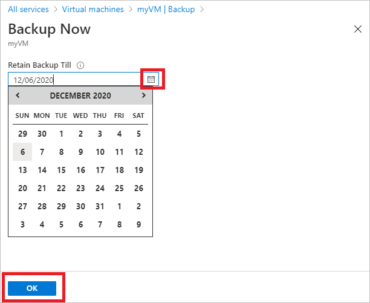

# Back up Azure virtual machines in Azure at scale

This tutorial details how to back up Azure virtual machines to a Recovery Services vault. Most of the work for backing up virtual machines is the preparation. Before you can back up (or protect) a virtual machine, you must complete the [prerequisites](backup-azure-arm-vms-prepare.md) to prepare your environment for protecting your VMs. 

> [!IMPORTANT]
> This tutorial assumes you have already created a resource group and an Azure virtual machine.

## Create a recovery services vault

A [Recovery Services vault](backup-azure-recovery-services-vault-overview.md) is a container that holds the recovery points for the items being backed up. A Recovery Services vault is an Azure resource that can be deployed and managed as part of an Azure resource group. In this tutorial, you create a Recovery Services vault in the same resource group as the virtual machine being protected.


The first time you use Azure Backup, you must register the Azure Recovery Service provider with your subscription. If you have already registered the provider with your subscription, go to the next step.

```powershell
Register-AzureRmResourceProvider -ProviderNamespace Microsoft.RecoveryServices
```

Create a Recovery Services vault with **New-AzureRmRecoveryServicesVault**. Be sure to specify the resource group name and location used when configuring the virtual machine that you want to back up. 

```powershell
New-AzureRmRecoveryServicesVault -Name myRSvault -ResourceGroupName "myResourceGroup" -Location "EastUS"
```

Many Azure Backup cmdlets require the Recovery Services vault object as an input. For this reason, it is convenient to store the Backup Recovery Services vault object in a variable. Then use **Set-AzureRmRecoveryServicesBackupProperties** to set the **-BackupStorageRedundancy** option to [Geo-Redundant Storage (GRS)](../storage/common/storage-redundancy.md#geo-redundant-storage). 

```powershell
$vault1 = Get-AzureRmRecoveryServicesVault –Name myRSVault
Set-AzureRmRecoveryServicesBackupProperties  -vault $vault1 -BackupStorageRedundancy GeoRedundant
```

## Back up Azure virtual machines

Before you can run the initial backup, you must set the vault context. The vault context is the type of data protected in the vault. When you create a Recovery Services vault, it comes with default protection and retention policies. The default protection policy triggers a backup job each day at a specified time. The default retention policy retains the daily recovery point for 30 days. For this tutorial, accept the default policy. 

Use **[Set-AzureRmRecoveryServicesVaultContext](https://docs.microsoft.com/powershell/module/azurerm.recoveryservices/set-azurermrecoveryservicesvaultcontext)** to set the vault context. Once the vault context is set, it applies to all subsequent cmdlets. 

```powershell
Get-AzureRmRecoveryServicesVault -Name myRSVault | Set-AzureRmRecoveryServicesVaultContext
```

Use **[Backup-AzureRmRecoveryServicesBackupItem](https://docs.microsoft.com/powershell/module/azurerm.recoveryservices.backup/backup-azurermrecoveryservicesbackupitem)** to trigger the backup job. The backup job creates a recovery point. If it is the initial backup, then the recovery point is a full backup. Subsequent backups create an incremental copy.

```powershell
$namedContainer = Get-AzureRmRecoveryServicesBackupContainer -ContainerType AzureVM -Status Registered -FriendlyName "V2VM"
$item = Get-AzureRmRecoveryServicesBackupItem -Container $namedContainer -WorkloadType AzureVM
$job = Backup-AzureRmRecoveryServicesBackupItem -Item $item
```

## Back up an Azure virtual machine with the Azure portal
The backup policy associated with the Recovery Services vault defines how often and when the backup operation runs. By default, the first scheduled backup is the initial backup. Until the initial backup occurs, the Last Backup Status on the **Backup Jobs** blade shows as **Warning(initial backup pending)**.


Unless your initial backup is due to begin soon, it is recommended that you run **Back up Now**. The following procedure starts from the vault dashboard. This procedure serves for running the initial backup job after you have completed all prerequisites. If the initial backup job has already been run, this procedure is not available. The associated backup policy determines the next backup job.  

To run the initial backup job:

1. On the vault dashboard, click the number under **Backup Items**, or click the **Backup Items** tile. <br/>
  

  The **Backup Items** blade opens.

  

2. On the **Backup Items** blade, select the item.

  

  The **Backup Items** list opens. <br/>

  

3. On the **Backup Items** list, click the ellipses **...** to open the Context menu.

  

  The Context menu appears.

  

4. On the Context menu, click **Backup now**.

  

  The Backup Now blade opens.

  

5. On the Backup Now blade, click the calendar icon, use the calendar control to select the last day this recovery point is retained, and click **Backup**.

  

  Deployment notifications let you know the backup job has been triggered, and that you can monitor the progress of the job on the Backup jobs page. Depending on the size of your VM, creating the initial backup may take a while.

6. To view or track the status of the initial backup, on the vault dashboard, on the **Backup Jobs** tile click **In progress**.

  

  The Backup Jobs blade opens.

  

  In the **Backup jobs** blade, you can see the status of all jobs. Check if the backup job for your VM is still in progress, or if it has finished. When a backup job is finished, the status is *Completed*.

  > [!NOTE]
  > As a part of the backup operation, the Azure Backup service issues a command to the backup extension in each VM to flush all writes and take a consistent snapshot.
  >
  >

## Troubleshooting errors
If you run into issues while backing up your virtual machine, see the [VM troubleshooting article](backup-azure-vms-troubleshoot.md) for help.

## Next steps
Now that you have protected your VM, see the following articles to learn about VM management tasks, and how to restore VMs.

* To modify the backup policy, see [Use AzureRM.RecoveryServices.Backup cmdlets to back up virtual machines](backup-azure-vms-automation.md#create-a-protection-policy).
* [Manage and monitor your virtual machines](backup-azure-manage-vms.md)
* [Restore virtual machines](backup-azure-arm-restore-vms.md)
