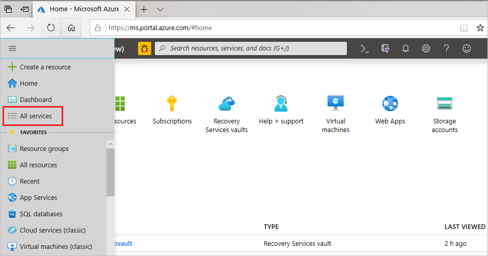
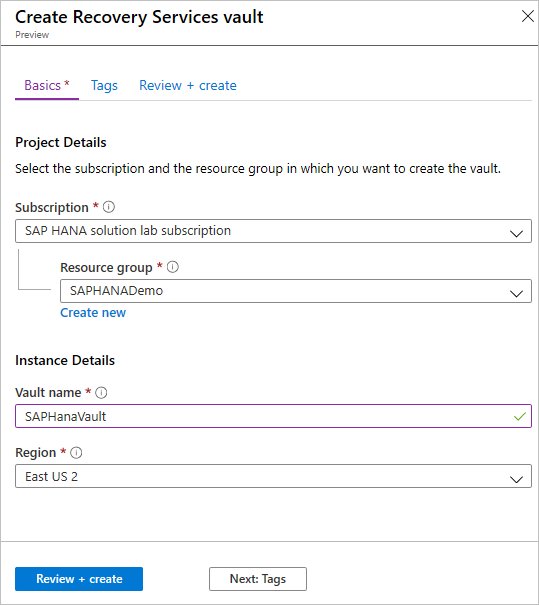
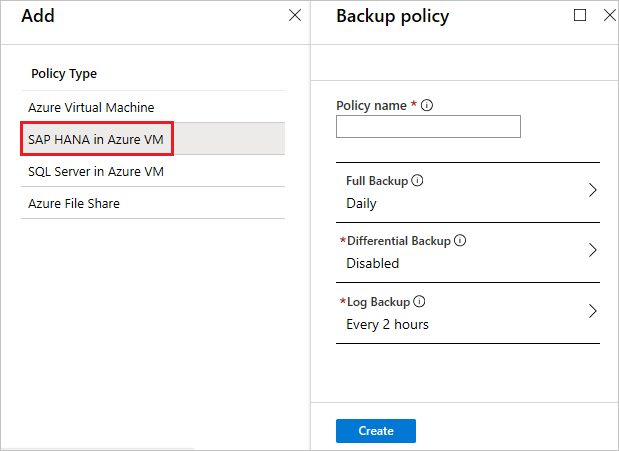

# Back up SAP HANA databases in an Azure VM

This tutorial shows you how to back up SAP HANA databases running on Azure VMs to an Azure Backup Recovery Services vault. In this article you'll learn how to:

> [!div class="checklist"]
>
> * Create and configure a vault
> * Discover databases
> * Configure backups

You can find [here](sap-hana-backup-support-matrix.md) all the scenarios that we currently support.

## Onboard to the public preview

Onboard to the public preview as follows:

* In the portal, register your subscription ID to the Recovery Services service provider by following [this article](https://docs.microsoft.com/azure/azure-resource-manager/resource-manager-register-provider-errors#solution-3---azure-portal).

* For PowerShell, run this cmdlet. It should complete as "Registered".

    ```powershell
    Register-AzProviderFeature -FeatureName "HanaBackup" –ProviderNamespace Microsoft.RecoveryServices
    ```

## Prerequisites

Make sure you do the following before configuring backups:

1. On the VM running the SAP HANA database, install and enable ODBC driver packages from the official SLES package/media using zypper, as follows:

```bash
sudo zypper update
sudo zypper install unixODBC
```

>[!NOTE]
> If you are not updating the repositories, make sure the version of unixODBC is minimum 2.3.4. To know the version of uniXODBC, run `odbcinst -j` as root
>

2. Allow connectivity from the VM to the internet, so that it can reach Azure, as described in the [procedure below](#set-up-network-connectivity).

3. Run the pre-registration script in the virtual machine where HANA is installed as a root user. [This script](https://aka.ms/scriptforpermsonhana) will set the [right permissions](#setting-up-permissions).

## Set up network connectivity

For all operations, the SAP HANA VM needs connectivity to Azure public IP addresses. VM operations (database discovery, configure backups, schedule backups, restore recovery points, and so on) can't work without connectivity. Establish connectivity by allowing access to the Azure datacenter IP ranges:

* You can download the [IP address ranges](https://www.microsoft.com/download/details.aspx?id=41653) for Azure datacenters, and then allow access to these IP addresses.
* If you're using network security groups (NSGs), you can use the AzureCloud [service tag](https://docs.microsoft.com/azure/virtual-network/security-overview#service-tags) to allow all Azure public IP addresses. You can use the [Set-AzureNetworkSecurityRule cmdlet](https://docs.microsoft.com/powershell/module/servicemanagement/azure/set-azurenetworksecurityrule?view=azuresmps-4.0.0)  to modify NSG rules.
* Port 443 should be added to the allow-list since the transport is via HTTPS.

## Setting up permissions

The pre-registration script performs the following actions:

1. Creates AZUREWLBACKUPHANAUSER in the HANA system and adds these required roles and permissions:
   * DATABASE ADMIN: to create new DBs during restore.
   * CATALOG READ: to read the backup catalog.
   * SAP_INTERNAL_HANA_SUPPORT: to access a few private tables.
2. Adds a key to Hdbuserstore for the HANA plug-in to handle all operations (database queries, restore operations, configuring and running backup).

To confirm the key creation, run the HDBSQL command on the HANA machine with SIDADM credentials:

```hdbsql
hdbuserstore list
```

The command output should display the {SID}{DBNAME} key, with the user shown as AZUREWLBACKUPHANAUSER.

>[!NOTE]
> Make sure you have a unique set of SSFS files under /usr/sap/{SID}/home/.hdb/. There should be only one folder in this path.
>

## Create a Recovery Service vault

A Recovery Services vault is an entity that stores the backups and recovery points created over time. The Recovery Services vault also contains the backup policies that are associated with the protected virtual machines.

To create a Recovery Services vault:

1. Sign in to your subscription in the [Azure portal](https://portal.azure.com/).

2. On the left menu, select **All services**



3. In the **All services** dialog box, enter **Recovery Services**. The list of resources filters according to your input. In the list of resources, select **Recovery Services vaults**.


4. On the **Recovery Services** vaults dashboard, select **Add**.


The **Recovery Services vault** dialog box opens. Provide values for the **Name, Subscription, Resource group,** and **Location**



* **Name**: The name is used to identify the recovery services vault and must be unique to the Azure subscription. Specify a name that has at least two, but not more than 50 characters. The name must start with a letter and consist only of letters, numbers, and hyphens. For this tutorial, we've used the name **SAPHanaVault**.
* **Subscription**: Choose the subscription to use. If you're a member of only one subscription, you'll see that name. If you're not sure which subscription to use, use the default (suggested) subscription. There are multiple choices only if your work or school account is associated with more than one Azure subscription. Here, we have used the **SAP HANA solution lab subscription** subscription.
* **Resource group**: Use an existing resource group or create a new one. Here, we have used **SAPHANADemo**.<br>
To see the list of available resource groups in your subscription, select **Use existing**, and then select a resource from the drop-down list box. To create a new resource group, select **Create new** and enter the name. For complete information about resource groups, see [Azure Resource Manager overview](https://docs.microsoft.com/azure/azure-resource-manager/resource-group-overview).
* **Location**: Select the geographic region for the vault. The vault must be in the same region as the Virtual Machine running SAP HANA. We have used **East US 2**.

5. Select **Review + Create**.

   

The Recovery services vault is now created.

## Discover the databases

1. In the vault, in **Getting Started**, click **Backup**. In **Where is your workload running?**, select **SAP HANA in Azure VM**.
2. Click **Start Discovery**. This initiates discovery of unprotected Linux VMs in the vault region. You will see the Azure VM that you want to protect.
3. In **Select Virtual Machines**, click the link to download the script that provides permissions for the Azure Backup service to access the SAP HANA VMs for database discovery.
4. Run the script on the VM hosting SAP HANA database(s) that you want to back up.
5. After running the script on the VM, in **Select Virtual Machines**, select the VM. Then click **Discover DBs**.
6. Azure Backup discovers all SAP HANA databases on the VM. During discovery, Azure Backup registers the VM with the vault, and installs an extension on the VM. No agent is installed on the database.

   

## Configure backup

Now that the databases we want to back up are discovered, let's enable backup.

1. Click **Configure Backup**.


2. In **Select items to back up**, select one or more databases that you want to protect, and then click **OK**.


3. In **Backup Policy > Choose backup policy**, create a new backup policy for the database(s), in accordance with the instructions in the next section.


4. After creating the policy, on the **Backup menu**, click **Enable backup**.

   

5. Track the backup configuration progress in the **Notifications** area of the portal.

## Creating a backup policy

A backup policy defines when backups are taken, and how long they're retained.

* A policy is created at the vault level.
* Multiple vaults can use the same backup policy, but you must apply the backup policy to each vault.

Specify the policy settings as follows:

1. In **Policy name**, enter a name for the new policy. In this case, enter **SAPHANA**.



2. In **Full Backup policy**, select a **Backup Frequency**. You can choose **Daily** or **Weekly**. For this tutorial, we chose the **Daily** backup.


3. In **Retention Range**, configure retention settings for the full backup.
   * By default, all options are selected. Clear any retention range limits you don't want to use and set those that you do.
   * The minimum retention period for any type of backup (full/differential/log) is seven days.
   * Recovery points are tagged for retention based on their retention range. For example, if you select a daily full backup, only one full backup is triggered each day.
   * The backup for a specific day is tagged and retained based on the weekly retention range and setting.
   * The monthly and yearly retention ranges behave in a similar way.
4. In the **Full Backup policy** menu, click **OK** to accept the settings.
5. Then select **Differential Backup** to add a differential policy.
6. In **Differential Backup policy**, select **Enable** to open the frequency and retention controls. We have enabled a differential backup every **Sunday** at **2:00 AM**, which is retained for **30 days**.

   

>[!NOTE]
>Incremental backups aren't currently supported.
>

7. Click **OK** to save the policy and return to the main **Backup policy** menu.
8. Select **Log Backup** to add a transactional log backup policy,
   * **Log Backup** is by default set to **Enable**. This cannot be disabled as SAP HANA manages all log backups.
   * We have set **2 hours** as the Backup schedule and **15 days** of retention period.

    

>[!NOTE]
> Log backups only begin to flow after one successful full backup is completed.
>

9. Click **OK** to save the policy and return to the main **Backup policy** menu.
10. After you finish defining the backup policy, click **OK**.

You have now successfully configured backup(s) for your SAP HANA database(s).

## Next Steps

* [Learn how](backup-azure-sap-hana-database.md#run-an-on-demand-backup) to run on-demand backups on SAP HANA databases running on Azure VMs
* [Learn how](sap-hana-db-restore.md) to Restore SAP HANA databases running on Azure VMs
* [Learn how](sap-hana-db-manage.md) to manage SAP HANA databases that are backed up using Azure Backup
* [Learn how](backup-azure-sap-hana-database-troubleshoot.md) to troubleshoot common issues when backing up SAP HANA databases
