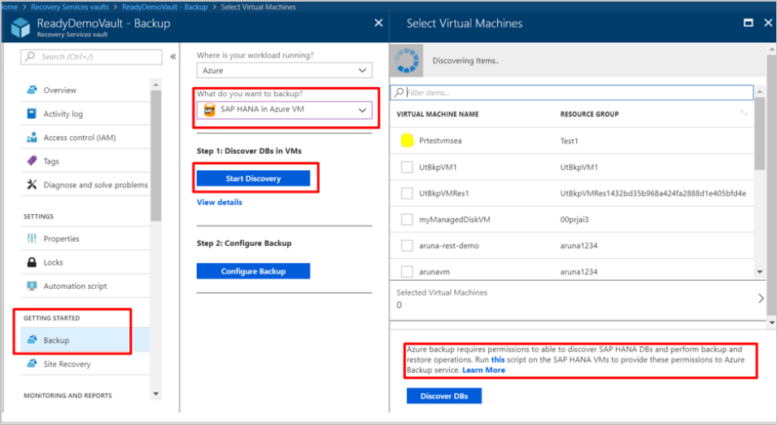
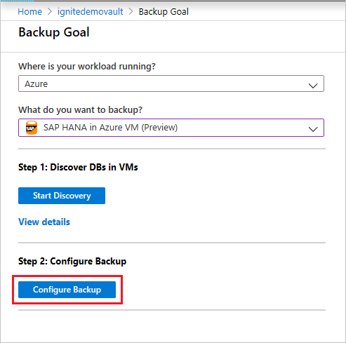
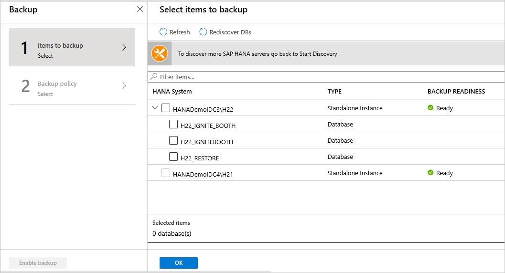
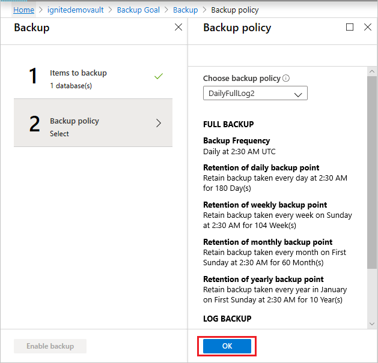

# Tutorial: Back up SAP HANA databases in an Azure VM

This tutorial shows you how to back up SAP HANA databases running on Azure VMs to an Azure Backup Recovery Services vault. In this article you'll learn how to:

> [!div class="checklist"]
>
> * Create and configure a vault
> * Discover databases
> * Configure backups

[Here](sap-hana-backup-support-matrix.md#scenario-support) are all the scenarios that we currently support.

>[!NOTE]
>As of August 1st, 2020, SAP HANA backup for RHEL (7.4, 7.6, 7.7 & 8.1) is generally available.

## Prerequisites

Make sure you do the following before configuring backups:

* Identify or create a [Recovery Services vault](backup-sql-server-database-azure-vms.md#create-a-recovery-services-vault) in the same region and subscription as the VM running SAP HANA.
* Allow connectivity from the VM to the internet, so that it can reach Azure, as described in the [set up network connectivity](#set-up-network-connectivity) procedure below.
* Ensure that the combined length of the SAP HANA Server VM name and the Resource Group name doesn't exceed 84 characters for Azure Resource Manager (ARM_ VMs (and 77 characters for classic VMs). This limitation is because some characters are reserved by the service.
* A key should exist in the **hdbuserstore** that fulfills the following criteria:
  * It should be present in the default **hdbuserstore**. The default is the `<sid>adm` account under which SAP HANA is installed.
  * For MDC, the key should point to the SQL port of **NAMESERVER**. In the case of SDC, it should point to the SQL port of **INDEXSERVER**
  * It should have credentials to add and delete users
  * Note that this key can be deleted after running the pre-registration script successfully
* Run the SAP HANA backup configuration script (pre-registration script) in the virtual machine where HANA is installed, as the root user. [This script](https://aka.ms/scriptforpermsonhana) gets the HANA system ready for backup. Refer to the [What the pre-registration script does](#what-the-pre-registration-script-does) section to understand more about the pre-registration script.
* If your HANA setup uses Private Endpoints, run the [pre-registration script](https://aka.ms/scriptforpermsonhana) with the *-sn* or *--skip-network-checks* parameter.

>[!NOTE]
>The preregistration script installs the **compat-unixODBC234** for SAP HANA workloads running on RHEL (7.4, 7.6 and 7.7) and **unixODBC** for RHEL 8.1. [This package is located in the RHEL for SAP HANA (for RHEL 7 Server) Update Services for SAP Solutions (RPMs) repo](https://access.redhat.com/solutions/5094721).  For an Azure Marketplace RHEL image the repo would be **rhui-rhel-sap-hana-for-rhel-7-server-rhui-e4s-rpms**.

## Set up network connectivity

For all operations, an SAP HANA database running on an Azure VM requires connectivity to the Azure Backup service, Azure Storage, and Azure Active Directory. This can be achieved by using private endpoints or by allowing access to the required public IP addresses or FQDNs. Not allowing proper connectivity to the required Azure services may lead to failure in operations like database discovery, configuring backup, performing backups, and restoring data.

The following table lists the various alternatives you can use for establishing connectivity:

| **Option**                        | **Advantages**                                               | **Disadvantages**                                            |
| --------------------------------- | ------------------------------------------------------------ | ------------------------------------------------------------ |
| Private endpoints                 | Allow backups over private IPs inside the virtual network  <br><br>   Provide granular control on the network and vault side | Incurs standard private endpoint [costs](https://azure.microsoft.com/pricing/details/private-link/) |
| NSG service tags                  | Easier to manage as range changes are automatically merged   <br><br>   No additional costs | Can be used with NSGs only  <br><br>    Provides access to the entire service |
| Azure Firewall FQDN tags          | Easier to manage since the required FQDNs are automatically managed | Can be used with Azure Firewall only                         |
| Allow access to service FQDNs/IPs | No additional costs   <br><br>  Works with all network security appliances and firewalls | A broad set of IPs or FQDNs may be required to be accessed   |
| Use an HTTP proxy                 | Single point of internet access to VMs                       | Additional costs to run a VM with the proxy software         |

More details around using these options are shared below:

### Private endpoints

Private endpoints allow you to connect securely from servers inside a virtual network to your Recovery Services vault. The private endpoint uses an IP from the VNET address space for your vault. The network traffic between your resources inside the virtual network and the vault travels over your virtual network and a private link on the Microsoft backbone network. This eliminates exposure from the public internet. Read more on private endpoints for Azure Backup [here](./private-endpoints.md).

### NSG tags

If you use Network Security Groups (NSG), use the *AzureBackup* service tag to allow outbound access to Azure Backup. In addition to the Azure Backup tag, you also need to allow connectivity for authentication and data transfer by creating similar [NSG rules](../virtual-network/security-overview.md#service-tags) for *Azure AD* and *Azure Storage*.  The following steps describe the process to create a rule for the Azure Backup tag:

1. In **All Services**, go to **Network security groups** and select the network security group.

1. Select **Outbound security rules** under **Settings**.

1. Select **Add**. Enter all the required details for creating a new rule as described in [security rule settings](../virtual-network/manage-network-security-group.md#security-rule-settings). Ensure the option **Destination** is set to *Service Tag* and **Destination service tag** is set to *AzureBackup*.

1. Select **Add**  to save the newly created outbound security rule.

You can similarly create [NSG outbound security rules](https://docs.microsoft.com/azure/virtual-network/network-security-groups-overview#service-tags) for Azure AD (*AzureActiveDirectory*) and Azure Storage(*Storage*). For more information on service tags, see [this article](../virtual-network/service-tags-overview.md).

### Azure Firewall tags

If you're using Azure Firewall, create an application rule by using the *AzureBackup* [Azure Firewall FQDN tag](../firewall/fqdn-tags.md). This allows all outbound access to Azure Backup.

### Allow access to service IP ranges

If you choose to allow access service IPs, refer to the IP ranges in the JSON file available [here](https://www.microsoft.com/download/confirmation.aspx?id=56519). You'll need to allow access to IPs corresponding to Azure Backup, Azure Storage, and Azure Active Directory.

### Allow access to service FQDNs

You can also use the following FQDNs to allow access to the required services from your servers:

| Service    | Domain  names to be accessed                             |
| -------------- | ------------------------------------------------------------ |
| Azure  Backup  | `*.backup.windowsazure.com`                             |
| Azure  Storage | `*.blob.core.windows.net` <br><br> `*.queue.core.windows.net` |
| Azure  AD      | Allow  access to FQDNs under sections 56 and 59 according to [this article](/office365/enterprise/urls-and-ip-address-ranges#microsoft-365-common-and-office-online) |

### Use an HTTP proxy server to route traffic

When you back up an SAP HANA database running on an Azure VM, the backup extension on the VM uses the HTTPS APIs to send management commands to Azure Backup and data to Azure Storage. The backup extension also uses Azure AD for authentication. Route the backup extension traffic for these three services through the HTTP proxy. Use the list of IPs and FQDNs mentioned above for allowing access to the required services. Authenticated proxy servers aren't supported.

## What the pre-registration script does

Running the pre-registration script performs the following functions:

* Based on your Linux distribution, the script installs or updates any necessary packages required by the Azure Backup agent.
* It performs outbound network connectivity checks with Azure Backup servers and dependent services like Azure Active Directory and Azure Storage.
* It logs into your HANA system using the user key listed as part of the [prerequisites](#prerequisites). The user key is used to create a backup user (AZUREWLBACKUPHANAUSER) in the HANA system and **the user key can be deleted after the pre-registration script runs successfully**.
* AZUREWLBACKUPHANAUSER is assigned these required roles and permissions:
  * DATABASE ADMIN (in the case of MDC) and BACKUP ADMIN (in the case of SDC): to create new databases during restore.
  * CATALOG READ: to read the backup catalog.
  * SAP_INTERNAL_HANA_SUPPORT: to access a few private tables.
* The script adds a key to **hdbuserstore** for AZUREWLBACKUPHANAUSER for the HANA backup plug-in to handle all operations (database queries, restore operations, configuring and running backup).

>[!NOTE]
> You can explicitly pass the user key listed as part of the [prerequisites](#prerequisites) as a parameter to the pre-registration script: `-sk SYSTEM_KEY_NAME, --system-key SYSTEM_KEY_NAME` <br><br>
>To learn what other parameters the script accepts, use the command `bash msawb-plugin-config-com-sap-hana.sh --help`

To confirm the key creation, run the HDBSQL command on the HANA machine with SIDADM credentials:

```hdbsql
hdbuserstore list
```

The command output should display the {SID}{DBNAME} key, with the user shown as AZUREWLBACKUPHANAUSER.

>[!NOTE]
> Make sure you have a unique set of SSFS files under `/usr/sap/{SID}/home/.hdb/`. There should be only one folder in this path.

## Create a Recovery Services vault

A Recovery Services vault is an entity that stores the backups and recovery points created over time. The Recovery Services vault also contains the backup policies that are associated with the protected virtual machines.

To create a Recovery Services vault:

1. Sign in to your subscription in the [Azure portal](https://portal.azure.com/).

2. On the left menu, select **All services**

   

3. In the **All services** dialog box, enter **Recovery Services**. The list of resources filters according to your input. In the list of resources, select **Recovery Services vaults**.

   

4. On the **Recovery Services** vaults dashboard, select **Add**.

   

   The **Recovery Services vault** dialog box opens. Provide values for the **Name, Subscription, Resource group,** and **Location**

   

   * **Name**: The name is used to identify the Recovery Services vault and must be unique to the Azure subscription. Specify a name that has at least two, but not more than 50 characters. The name must start with a letter and consist only of letters, numbers, and hyphens. For this tutorial, we've used the name **SAPHanaVault**.
   * **Subscription**: Choose the subscription to use. If you're a member of only one subscription, you'll see that name. If you're not sure which subscription to use, use the default (suggested) subscription. There are multiple choices only if your work or school account is associated with more than one Azure subscription. Here, we've used the **SAP HANA solution lab subscription** subscription.
   * **Resource group**: Use an existing resource group or create a new one. Here, we've used **SAPHANADemo**.<br>
   To see the list of available resource groups in your subscription, select **Use existing**, and then select a resource from the drop-down list box. To create a new resource group, select **Create new** and enter the name. For complete information about resource groups, see [Azure Resource Manager overview](../azure-resource-manager/management/overview.md).
   * **Location**: Select the geographic region for the vault. The vault must be in the same region as the Virtual Machine running SAP HANA. We've used **East US 2**.

5. Select **Review + Create**.

   

The Recovery Services vault is now created.

## Discover the databases

1. In the vault, in **Getting Started**, select **Backup**. In **Where is your workload running?**, select **SAP HANA in Azure VM**.
2. Select **Start Discovery**. This initiates discovery of unprotected Linux VMs in the vault region. You'll see the Azure VM that you want to protect.
3. In **Select Virtual Machines**, select the link to download the script that provides permissions for the Azure Backup service to access the SAP HANA VMs for database discovery.
4. Run the script on the VM hosting SAP HANA database(s) that you want to back up.
5. After running the script on the VM, in **Select Virtual Machines**, select the VM. Then select **Discover DBs**.
6. Azure Backup discovers all SAP HANA databases on the VM. During discovery, Azure Backup registers the VM with the vault, and installs an extension on the VM. No agent is installed on the database.

   

## Configure backup

Now that the databases we want to back up are discovered, let's enable backup.

1. Select **Configure Backup**.

   

2. In **Select items to back up**, select one or more databases that you want to protect, and then select **OK**.

   

3. In **Backup Policy > Choose backup policy**, create a new backup policy for the database(s), in accordance with the instructions in the next section.

   

4. After creating the policy, on the **Backup menu**, select **Enable backup**.

   

5. Track the backup configuration progress in the **Notifications** area of the portal.

## Creating a backup policy

A backup policy defines when backups are taken, and how long they're retained.

* A policy is created at the vault level.
* Multiple vaults can use the same backup policy, but you must apply the backup policy to each vault.

Specify the policy settings as follows:

1. In **Policy name**, enter a name for the new policy. In this case, enter **SAPHANA**.

   

2. In **Full Backup policy**, select a **Backup Frequency**. You can choose **Daily** or **Weekly**. For this tutorial, we chose the **Daily** backup.

   

3. In **Retention Range**, configure retention settings for the full backup.
   * By default, all options are selected. Clear any retention range limits you don't want to use and set those that you do.
   * The minimum retention period for any type of backup (full/differential/log) is seven days.
   * Recovery points are tagged for retention based on their retention range. For example, if you select a daily full backup, only one full backup is triggered each day.
   * The backup for a specific day is tagged and retained based on the weekly retention range and setting.
   * The monthly and yearly retention ranges behave in a similar way.
4. In the **Full Backup policy** menu, select **OK** to accept the settings.
5. Then select **Differential Backup** to add a differential policy.
6. In **Differential Backup policy**, select **Enable** to open the frequency and retention controls. We've enabled a differential backup every **Sunday** at **2:00 AM**, which is retained for **30 days**.

   

   >[!NOTE]
   >Incremental backups aren't currently supported.
   >

7. Select **OK** to save the policy and return to the main **Backup policy** menu.
8. Select **Log Backup** to add a transactional log backup policy,
   * **Log Backup** is by default set to **Enable**. This can't be disabled as SAP HANA manages all log backups.
   * We've set **2 hours** as the Backup schedule and **15 days** of retention period.

    

   >[!NOTE]
   > Log backups only begin to flow after one successful full backup is completed.
   >

9. Select **OK** to save the policy and return to the main **Backup policy** menu.
10. After you finish defining the backup policy, select **OK**.

You've now successfully configured backup(s) for your SAP HANA database(s).

## Next Steps

* Learn how to [run on-demand backups on SAP HANA databases running on Azure VMs](backup-azure-sap-hana-database.md#run-an-on-demand-backup)
* Learn how to [restore SAP HANA databases running on Azure VMs](sap-hana-db-restore.md)
* Learn how to [manage SAP HANA databases that are backed up using Azure Backup](sap-hana-db-manage.md)
* Learn how to [troubleshoot common issues when backing up SAP HANA databases](backup-azure-sap-hana-database-troubleshoot.md)
