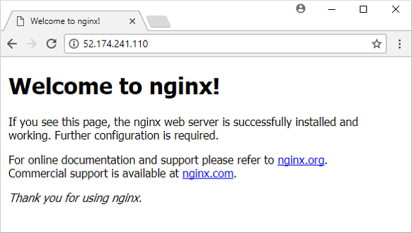
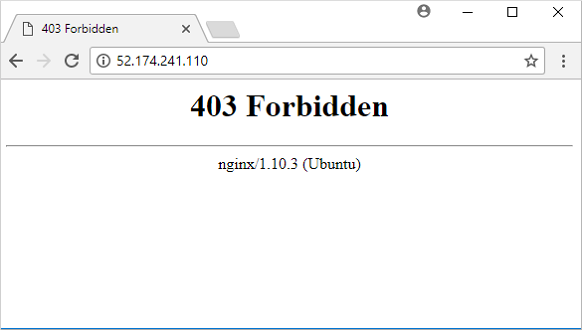

# Restore files to a virtual machine in Azure
Azure Backup creates recovery points that are stored in geo-redundant recovery vaults. When you restore from a recovery point, you can restore the whole VM or individual files. This article details how to restore individual files. You can also [restore a complete VM](tutorial-restore-disk.md). In this tutorial you learn how to:

> [!div class="checklist"]
> * List and select recovery points
> * Connect a recovery point to a VM
> * Restore files from a recovery point

[!INCLUDE [cloud-shell-try-it.md](../../includes/cloud-shell-try-it.md)]

If you choose to install and use the CLI locally, this tutorial requires that you are running the Azure CLI version 2.0.4 or later. Run `az --version` to find the version. If you need to install or upgrade, see [Install Azure CLI 2.0](/cli/azure/install-azure-cli). 


## Backup overview
When Azure initiates a backup, the backup extension on the VM takes a point-in-time snapshot. The backup extension is installed on the VM when the first backup is requested. Azure Backup can also take a snapshot of the underlying storage if the VM is not running when the backup takes place.

By default, Azure Backup takes a file system consistent backup. Once Azure Backup takes the snapshot, the data is transferred to the Recovery Services vault. To maximize efficiency, Azure Backup identifies and transfers only the blocks of data that have changed since the previous backup.

When the data transfer is complete, the snapshot is removed and a recovery point is created.


## Prerequisites
This tutorial requires a Linux VM that has been protected with Azure Backup. To simulate an accidental file deletion and recovery process, you delete a page from a web server. If you need a Linux VM that runs a webserver and has been protected with Azure Backup, see [Back up a virtual machine in Azure with the CLI](quick-backup-vm-cli.md).


## Delete a file from a VM
If you accidentally delete or make changes to a file, you can restore invididual files from a recovery point. This process allows you to browse all the file backed up in a recovery point and restore only the files you need. In this example, we delete a file from a web server to demonstrate the file-level recovery process.

1. To connect to your VM, obtain the IP address of your VM with [az vm show](/cli/azure/vm?view=azure-cli-latest#az_vm_show):

     ```azurecli-interactive
     az vm show --resource-group myResourceGroup --name myVM -d --query [publicIps] --o tsv
     ```

2. To confirm that your web site currently works, open a web browser to the public IP address of your VM. Leave the web browser window open.

    

3. Connect to your VM with SSH. Replace *publicIpAddress* with the public IP address that you obtained in a previous command:

    ```azurecli-interactive
    ssh publicIpAddress
    ```

4. Delete the default page from the web server at */var/www/html/index.nginx-debian.html*:

    ```azurecli-interactive
    sudo rm /var/www/html/index.nginx-debian.html
    ```

5. In your web browser, refresh the web page. The web site no longer loads the page, as shown in the following example:

    

6. Close the SSH session to your VM as follows:

    ```azurecli-interactive
    exit
    ```


## Generate file recovery script
To restore your files, Azure Backup provides a script to run on your VM that connects your recovery point as a local drive. You can browse this local drive, restore files to the VM itself, then disconnect the recovery point. Azure Backup then continues to back up your data based on the assigned policy for schedule and retention.

1. To list recovery points for your VM, use **az backup recoverypoint list**. In this example, we select the most recent recovery point with `--query [0].name` for the VM named *myVM* that is protected in *myRecoveryServicesVault*:

    ```azurecli-interactive
    az backup recoverypoint list \
        --resource-group myResourceGroup \
        --vault-name myRecoveryServicesVault \
        --container-name myVM \
        --item-name myVM \
        --query [0].name \
        --output tsv
    ```

2. To obtain the script that connects, or mounts, the recovery point to your VM, use **az backup restore files mount-rp**. The following example obtains the script for the VM named *myVM* that is protected in *myRecoveryServicesVault*. Replace *myRecoveryPointName* with the name of your recovery point that you obtained in the preceding command:

    ```azurecli-interactive
    az backup restore files mount-rp \
        --resource-group myResourceGroup \
        --vault-name myRecoveryServicesVault \
        --container-name myVM \
        --item-name myVM \
        --rp-name myRecoveryPointName
    ```

3. The script is downloaded and a password is displayed, as in the following example:

    ```
    File downloaded: myVM_we_1571974050985163527.sh. Use password c068a041ce12465
    ```

    To transfer the script to your VM, use Secure Copy (SCP). Provide the name of your downloaded script, and replace *publicIpAddress* with the public IP address of your VM. Make sure you include the trailing `:` at the end of the SCP command as follows:

    ```bash
    scp myVM_we_1571974050985163527.sh 52.174.241.110:
    ```


## Restore file to your VM
With the recovery script copied to your VM, you can now connect the recovery point and restore files.

1. Connect to your VM with SSH. Replace *publicIpAddress* with the public IP address of your VM as follows:

    ```azurecli-interactive
    ssh publicIpAddress
    ```

2. To allow your script to run correctly, add execute permissions with **chmod**. Enter the name of your own script as follows:

    ```azurecli-interactive
    chmod +x myVM_we_1571974050985163527.sh
    ```

3. To mount the recovery point, run the script. Again, enter the name of your own script as follows:

    ```azurecli-interactive
    ./myVM_we_1571974050985163527.sh
    ```

    As the script runs, you are prompted to enter a password to access the recovery point. Enter the password that was output from the **az backup restore files mount-rp** command that generated the recovery script.

4. The output from the script gives you the path for the recovery point. The following example output shows that the recovery point is mounted at */home/azureuser/myVM-20170919213536/Volume1*:

    ```
    Microsoft Azure VM Backup - File Recovery
    ______________________________________________
    Please enter the password as shown on the portal to securely connect to the recovery point. : c068a041ce12465
    
    Connecting to recovery point using ISCSI service...
    
    Connection succeeded!
    
    Please wait while we attach volumes of the recovery point to this machine...
    
    ************ Volumes of the recovery point and their mount paths on this machine ************
    
    Sr.No.  |  Disk  |  Volume  |  MountPath
    
    1)  | /dev/sdc  |  /dev/sdc1  |  /home/azureuser/myVM-20170919213536/Volume1
    
    ************ Open File Explorer to browse for files. ************
    ```

5. Use **cp** to copy the NGINX default web page from the mounted recovery point back to the original file location. Replace the */home/azureuser/myVM-20170919213536/Volume1* mount point with your own location as follows:

    ```azurecli-interactive
    sudo cp /home/azureuser/myVM-20170919213536/Volume1/var/www/html/index.nginx-debian.html /var/www/html/
    ```

6. In the web browser open to your web site, refresh the page. The web site now loads correctly again, as shown in the following example:

    

7. Close the SSH session to your VM as follows:

    ```azurecli-interactive
    exit
    ```

    Unmount the recovery point from your VM with **az backup restore files unmount-rp**. The following example unmounts the recovery point from the VM named *myVM* in *myRecoveryServicesVault*. Replace *myRecoveryPointName* with the name of your recovery point that you obtained in the previous commands:
    
    ```azurecli-interactive
    az backup restore files unmount-rp \
        --resource-group myResourceGroup \
        --vault-name myRecoveryServicesVault \
        --container-name myVM \
        --item-name myVM \
        --rp-name myRecoveryPointName
    ```

## Next steps
In this tutorial, you connected a recovery point to a VM and restored files for a web server. You learned how to:

> [!div class="checklist"]
> * List and select recovery points
> * Connect a recovery point to a VM
> * Restore files from a recovery point

Advance to the next tutorial to learn about how to back up on-premises servers.

> [!div class="nextstepaction"]
> [Back up on-premises server to Azure](tutorial-backup-windows-server-to-azure.md)

