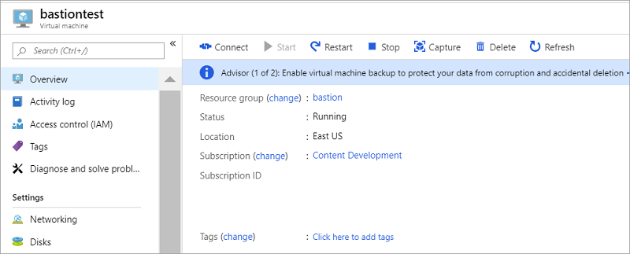
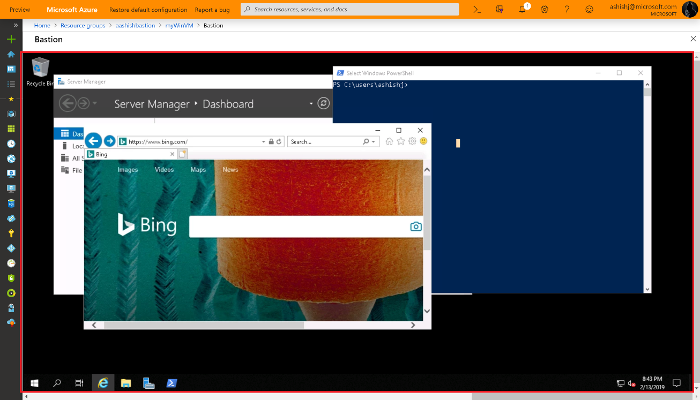
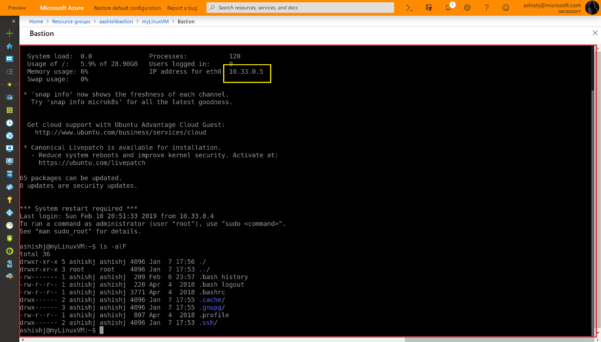

# Connect to a virtual machine by using Azure Bastion (preview)

This article shows you how to securely and seamlessly RDP & SSH to your VMs in an Azure virtual network. You can connect to a VM directly from the Azure portal. When using Azure Bastion, VMs do not require a client, agent, or additional software. For more information about Azure Bastion, see the [Overview](bastion-overview.md).

In the preview, Bastion assumes that you are using RDP to connect to a Windows VM, and SSH to connect to your Linux VMs.

> [!IMPORTANT]
> This public preview is provided without a service level agreement and should not be used for production workloads. Certain features may not be supported, may have constrained capabilities, or may not be available in all Azure locations. See the [Supplemental Terms of Use for Microsoft Azure Previews](https://azure.microsoft.com/support/legal/preview-supplemental-terms/) for details.
>

## Before you begin

Verify that you have set up your Azure Bastion host for the virtual network in which the VM resides. For more information, see [Create an Azure Bastion host](bastion-create-host-portal.md).

Once the Bastion service is provisioned and deployed in your virtual network, you can use it to seamlessly connect to any VM in this virtual network.

## Connect using RDP (Windows)

1. In the [Azure portal](http://aka.ms/BastionHost) for the Bastion preview, navigate to the virtual machine that you want to connect to, then click **Connect**. The VM should be a Windows virtual machine when using an RDP connection.

    

1. After you click Connect, a side bar appears that has three tabs – RDP (legacy), SSH (legacy), and Bastion (new). If Bastion was provisioned for the virtual network, the Bastion tab is active by default. If you did not provision Bastion for the virtual network, you can click the link to configure Bastion. For configuration instructions, see [Configure Bastion](bastion-create-host-portal.md).

    

1. Enter the username and password for your virtual machine, then click **Connect**. The RDP connection to this virtual machine via Bastion will open directly in the Azure portal (over HTML5) using port 443 and the Bastion service.

    
 
## Connect using SSH (Linux)

1. In the [Azure portal](http://aka.ms/BastionHost) for the Bastion preview, navigate to the virtual machine that you want to connect to, then click **Connect**. The VM should be a Linux virtual machine when using an SSH connection.

    

1. After you click Connect, a side bar appears that has three tabs – RDP (legacy), SSH (legacy), and Bastion (new). If Bastion was provisioned for the virtual network, the Bastion tab is active by default. If you did not provision Bastion for the virtual network, you can click the link to configure Bastion. For configuration instructions, see [Configure Bastion](bastion-create-host-portal.md).

    

1. Enter the username and password for your virtual machine, then click **Connect**. The SSH connection to this virtual machine via Bastion will open directly in the Azure portal (over HTML5) using port 443 and the Bastion service.

    

## Next steps

Read the [Bastion FAQ](bastion-faq.md)