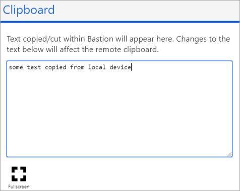
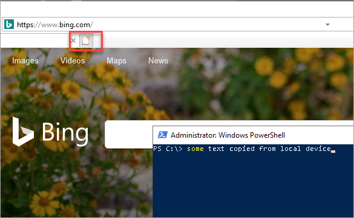
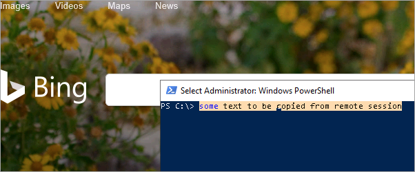
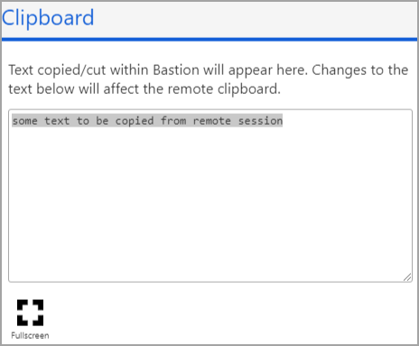

# Working with VMs using Azure Bastion (preview)

This article helps you work with VMs. Before you work with a VM, make sure you have followed the steps to [Create a Bastion host](bastion-create-host-portal.md) and have connected to the VM that you want to work with via either [RDP](bastion-connect-vm-rdp.md) or [SSH](bastion-connect-vm-ssh.md).

> [!IMPORTANT]
> This public preview is provided without a service level agreement and should not be used for production workloads. Certain features may not be supported, may have constrained capabilities, or may not be available in all Azure locations. See the [Supplemental Terms of Use for Microsoft Azure Previews](https://azure.microsoft.com/support/legal/preview-supplemental-terms/) for details.
>

## Resize a session to full screen

You can resize the remote session from the Browser to full-screen for a more productive seamless experience.

1. During the remote session, launch the Bastion clipboard access tool palette by selecting the two arrows that located on the left center of the session.

    

2. Select the Fullscreen button on the palette to switch the session to a full screen experience. Once you switch, the session will reinitialize to full screen.

##  Copy and paste text

This section shows you how copy and paste text across local devices and remote sessions.

For browsers that support the advanced Clipboard API access, you can copy and paste text between your local device and the remote session in the same way you copy and paste between applications on your local device. For other browsers, you can use the Bastion clipboard access tool palette.

Only text copy/paste is supported. For direct copy and paste, your browser may prompt you for clipboard access when the Bastion session is being initialized. **Allow** the web page to access the clipboard.

### Copy to a remote session

After connecting to the virtual machine using the [Azure portal](https://aka.ms/BastionHost) for the Bastion preview:

1. Copy the text/content from the local device into local clipboard.
1. During the remote session, launch the Bastion clipboard access tool palette by selecting the two arrows. The arrows are located on the left center of the session.

    

    

1. Typically, the copied text automatically shows on the Bastion copy paste palette. If your text is not there, then paste the text in the text area on the palette.
1. Once the text is in the text area, you can paste it to the remote session.

    

### Copy from a remote session

After connecting to the virtual machine using the [Azure portal](https://aka.ms/BastionHost) for the Bastion preview:

1. Copy the text/content from the remote session into remote clipboard (using Ctrl-C).

    

1. During the remote session, launch the Bastion clipboard access tool palette by selecting the two arrows. The arrows are located on the left center of the session.

    

1. Typically, the copied text automatically shows on the Bastion copy paste palette. If your text is not there, then paste the text in the text area on the palette.
1. Once the text is in the text area, you can paste it to the local device.

    
 
## Next steps

Read the [Bastion FAQ](bastion-faq.md).