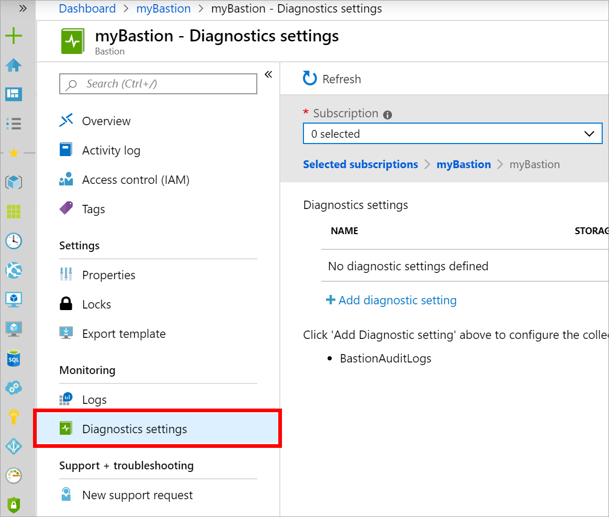
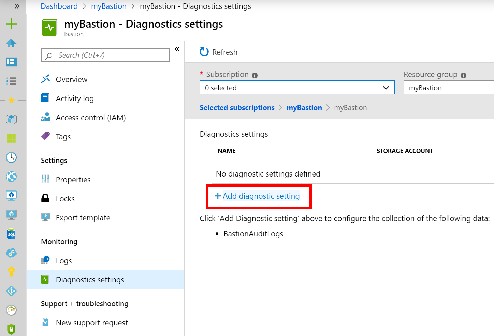
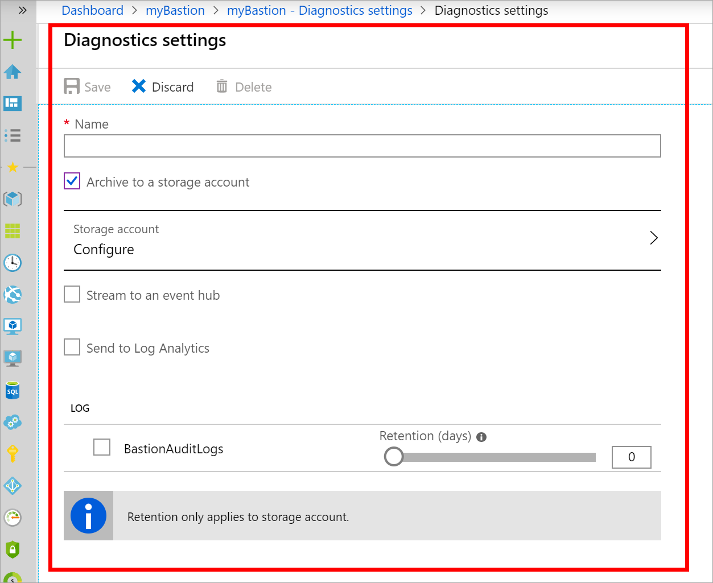
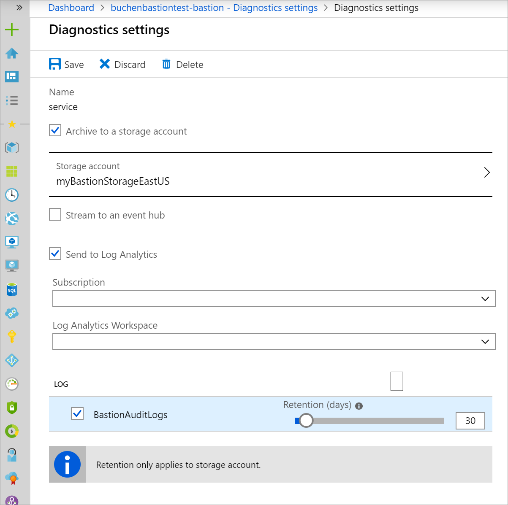
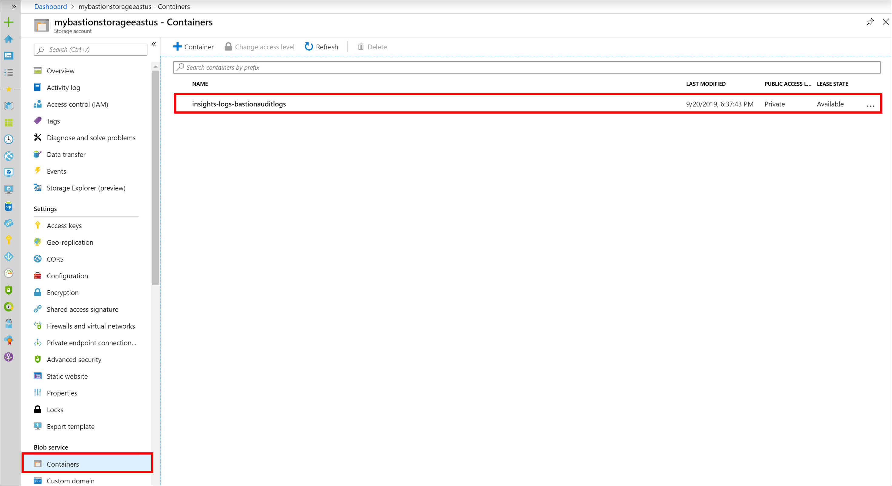

# Session monitoring and management for Azure Bastion

Once the Bastion service is provisioned/deployed in your virtual network, you can use it to seamlessly connect to any VM in this virtual network. As users connect to workloads, Azure Bastion can be used to monitor the remote sessions and take quick management actions. Azure Bastion session monitoring lets you view which users are connected to which VMs from what IPs and since when, apart from other details. The session management experience lets you select an ongoing session and force-disconnect or delete a session to disconnect a user from that ongoing session.

## <a name="monitor"></a>Monitor remote sessions

1. In the [Azure portal](azure portal), navigate to your Azure Bastion resource and select **Sessions** from the Azure Bastion page.

   
2. Select **Diagnostics settings**, then select **+Add diagnostic setting** to add a destination for the logs.

   
3. On the **Diagnostics settings** page, select the type of storage account to be used for storing diagnostics logs.

   
4. When you complete the settings, it will look similar to this example:

   

## <a name="view"></a>View diagnostics log

To access your diagnostics logs, you can directly use the storage account that you specified while enabling the diagnostics settings.

1. Navigate to your storage account resource, then to **Containers**. You see the **insights-logs-bastionauditlogs** blob created in your storage account blob container.

   
2. As you navigate to inside the container, you see various folders in your blog.  These folders indicate the resource hierarchy for your Azure Bastion resource.

   
3. Navigate to the full hierarchy of your Azure Bastion resource whose diagnostics logs you wish to access/view. The ‘y=’, ‘m=’, ‘d=’, ‘h=’ and ‘m=’ indicate the year, month, day, hour, and minute respectively for the diagnostic logs.

   
4. Locate the json file created by Azure Bastion that contains the diagnostics log data for the time-period navigated to.

5. Download the json file from your storage blob container.  An example entry from the json file is shown below for reference:

   ```json
   { 
   "time":"2019-10-03T16:03:34.776Z",
   "resourceId":"/SUBSCRIPTIONS/<subscripionID>/RESOURCEGROUPS/MYBASTION/PROVIDERS/MICROSOFT.NETWORK/BASTIONHOSTS/MYBASTION-BASTION",
   "operationName":"Microsoft.Network/BastionHost/connect",
   "category":"BastionAuditLogs",
   "level":"Informational",
   "location":"eastus",
   "properties":{ 
      "userName":"<username>",
      "userAgent":"Mozilla/5.0 (Windows NT 10.0; Win64; x64) AppleWebKit/537.36 (KHTML, like Gecko) Chrome/77.0.3865.90 Safari/537.36",
      "clientIpAddress":"131.107.159.86",
      "clientPort":24039,
      "protocol":"ssh",
      "targetResourceId":"/SUBSCRIPTIONS/<subscripionID>/RESOURCEGROUPS/MYBASTION/PROVIDERS/MICROSOFT.COMPUTE/VIRTUALMACHINES/LINUX-KEY",
      "subscriptionId":"<subscripionID>",
      "message":"Successfully Connected.",
      "resourceType":"VM",
      "targetVMIPAddress":"172.16.1.5",
      "tunnelId":"<tunnelID>"
   },
   "FluentdIngestTimestamp":"2019-10-03T16:03:34.0000000Z",
   "Region":"eastus",
   "CustomerSubscriptionId":"<subscripionID>"
   }
   ```

## Next steps

Read the [Bastion FAQ](bastion-faq.md).
