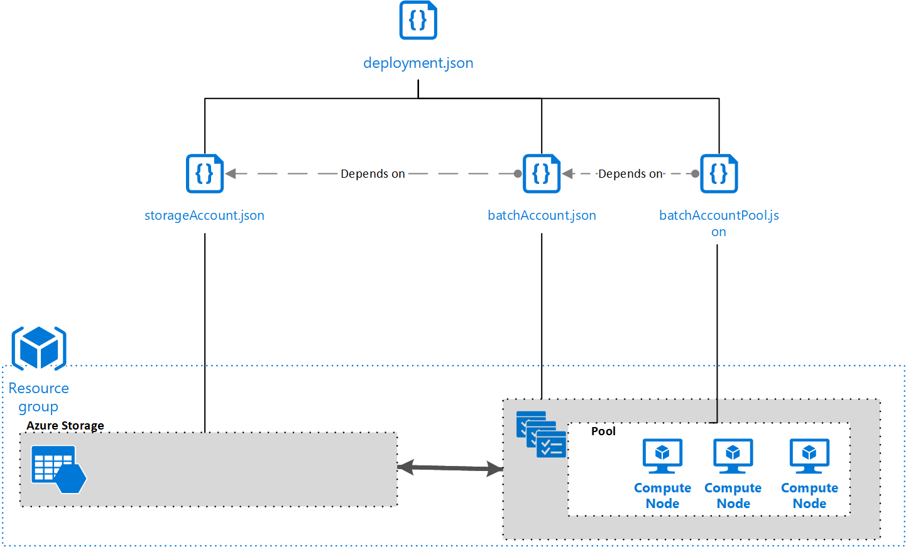
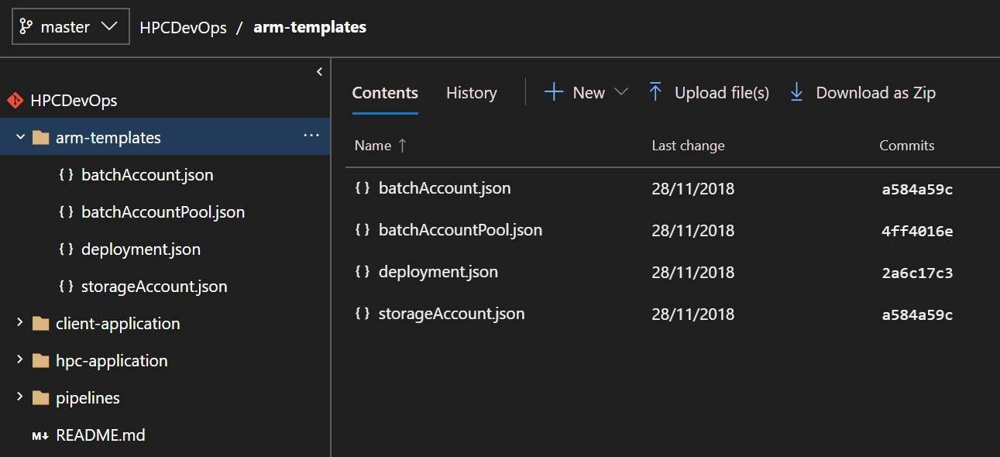
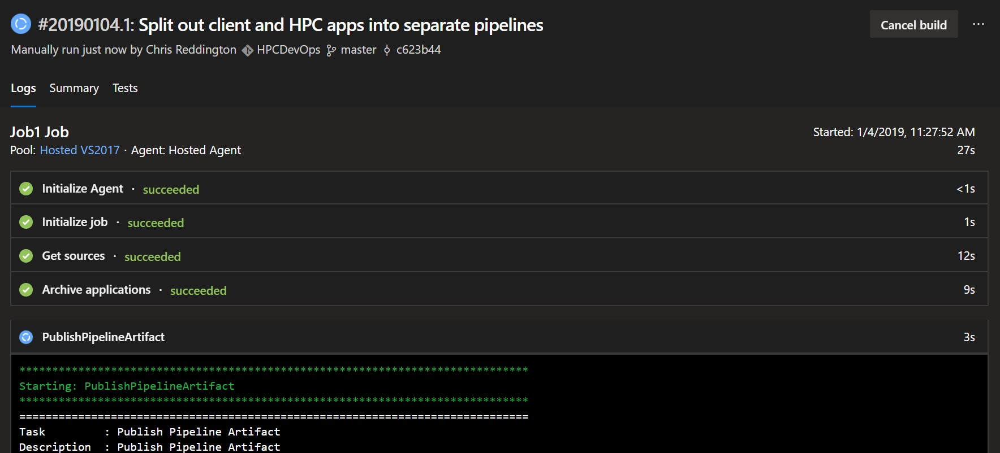
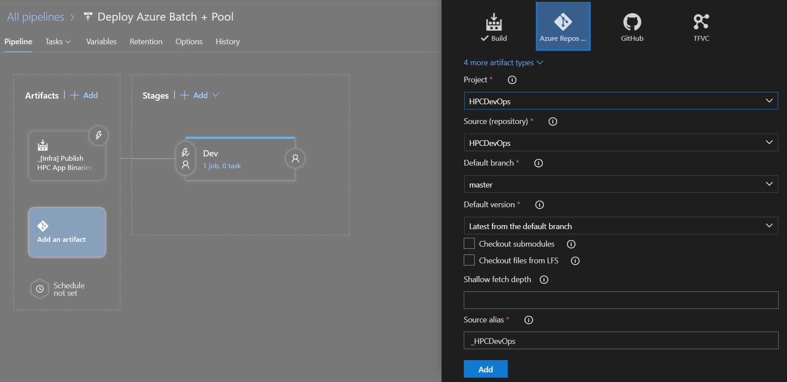
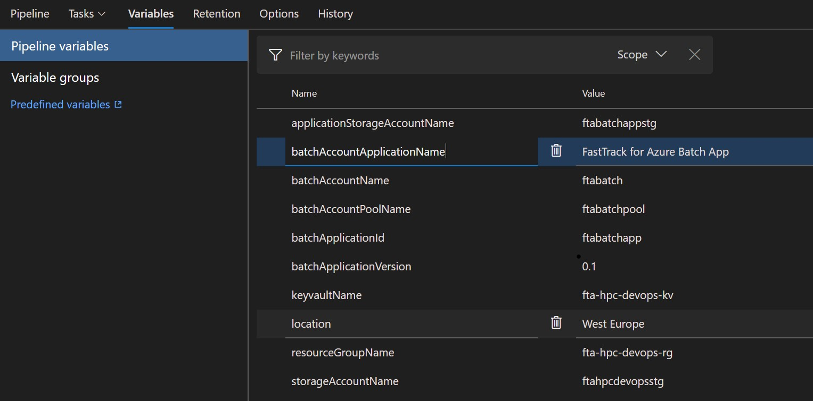
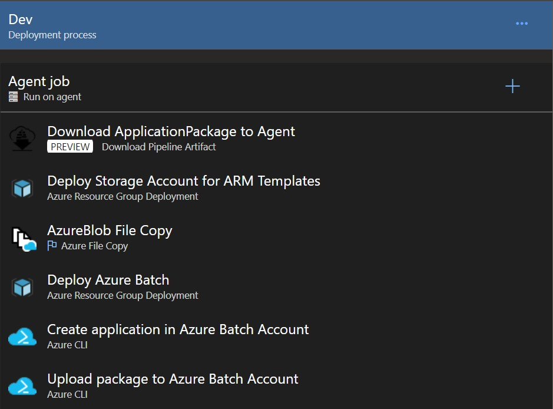

# Use Azure Pipelines to build and deploy HPC solutions

Azure DevOps Services provide a range of tools used by development teams when building a custom application. Tools provided by Azure DevOps can translate into automated building and testing of high performance compute solutions. This article demonstrates how to set up a continuous integration (CI) and continuous deployment (CD) using Azure Pipelines for a high performance compute solution deployed on Azure Batch.

Azure Pipelines provides a range of modern CI/CD processes for building, deploying, testing, and monitoring software. These processes accelerate your software delivery, allowing you to focus on your code rather than support infrastructure and operations.

## Create an Azure Pipeline

In this example, we will create a build and release pipeline to deploy an Azure Batch infrastructure and release an application package. Assuming that the code is developed locally, this is the general deployment flow:


### Setup

To follow the steps in this article, you need an Azure DevOps organization and a team project.

* [Create an Azure DevOps Organization](/azure/devops/organizations/accounts/create-organization?view=azure-devops)
* [Create a project in Azure DevOps](/azure/devops/organizations/projects/create-project?view=azure-devops)

### Source control for your environment

Source control allows teams to track changes made to the codebase and inspect previous versions of the code.

Typically, source control is thought of hand-in-hand with software code. How about the underlying infrastructure? This brings us to Infrastructure as Code, where we will use Azure Resource Manager templates or other open-source alternatives to declaratively define our underlying infrastructure.

This sample heavily relies on a number of Resource Manager Templates (JSON Documents) and existing binaries. You can copy these examples into your repository and push them to Azure DevOps.

The codebase structure used in this sample resembles the following;

* An **arm-templates** folder, containing a number of Azure Resource Manager templates. The templates are explained in this article.
* A **client-application** folder, which is a copy of the [Azure Batch .NET File Processing with ffmpeg](https://github.com/Azure-Samples/batch-dotnet-ffmpeg-tutorial) sample. This is not needed for this article.
* An **hpc-application** folder, which is the Windows 64-bit version of [ffmpeg 4.3.1](https://www.gyan.dev/ffmpeg/builds/packages/ffmpeg-4.3.1-2020-09-21-full_build.zip).
* A **pipelines** folder. This contains a YAML file outlining our build process. This is discussed in the article.

This section assumes you are familiar with version control and designing Resource Manager templates. If you aren't familiar with these concepts, see the following pages for more information.

* [What is source control?](/azure/devops/user-guide/source-control?view=azure-devops)
* [Understand the structure and syntax of Azure Resource Manager Templates](../azure-resource-manager/templates/template-syntax.md)

#### Azure Resource Manager templates

This example leverages multiple Resource Manager templates to deploy our solution. To do this, we use a number of capability templates (similar to units or modules) that implement a specific piece of functionality. We also use an end-to-end solution template which is responsible for bringing those underlying capabilities together. There are a couple of benefits to this approach:

* The underlying capability templates can be individually unit tested.
* The underlying capability templates can be defined as a standard inside of an organization, and be reused in multiple solutions.

For this example, there is an end-to-end solution template (deployment.json) that deploys three templates. The underlying templates are capability templates, responsible for deploying a specific aspect of the solution.



The first template that we will look at is for an Azure Storage Account. Our solution requires a storage account to deploy the application to our Batch Account. It is worth being aware of the [Resource Manager template reference guide for Microsoft.Storage resource types](/azure/templates/microsoft.storage/allversions) when building Resource Manager templates for Storage Accounts.

```json
{
    "$schema": "https://schema.management.azure.com/schemas/2015-01-01/deploymentTemplate.json#",
    "contentVersion": "1.0.0.0",
    "parameters": {
        "accountName": {
            "type": "string",
            "metadata": {
                 "description": "Name of the Azure Storage Account"
             }
         }
    },
    "variables": {},
    "resources": [
        {
            "type": "Microsoft.Storage/storageAccounts",
            "name": "[parameters('accountName')]",
            "sku": {
                "name": "Standard_LRS"
            },
            "apiVersion": "2018-02-01",
            "location": "[resourceGroup().location]",
            "properties": {}
        }
    ],
    "outputs": {
        "blobEndpoint": {
          "type": "string",
          "value": "[reference(resourceId('Microsoft.Storage/storageAccounts', parameters('accountName'))).primaryEndpoints.blob]"
        },
        "resourceId": {
          "type": "string",
          "value": "[resourceId('Microsoft.Storage/storageAccounts', parameters('accountName'))]"
        }
    }
}
```

Next, we will look at the Azure Batch Account template. The Azure Batch Account acts as a platform to run numerous applications across pools (groupings of machines). It is worth being aware of the [Resource Manager template reference guide for Microsoft.Batch resource types](/azure/templates/microsoft.batch/allversions) when building Resource Manager templates for Batch Accounts.

```json
{
    "$schema": "https://schema.management.azure.com/schemas/2015-01-01/deploymentTemplate.json#",
    "contentVersion": "1.0.0.0",
    "parameters": {
        "batchAccountName": {
           "type": "string",
           "metadata": {
                "description": "Name of the Azure Batch Account"
            }
        },
        "storageAccountId": {
           "type": "string",
           "metadata": {
                "description": "ID of the Azure Storage Account"
            }
        }
    },
    "variables": {},
    "resources": [
        {
            "name": "[parameters('batchAccountName')]",
            "type": "Microsoft.Batch/batchAccounts",
            "apiVersion": "2017-09-01",
            "location": "[resourceGroup().location]",
            "properties": {
              "poolAllocationMode": "BatchService",
              "autoStorage": {
                  "storageAccountId": "[parameters('storageAccountId')]"
              }
            }
          }
    ],
    "outputs": {}
}
```

The next template shows an example creating an Azure Batch Pool (the backend machines to process our applications). It is worth being aware of the [Resource Manager template reference guide for Microsoft.Batch resource types](/azure/templates/microsoft.batch/allversions) when building Resource Manager templates for Batch Account Pools.

```json
{
    "$schema": "https://schema.management.azure.com/schemas/2015-01-01/deploymentTemplate.json#",
    "contentVersion": "1.0.0.0",
    "parameters": {
        "batchAccountName": {
           "type": "string",
           "metadata": {
                "description": "Name of the Azure Batch Account"
           }
        },
        "batchAccountPoolName": {
            "type": "string",
            "metadata": {
                 "description": "Name of the Azure Batch Account Pool"
             }
         }
    },
    "variables": {},
    "resources": [
        {
            "name": "[concat(parameters('batchAccountName'),'/', parameters('batchAccountPoolName'))]",
            "type": "Microsoft.Batch/batchAccounts/pools",
            "apiVersion": "2017-09-01",
            "properties": {
                "deploymentConfiguration": {
                    "virtualMachineConfiguration": {
                        "imageReference": {
                            "publisher": "Canonical",
                            "offer": "UbuntuServer",
                            "sku": "18.04-LTS",
                            "version": "latest"
                        },
                        "nodeAgentSkuId": "batch.node.ubuntu 18.04"
                    }
                },
                "vmSize": "Standard_D1_v2"
            }
          }
    ],
    "outputs": {}
}
```

Finally, we have a template that acts similar to an orchestrator. This template is responsible for deploying the capability templates.

You can also find out more about [creating linked Azure Resource Manager templates](../azure-resource-manager/templates/deployment-tutorial-linked-template.md) in a separate article.

```json
{
    "$schema": "https://schema.management.azure.com/schemas/2015-01-01/deploymentTemplate.json#",
    "contentVersion": "1.0.0.0",
    "parameters": {
        "templateContainerUri": {
           "type": "string",
           "metadata": {
                "description": "URI of the Blob Storage Container containing the Azure Resouce Manager templates"
            }
        },
        "templateContainerSasToken": {
           "type": "string",
           "metadata": {
                "description": "The SAS token of the container containing the Azure Resouce Manager templates"
            }
        },
        "applicationStorageAccountName": {
            "type": "string",
            "metadata": {
                 "description": "Name of the Azure Storage Account"
            }
         },
        "batchAccountName": {
            "type": "string",
            "metadata": {
                 "description": "Name of the Azure Batch Account"
            }
         },
         "batchAccountPoolName": {
             "type": "string",
             "metadata": {
                  "description": "Name of the Azure Batch Account Pool"
              }
          }
    },
    "variables": {},
    "resources": [
        {
            "apiVersion": "2017-05-10",
            "name": "storageAccountDeployment",
            "type": "Microsoft.Resources/deployments",
            "properties": {
                "mode": "Incremental",
                "templateLink": {
                  "uri": "[concat(parameters('templateContainerUri'), '/storageAccount.json', parameters('templateContainerSasToken'))]",
                  "contentVersion": "1.0.0.0"
                },
                "parameters": {
                    "accountName": {"value": "[parameters('applicationStorageAccountName')]"}
                }
            }
        },  
        {
            "apiVersion": "2017-05-10",
            "name": "batchAccountDeployment",
            "type": "Microsoft.Resources/deployments",
            "dependsOn": [
                "storageAccountDeployment"
            ],
            "properties": {
                "mode": "Incremental",
                "templateLink": {
                  "uri": "[concat(parameters('templateContainerUri'), '/batchAccount.json', parameters('templateContainerSasToken'))]",
                  "contentVersion": "1.0.0.0"
                },
                "parameters": {
                    "batchAccountName": {"value": "[parameters('batchAccountName')]"},
                    "storageAccountId": {"value": "[reference('storageAccountDeployment').outputs.resourceId.value]"}
                }
            }
        },
        {
            "apiVersion": "2017-05-10",
            "name": "poolDeployment",
            "type": "Microsoft.Resources/deployments",
            "dependsOn": [
                "batchAccountDeployment"
            ],
            "properties": {
                "mode": "Incremental",
                "templateLink": {
                  "uri": "[concat(parameters('templateContainerUri'), '/batchAccountPool.json', parameters('templateContainerSasToken'))]",
                  "contentVersion": "1.0.0.0"
                },
                "parameters": {
                    "batchAccountName": {"value": "[parameters('batchAccountName')]"},
                    "batchAccountPoolName": {"value": "[parameters('batchAccountPoolName')]"}
                }
            }
        }
    ],
    "outputs": {}
}
```

#### The HPC Solution

The infrastructure and software can be defined as code and colocated in the same repository.

For this solution, the ffmpeg is used as the application package. The ffmpeg package can be downloaded [here](https://ffmpeg.zeranoe.com/builds/win64/static/ffmpeg-3.4-win64-static.zip).



There are four main sections to this repository:

* The **arm-templates** folder that stores our Infrastructure as Code
* The **hpc-application** folder that contains the binaries for ffmpeg
* The **pipelines** folder that contains the definition for our build pipeline.
* **Optional**: The **client-application** folder that would store code for .NET application. We do not use this in the sample, but in your own project, you may wish to execute runs of the HPC Batch Application via a client application.

> [!NOTE]
> This is just one example of a structure to a codebase. This approach is used for the purposes of demonstrating that application, infrastructure, and pipeline code are stored in the same repository.

Now that the source code is set up, we can begin the first build.

## Continuous integration

[Azure Pipelines](/azure/devops/pipelines/get-started/?view=azure-devops), within Azure DevOps Services, helps you implement a build, test, and deployment pipeline for your applications.

In this stage of your pipeline, tests are typically run to validate code and build the appropriate pieces of the software. The number and types of tests, and any additional tasks that you run will depend on your wider build and release strategy.

## Preparing the HPC application

In this example, we will focus on the **hpc-application** folder. The **hpc-application** folder is the ffmpeg software that will run from within the Azure Batch account.

1. Navigate to the Builds section of Azure Pipelines in your Azure DevOps organization. Create a **New pipeline**.

    

1. You have two options to create a Build pipeline:

    a. [Using the Visual Designer](/azure/devops/pipelines/get-started-designer?view=azure-devops&tabs=new-nav). To use this, click "Use the visual designer" on the **New pipeline** page.

    b. [Using YAML Builds](/azure/devops/pipelines/get-started-yaml?view=azure-devops). You can create a new YAML pipeline by clicking the Azure Repos or GitHub option on the New pipeline page. Alternatively, you can store the example below in your source control and reference an existing YAML file by clicking on Visual Designer, and then using the YAML template.

    ```yml
    # To publish an application into Azure Batch, we need to
    # first zip the file, and then publish an artifact, so that
    # we can take the necessary steps in our release pipeline.
    steps:
    # First, we Zip up the files required in the Batch Account
    # For this instance, those are the ffmpeg files
    - task: ArchiveFiles@2
      displayName: 'Archive applications'
      inputs:
        rootFolderOrFile: hpc-application
        includeRootFolder: false
        archiveFile: '$(Build.ArtifactStagingDirectory)/package/$(Build.BuildId).zip'
    # Publish that zip file, so that we can use it as part
    # of our Release Pipeline later
    - task: PublishPipelineArtifact@0
      inputs:
        artifactName: 'hpc-application'
        targetPath: '$(Build.ArtifactStagingDirectory)/package'
    ```

1. Once the build is configured as needed, select **Save & Queue**. If you have continuous integration enabled (in the **Triggers** section), the build will automatically trigger when a new commit to the repository is made, meeting the conditions set in the build.

    

1. View live updates on the progress of your build in Azure DevOps by navigating to the **Build** section of Azure Pipelines. Select the appropriate build from your build definition.

    

> [!NOTE]
> If you use a client application to execute your HPC Batch Application, you need to create a separate build definition for that application. You can find a number of how-to guides in the [Azure Pipelines](/azure/devops/pipelines/get-started/index?view=azure-devops) documentation.

## Continuous deployment

Azure Pipelines also used to deploy your application and underlying infrastructure. [Release pipelines](/azure/devops/pipelines/release) is the component that enables continuous deployment and automates your release process.

### Deploying your application and underlying infrastructure

There are a number of steps involved in deploying the infrastructure. As we have used [linked templates](../azure-resource-manager/templates/linked-templates.md), those templates will need to be accessible from a public endpoint (HTTP or HTTPS). This could be a repository on GitHub, or an Azure Blob Storage Account, or another storage location. The uploaded template artifacts can remain secure, as they can be held in a private mode but accessed using some form of shared access signature (SAS) token. The following example demonstrates how to deploy an infrastructure with templates from an Azure Storage blob.

1. Create a **New Release Definition**, and select an empty definition. We then need to rename the newly created environment to something relevant for our pipeline.

    

1. Create a dependency on the Build Pipeline to get the output for our HPC application.

    > [!NOTE]
    > Once again, note the **Source Alias**, as this will be needed when tasks are created inside of the Release Definition.

    

1. Create a link to another artifact, this time, an Azure Repo. This is required to access the Resource Manager templates stored in your repository. As Resource Manager templates do not require compilation, you don't need to push them through a build pipeline.

    > [!NOTE]
    > Once again, note the **Source Alias**, as this will be needed when tasks are created inside of the Release Definition.

    

1. Navigate to the **variables** section. It's recommended to create a number of variables in your pipeline, so you aren't inputting the same information into multiple tasks. These are the variables used in this example, and how they impact the deployment.

    * **applicationStorageAccountName**: Name of the Storage Account to hold HPC application binaries
    * **batchAccountApplicationName**: Name of the application in the Azure Batch Account
    * **batchAccountName**: Name of the Azure Batch Account
    * **batchAccountPoolName**: Name of the pool of VMs doing the processing
    * **batchApplicationId**: Unique ID for the Azure Batch application
    * **batchApplicationVersion**: Semantic version of your batch application (that is, the ffmpeg binaries)
    * **location**: Location for the Azure Resources to be deployed
    * **resourceGroupName**: Name of the Resource Group to be created, and where your resources will be deployed
    * **storageAccountName**: Name of the Storage Account to hold linked Resource Manager templates

    

1. Navigate to the tasks for the Dev environment. In the below snapshot, you can see six tasks. These tasks will: download the zipped ffmpeg files, deploy a storage account to host the nested Resource Manager templates, copy those Resource Manager templates to the storage account, deploy the batch account and required dependencies, create an application in the Azure Batch Account and upload the application package to the Azure Batch Account.

    

1. Add the **Download Pipeline Artifact (Preview)** task and set the following properties:
    * **Display Name:** Download ApplicationPackage to Agent
    * **The name of the artifact to download:** hpc-application
    * **Path to download to**: $(System.DefaultWorkingDirectory)

1. Create a Storage Account to store your artifacts. An existing storage account from the solution could be used, but for the self-contained sample and isolation of content, we are making a dedicated storage account for our artifacts (specifically the Resource Manager templates).

    Add the **Azure Resource Group Deployment** task and set the following properties:
    * **Display Name:** Deploy Storage Account for Resource Manager templates
    * **Azure Subscription:** Select the appropriate Azure Subscription
    * **Action**: Create or update resource group
    * **Resource Group**: $(resourceGroupName)
    * **Location**: $(location)
    * **Template**: $(System.ArtifactsDirectory)/**{YourAzureRepoArtifactSourceAlias}**/arm-templates/storageAccount.json
    * **Override template parameters**: -accountName $(storageAccountName)

1. Upload the artifacts from the Source Control into the Storage Account. There is an Azure Pipeline task to perform this. As part of this task, the Storage Account Container URL and the SAS Token can be outputted to a variable in Azure Pipelines. This means it can be reused throughout this agent phase.

    Add the **Azure File Copy** task and set the following properties:
    * **Source:** $(System.ArtifactsDirectory)/**{YourAzureRepoArtifactSourceAlias}**/arm-templates/
    * **Azure Connection Type**: Azure Resource Manager
    * **Azure Subscription:** Select the appropriate Azure Subscription
    * **Destination Type**: Azure Blob
    * **RM Storage Account**: $(storageAccountName)
    * **Container Name**: templates
    * **Storage Container URI**: templateContainerUri
    * **Storage Container SAS Token**: templateContainerSasToken

1. Deploy the orchestrator template. Recall the orchestrator template from earlier, you will notice that there were parameters for the Storage Account Container URL, in addition to the SAS token. You should notice that the variables required in the Resource Manager template are either held in the variables section of the release definition, or were set from another Azure Pipelines task (for example, part of the Azure Blob Copy task).

    Add the **Azure Resource Group Deployment** task and set the following properties:
    * **Display Name:** Deploy Azure Batch
    * **Azure Subscription:** Select the appropriate Azure Subscription
    * **Action**: Create or update resource group
    * **Resource Group**: $(resourceGroupName)
    * **Location**: $(location)
    * **Template**: $(System.ArtifactsDirectory)/**{YourAzureRepoArtifactSourceAlias}**/arm-templates/deployment.json
    * **Override template parameters**: ```-templateContainerUri $(templateContainerUri) -templateContainerSasToken $(templateContainerSasToken) -batchAccountName $(batchAccountName) -batchAccountPoolName $(batchAccountPoolName) -applicationStorageAccountName $(applicationStorageAccountName)```

A common practice is to use Azure Key Vault tasks. If the Service Principal (connection to your Azure Subscription) has an appropriate access policies set, it can download secrets from an Azure Key Vault and be used as variables in your pipeline. The name of the secret will be set with the associated value. For example, a secret of sshPassword could be referenced with $(sshPassword) in the release definition.

1. The next steps call the Azure CLI. The first is used to create an application in Azure Batch. and upload associated packages.

    Add the **Azure CLI** task and set the following properties:
    * **Display Name:** Create application in Azure Batch Account
    * **Azure Subscription:** Select the appropriate Azure Subscription
    * **Script Location**: Inline Script
    * **Inline Script**: ```az batch application create --application-id $(batchApplicationId) --name $(batchAccountName) --resource-group $(resourceGroupName)```

1. The second step is used to upload associated packages to the application. In our case, the ffmpeg files.

    Add the **Azure CLI** task and set the following properties:
    * **Display Name:** Upload package to Azure Batch Account
    * **Azure Subscription:** Select the appropriate Azure Subscription
    * **Script Location**: Inline Script
    * **Inline Script**: ```az batch application package create --application-id $(batchApplicationId)  --name $(batchAccountName)  --resource-group $(resourceGroupName) --version $(batchApplicationVersion) --package-file=$(System.DefaultWorkingDirectory)/$(Release.Artifacts.{YourBuildArtifactSourceAlias}.BuildId).zip```

    > [!NOTE]
    > The version number of the application package is set to a variable. This is convenient if overwriting previous versions of the package works for you, and if you want to manually control the version number of the package pushed to Azure Batch.

1. Create a new release by selecting **Release > Create a new release**. Once triggered, select the link to your new release to view the status.

1. You can view the live output from the agent by selecting the **Logs** button underneath your environment.

    

### Testing the environment

Once the environment is set up, confirm the following tests can be completed successfully.

Connect to the new Azure Batch Account, using the Azure CLI from a PowerShell command prompt.

* Sign in to your Azure account with `az login` and follow the instructions to authenticate.
* Now authenticate the Batch account: `az batch account login -g <resourceGroup> -n <batchAccount>`

#### List the available applications

```azurecli
az batch application list -g <resourcegroup> -n <batchaccountname>
```

#### Check the pool is valid

```azurecli
az batch pool list
```

Note the value of `currentDedicatedNodes` from the output of this command. This value is adjusted in the next test.

#### Resize the pool

Resize the pool so there are compute nodes available for job and task testing, check with the pool list command to see the current status until the resizing has completed and there are available nodes

```azurecli
az batch pool resize --pool-id <poolname> --target-dedicated-nodes 4
```

## Next steps

In addition to this article, there are two tutorials that utilize ffmpeg, using .NET and Python. See these tutorials for more information on how to interact with a Batch account via a simple application.

* [Run a parallel workload with Azure Batch using the Python API](tutorial-parallel-python.md)
* [Run a parallel workload with Azure Batch using the .NET API](tutorial-parallel-dotnet.md)
