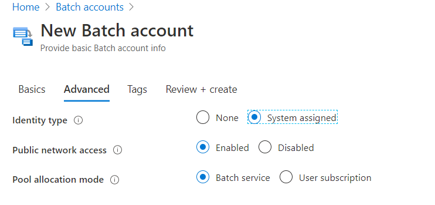
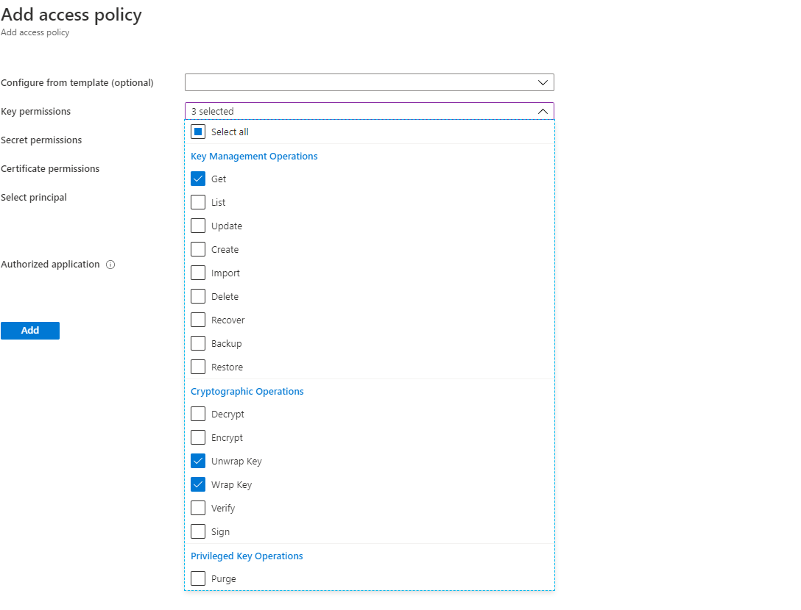
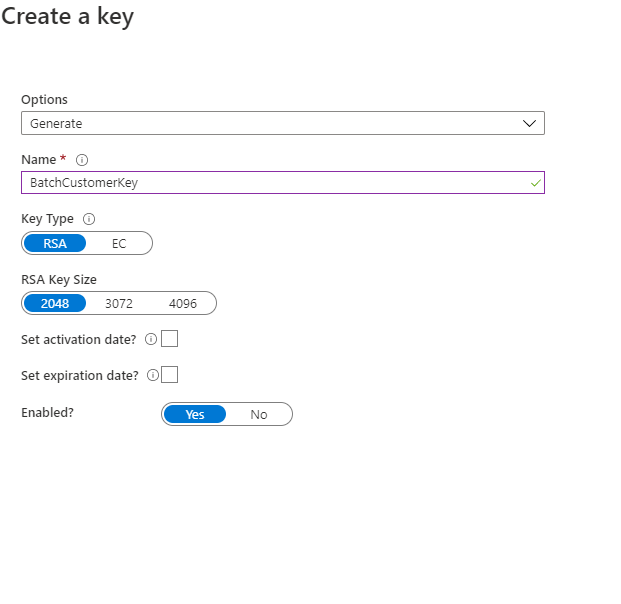
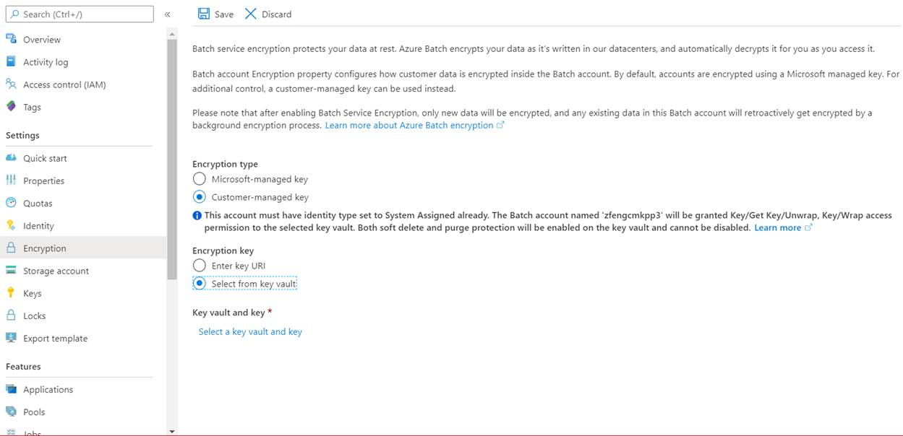

# Configure customer-managed keys for your Azure Batch account with Azure Key Vault and Managed Identity

By default Azure Batch uses platform-managed keys to encrypt all the customer data stored in the Azure Batch Service, like certificates, job/task metadata. Optionally, you could use your own keys to encrypt data stored in Azure Batch.

The keys you provide must be generated in [Azure Key Vault](https://docs.microsoft.com/azure/key-vault/general/basic-concepts), and the Batch accounts you want to configure with customer-managed keys have to be enabled with [Azure Managed Identity](https://docs.microsoft.com/azure/active-directory/managed-identities-azure-resources/overview).

> [!IMPORTANT]
> Support for customer-managed keys in Azure Batch is currently in public preview.
> This preview version is provided without a service level agreement, and it's not recommended for production workloads. Certain features might not be supported or might have constrained capabilities. 
> For more information, see [Supplemental Terms of Use for Microsoft Azure Previews](https://azure.microsoft.com/support/legal/preview-supplemental-terms/).

## Create a Batch Account with system-assigned managed identity

### Azure portal

In the [Azure portal](https://portal.azure.com/), when you create Batch accounts, pick **System assigned** in the identity type under the **Advanced** tab.



After the account is created, you can find a unique GUID in the **Identity principal id** field under the **Property** section. The **Identity Type** will show `SystemAssigned`.


 
### Azure CLI

When you create a new Batch account, specify `SystemAssigned` for the `--identity` parameter.

```powershell
resourceGroupName='myResourceGroup'
accountName='mybatchaccount'

az batch account create \
    -n $accountName \
    -g $resourceGroupName \
    --locations regionName='West US 2' \
    --identity 'SystemAssigned'
```

After the account is created, you can verify that system-assigned managed identity has been enabled on this account. Be sure to note the `PrincipalId`, as this value will be needed to grant this batch account access to the Key Vault.

```powershell
az batch account show \
    -n $accountName \
    -g $resourceGroupName \
    --query identity
```

## Configure your Azure Key Vault instance

### Create an Azure Key Vault

When creating an Azure Key Vault instance with customer-managed keys for Azure Batch, make sure that **Soft Delete** and **Purge Protection** are both enabled.


### Add an access policy to your Azure Key Vault instance

In the Azure portal, after the Key Vault is created, In the **Access Policy** under **Setting**, add the Batch account access using managed identity. Under **Key Permissions**, select **Get**, **Wrap Key** and **Unwrap Key**. 


 
In the **Select** field under **Principal**, fill in the `principalId` that you previously retrieved, or the name of the batch account.


 
### Generate a key in Azure Key Vault

In the Azure Portal, go to the Key Vault instance in the **key** section, select **Generate/Import**. Select the **Key Type** to be `RSA` and **Key Size** to be `2048`.



After the key is created, click on the newly created key and the current version, copy the **Key Identifier** under **properties** section.  Be sure sure that under **Permitted Operations**, **Wrap Key** and **Unwrap Key** are both checked.

## Enable customer-managed keys on Azure Batch Account

### Azure portal

In the [Azure portal](https://portal.azure.com/), go to the Batch account page. Under the **Encrpytion** section, enable **Customer-managed keys**. You can directly use the Key Identifier, or you can select the key vault and then click **Select a key vault and key**.



### Azure CLI

After the Batch account is created with system-assigned managed identity and the access to Key Vault is granted, update the Batch account with the `{Key Identifier}` URL under `keyVaultProperties` parameter. Also set **encryption_key_source** as `Microsoft.KeyVault`.

```powershell
az batch account set \
    -n $accountName \
    -g $resourceGroupName \
    --encryption_key_source Microsoft.KeyVault \
    --encryption_key_identifier {YourKeyIdentifier} 
```

## Update the customer-managed key version

When you create a new version of a key, update the Batch account to use the new version. Follow these steps:

1. Navigate to your Batch account in Azure Portal and display the Encryption settings.
2. Enter the URI for the new key version. Alternately, you can select the key vault and the key again to update the version.
3. Save your changes.

You can also use Azure CLI to update the version.

```powershell
az batch account set \
    -n $accountName \
    -g $resourceGroupName \
    --encryption_key_identifier {YourKeyIdentifierWithNewVersion} 
```
## Use a different key for Batch encryption

To change the key used for Batch encryption, follow these steps:

1. Navigate to your Batch account and display the Encryption settings.
2. Enter the URI for the new key. Alternately, you can select the key vault and choose a new key.
3. Save your changes.

You can  also use Azure CLI to use a different key.

```powershell
az batch account set \
    -n $accountName \
    -g $resourceGroupName \
    --encryption_key_identifier {YourNewKeyIdentifier} 
```
## Frequently asked questions
  * **Are customer-managed keys supported for existing Batch accounts?** No. Customer-managed keys are only supported for new Batch accounts.
  * **Which disks is encryption applied to?** Today, encryption is only applied to temporary disks. If you're in a sensitive environment, storing data on OS or data disks is not recommended.
  * **What operations are available after a customer-managed key is revoked?** The only operation allowed is account deletion if Batch loses access to the customer-managed key.
  * **How should I restore access to my Batch account if I accidentally delete the Key Vault key?** Since purge protection and soft delete are enabled, you could restore the existing keys. For more information, see [Recover an Azure Key Vault]( https://docs.microsoft.com/azure/key-vault/general/soft-delete-cli#recovering-a-key-vault).
  * **Can I disable customer-managed keys?** You can set the encryption type of the Batch Account back to "Microsoft managed key" at any time. After this, you are free to delete or change the key.
  * **How can I rotate my keys?** Customer-managed keys are not automatically rotated. To rotate the key, update the Key Identifier that the account is associated with.
  * **After I restore access how long will it take for the Batch account to work again?** It can take up to 10 minutes for the account to be accessible again once access is restored.
  * **While the Batch Account is unavailable what happens to my resources?** Any pools that are running when Batch access to customer-managed keys is lost will continue to run. However, the nodes will transition into an unavailable state, and tasks will stop running (and be requeued). Once access is restored, nodes will become available again and tasks will be restarted.


