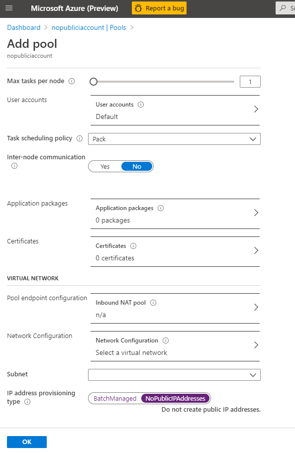

# Create an Azure Batch pool without public IP addresses

When you create an Azure Batch pool, you can provision the virtual machine configuration pool without a public IP address. This article explains how to set up a Batch pool without public IP addresses.

## Why use a Pool without public IP Addresses?

All the compute nodes in the Azure Batch virtual machine configuration pools by default are assigned with a public IP address for customer to communicate with the nodes, Batch service to schedule the tasks and for outbound access to internet from the compute nodes. 

To restrict access to these compute nodes, reduce the discoverability of these nodes from internet, you can provision the pool without public IP addresses, thus providing a secure solution to protect the Batch compute nodes from the internet.


> [!IMPORTANT]
> Support for no public IP pools in Azure Batch is currently in public preview for the West Central US, East US, South Central US, West US 2, US Gov Virginia, and US Gov Arizona regions.
> This preview version is provided without a service level agreement, and it's not recommended for production workloads. Certain features might not be supported or might have constrained capabilities. 
> For more information, see [Supplemental Terms of Use for Microsoft Azure Previews](https://azure.microsoft.com/support/legal/preview-supplemental-terms/).

## Prerequisites

 - **Authentication**. To use a no public IP addresses pool inside a customer [virtual network](https://docs.microsoft.com/azure/batch/batch-virtual-network), the Batch client API must use Azure Active Directory (AD) authentication. Azure Batch support for Azure AD is documented in Authenticate Batch service solutions with Active Directory. If you are using no public address pools without a custom virtual network, then either AAD authentication or key-based authentication can be used.

 - **An Azure VNet**. If you are creating Azure Batch pools in a [virtual network](https://docs.microsoft.com/azure/batch/batch-virtual-network), see the following section for VNet requirements and configuration. To prepare a VNet with one or more subnets in advance, you can use the Azure portal, Azure PowerShell, the Azure Command-Line Interface (CLI), or other methods.
 	- The VNet must be in the same subscription and region as the Batch account you use to create your pool.
	- The subnet specified for the pool must have enough unassigned IP addresses to accommodate the number of VMs targeted for the pool; that is, the sum of the `targetDedicatedNodes` and `targetLowPriorityNodes` properties of the pool. If the subnet doesn't have enough unassigned IP addresses, the pool partially allocates the compute nodes, and a resize error occurs.
  - You have to disable private link service and endpoint network policies. This can be done through CLI as below:
    - ```az network vnet subnet update --vnet-name <vnetname> -n <subnetname> --disable-private-endpoint-network-policies --disable-private-link-service-network-policies```
  
> [!IMPORTANT]
> For each 100 dedicated or low-priority nodes, Batch allocates one private link service and one load balancer. These resources are limited by the subscription's [resource quotas](https://docs.microsoft.com/azure/azure-resource-manager/management/azure-subscription-service-limits). For large pools, you might need to request a quota increase for one or more of these resources. Additionally, no resource locks should be applied to any resource created by Batch, otherwise this can result in preventing cleanup of resources as a result of user-initiated actions such as deleting a pool or resizing to zero.

## Current Limitations

1. The feature is available only in virtual machine configuration pools. It is not applicable to Cloud Service configuration pools.
1. [Custom endpoint configuration](https://docs.microsoft.com/azure/batch/pool-endpoint-configuration) to Batch compute nodes does not work with this feature
1. Customers cannot bring their own [public IP addresses](https://docs.microsoft.com/azure/batch/create-pool-public-ip) with this feature.

## Create a pool without public IP addresses in the Portal

1. Navigate to your Batch account in the Azure portal. 
1. In the **Settings** window on the left, select the **Pools** menu item.
1. In the **Pools** window, select the **Add** command.
1. On the **Add Pool** window, select the option you intend to use from the **Image Type** dropdown.
1. Select the correct **Publisher/Offer/Sku** of your image.
1. Specify the remaining required settings, including the **Node size**, **Target dedicated nodes**, and **Low-priority nodes**, as well as any desired optional settings.
1. Optionally select a virtual network and subnet you wish to use. This virtual network must be in the same resource group as the pool you are creating.
1. In **IP address provisioning type**, select "NoPublicIPAddresses"



## Use the Batch REST API to create a pool without public IP addresses

The example below shows how to use the [Azure Batch REST API](https://docs.microsoft.com/rest/api/batchservice/pool/add) to create a pool that uses public IP addresses.

```
POST {batchURL}/pools?api-version=2020-03-01.11.0
client-request-id: 00000000-0000-0000-0000-000000000000
```

```Request body
"pool": {
	"id": "pool2",
	"vmSize": "standard_a1",
	"virtualMachineConfiguration": {
		"imageReference": {
			"publisher": "Canonical",
			"offer": "UbuntuServer",
			"sku": "16.040-LTS"
		},
	"nodeAgentSKUId": "batch.node.ubuntu 16.04"
	}
	"networkConfiguration": {
		"subnetId": "/subscriptions/<your_subscription_id>/resourceGroups/<your_resource_group>/providers/Microsoft.Network/virtualNetworks/<your_vnet_name>/subnets/<your_subnet_name>",
		"publicIPAddressConfiguration": {
			"provision": "NoPublicIPAddresses"
		}
	},
	"resizeTimeout": "PT15M",
	"targetDedicatedNodes": 5,
	"targetLowPriorityNodes": 0,
	"maxTasksPerNode": 3,
	"taskSchedulingPolicy": {
		"nodeFillType": "spread"
	},
	"enableAutoScale": false,
	"enableInterNodeCommunication": true,
	"metadata": [
    {
      "name": "myproperty",
      "value": "myvalue"
    }
  	]
}
```

## Outbound access to the internet

Without public IP addresses, the virtual machines will not be able to access the public internet. If you need any access to the internet, please configure your network setup appropriately. There are a number of ways to achieve it, but the most straightforward is using [NAT virtual network](https://docs.microsoft.com/azure/virtual-network/nat-overview). Note that NAT will only outbound access to internet from all the virtual machines in the virtual network. Batch created compute nodes are still inaccessible publicly with no public IP addresses associated. Other alternatives would be using UDRs to route the traffic to a proxy machine that has public internet access.
