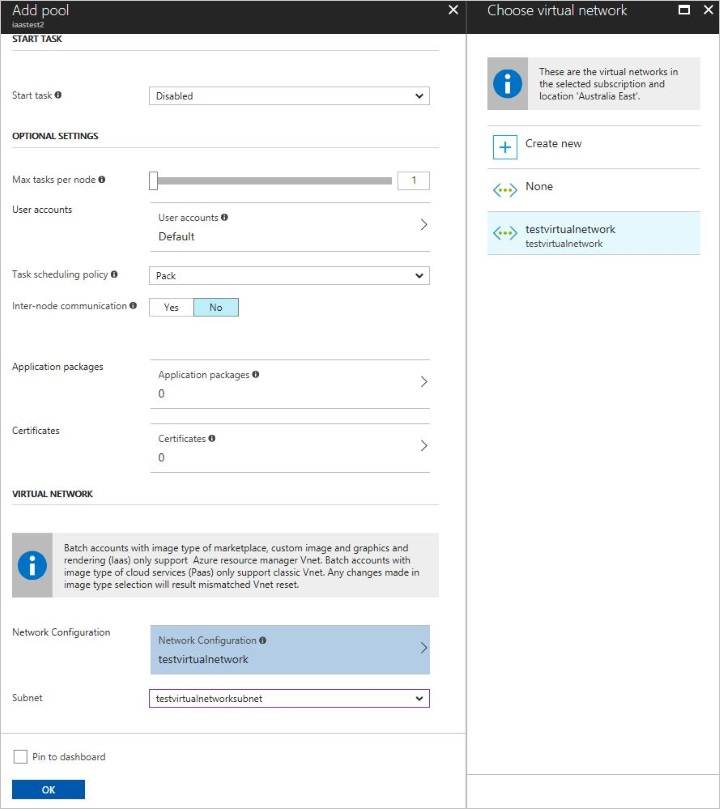

# Create a pool of virtual machines with your virtual network

When you create an Azure Batch pool, you can provision the pool in a subnet of an [Azure virtual network](../virtual-network/virtual-networks-overview.md) (VNet) that you specify. This article explains how to set up a Batch pool using the Virtual Machine Configuration in a VNet. 

> [!NOTE]
> It is also possible to set up a pool in the Cloud Services Configuration in a VNet. In this pool configuration, the network requirements and Batch settings differ from those described in this article. For more information about the differences, see the [Batch feature overview](batch-api-basics.md#virtual-network-vnet-and-firewall-configuration)
>

## Why use a VNet?

The compute nodes of an Azure Batch pool are automatically networked so that they can communicate with each other. However, by default, the nodes cannot communicate with virtual machines that are not part of the Batch pool, such as a license server or a file server. To allow pool compute nodes to communicate securely with other virtual machines, or with an on-premises network, you can provision the pool in a subnet of an Azure virtual network (VNet) that you specify. 

## Prerequisites

* **Azure Active Directory (AD) authentication**. The Batch client API must use Azure AD authentication. Azure Batch support for Azure AD is documented in [Authenticate Batch service solutions with Active Directory](batch-aad-auth.md).

* **An Azure VNet**. To prepare a VNet with one or more subnets in advance, you can use the Azure portal, Azure PowerShell, the Azure Command-Line Interface 2.0, or other methods. For steps, see [Create a virtual network with multiple subnets](..virtual-network/virtual-networks-create-vnet-arm-pportal.md). 

  The VNet must meet the following requirements:

  - The VNet must be in the same Azure **region** and **subscription** as the Batch account.

  - The VNet must be created in the Azure Resource Manager deployment model. You cannot use a classic VNet in this configuration.

  - The subnet specified for the pool must have enough unassigned IP addresses to accommodate the number of VMs targeted for the pool. If the subnet doesn't have enough unassigned IP addresses, the pool partially allocates the compute nodes, and a resize error occurs. 

  - The VNet must allow communication from the Batch service to be able to schedule tasks on the compute nodes. This can be verified by checking if the VNet has any associated network security groups (NSGs). If communication to the compute nodes in the specified subnet is denied by an NSG, then the Batch service sets the state of the compute nodes to **unusable**. 

  - If the specified VNet has associated Network Security Groups (NSGs) and/or a firewall, configure the inbound and outbound ports as shown in the following tables:

    [!INCLUDE [batch-virtual-netwrk-ports](../../includes/batch-virtual-network-ports.md)]

    
## Create a pool with a VNet in the portal

Once you have created your VNet and assigned a subnet to it, you can create a Batch pool with that VNet. Follow these steps to create a pool from the Azure portal: 

1. Navigate to your Batch account in the Azure portal. This account must be in the same subscription and region as the resource group containing the custom image. 
2. In the **Settings** window on the left, select the **Pools** menu item.
3. In the **Pools** window, select the **Add** command.
4. On the **Add Pool** window, select the option you intend to use from the **Image Type** dropdown. 
5. Select the correct **Publisher/Offer/Sku** for your custom image.
6. Specify the remaining required settings, including the **Node size**, **Target dedicated nodes**, and **Low priority nodes**, as well as any desired optional settings.
7. In **Virtual Network**, select the virtual network and subnet you wish to use.
  
  

## User-defined routes for forced tunneling

You might have requirements in your organization to redirect (force) Internet-bound traffic from the subnet back to your on-premises location for inspection and logging. You can configue forced tunneling in the subnet by adding [user-defined routes](../virtual-network/virtual-networks-udr-overview.md).

To enable forced tunneling for the VNet selected for the Batch pool, add user-defined routes for the following:

* The IP addresses needed for the Batch service to communicate with pool VMs. For the list of addresses, please contact Azure Support.

* Azure Storage addresses. 
    
## Next steps

- For an in-depth overview of Batch, see [Develop large-scale parallel compute solutions with Batch](batch-api-basics.md).
