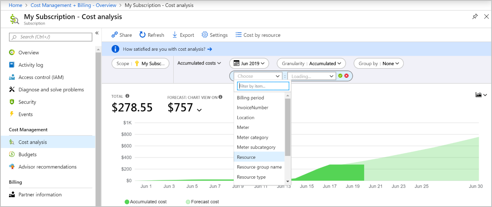
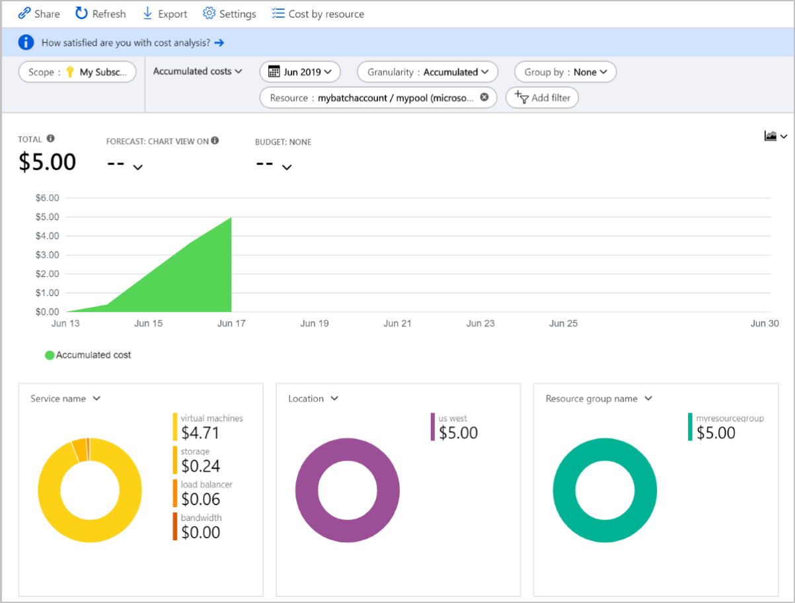

# Cost analysis and budget for Azure Batch

The Azure Batch infrastructure is a free service. Charges only apply to the resources used to run Batch workloads, with the majority being virtual machines (VMs) and storage. Management of tasks, pools, and jobs does not contribute to your Azure bill. On a high level, costs are incurred from virtual machines (VMs) in a pool, data transfer from the VM, or any input or output data stored in the cloud. Let's take a look at some key components of Batch to understand where costs come from, and what you can do to make your Batch workloads more cost efficient. We'll also walk through the step of analyzing a pool and creating a budget.

## Batch resources

Virtual machines are the most significant resource used for Batch processing. The cost of using VMs for Batch is calculated based on the type, quantity, and the duration of use. VM billing options include [Pay-As-You-Go](https://azure.microsoft.com/offers/ms-azr-0003p/) or [reservation](../billing/billing-save-compute-costs-reservations.md) (pay in advance). Both payment options have different benefits depending on your compute workload, and both payment models will affect your bill differently.

When applications are deployed to Batch nodes (VMs) using [application packages](batch-application-packages.md), you are billed for the Azure Storage resources that your application packages consume. You are also billed for the storage of any input or output files, such as resource files and other log data. In general, the cost of storage data associated with Batch is much lower than the cost of compute resources.

### Additional services

Services not including VMs and storage can factor in to the cost of your Batch account.

Other services commonly used with Batch can include:

- Application Insights
- Data Factory
- Azure Monitor
- Virtual Network
- VMs with graphics applications

Depending on which services you use with your Batch solution, you may incur additional fees. Refer to the [Pricing Calculator](https://azure.microsoft.com/pricing/calculator/) to determine the cost of each additional service.

## Cost analysis and budget for a pool

Through the Azure portal, you can get accurate, up-to-date information on cost and resources used by your Batch pool.

1. In the Azure portal, select **Cost Management + Billing** from the left navigation bar.
1. Select your subscription from the **My subscriptions** section
1. Go to **Cost analysis** under the **Cost Management** section of the left nav bar, which will show a view like this:
1. Select **Add Filter**. In the first drop-down, select **Resource**
    
1. In the second drop-down, select the Batch pool. When the pool is selected, the cost analysis will look similar to the following analysis.
    

The resulting cost analysis shows the cost of the pool as well as the resources that contribute to this cost. In this example, the VMs used in the pool are the most costly resource.

To create a budget for the pool select **Budget: none**, and then select **Create new budget >**. This opens a window to configure a budget specifically for your pool.

For more information on configuring a budget, see [Create and manage Azure budgets](../cost-management/tutorial-acm-create-budgets.md).

> [!NOTE]
> Azure Batch is built on Azure Cloud Services and Azure Virtual Machines technology. When you choose **Cloud Services Configuration**, you are charged based on the Cloud Services pricing structure. When you choose **Virtual Machine Configuration**, you are charged based on the Virtual Machines pricing structure. The example on this page uses the **Virtual Machine Configuration**.

## Minimize cost

Using several VMs and Azure services for extended periods of time can be costly. Fortunately, there are services available to help reduce your spending, as well as strategies for maximizing the efficiency of your workload.

### Low-priority virtual machines

Low-priority VMs reduce the cost of Batch workloads by taking advantage of surplus computing capacity in Azure. When you specify low-priority VMs in your pools, Batch uses this surplus to run your workload. There is a substantial cost saving by using low-priority VMs in place of dedicated VMs.

Learn more about how to set up low-priority VMs for your workload at [Use low-priority VMs with Batch](batch-low-pri-vms.md).

### Premium storage virtual machines

Most VM-series have sizes that support both premium and non-premium storage. Virtual machines with premium storage capabilities are more expensive than VMs without premium storage. If premium storage isn't necessary for your workload, consider using a non-premium VM size to reduce your monthly bill. See [Designing for high performance](..//virtual-machines/windows/premium-storage-performance.md) to learn more about premium storage and performance.

### Reserved virtual machine instances

An alternative way to save costs on VMs is to reserve virtual machine instances for your workloads. If you have Batch workloads that run for long periods of time, a reservation is the most cost-effective option. Compared to a pay-as-you-go rate, a reservation rate is considerably lower. Virtual machine instances used without a reservation are charged at pay-as-you-go rates. If you purchase a reservation for those resources, the reservation discount is applied and you are no longer charged at the pay-as-you-go rates.

### Automatic scaling

[Automatic scaling](batch-automatic-scaling.md) dynamically scales the number of VMs in your Batch pool based on demands of the current job. By scaling the pool based on the lifetime of a job, automatic scaling ensures that VMs scaled up and used only when there is a job to perform. When the job is complete, or there are no jobs, the VMs are automatically scaled down to save compute resources. Scaling allows you to lower the overall cost of your Batch solution by using only the resources you need.

For more information about automatic scaling, see [Automatically scale compute nodes in an Azure Batch pool](batch-automatic-scaling.md).

## Next steps

- Learn more about [monitoring Batch solutions](monitoring-overview.md).  
- Learn more about the [Batch APIs and tools](batch-apis-tools.md) available for building and monitoring Batch solutions.  
