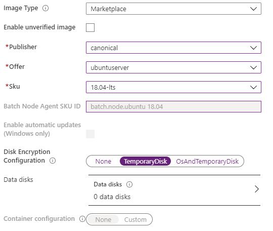
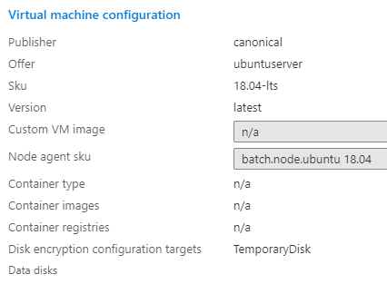

# Use DiskEncriptionConfiguration to encrypt nodes with a platform managed key 

When you create an Azure Batch pool using virtual machine configuration, you can encrypt compute nodes in the pool with a platform managed key (PMK) by specifying diskencryption configuration. 

This article explains how to set up Batch pool with disk encryption enabled. 

## Why use a pool with DiskEncryptionConfiguration?

When customer use nodes in a Batch pool, they can access and store data on OsDisk and TemporaryDisk of the compute node. Encrypting the server-side disk with PMK will safeguard the customer data with low overhead convenience on customer side.  

Batch uses three following DiskEncryption technologies offered by Azure and applies the appropriate technology on the customer compute nodes based on the customer pool configuration and regional supportability. 

1. [Managed disk encryption at rest with platform-managed keys](https://docs.microsoft.com/azure/virtual-machines/windows/disk-encryption#platform-managed-keys) 

1. [Encryption at Host using a platform managed Key](https://docs.microsoft.com/azure/virtual-machines/windows/disk-encryption#encryption-at-host---end-to-end-encryption-for-your-vm-data) 

1. [Azure Disk Encryption](https://docs.microsoft.com/azure/security/fundamentals/azure-disk-encryption-vms-vmss) 


> [!IMPORTANT] 
> Encryption at Host using a platform managed key is currently a preview feature offered by Azure, and is currently only supported by Batch in the following regions: East US, West US 2, South Central US, US Gov Virginia and US Gov Arizona. 

Please note that Batch customer does not have an option to choose which encryption method they want to apply to their nodes. Instead, customer will provide the target disks they want to encrypt on their nodes, so that Batch can choose the appropriate encryption method and ensure the specified disks are encrypted on server side. Once a disk encryption configuration is specified while creating a pool, the target disks for each node in the pool will be encrypted.
 
## Create a DiskEncryption Pool from the Azure Portal 
In the Azure portal, when you create Batch pool, pick the appropriate disk under **Disk Encryption Configuration**.




After the pool is created, you can find disk encryption configuration targets under pool Properties section.



## Create a DiskEncryption pool with Batch .NET SDK 

The following code example shows how to encrypt the OS and temporary disks using Batch's .NET SDK.

```csharp
pool.VirtualMachineConfiguration.DiskEncryptionConfiguration = new DiskEncryptionConfiguration(
    targets: new List<DiskEncryptionTarget> { DiskEncryptionTarget.OsDisk, DiskEncryptionTarget.TemporaryDisk }
    );
```

## Create a DiskEncryption pool using Batch REST API

Similar to the .NET example, the following REST API call shows how to encrypt the OS and temporary disks as well: 

REST API URL:
```
POST {batchURL}/pools?api-version=2020-03-01.11.0
client-request-id: 00000000-0000-0000-0000-000000000000
```
Request body:
```
"pool": {
    "id": "pool2",
    "vmSize": "standard_a1",
    "virtualMachineConfiguration": {
        "imageReference": {
            "publisher": "Canonical",
            "offer": "UbuntuServer",
            "sku": "16.040-LTS"
        },
        "diskEncryptionConfiguration": {
            "targets": [
                "OsDisk",
                "TemporaryDisk"
            ]
        }
        "nodeAgentSKUId": "batch.node.ubuntu 16.04"
    },
    "resizeTimeout": "PT15M",
    "targetDedicatedNodes": 5,
    "targetLowPriorityNodes": 0,
    "maxTasksPerNode": 3,
    "enableAutoScale": false,
    "enableInterNodeCommunication": false
}
```
