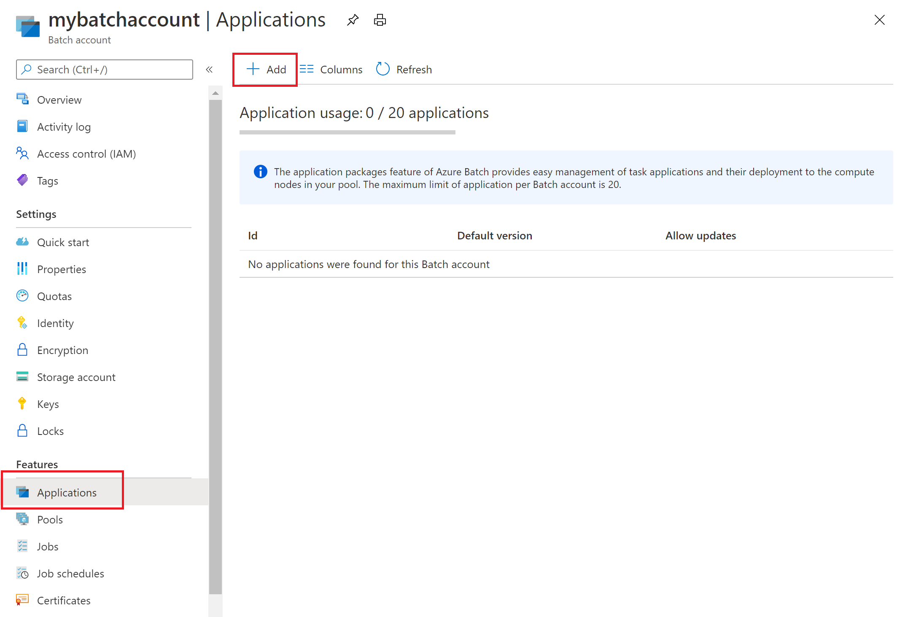
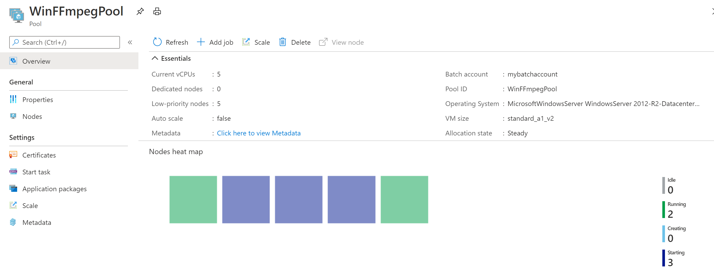

# Process media files in parallel with Azure Batch using the .NET API

Azure Batch enables you to run large-scale parallel and high-performance computing (HPC) batch jobs efficiently in Azure. This tutorial covers building a C# sample application step by step to process a parallel workload using Batch. In this tutorial, you convert media files in parallel using the [ffmpeg](http://ffmpeg.org/) open-source tool. You learn a common Batch application workflow and how to interact programmatically with Batch and Storage resources. You learn how to:

> [!div class="checklist"]
> * Add an ffmpeg application package to your Batch account
> * Authenticate with Batch and Storage accounts
> * Upload input data files to Storage
> * Create a Batch pool to run ffmpeg
> * Create a job and tasks to process input files
> * Monitor task execution
> * Retrieve output files

## Prerequisites

* [Visual Studio 2015](https://www.visualstudio.com/) or a more recent version. 
* An Azure Batch account and a linked Azure Storage account. To create these accounts, see the Batch quickstarts using the [Azure portal](quick-create-portal.md) or [Azure CLI](quick-create-cli.md). 
* [Windows 64-bit version of ffmpeg 3.4](https://ffmpeg.zeranoe.com/builds/win64/static/ffmpeg-3.4-win64-static.zip) (.zip). Download the zipfile to your local computer. You do not need to unzip the file or install it locally.

## Add the ffmpeg application package

Use the Azure portal to add ffmpeg to your Batch account as an [application package](batch-application-packages.md). Application packages help you manage task applications and their deployment to the compute nodes in your pool. 

1. Sign in to the [Azure portal](https://portal.azure.com).
2. Click **All services** > **Batch accounts** and then click the name of your Batch account.
3. Click **Applications** > **Add**.
4. For **Application id** enter *ffmpeg*, and a package version of *3.4*. Select the ffmpeg zipfile you downloaded previously, and then click **OK**.

The ffmpeg application is added to your Batch account.




## Download the sample

[Download or clone the sample application](https://github.com/dlepow/batchmvc) from GitHub. 

Change to the directory that contains the sample code:

```bash
cd tutorial_dotnet
```

[!INCLUDE [batch-common-credentials](../../includes/batch-common-credentials.md)]

Open the solution in Visual Studio, and update the following strings in `program.cs`:

```csharp
// Batch account credentials
private const string BatchAccountName = "mybatchaccount";
private const string BatchAccountKey  = "xxxxxxxxxxxxxxxxE+yXrRvJAqT9BlXwwo1CwF+SwAYOxxxxxxxxxxxxxxxx43pXi/gdiATkvbpLRl3x14pcEQ==";
private const string BatchAccountUrl  = "https://mybatchaccount.westeurope.batch.azure.com";

// Storage account credentials
private const string StorageAccountName = "mystorageaccount";
private const string StorageAccountKey  = "xxxxxxxxxxxxxxxxy4/xxxxxxxxxxxxxxxxfwpbIC5aAWA8wDu+AFXZB827Mt9lybZB1nUcQbQiUrkPtilK5BQ==";
```

Also, make sure that the ffmpeg application package reference in the solution matches the Id and version of the ffmpeg package that you uploaded to your Batch account.

```csharp
const string appPackageId = "ffmpeg";
const string appPackageVersion = "3.4";
```
## Build the sample project

Right-click the solution in Solution Explorer and click **Build Solution**. Confirm the restoration of any NuGet packages, if you're prompted. If you need to download missing packages, ensure the [NuGet Package Manager](https://docs.nuget.org/consume/installing-nuget) is installed.

The following sections break down the sample application into the steps that it performs to process a workload in the Batch service. Refer to the open solution in Visual Studio while you work your way through the rest of this article, since not every line of code in the sample is discussed.


## Blob and Batch clients

* To interact with the linked storage account, the app uses the Azure Storage Client Library for .NET. It creates a reference to the account with [CloudStorageAccount](/dotnet/api/microsoft.windowsazure.storage.cloudstorageaccount), authenticating using shared key authentication. Then, it creates a [CloudBlobClient](/dotnet/api/microsoft.windowsazure.storage.blob.cloudblobclient).

  ```csharp
  // Construct the Storage account connection string
  string storageConnectionString = String.Format("DefaultEndpointsProtocol=https;AccountName={0};AccountKey={1}",
  StorageAccountName, StorageAccountKey);

  // Retrieve the storage account
  CloudStorageAccount storageAccount = CloudStorageAccount.Parse(storageConnectionString);

  CloudBlobClient blobClient = storageAccount.CreateCloudBlobClient();
  ```

* The app creates a [BatchClient](/dotnet/api/microsoft.azure.batch.batchclient) object to create and manage pools, jobs, and tasks in the Batch service. The Batch client in the sample uses shared key authentication. Batch also supports authentication through [Azure Active Directory](batch-aad-auth.md), to authenticate individual users or an unattended application.

  ```csharp
  BatchSharedKeyCredentials cred = new BatchSharedKeyCredentials(BatchAccountUrl, BatchAccountName, BatchAccountKey);

  BatchClient batchClient = BatchClient.Open(cred);
  ```

## Upload input files

The app passes the `blobClient` object to the `CreateContainerIfNotExistAsync` method to create a storage container for the input MP4 files and a container for the task output.

```csharp
  CreateContainerIfNotExistAsync(blobClient, inputContainerName).Wait();
  CreateContainerIfNotExistAsync(blobClient, outputContainerName).Wait();
```

Then, files are uploaded to the input container. The files in storage are defined as Batch [ResourceFile](/dotnet/api/microsoft.azure.batch.resourcefile) objects that Batch can later download to compute nodes. 

Two methods in `Program.cs` are involved in uploading the files:

* `UploadResourceFilesToContainer`: Returns a collection of ResourceFile objects and internally calls `UploadResourceFileToContainer` to upload each file that is passed in the `filePaths` parameter.
* `UploadResourceFileToContainer`: Uploads each file as a blob to the input container. After uploading the file, it obtains a shared access signature (SAS) for the blob and returns a ResourceFile object to represent it. 

```csharp
  List<string> inputFilePaths = new List<string>(Directory.GetFileSystemEntries(@"..\..\InputFiles", "*.mp4",
      SearchOption.TopDirectoryOnly));

  List<ResourceFile> inputFiles = UploadResourceFilesToContainer(
    blobClient,
    inputContainerName,
    inputFilePaths);
```

For details about uploading files as blobs to a storage account with .NET, see [Get started with Azure Blob storage using .NET](../storage//blobs/storage-dotnet-how-to-use-blobs.md).

## Create a Batch pool

Next, the sample creates a pool of compute nodes in the Batch account with a call to `CreatePoolIfNoneExist`. `CreatePoolIfNoneExist` uses the [BatchClient.PoolOperations.CreatePool](/dotnet/api/microsoft.azure.batch.pooloperations.createpool) method to set the number of nodes, VM size, and a pool configuration. Here, a [VirtualMachineConfiguration](/dotnet/api/microsoft.azure.batch.virtualmachineconfiguration) object specifies an [ImageReference](/dotnet/api/microsoft.azure.batch.imagereference) to a Windows Server image published in the Azure Marketplace. The sample by default creates a pool of 5 size *Standard_A1_v2* nodes. 

The ffmpeg application is deployed to the compute nodes by adding an [ApplicationPackageReference](/dotnet/api/microsoft.azure.batch.applicationpackagereference) to the pool. 

The [Commit](/dotnet/api/microsoft.azure.batch.cloudpool.commit) method submits the pool to the Batch service.

```csharp
ImageReference imageReference = new ImageReference(
            publisher: "MicrosoftWindowsServer",
            offer: "WindowsServer",
            sku: "2012-R2-Datacenter",
            version: "latest");

VirtualMachineConfiguration virtualMachineConfiguration =
            new VirtualMachineConfiguration(
            imageReference: imageReference,
            nodeAgentSkuId: "batch.node.windows amd64");

pool = batchClient.PoolOperations.CreatePool(
            poolId: poolId,
            targetDedicatedComputeNodes: 5,
            virtualMachineSize: "STANDARD_A1_v2",
            virtualMachineConfiguration: virtualMachineConfiguration); 

pool.ApplicationPackageReferences = new List<ApplicationPackageReference>
            {
            new ApplicationPackageReference {
            ApplicationId = appPackageId,
            Version = appPackageVersion}};

pool.Commit();  
```

## Create a Batch job

A Batch job specifies a pool to run tasks on and optional settings such as a priority and schedule for the work. The sample creates a job with a call to `CreateJob`. `CreateJob` uses the [BatchClient.JobOperations.CreateJob](/dotnet/api/microsoft.azure.batch.joboperations.createjob) method to create a job on your pool. 

The [Commit](/dotnet/api/microsoft.azure.batch.cloudjob.commit) method submits the job to the Batch service. Initially the job has no tasks.

```csharp
CloudJob job = batchClient.JobOperations.CreateJob();
    job.Id = JobId;
    job.PoolInformation = new PoolInformation { PoolId = PoolId };

job.Commit();        
```

## Create tasks

The sample creates tasks in the job with a call to the `CreateTasks` method, which creates a list of [CloudTask](/dotnet/api/microsoft.azure.batch.cloudtask) objects. Each `CloudTask` processes an input `ResourceFile` object using a [CommandLine](/dotnet/api/microsoft.azure.batch.cloudtask.commandline) property. Here, the command line runs ffmpeg to convert each input MP4 file to an MP3 file.

The sample creates an [OutputFile](/dotnet/api/microsoft.azure.batch.outputfile) object for the MP3 file generated by each task. Each task's output files (one, in this case) are uploaded to a container in the linked storage account by using the task's [OutputFiles](/dotnet/api/microsoft.azure.batch.cloudtask.outputfiles) property.

Then, the sample adds tasks to the job with the [AddTaskAsync](/dotnet/api/microsoft.azure.batch.joboperations.addtask) method, which queues them to run on the compute nodes. 

```csharp
foreach (ResourceFile inputFile in inputFiles)
{
    string taskId = "task_" + inputFiles.IndexOf(inputFile);

    // Define task command line to convert each input file.
    string appPath = String.Format("%AZ_BATCH_APP_PACKAGE_{0}#{1}%", appPackageId, appPackageVersion);
    string inputMediaFile = inputFile.FilePath;
    string outputMediaFile = String.Format("{0}{1}",
        System.IO.Path.GetFileNameWithoutExtension(inputMediaFile),
        ".mp3");
    
    string taskCommandLine = String.Format("cmd /c {0}\\ffmpeg-3.4-win64-static\\bin\\ffmpeg.exe -i {1} {2}", appPath, inputMediaFile, outputMediaFile);

    // Create a cloud task (with the task ID and command line) 
    CloudTask task = new CloudTask(taskId, taskCommandLine);
    task.ResourceFiles = new List<ResourceFile> { inputFile };
   

    // Task output file
    List<OutputFile> outputFileList = new List<OutputFile>();
    OutputFileBlobContainerDestination outputContainer = new OutputFileBlobContainerDestination(outputContainerSasUrl);
    OutputFile outputFile = new OutputFile(outputMediaFile,
       new OutputFileDestination(outputContainer),
       new OutputFileUploadOptions(OutputFileUploadCondition.TaskSuccess));
    outputFileList.Add(outputFile);
    task.OutputFiles = outputFileList;
    tasks.Add(task);
}
batchClient.JobOperations.AddTaskAsync(jobId, tasks).Wait();
```

## Monitor tasks

When tasks are added to a job, Batch automatically queues and schedules them for execution on compute nodes in the associated pool. Based on the settings you specify, Batch handles all task queuing, scheduling, retrying, and other task administration duties. 

There are many approaches to monitoring task execution. This sample uses a `MonitorTasks` method to report only on completion and task failure or success states. Within `MonitorTasks`, the app specifies an [ODATADetailLevel](/dotnet/api/microsoft.azure.batch.odatadetaillevel) to efficiently select only minimal information about the tasks. Then, it creates a [TaskStateMonitor](/dotnet/api/microsoft.azure.batch.taskstatemonitor), which provides helper utilities for monitoring task states. In `MonitorTasks`, the sample waits for all tasks to reach `TaskState.Completed` within a time limit. Then it checks for any failed tasks and terminates the job.


## Run the app

When you run the sample application, the console output is similar to the following. During execution, you experience a pause at `Awaiting task completion, timeout in 00:30:00...` while the pool's compute nodes are started. 

```
Sample start: 12/12/2017 3:20:21 PM

Container [input] created.
Container [output] creating
Uploading file ..\..\InputFiles\twc78.mp4 to container [input]...
Uploading file ..\..\InputFiles\twc79.mp4 to container [input]...
Uploading file ..\..\InputFiles\twc80.mp4 to container [input]...
Uploading file ..\..\InputFiles\twc81.mp4 to container [input]...
Uploading file ..\..\InputFiles\twc83.mp4 to container [input]...
Creating pool [WinFFmpegPool]...
Creating job [WinFFmpegJob]...
Adding 5 tasks to job [WinFFmpegJob]...
Awaiting task completion, timeout in 00:30:00...
Success! All tasks completed successfully within the specified timeout period.
Downloading all files from container [output]...
All files downloaded to C:\Users\danlep\AppData\Local\Temp

Sample end: 12/12/2017 3:29:36 PM
Elapsed time: 00:09:14.3418742
```
Typical execution time is approximately **10 minutes** when you run the application in its default configuration. Pool creation takes the most time. Go to your Batch account in the Azure portal to monitor the pool, compute nodes, job, and tasks. For example, to see a heat map of the compute nodes in your pool:

1. Sign in to the [Azure portal](https://portal.azure.com).
2. Click **All services** > **Batch accounts** and then click the name of your Batch account.
3. Click **Pools** > *WinFFmpegPool*.

When tasks are running the heatmap is similar to the following:



You can also use the Azure portal to download the output files generated by ffmpeg. (Although not shown in this sample, you can download the files programmatically from the compute nodes or from the storage container.)

1. Click **All services** > **Storage accounts** and then click the name of your storage account.
2. Click **Blobs** > *output*.
3. Click one of the output MP3 files and then click **Download**. Follow the prompts in your browser to open or save the file.


## Clean up resources

After it runs the tasks, the app gives you the option to delete the Batch pool and job. The BatchClient's [JobOperations](/dotnet/api/microsoft.azure.batch.batchclient.joboperations) and [PoolOperations](/dotnet/api/microsoft.azure.batch.batchclient.pooloperations) both have corresponding deletion methods, which are called if the user confirms deletion. Although you're not charged for jobs and tasks themselves, you are charged for compute nodes. Thus, we recommend that you allocate pools only as needed. When you delete the pool, all task output on the nodes is deleted. However, the input and output files remain in the storage account.

When no longer needed, delete the resource group, Batch account, and storage account. To do so in the Azure portal, select the resource group for the Batch account and click **Delete**.

## Next steps

In this tutorial, you learned about how to:

> [!div class="checklist"]
> * Add an ffmpeg application package to your Batch account
> * Authenticate with Batch and Storage accounts
> * Upload input data files to Storage
> * Create a Batch pool to run ffmpeg
> * Create a job and tasks to process input files
> * Monitor task execution
> * Retrieve output files


Advance to the next tutorial to learn about how to build a Python application to process a parallel workload with Batch.

> [!div class="nextstepaction"]
> [Process files in parallel with Python](tutorial-parallel-python.md)

