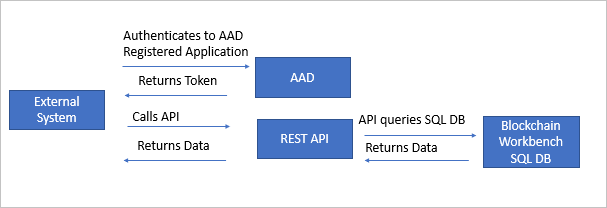
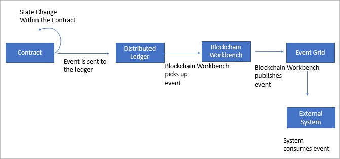
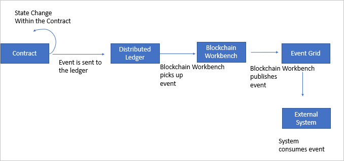
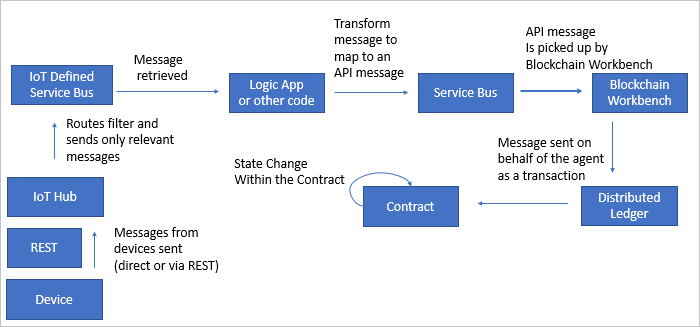
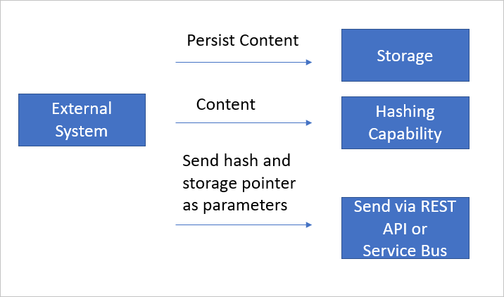

# Smart contract integration patterns

Smart contracts will often represent a business workflow that need to integrate with external systems and devices.

The requirements of these workflows include a need to initiate transactions on a distributed ledger that include data from an external system, service or device. They also need to have external systems react to events originating from smart contracts on a distributed ledger.

The REST API and messaging integration provide the ability to both send transactions from external systems to smart contracts included in an Azure Blockchain Workbench application, as well as send event notifications to external systems based on changes that take place
within an application.

For data integration scenarios, Azure Blockchain Workbench includes a set of database views that merge a combination of transactional data from the blockchain and meta-data about applications and smart contracts.

In addition, some scenarios, such as those related to supply chain or media, may also require the integration of documents. While Azure Blockchain Workbench does not provide API calls for handling documents directly, documents can be incorporated into an Azure Blockchain
Application. This section also includes that pattern.

This section includes the patterns identified for implementing each of these types of integrations in your end to end solutions.

## REST API-based integration

Capabilities within the Azure Blockchain Workbench generated web application are exposed via the REST API. This includes Azure Blockchain Workbench uploading, configuration and administration of applications, sending transactions to a distributed ledger, and the querying of application metadata and ledger data.

The REST API is primarily used for interactive clients such as web, mobile, and bot applications.

This section looks at patterns focused on the aspects of the REST API that send transactions to a distributed ledger and those that query data about transactions from Azure Blockchain Workbench's *off chain* SQL database.

### Sending transactions to a distributed ledger from an external system

The Azure Blockchain Workbench REST API provides the ability to send authenticated requests to execute transactions on a distributed ledger.

This occurs using the process depicted above, where:

-   The external application authenticates to the Azure Active Directory provisioned as part of the Azure Blockchain Workbench deployment.
-   Authorized users receive a bearer token that can be sent with requests to the API.
-   External applications make calls to the REST API using the bearer token.
-   The REST API packages the request as a message and sends it to the Service Bus. From here it will be retrieved, signed, and sent to the appropriate distributed ledger.
-   The REST API makes a request to the Azure Blockchain Workbench SQL DB to record the request and establish the current provisioning status.
-   The SQL DB returns the provisioning status and the API call returns the ID to the external application that called it.

### Querying Blockchain Workbench metadata and distributed ledger transactions

The Azure Blockchain Workbench REST API provides the ability to send authenticated requests to query details related to smart contract execution on a distributed ledger.

This occurs using the process depicted above, where:

1. The external application authenticates to the Azure Active Directory provisioned as part of the Azure Blockchain Workbench deployment.
2. Authorized users receive a bearer token that can be sent with requests to the API.
3. External applications make calls to the REST API using the bearer token.
4. The REST API queries the data for the request from the SQL DB and returns it to the client.

## Messaging integration

Messaging integration facilitates interaction with systems, services, and devices where an interactive login is not possible or desirable. Messaging integration focuses on two types of messages, those that request that transactions be executed on a distributed ledger and events that are exposed by that ledger when transactions have taken place.

Messaging integration focuses on the execution and monitoring of transactions related to user creation, contract creation, and execution of transactions on contracts and is primarily used by *headless* back-end systems.

This section looks at patterns focused on the aspects of the message-based API that send transactions to a distributed ledger and those that represent event messages exposed by the underlying distributed ledger.

### One-way event delivery from a smart contract to an event consumer 

In this scenario, an event occurs within a smart contract, for example, a state change or the execution of a specific type of transaction. This event is broadcast via an Event Grid to downstream consumers, and those consumers then take appropriate actions.

An example of this scenario is that when a transaction occurs, a consumer would be alerted and could take action, such as recording the information in a SQL DB or the Common Data Service. This is the same pattern that Workbench follows to populate it's *off chain* SQL DB.

Another would be if a smart contract transitions to a particular state, for example when a contract goes into an *OutOfCompliance*. When this state change happens, it could trigger an alert to be sent to an administrator's mobile phone.

This occurs using the process depicted above, where:

-   The smart contract transitions to a new state and sends an event to the ledger.
-   The ledger receives and delivers the event to Azure Blockchain Workbench.
-   Azure Blockchain Workbench is subscribed to events from the ledger and receives the event.
-   Azure Blockchain Workbench publishes the event to subscribers on the Event Grid.
-   External systems are subscribed to the Event Grid, consume the message, and take the appropriate action(s).

## One-way event delivery of a message from an external system to a smart contract

There is also a scenario that flows from the opposite direction. In this case, an event is generated by a sensor or an external system and the data from that event should be sent to a smart contract.

A common example is the delivery of data from financial markets, for example, prices of commodities, stock, or bonds, to a smart contract.

### Direct delivery of an Azure Blockchain Workbench in the expected format

Some applications are built to integrate with Azure Blockchain Workbench and directly generates and send messages in the expected formats.

This occurs using the process depicted above, where:

-   An event occurs in an external system that triggers the creation of a message for Azure Blockchain Workbench.
-   The external system has code written to create this message in a known format and sends this directly to the Service Bus.
-   Azure Blockchain Workbench is subscribed to events from the Service Bus and retrieves the message.
-   Azure Blockchain Workbench initiates a call to the ledger, sending data from the external system to a specific contract.
-   Upon receipt of the message, the contract transitions to a new state.

### Delivery of a message in a format unknown to Azure Blockchain Workbench

Some systems cannot be modified to deliver messages in the standard formats used by Azure Blockchain Workbench. In these cases, existing mechanisms and message formats from these systems can often be used. Specifically, the native message types of these systems can be
transformed using Logic Apps, Azure Functions, or other custom code to map to one of the standard messaging formats expected.

This occurs using the process depicted above, where:

-   An event occurs in an external system that triggers the creation of a message.
-   A Logic App or custom code is used to receive that message and transform it to a standard Azure Blockchain Workbench formatted message.
-   The Logic App sends the transformed message directly to the Service Bus.
-   Azure Blockchain Workbench is subscribed to events from the Service
    Bus and retrieves the message.
-   Azure Blockchain Workbench initiates a call to the ledger, sending data from the external system to a specific function on the contract.
-   The function executes and typically modifies the state. The change of state moves forward the business workflow reflected in the smart contract, enabling other functions to now be executed as appropriate.

### Transitioning control to an external process and await completion

There are scenarios where a smart contract must stop internal execution and hand off to an external process. That external process would then complete, send a message to the smart contract, and execution would then continue within the smart contract.

#### Transition to the external process

This pattern is typically implemented using the following approach:

-   The smart contract transitions to a specific state. In this state, either no or a limited number of functions can be executed until an external system takes a desired action.
-   The change of state is surfaced as an event to a downstream consumer.
-   The downstream consumer receives the event and triggers external code execution.

#### Return of control from the smart contract

Depending on the ability to customize the external system it may or may not be able to deliver messages in one of the standard formats that Azure Blockchain Workbench expects. Based on the external systems ability to generate one of these messages will determine which of the following two return paths will be taken.

##### Direct delivery of an Azure Blockchain Workbench in the expected format

In this model, the communication to the contract and subsequent state
change occurs following the above process where -

-   Upon reaching the completion or a specific milestone in the external
    code execution, an event is sent to the Service Bus connected to
    Azure Blockchain Workbench.

-   For systems that can't be directly adapted to write a message that
    conforms to the expectations of the API, it will be transformed.

-   The content of the message is packaged up and sent to a specific
    function on the smart contract. This is done on behalf of the user
    associated with the external system.

-   The function executes and typically will modify the state. The
    change of state moves forward the business workflow reflected in the
    smart contract, enabling other functions to now be executed as
    appropriate.

### 

### Delivery of a message in a format unknown to Azure Blockchain Workbench

In this model where a message in a standard format cannot be sent directly, the communication to the contract and subsequent state change occurs following the above process where:

1.  Upon reaching the completion or a specific milestone in the external code execution, an event is sent to the Service Bus connected to Azure Blockchain Workbench.
2.  A Logic App or custom code is used to receive that message and transform it to a standard Azure Blockchain Workbench formatted message.
3.  The Logic App sends the transformed message directly to the Service Bus.
4.  Azure Blockchain Workbench is subscribed to events from the Service Bus and retrieves the message.
5.  Azure Blockchain Workbench initiates a call to the ledger, sending data from the external system to a specific contract.
6. The content of the message is packaged up and sent to a specific function on the smart contract. This is done on behalf of the user associated with the external system.
7.  The function executes and typically will modify the state. The change of state moves forward the business workflow reflected in the smart contract, enabling other functions to now be executed as appropriate.

## IoT integration

A common integration scenario is the inclusion of telemetry data retrieved from sensors in a smart contract. Based on data delivered by sensors, smart contracts could take informed actions and alter the state of the contract.

For example, if a truck delivering medicine had its temperature soar to 110 degrees, it may impact the effectiveness of the medicine and may cause a public safety issue if not detected and removed from the supply chain. if a driver accelerated his car to 100 miles per hour, the resulting sensor information could trigger a cancelation of insurance by
his insurance provider. If the car was a rental car, GPS data could indicate when the driver went outside a geography covered by his rental agreement and charge a penalty.

The challenge is that these sensors can be delivering data on a constant basis and it is not appropriate to send all of this data to a smart contract. A typical approach is to limit the number of messages sent to the blockchain while delivering all messages to a secondary store. For example, deliver messages received at only fixed interval, for example, once per hour, and when a contained value falls outside of an agreed upon range for a smart contract. Checking values that fall outside of tolerances, ensures that the data relevant to the contracts business logic is received and executed. Checking the value at the interval confirms that the sensor is still reporting. All data is sent to a secondary reporting store to enable broader reporting, analytics, and machine learning. For example, while getting sensor readings for GPS may not be required every minute for a smart contract, they could provide interesting data to be used in reports or mapping routes.

On the Azure platform, integration with devices is typically done with IoT Hub. IoT Hub provides the ability to route messages based on content, and enables the type of functionality described above.

The process above depicts a pattern for this is implemented:

-   A device communicates directly or via a field gateway to IoT Hub.
-   IoT Hub receives the messages and evaluates the messages against routes established that check the content of the message, for example. *Does the sensor report a temperature greater than 50 degrees?*
-   The IoT Hub sends messages that meet the criteria to a defined Service Bus for the route.
-   A Logic App or other code listens to the Service Bus that IoT Hub has established for the route.
-   The Logic App or other code retrieves and transform the message to a known format.
-   The transformed message, now in a standard format, is sent to the Service Bus for Azure Blockchain Workbench.
-   Azure Blockchain Workbench is subscribed to events from the Service Bus and retrieves the message.
-   Azure Blockchain Workbench initiates a call to the ledger, sending data from the external system to a specific contract.
-   Upon receipt of the message, the contract evaluates the data and may change the state based on the outcome of that evaluation, for example, for a high temperature, change the state to *Out of Compliance*.

## Data integration

In addition to REST and message-based API, Azure Blockchain Workbench also provides access to a SQL DB populated with application and contract meta-data as well as transactional data from distributed ledgers.

The data integration is well known:

-   Azure Blockchain Workbench stores metadata about applications, workflows, contracts, and transactions as part of it's normal operating behavior.
-   External systems or tools provide one or more dialogs to facilitate the collection of information about the database, such as database server name, database name, type of authentication, login credentials, and which database views to utilize.
-   Queries are written against SQL database views to facilitate downstream consumption by external systems, services, reporting, developer tools, and enterprise productivity tools.

## Storage integration

Many scenarios may require the need to incorporate attestable files. For multiple reasons, it will be inappropriate to put files on a blockchain. Instead, a common approach is to perform a one way hash against a file and share that hash on a distributed ledger. Performing the hash again at any future time should return the same result. If the file is
modified, even if just one pixel is modified in an image, the hash will return a different value.

The pattern is realized by the process above, where:

-   An external system persists a file in a storage mechanism, such as Azure Storage.
-   A hash is generated with the file or the file and associated metadata such as an identifier for the owner, the URL where the file is located, etc.
-   The hash and any metadata is sent to a function on a smart contract, such as *FileAdded*
-   In future, the file and meta-data can be hashed again and compared against the values stored on the ledger.

## Pre-requisites for implementing integration patterns using the REST and message APIs

To facilitate the ability for an external system or device to interact with the smart contract using either the REST or message API, the following must occur -

1. In the Azure Active Directory for the consortium, an account is created that represents the external system or device.
2. The appropriate smart contract(s) for your Azure Blockchain Workbench application have functions defined to accept the events from your external system or device.
3. The Application configuration file for your smart contract contains the role, which the system or device will be assigned.
4. The Application configuration file for your smart contract identifies in which states this function can be called by the defined role.
5. The Application configuration file and its smart contracts are uploaded to Azure Blockchain Workbench.

Once the application is uploaded, the Azure Active Directory account for the external system is assigned to the contract and the associated role.

## Testing External System Integration Flows Prior to Writing Integration Code 

Providing the ability to integrate with external systems is a key requirement of many scenarios. It is desirable to be able to validate smart contract design prior or in parallel to the development of code to integrate with external systems.

The use of Azure Active Directory (Azure AD) can greatly accelerate developer productivity and time to value. Specifically, the code integration with an external system may take a non-trivial amount of time. By using Azure AD and the auto-generation of UX by Azure Blockchain Workbench, this can allow developers to log in to Workbench as that external system and populate values expected from that external system via the UX. This allows for rapidly developing and validating of ideas in a proof of concept environment either prior to or in parallel to integration code being written for the external systems.
