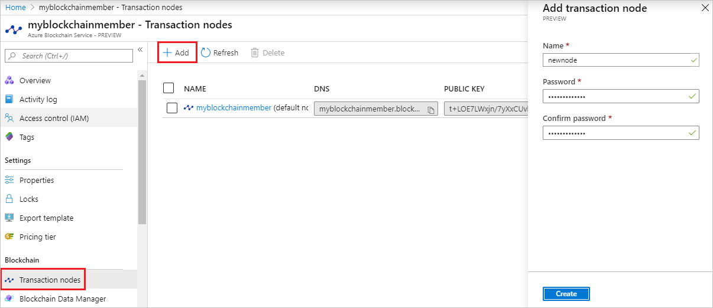
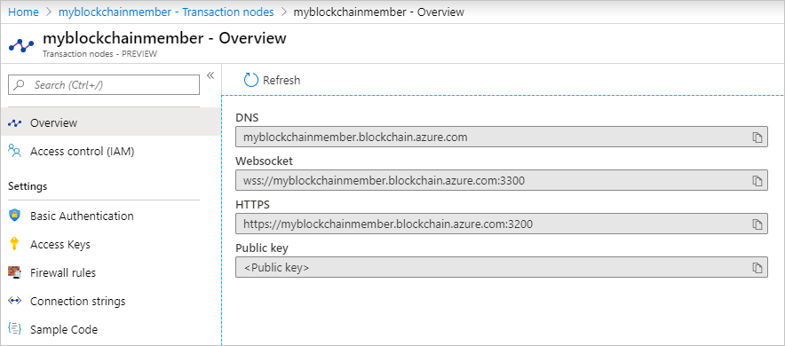
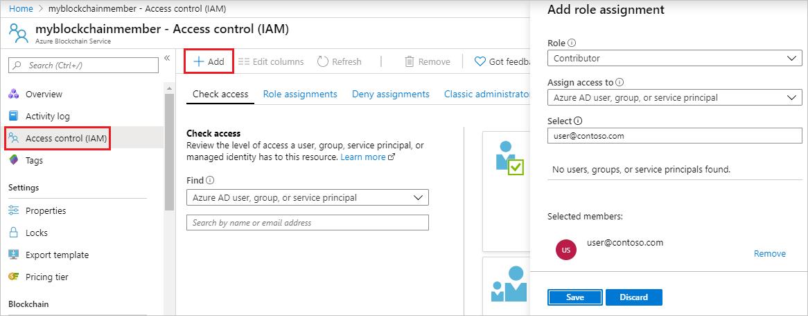
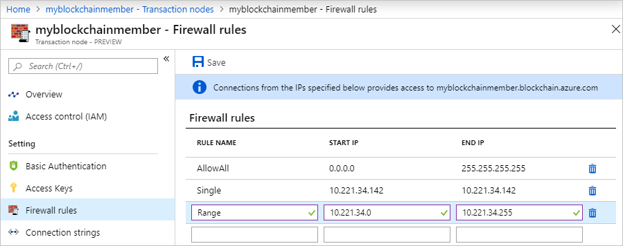
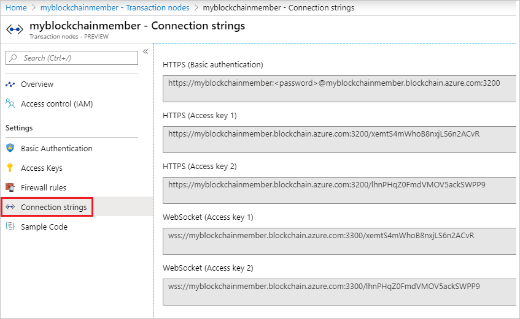
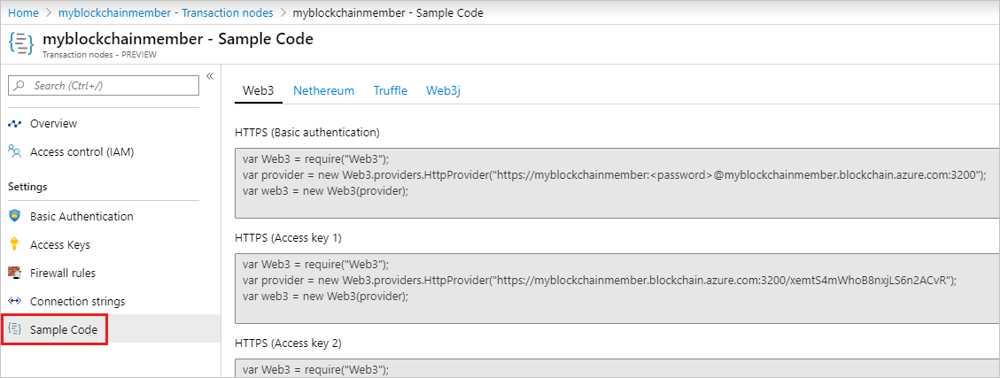

# Configure Azure Blockchain Service transaction nodes

To quickly create and manage transaction nodes for your Azure Blockchain blockchain member, you can use Azure portal for configuration.

## Prerequisites

* [Create an Azure Blockchain member](create-member.md)

## Transaction node overview

Transaction nodes are used to send blockchain transactions to Azure Blockchain Service through a public endpoint. When you create a blockchain member, a default transaction node with the same name as the blockchain member is provisioned. The default transaction node can't be deleted.

To view the default transaction node details:

1. Sign in to the [Azure portal](https://portal.azure.com).
1. Navigate to your Azure Blockchain Service member and select **Transaction nodes > Overview**.

    

    Overview details include public endpoint addresses and public key.

## Create transaction node

You can add transaction nodes to your blockchain member. By adding transaction nodes, you can increase scalability or distribute load. For example, you could have a transaction node endpoint for different client applications.

To add a transaction node:

1. In the Azure portal, navigate to your Azure Blockchain Service member and select **Transaction nodes > Add**.
1. Complete the settings for the new transaction node.

    

    | Setting | Description |
    |---------|-------------|
    | Name | Transaction node name. The name is used to create the DNS address for the transaction node endpoint. For example, `newnode-myblockchainmember.blockchain.azure.com`. The node name cannot be changed once it is created. |
    | Password | Set a strong password. Use the password to access the transaction node endpoint with basic authentication.

1. Select **Create**.

    Provisioning a new transaction node takes about 10 minutes. Additional transaction nodes incur cost. For more information on costs, see [Azure pricing](https://azure.microsoft.com/pricing/).

## Endpoints

Transaction nodes have a unique DNS name and public endpoints.

To view a transaction node's endpoint details:

1. In the Azure portal, navigate to one of your Azure Blockchain Service member transaction nodes and select **Overview**.

    

Transaction node endpoints are secure and require authentication. You can connect to a transaction endpoint using Azure AD authentication, HTTP basic authentication, and using an access key.

### Azure Active Directory access control

Azure Blockchain Service transaction node endpoints support Azure Active Directory (Azure AD) authentication. You can grant Azure AD user, group, and service principal access to your endpoint.

To grant Azure AD access control to your endpoint:

1. In the Azure portal, navigate to your Azure Blockchain Service member and select **Transaction nodes > Access control (IAM) > Add > Add role assignment**.
1. Create a new role assignment for a user, group, or service principal (application roles).

    

    | Setting | Action |
    |---------|-------------|
    | Role | Select **Owner**, **Contributor**, or **Reader**.
    | Assign access to | Select **Azure AD user, group, or service principal**.
    | Select | Search for the user, group, or service principal you want to add.

1. Select **Save** to add the role assignment.

For more information on Azure AD access control, see [Manage access to Azure resources using RBAC and the Azure portal](../../role-based-access-control/role-assignments-portal.md)

For details on how to connect using Azure AD authentication, see [connect to your node using AAD authentication](configure-aad.md).

### Basic authentication

For HTTP basic authentication, user name and password credentials are passed in the HTTP header of the request to the endpoint.

You can view a transaction node's basic authentication endpoint details in the Azure portal. Navigate to one of your Azure Blockchain Service member transaction nodes and select **Basic Authentication** in settings.

The user name is the name of your node and cannot be changed.

To use the URL, replace \<password\> with the password set when the node was provisioned. You can update the password by selecting **Reset password**.

### Access keys

For access key authentication, the access key is included in the endpoint URL. When the transaction node is provisioned, two access keys are generated. Either access key can be used for authentication. Two keys enable you change and rotate keys.

You can view a transaction node's access key details and copy endpoint addresses that include the access keys. Navigate to one of your Azure Blockchain Service member transaction nodes and select **Access Keys** in settings.

### Firewall rules

Firewall rules enable you to limit the IP addresses that can attempt to authenticate to your transaction node.  If no firewall rules are configured for your transaction node, it cannot be accessed by any party.  

To view a transaction node's firewall rules, navigate to one of your Azure Blockchain Service member transaction nodes and select **Firewall rules** in settings.

You can add firewall rules by entering a rule name, starting IP address, and an ending IP address in the **Firewall rules** grid.

To enable:

* **Single IP address:** Configure the same IP address for the starting and ending IP addresses.
* **IP address range:** Configure the starting and ending IP address range. For example, a range starting at 10.221.34.0 and ending at 10.221.34.255 would enable the entire 10.221.34.xxx subnet.
* **Allow all IP addresses:** Configure the starting IP address to 0.0.0.0 and the ending IP address to 255.255.255.255.

## Connection strings

Connection string syntax for your transaction node is provided for basic authentication or using access keys. Connection strings including access keys over HTTPS and WebSockets are provided.

You can view a transaction node's connection strings and copy endpoint addresses. Navigate to one of your Azure Blockchain Service member transaction nodes and select **Connection strings** in settings.

## Sample code

Sample code is provided to quickly enable connecting to your transaction node via Web3, Nethereum, Web3js, and Truffle.

You can view a transaction node's sample connection code and copy it to use with popular developer tools. Navigate to one of your Azure Blockchain Service member transaction nodes and select **Sample Code** in settings.

Choose the Web3 or Nethereum tab to view the code sample you want to use.

## Next steps

> [!div class="nextstepaction"]
> [Configure transaction nodes using Azure CLI](manage-cli.md)
