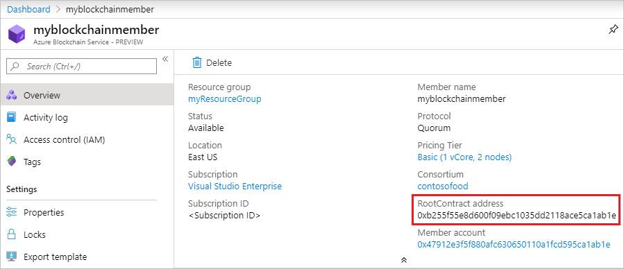

# Azure Blockchain Service Consortium

Using Azure Blockchain Service, you can create private consortium blockchain networks where each blockchain network can be limited to specific participants in the network. Only participants in the private consortium blockchain network can view and interact with the blockchain. Consortium networks in Azure Blockchain Service can contain two types of member participant roles:

**Administrator** - Privileged participants who can take consortium management actions and can participate in blockchain transactions.
**User** -  Participants who cannot take any consortium management action but can participate in blockchain transactions.

Consortium networks can be a mix of participant roles and can have an arbitrary number of each role type.

The following diagram shows a consortium network with multiple participants:

[Private consortium network diagram](./media/consortium/network-diagram.png)

With consortium management in Azure Blockchain Service, you can manage participants in the consortium network. Management of the consortium is based on the consensus model of the network. In the current preview release, Azure Blockchain Service provides a centralized consensus model for consortium management. Any privileged participant with an administer role can take consortium management actions, such as adding or removing participants from a network.

## Roles

Participants in a consortium can be individuals or organizations and can be assigned a user (member) role or an administrator role. The following table lists the high-level differences between the two roles:

| Action | User role | Administrator role
|--------|:----:|:------------:|
| Create new member | Yes | Yes |
| Invite new members | No | Yes |
| Set or change member participant role | No | Yes |
| Change member display name | Only for own member | Only for own member |
| Remove members | Only for own member | Yes |
| Participate in blockchain transactions | Yes | Yes |

### User role

Users are consortium participants with no administrator capabilities. They cannot participate in managing members related to the consortium. The default role for new participants is user. Users can change their member display name and can remove themselves from a consortium.

### Administrator

An administrator can manage members within the consortium. An administrator can invite members, remove members, or update members roles within the consortium.
There must always be at least one administrator within a consortium. The last administrator must specify another participant as an administrator role before leaving a consortium.

## Managing members

Only administrators can invite other participants to the consortium. Administrators invite participants using their Azure subscription ID.

Once invited, participants can join the blockchain consortium by deploying a new member in Azure Blockchain Service. To view and join the invited consortium, you must specify the same Azure subscription ID used in the invite by the network administrator.

Administrators can remove any participant from the consortium, including other administrators. Members can only remove themselves from a consortium.

## Consortium management smart contract

Consortium management in Azure Blockchain Service is done via consortium management smart contracts. The smart contracts are automatically deployed to your nodes when you deploy a new blockchain member. <!--For a reference of the consortium management smart contracts, see [GitHub link]-->.

The address of the root consortium management smart contract can be viewed in the Azure portal. The **RootContract address** is in blockchain member's overview section.

You can interact with the consortium management smart contract using the consortium management [PowerShell module](), Azure portal, or directly through the smart contract using the Azure Blockchain Service generated Ethereum account.

## Ethereum account

When a member is created, an Ethereum account key is created. Azure Blockchain Service uses the key to create transactions related to consortium management. The Ethereum account key is managed by Azure Blockchain Service automatically.

The member account can be viewed in the Azure portal. The member account is in blockchain member's overview section.

You can reset your Ethereum account by clicking on your member account and entering a new password. Both the Ethereum account address and the password will be reset.  

## Next steps

[How to manage members in Azure Blockchain Service using PowerShell](manage-consortium-powershell.md)
