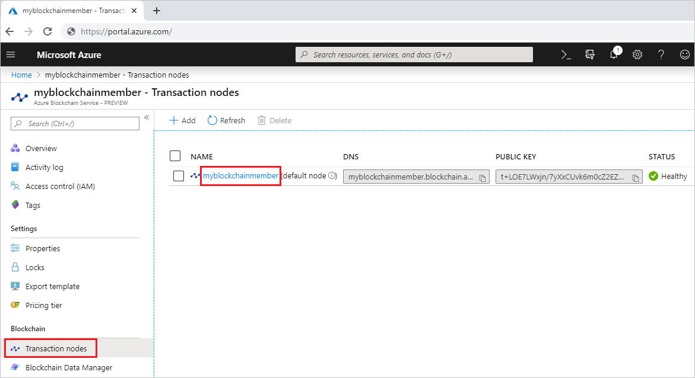
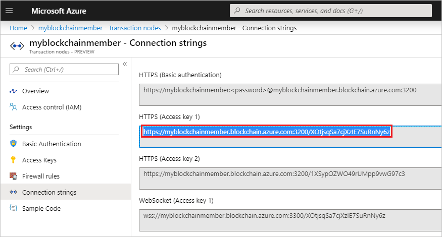

# How to use Ethereum Blockchain connector with Azure Logic Apps

Use the [Ethereum Blockchain connector](https://docs.microsoft.com/connectors/blockchainethereum/) with [Azure Logic Apps](https://docs.microsoft.com/azure/logic-apps/) to perform smart contract actions and respond to smart contract events. For example, you want to provide a web API that returns information from a blockchain ledger. Using a logic app, you can accept HTTP requests that query information stored in a blockchain ledger.

## Prerequisites

* Complete the optional prerequisite [Quickstart: Use Visual Studio Code to connect to a Azure Blockchain Service consortium network](connect-vscode.md). The quickstart guides you though installing the [Azure Blockchain Development Kit for Ethereum](https://marketplace.visualstudio.com/items?itemName=AzBlockchain.azure-blockchain) and setting up your blockchain development environment.

## Create a logic app

Azure Logic Apps help you schedule, automate business processes and workflows when you need to integrate systems and services. First, you create a logic that uses the Ethereum Blockchain connector. 

1. In the [Azure portal](https://portal.azure.com), choose **Create a resource > Integration > Logic App**.
1. Under **Create logic app**, provide details where to create your logic app. After you're done, select **Create**. For more information on creating Azure Logic Apps, see [Create Azure Logic Apps](../../logic-apps/quickstart-create-first-logic-app-workflow.md).
1. After Azure deploys your app, select your logic app resource.
1. In the Logic Apps Designer, under **Templates**, choose **Blank Logic App**.

Every logic app must start with a trigger, which fires when a specific event happens or when a specific condition is met. Each time the trigger fires, the Logic Apps engine creates a logic app instance that starts and runs your workflow.

The Ethereum Blockchain connector has one trigger and several actions. Which trigger or action you use depends on your scenario.

If your workflow:

* Triggers when an event occurs on the blockchain, [use the event trigger](#use-the-event-trigger)
* Queries or deploys a smart contract, [use actions](#use-actions)

## Use the event trigger

Use Ethereum Blockchain event triggers when you want a logic app to run after a smart contract event occurs. For example, you want to send an email when a smart contract function is called.

1. In the Logic App designer, choose the Ethereum Blockchain connector.
1. From the **Triggers** tab, choose **When a smart contract event occurs**.
1. Change or [create an API connection](#create-an-api-connection) to your Azure Blockchain Service.
1. Enter the details about the smart contract you want to check for events.

    [screenshot]

| Property | Description |
|----------|-------------|
| **Contract ABI** | How to [get the contract ABI](#get-contract-abi). |
| **Smart contract address** | How to [get the contract address](#get-contract-address). |
| **Event name** | Choose a smart contract event to check. The event triggers the logic app. |
| **Interval** and **Frequency** | Choose how often you want to check for the event. |

## Use actions

Use the Ethereum Blockchain actions when you want a logic app to perform an action on the blockchain ledger. For example, you want to call a smart contract function when an HTTP request is made to a logic app.

Connector actions require a trigger. You can use an Ethereum Blockchain connector action as the next step after a trigger.

1. In the Logic App designer, select **New step** following a trigger. 
1. Choose the Ethereum Blockchain connector.
1. From the **Actions** tab, choose one of the available actions.

    [screenshot]

1. Change or [create an API connection](#create-an-api-connection) to your Azure Blockchain Service.
1. Depending on the action you chose, provide the following details about your smart contract function.

    | Property | Description |
    |----------|-------------|
    | **Contract ABI** | How to [get the contract ABI](#get-contract-abi). |
    | **Contract bytecode** | The compiled smart contract bytecode. How to [get the contract bytecode](#get-contract-bytecode). |
    | **Smart contract address** | How to [get the contract address](#get-contract-address). |
    | **Smart contract function name** | Choose the smart contract function name for the action. The list is populated from the details in the contract ABI. |

    After choosing a smart contract function name, you may see required fields for function parameters. Enter the values or dynamic content required for your scenario.

## Create an API connection

An API connection to a blockchain is required for the Ethereum Blockchain connector. You can use the API connector for multiple logic apps. To set up a connection to an Azure Blockchain Service member, you need the following information:

| Property | Description |
|----------|-------------|
|**Connection name** | Name of the API connection. |
|**Ethereum RPC endpoint** | HTTP address of the Azure Blockchain Service transaction node. How to [get the RPC endpoint](#get-rpc-endpoint). |
|**Private key** | Ethereum account private key. How to [get the private key](#get-private-key). |
|**Account address** | Azure Blockchain Service member account address. How to [get the account address](#get-account-address). |
|**Account password** | The account password is set when you create the member. For information on resetting the password, see [Ethereum account](consortium.md#ethereum-account).|

> [!IMPORTANT]
> A private key or account address and password is required for creating transactions on a blockchain. Only one form of authentication is needed. You don't need to provide both the private key and account details. Querying contracts does not require a transaction. If you are using actions that query contract state, the private key or account address and password are not required.

## Get RPC endpoint

You need the Azure Blockchain Service endpoint address to connect to a blockchain network. You can get endpoint address using the Azure Blockchain Development Kit for Ethereum or the Azure portal.

Using development kit:

1. Under **Azure Blockchain Service** in Visual Studio Code, right click the consortium.
1. Select **Copy RPC endpoint**.

    [screenshot]

Using Azure portal:

1. Sign in to the [Azure portal](https://portal.azure.com).
1. Navigate to your Azure Blockchain Service member. Select **Transaction nodes** and the default transaction node link.

    

1. Select **Connection strings > Access keys**.
1. Copy the endpoint address from **HTTPS (Access key 1)** or access key 2.

    

    The RPC endpoint is the HTTPS URL including the address and access key of your Azure Blockchain Service member transaction node.

## Get private key 

Your Ethereum account public and private key is generated from a 12 word mnemonic. Azure Blockchain Development Kit for Ethereum generates a mnemonic when you connect to a Azure Blockchain Service consortium member. You can get endpoint address using the development kit extension.

1. In Visual Studio Code, open the command palette (F1).
1. Choose **Azure Blockchain: Retrieve private key**.
1. Select mnemonic you saved when connecting to the consortium member. The private key is copied to your clipboard.

    [screenshot]

## Get account address

The member account and password is required to authenticate to the management smart contract at the root contract address. The password is set when you create the member.

1. In the Azure portal, go to your Azure Blockchain Service overview page.
1. Copy the **member account** address.

    [screenshot]

For more information on the account address and password, see [Ethereum account](consortium.md#ethereum-account).

## Get contract ABI

The contract application binary interface (ABI) defines the smart contract interfaces. It describes how to interact with the smart contract. You can get contract ABI using the Azure Blockchain Development Kit for Ethereum or from the Solidity compiler contract metadata file.

Using development kit:

If you used development kit or Truffle to build your smart contract, you can use the extension to copy the contract ABI to the clipboard.

1. In Visual Studio Code explorer pane, expand the **build/contracts** folder of your Solidity project.

    [screenshot]

1. Right-click the contract metadata JSON file.
1. Choose **Copy contract ABI**. The contract ABI is copied to the clipboard.

Using the contract metadata file:

1. Find the "abi" section

The smart contract ABI 
From devkit - right click contract, get ABI.

Select your compiled contract under the build > contracts folder in the VS Code Explorer pane.
Right click the contract.sol file.
Choose copy contract ABI.

The abi section of the contract.json file is copied to your clipboard.

## Get contract bytecode

from devkit - right click contract, get bytecode
solc --bin sourcefile.sol

## Get contract address

from truffle deployment output. 
From build>contract> contract.json > networks > number > address file .

## Next steps
