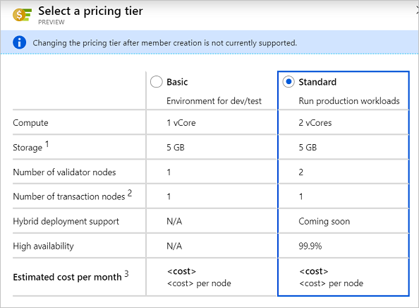
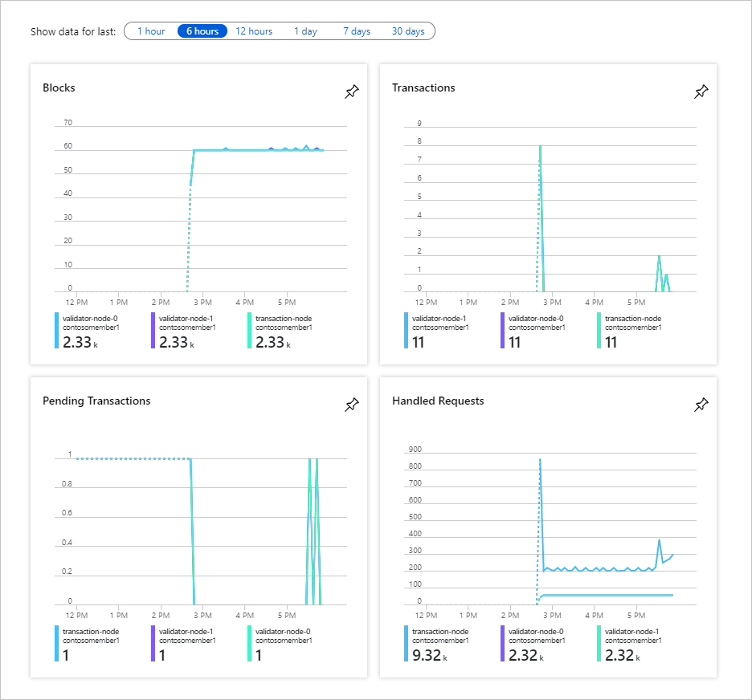

# What is Azure Blockchain Service?

Azure Blockchain Service is a fully managed ledger service that enables users the ability to grow and operate blockchain networks at scale in Azure. By providing unified control for both infrastructure management as well as blockchain network governance, Azure Blockchain Service provides:

* Simple network deployment and operations
* Built-in consortium management
* Develop smart contracts with familiar development tools

Azure Blockchain Service is designed to support multiple ledger protocols. Currently, it provides support for the Ethereum [Quorum](https://www.jpmorgan.com/Quorum) ledger using the [IBFT](https://github.com/jpmorganchase/quorum/wiki/Quorum-Consensus) consensus mechanism.

These capabilities require almost no administration and all are provided at no additional cost. You can focus on app development and business logic rather than allocating time and resources to managing virtual machines and infrastructure. In addition, you can continue to develop your application with the open-source tools and platform of your choice to deliver your solutions without having to learn new skills.

## Network deployment and operations

Deploying Azure Blockchain Service is done through the Azure portal, Azure CLI, or through Visual Studio code using the Azure Blockchain extension. Deployment is simplified, including provisioning both transaction and validator nodes, Azure Virtual Networks for security isolation as well as service-managed storage.  In addition, when deploying a new blockchain member, users also create, or join, a consortium.  Consortiums enable multiple parties in different Azure subscriptions to be able to securely communicate with one another on a shared blockchain.  This simplified deployment reduces blockchain network deployment from days to minutes.

### Performance and service tiers

Azure Blockchain Service offers two service tiers: *Basic* and *Standard*. Each tier offers different performance and capabilities to support lightweight development and test workloads up to massively scaled production blockchain deployments. Both tiers include at least one transaction node, and one validator node (Basic) or two validator nodes (Standard).

In addition to offering two validator nodes, the *Standard* tier provides 2 *vCores* for each transaction and validator node whereas the Basic tier offers a 1 vCore configuration.  By offering 2 vCores for transaction and validator nodes, 1 vCore can be dedicated to the Quorum ledger while the remaining 1 vCore can be used for other infrastructure-related services, ensuring optimal performance for production blockchain workloads. For more information on pricing details, see [Azure Blockchain Service pricing](https://azure.microsoft.com/pricing/details/blockchain-service).

### Security and maintenance

After provisioning your first blockchain member, you have the ability to add additional transaction nodes to your member.  By default, transaction nodes are secured through firewall rules and require configuration for access.  Additionally, all transaction nodes encrypt data in motion via TLS.  Multiple options exist for securing transaction node access, including firewall rules, basic authentication, access keys, and Azure Active Directory integration. For more information, see [configure transaction nodes](configure-transaction-nodes.md) and [configure Azure Active Directory access](configure-aad.md).

As a managed service, Azure Blockchain Service ensures that your blockchain member's nodes are patched with the latest host operating system and ledger software stack updates, configured for high-availability (Standard tier only), eliminating much of the DevOps required for traditional IaaS blockchain nodes.  For more information on patching and updates, see [supported Azure Blockchain Service ledger versions](ledger-versions.md).

### Monitoring and logging

In addition, Azure Blockchain Service provides rich metrics through Azure Monitor Service providing insights into nodes' CPU, memory, and storage usage.  Azure Monitor also provides helpful insights into blockchain network activity such as transactions and blocks mined, transaction queue depth, and active connections.  Metrics can be customized to provide views into the insights that are important to your blockchain application.  In addition, thresholds can be defined through alerts enabling users to trigger actions such as sending an email or text message, running a Logic App, Azure Function or sending to a custom-defined webhook.

Through Azure Log Analytics, users can view logs related to the Quorum ledger, or other important information such as attempted connections to the transaction nodes.

## Built-in consortium management

When deploying your first blockchain member, you either join or create a new consortium.  A consortium is a logical group used to manage the governance and connectivity between blockchain members who transact in a multi-party process.  Azure Blockchain Service provides built-in governance controls through pre-defined smart contracts, which determine what actions members in the consortium can take.  These governance controls can be customized as necessary by the administrator of the consortium. When you create a new consortium, your blockchain member is the default administrator of the consortium, enabling the ability to invite other parties to join your consortium.  You can join a consortium only if you have been previously invited.  When joining a consortium, your blockchain member is subject to the governance controls put in place by the consortium's administrator.

Consortium management actions such as adding and removing members from a consortium can be accessed through PowerShell and a REST API. You can programmatically manage a consortium using common interfaces rather than modifying and submitting solidity-based smart contracts. For more information, see [consortium management](consortium.md).

## Develop using familiar development tools

Based on the open-sourced Quorum Ethereum ledger, you can develop applications for Azure Blockchain Service the same way as you do for existing Ethereum applications. Working with leading industry partners, the Azure Blockchain Development Kit Visual Studio Code extension allows developers to leverage familiar tools like Truffle Suite to build smart contracts. Using the Azure Blockchain Development Kit extension, developers can create, or connect to and existing consortium so that you can build and deploy your smart contracts all from one IDE. Using the Azure Blockchain Visual Studio Code extension, you can create or connect to an existing consortium so that you can build and deploy your smart contracts all from one IDE. For more information, see [Azure Blockchain Development Kit in the VS Code marketplace](https://aka.ms/vscodebcextension) and the [Azure Blockchain Development Kit user guide](https://aka.ms/vscodebcextensionwiki ).

## Publish blockchain data

Blockchain Data Manager for Azure Blockchain Service captures, transforms, and delivers Azure Blockchain Service transaction data to Azure Event Grid Topics providing reliable and scalable blockchain ledger integration with Azure services. You can use Blockchain Data Manager to integrate off-chain applications and data stores. For more information, see [What is Blockchain Data Manager for Azure Blockchain Service?](data-manager.md).

## Support and feedback

Need help or have feedback?

* Visit the [Azure Blockchain blog](https://azure.microsoft.com/blog/topics/blockchain/), [Microsoft Tech Community](https://techcommunity.microsoft.com/t5/Blockchain/bd-p/AzureBlockchain), and [Azure Blockchain forum](https://social.msdn.microsoft.com/Forums/home?forum=azureblockchain).
* To provide feedback or to request new features, create an entry via [UserVoice](https://feedback.azure.com/forums/921130-azure-blockchain-service).

## Next steps

To get started, try a quickstart or find out more details from these resources.
* [Create a blockchain member using the Azure portal](create-member.md) or [create a blockchain member using Azure CLI](create-member-cli.md)
* For cost comparisons and calculators, see the [pricing page](https://azure.microsoft.com/pricing/details/blockchain-service).
* Build your first app using the [Azure Blockchain Development Kit](https://github.com/Azure-Samples/blockchain-devkit)
* Azure Blockchain VSCode Extension [user guide](https://github.com/Microsoft/vscode-azure-blockchain-ethereum/wiki)
