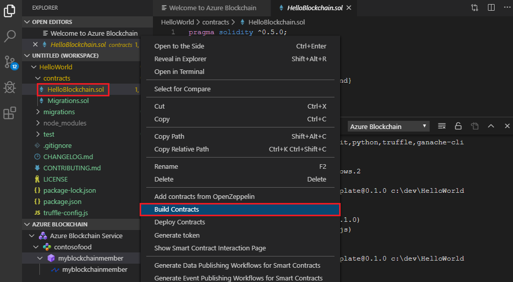
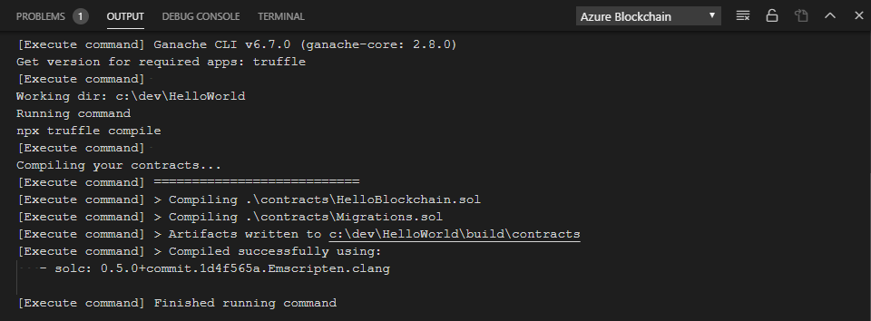
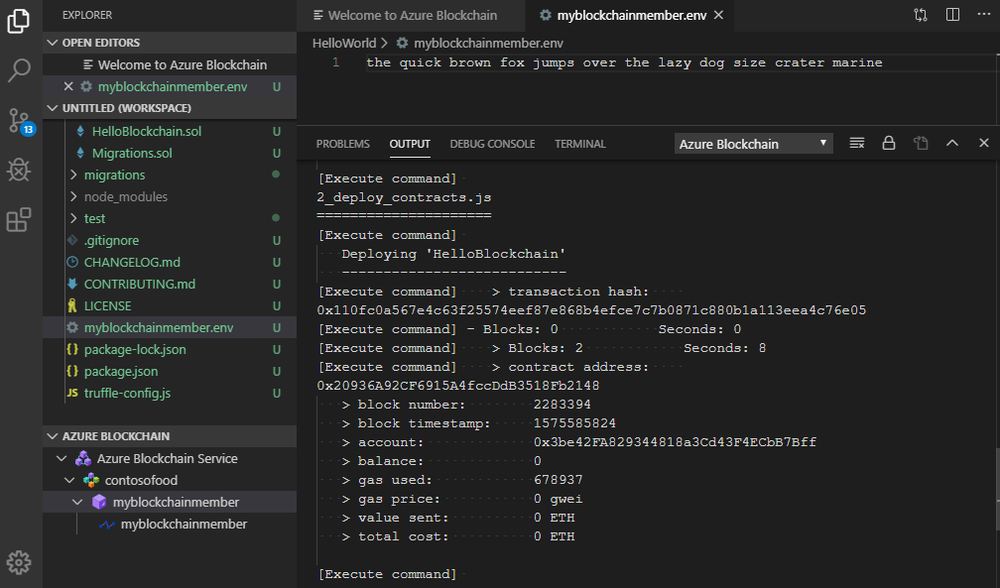

# Tutorial: Create, build, and deploy smart contracts on Azure Blockchain Service

In this tutorial, use the Azure Blockchain Development Kit for Ethereum extension in Visual Studio Code to create, build, and deploy a smart contract on Azure Blockchain Service. You also use Truffle to execute a smart contract function via a transaction.

You use Azure Blockchain Development Kit for Ethereum to:

> [!div class="checklist"]
> * Create a smart contract
> * Deploy a smart contract
> * Execute a smart contract function via a transaction
> * Query contract state

[!INCLUDE [quickstarts-free-trial-note](../../../includes/quickstarts-free-trial-note.md)]

## Prerequisites

* Complete [Quickstart: Use Visual Studio Code to connect to a Azure Blockchain Service consortium network](connect-vscode.md)
* [Visual Studio Code](https://code.visualstudio.com/Download)
* [Azure Blockchain Development Kit for Ethereum extension](https://marketplace.visualstudio.com/items?itemName=AzBlockchain.azure-blockchain)
* [Node.js 10.15.x or higher](https://nodejs.org/download)
* [Git 2.10.x or higher](https://git-scm.com)
* [Python 2.7.15](https://www.python.org/downloads/release/python-2715/) Add python.exe to your path. Python version 2.7.15 in your path is required for Azure Blockchain Development Kit.
* [Truffle 5.0.0](https://www.trufflesuite.com/docs/truffle/getting-started/installation)
* [Ganache CLI 6.0.0](https://github.com/trufflesuite/ganache-cli)

On Windows, an installed C++ compiler is required. You can use the MSBuild tools:

* If Visual Studio 2017 is installed, configure npm to use the MSBuild tools using the command `npm config set msvs_version 2017 -g`
* If Visual Studio 2019 is installed, set the MS build tools path for npm. For example, `npm config set msbuild_path "C:\Program Files (x86)\Microsoft Visual Studio\2019\Community\MSBuild\Current\Bin\MSBuild.exe"`
* Otherwise, install the stand-alone VS Build tools using `npm install --global windows-build-tools` in an elevated *Run as administrator* command shell.

## Create a smart contract

The Azure Blockchain Development Kit for Ethereum uses project templates and Truffle tools to help scaffold, build, and deploy contracts. Before you begin, complete the prerequisite [Quickstart: Use Visual Studio Code to connect to a Azure Blockchain Service consortium network](connect-vscode.md). The quickstart guides you through the installation and configuration of the Azure Blockchain Development Kit for Ethereum.

1. From the VS Code command palette, choose **Azure Blockchain: New Solidity Project**.
1. Choose **Create basic project**.
1. Create a new folder named `HelloBlockchain` and **Select new project path**.

The Azure Blockchain Development Kit creates and initializes a new Solidity project for you. The basic project includes a sample **HelloBlockchain** smart contract and all the necessary files to build and deploy to your consortium member in Azure Blockchain Service. It may take several minutes for the project to be created. You can monitor the progress in VS Code's terminal panel by selecting the output for Azure Blockchain.

The project structure looks like the following example:

   

## Build a smart contract

Smart contracts are located in the project's **contracts** directory. You compile smart contracts before you deploy them to a blockchain. Use the **Build Contracts** command to compile all the smart contracts in your project.

1. In the VS Code explorer sidebar, expand the **contracts** folder in your project.
1. Right-click **HelloBlockchain.sol** and choose **Build Contracts** from the menu.

    

Azure Blockchain Development Kit uses Truffle to compile the smart contracts.



## Deploy a smart contract

Truffle uses migration scripts to deploy your contracts to an Ethereum network. Migrations are JavaScript files located in the project's **migrations** directory.

1. To deploy your smart contract, right-click **HelloBlockchain.sol** and choose **Deploy Contracts** from the menu.
1. Choose your Azure Blockchain consortium network in the command palette. The consortium blockchain network was added to the project's Truffle configuration file when you created the project.
1. Choose **Generate mnemonic**. Choose a filename and save the mnemonic file in the project folder. For example, `myblockchainmember.env`. The mnemonic file is used to generate an Ethereum private key for your blockchain member.

Azure Blockchain Development Kit uses Truffle to execute the migration script to deploy the contracts to the blockchain.



## Call a contract function

The **HelloBlockchain** contract's **SendRequest** function changes the **RequestMessage** state variable. Changing the state of a blockchain network is done via a transaction. You can create a script to execute the **SendRequest** function via a transaction.

1. Create a new file in the root of your Truffle project and name it `sendrequest.js`. Add the following Web3 JavaScript code to the file.

    ```javascript
    var HelloBlockchain = artifacts.require("HelloBlockchain");
        
    module.exports = function(done) {
      console.log("Getting the deployed version of the HelloBlockchain smart contract")
      HelloBlockchain.deployed().then(function(instance) {
        console.log("Calling SendRequest function for contract ", instance.address);
        return instance.SendRequest("Hello, blockchain!");
      }).then(function(result) {
        console.log("Transaction hash: ", result.tx);
        console.log("Request complete");
        done();
      }).catch(function(e) {
        console.log(e);
        done();
      });
    };
    ```

1. When Azure Blockchain Development Kit creates a project, the Truffle configuration file is generated with your consortium blockchain network endpoint details. Open **truffle-config.js** in your project. The configuration file lists two networks: one named development and one with the same name as the consortium.
1. In VS Code's terminal pane, use Truffle to execute the script on your consortium blockchain network. In the terminal pane menu bar, select the **Terminal** tab and **PowerShell** in the dropdown.

    ```PowerShell
    truffle exec sendrequest.js --network <blockchain network>
    ```

    Replace \<blockchain network\> with the name of the blockchain network defined in the **truffle-config.js**.

Truffle executes the script on your blockchain network.


When you execute a contract's function via a transaction, the transaction isn't processed until a block is created. Functions meant to be executed via a transaction return a transaction ID instead of a return value.

## Query contract state

Smart contract functions can return the current value of state variables. Let's add a function to return the value of a state variable.

1. In **HelloBlockchain.sol**, add a **getMessage** function to the **HelloBlockchain** smart contract.

    ``` solidity
    function getMessage() public view returns (string memory)
    {
        if (State == StateType.Request)
            return RequestMessage;
        else
            return ResponseMessage;
    }
    ```

    The function returns the message stored in a state variable based on the current state of the contract.

1. Right-click **HelloBlockchain.sol** and choose **Build Contracts** from the menu to compile the changes to the smart contract.
1. To deploy, right-click **HelloBlockchain.sol** and choose **Deploy Contracts** from the menu. When prompted, choose your Azure Blockchain consortium network in the command palette.
1. Next, create a script using to call the **getMessage** function. Create a new file in the root of your Truffle project and name it `getmessage.js`. Add the following Web3 JavaScript code to the file.

    ```javascript
    var HelloBlockchain = artifacts.require("HelloBlockchain");
    
    module.exports = function(done) {
      console.log("Getting the deployed version of the HelloBlockchain smart contract")
      HelloBlockchain.deployed().then(function(instance) {
        console.log("Calling getMessage function for contract ", instance.address);
        return instance.getMessage();
      }).then(function(result) {
        console.log("Request message value: ", result);
        console.log("Request complete");
        done();
      }).catch(function(e) {
        console.log(e);
        done();
      });
    };
    ```

1. In VS Code's terminal pane, use Truffle to execute the script on your blockchain network. In the terminal pane menu bar, select the **Terminal** tab and **PowerShell** in the dropdown.

    ```bash
    truffle exec getmessage.js --network <blockchain network>
    ```

    Replace \<blockchain network\> with the name of the blockchain network defined in the **truffle-config.js**.

The script queries the smart contract by calling the getMessage function. The current value of the **RequestMessage** state variable is returned.


Notice the value is not **Hello, blockchain!**. Instead, the returned value is a placeholder. When you change and deploy the contract, the changed contract is deployed at a new address and the state variables are assigned values in the smart contract constructor. The Truffle sample **2_deploy_contracts.js** migration script deploys the smart contract and passes a placeholder value as an argument. The constructor sets the **RequestMessage** state variable to the placeholder value and that's what is returned.

1. To set the **RequestMessage** state variable and query the value, run the **sendrequest.js** and **getmessage.js** scripts again.

    

    **sendrequest.js** sets the **RequestMessage** state variable to **Hello, blockchain!** and **getmessage.js** queries the contract for value of **RequestMessage** state variable and returns **Hello, blockchain!**.

## Clean up resources

When no longer needed, you can delete the resources by deleting the `myResourceGroup` resource group you created in the *Create a blockchain member* prerequisite quickstart.

To delete the resource group:

1. In the Azure portal, navigate to **Resource group** in the left navigation pane and select the resource group you want to delete.
1. Select **Delete resource group**. Verify deletion by entering the resource group name and select **Delete**.

## Next steps

In this tutorial, you created a sample Solidity project using Azure Blockchain Development Kit. You built and deployed a smart contract then called a function via a transaction on a blockchain consortium network hosted on Azure Blockchain Service.

> [!div class="nextstepaction"]
> [Developing blockchain applications using Azure Blockchain Service](develop.md)
