# Deploy Ethereum proof-of-authority consortium solution template on Azure

You can use [the Ethereum Proof-of-Authority Consortium preview Azure solution template](https://azuremarketplace.microsoft.com/marketplace/apps/microsoft-azure-blockchain.azure-blockchain-ethereum) to deploy, configure, and govern a multi-member consortium proof-of-authority Ethereum network with minimal Azure and Ethereum knowledge.

The solution template can be used by each consortium member to provision a blockchain network footprint using
Microsoft Azure compute, networking, and storage services. Each consortium member's network footprint consists of a set of load-balanced validator nodes that an application or user can interact with to submit Ethereum transactions.

## Choose an Azure Blockchain solution

Before choosing to use the Ethereum proof-of-authority consortium solution template, compare your scenario with the common use cases of available Azure Blockchain options.

Option | Service model | Common use case
-------|---------------|-----------------
Solution templates | IaaS | Solution templates are Azure Resource Manager templates you can use to provision a fully configured blockchain network topology. The templates deploy and configure Microsoft Azure compute, networking, and storage services for a given blockchain network type.
[Azure Blockchain Service](../service/overview.md) | PaaS | Azure Blockchain Service Preview simplifies the formation, management, and governance of consortium blockchain networks. Use Azure Blockchain Service for solutions requiring PaaS, consortium management, or contract and transaction privacy.
[Azure Blockchain Workbench](../workbench/overview.md) | IaaS and PaaS | Azure Blockchain Workbench Preview is a collection of Azure services and capabilities designed to help you create and deploy blockchain applications to share business processes and data with other organizations. Use Azure Blockchain Workbench for prototyping a blockchain solution or a blockchain application proof of concept.

## Solution architecture

Using the Ethereum solution template, you can deploy a single or multi-region based multi-member Ethereum proof-of-authority consortium network.


Each consortium member deployment includes:

* Virtual Machines for running the PoA validators
* Azure Load Balancer for distributing RPC, peering, and governance DApp requests
* Azure Key Vault for securing the validator identities
* Azure Storage for hosting persistent network information and coordinating leasing
* Azure Monitor for aggregating logs and performance statistics
* VNet Gateway (optional) for allowing VPN connections across private VNets

By default, the RPC and peering endpoints are accessible over public IP to enable simplified connectivity across
subscriptions and clouds. For application level access-controls, you can use [Parity's permissioning contracts](https://wiki.parity.io/Permissioning). Networks deployed behind VPNs, which leverage VNet gateways for cross-subscription connectivity are supported. Since VPN and VNet deployments are more complex, you may want to start with a public IP model when prototyping a solution.

Docker containers are used for reliability and modularity. Azure Container Registry is used to host and serve versioned images as part of each deployment. The container images consist of:

* Orchestrator - Generates identities and governance contracts. Stores identities in an identity store.
* Parity client - Leases identity from the identity store. Discovers and connects to peers.
* EthStats Agent - Collects local logs and stats via RPC and pushes information to Azure Monitor.
* Governance DApp - Web interface for interacting with Governance contracts.

### Validator nodes

In the proof-of-authority protocol, validator nodes take the place of traditional miner nodes. Each validator has a unique Ethereum identity allowing it to participate in the block creation process. Each consortium member can provision two or more validator nodes across five regions, for geo-redundancy. Validator nodes communicate with other validator nodes to come to consensus on the state of the underlying distributed ledger. To ensure fair participation on the network, each consortium member is prohibited from using more validators than the first member on the network. For example, if the first member deploys three validators, each member can only have up to three validators.

### Identity store

An identity store is deployed in each member's subscription that securely holds the generated Ethereum identities. For each validator, the orchestration container generates an Ethereum private key and stores it in Azure Key Vault.

## Deploy Ethereum consortium network

In this walk through, let's assume you are creating a multi-party Ethereum consortium network. The following flow is an example of a multi-party deployment:

1. Three members each generate an Ethereum account using MetaMask
1. *Member A* deploys Ethereum PoA, providing their Ethereum public address
1. *Member A* provides the consortium URL to *Member B* and *Member C*
1. *Member B* and *Member C* deploy, Ethereum PoA, providing their Ethereum Public Address and *Member A*'s consortium URL
1. *Member A* votes in *Member B* as an admin
1. *Member A* and *Member B* both vote *Member C* as an admin

The next sections show you how to configure the first member's footprint in the network.

### Create resource

In the [Azure portal](https://portal.azure.com), select **Create a resource** in the upper left-hand corner.

Select **Blockchain** > **Ethereum Proof-of-Authority Consortium (preview)**.

### Basics

Under **Basics**, specify values for standard parameters for any deployment.

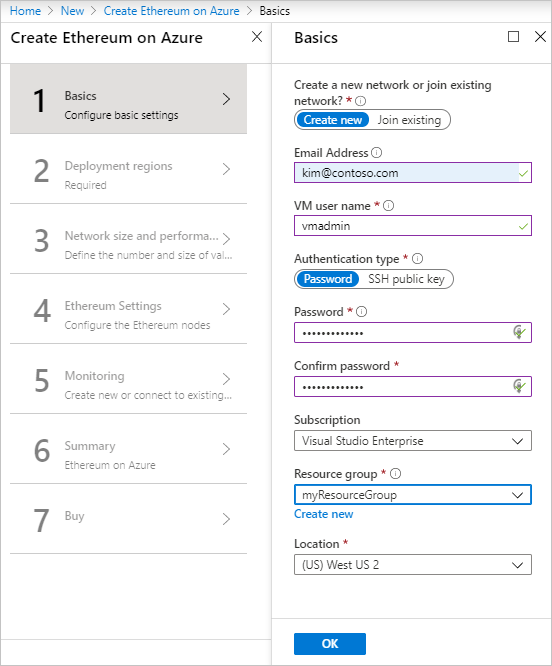

Parameter | Description | Example value
----------|-------------|--------------
Create a new network or join existing network | You can create a new consortium network or join a pre-existing consortium network. Joining an existing network requires additional parameters. | Create new
Email Address | You receive an email notification when your deployment completes with information about your deployment. | A valid email address
VM user name | Administrator username of each deployed VM | 1-64 alphanumeric characters
Authentication type | The method to authenticate to the virtual machine. | Password
Password | The password for the administrator account for each of the virtual machines deployed. All VMs initially have the same password. You can change the password after provisioning. | 12-72 characters 
Subscription | The subscription to which to deploy the consortium network |
Resource Group| The resource group to which to deploy the consortium network. | myResourceGroup
Location | The Azure region for resource group. | West US 2

Select **OK**.

### Deployment regions

Under *Deployment regions*, specify the number of regions
and locations for each. You can deploy in maximum of five regions. The first region should match the resource group location from *Basics* section. For development or test networks, you can use a single region per member. For production, deploy across two or more regions for high-availability.


Parameter | Description | Example value
----------|-------------|--------------
Number of region(s)|Number of regions to deploy the consortium network| 2
First region | First region to deploy the consortium network | West US 2
Second region | Second region to deploy the consortium network. This is visible when number of regions is two or greater. | East US 2

Select **OK**.

### Network size and performance

Under *Network size and performance*, specify inputs for the size of the consortium network. The validator node storage size dictates the potential size of the blockchain. The size can be changed after deployment.


Parameter | Description | Example value
----------|-------------|--------------
Number of load balanced validator nodes | The number of validator nodes to provision as part of the network. | 2
Validator node storage performance | The type of managed disk for each of the deployed validator nodes. For details on pricing, see [storage pricing](https://azure.microsoft.com/pricing/details/managed-disks/) | Standard SSD
Validator node virtual machine size | The virtual machine size used for validator nodes. For details on pricing, see [virtual machine pricing](https://azure.microsoft.com/pricing/details/virtual-machines/windows/) | Standard D2 v3

Virtual machine and storage tier affect network performance.  Use the following table to help choose cost efficiency:

Virtual Machine SKU|Storage Tier|Price|Throughput|Latency
---|---|---|---|---
F1|Standard SSD|low|low|high
D2_v3|Standard SSD|medium|medium|medium
F16s|Premium SSD|high|high|low

Select **OK**.

### Ethereum settings

Under *Ethereum Settings*, specify Ethereum-related configuration settings.

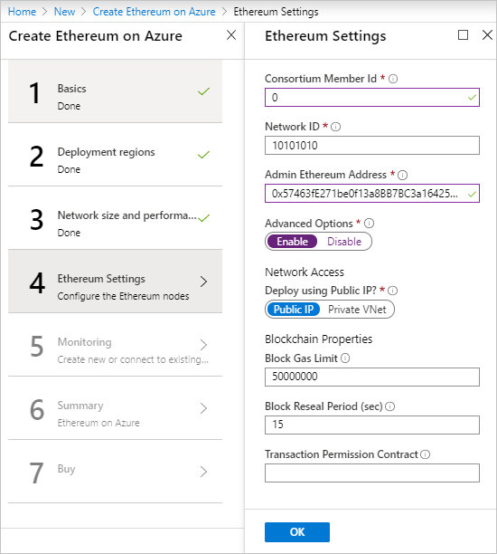

Parameter | Description | Example value
----------|-------------|--------------
Consortium Member ID | The ID associated with each member participating in the consortium network. It's used to configure IP address spaces to avoid collision. For a private network, Member ID should be unique across different organizations in the same network.  A unique member ID is needed even when the same organization deploys to multiple regions. Make note of the value of this parameter since you need to share it with other joining members to ensure there’s no collision. The valid range is 0 through 255. | 0
Network ID | The network ID for the consortium Ethereum network being deployed. Each Ethereum network has its own Network ID, with 1 being the ID for the public network. The valid range is 5 through 999,999,999 | 10101010
Admin Ethereum Address | The Ethereum account address used for participating in PoA governance. You can use MetaMask to generate an Ethereum address. |
Advanced Options | Advanced options for Ethereum settings | Enable
Deploy using Public IP | If Private VNet is selected, the network is deployed behind a VNet Gateway and removes peering access. For Private VNet, all members must use a VNet Gateway for the connection to be compatible. | Public IP
Block Gas Limit | The starting block gas limit of the network. | 50000000
Block Reseal Period (sec) | The frequency at which empty blocks will be created when there are no transactions on the network. A higher frequency will have faster finality but increased storage costs. | 15
Transaction Permission Contract | Bytecode for the Transaction Permissioning contract. Restricts smart contract deployment and execution to a permitted list of Ethereum accounts. |

Select **OK**.

### Monitoring

Monitoring allows you to configure a log resource for your network. The monitoring agent collects and surfaces useful
metrics and logs from your network providing the ability to quickly check the network health or debug issues.


Parameter | Description | Example value
----------|-------------|--------------
Monitoring | Option to enable monitoring | Enable
Connect to existing Azure Monitor logs | Option to create a new Azure Monitor logs instance or join an existing instance | Create new
Location | The region where the new instance is deployed | East US
Existing log analytics workspace ID (Connect to existing Azure Monitor logs = Join Existing)|Workspace ID of the existing Azure Monitor logs instance||NA
Existing log analytics primary key (Connect to existing Azure Monitor logs = Join Existing)|The primary key used to connect to the existing Azure Monitor logs instance||NA

Select **OK**.

### Summary

Click through the summary blade to review the inputs specified and run basic pre-deployment validation. Before deploying, you can download the template and parameters.

Select **Create** to deploy.

If the deployment includes VNet Gateways, the deployment can take up 45 to 50 minutes.

## Deployment output

Once the deployment has completed, you can access the necessary parameters via the confirmation email or through the Azure portal.

### Confirmation email

If you provide an email address ([Basics Section](#basics)), an email
is sent that includes the deployment output information.

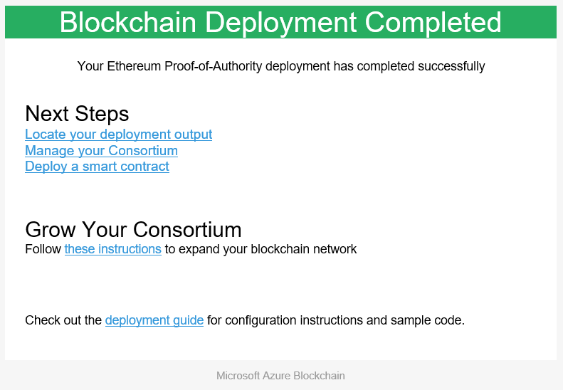

### Portal

Once the deployment has completed successfully and all resources have been provisioned, you can view the output parameters in your resource group.

1. Locate your resource group in the portal
1. Go to **Deployments**
1. Select the top deployment with the same name as your resource group
1. Select **Outputs**

## Growing the consortium

To expand your consortium, you must first connect the physical network. If deploying behind a VPN, see the section [Connecting VNet Gateway](#connecting-vnet-gateways) configure the network connection as part of the new member deployment. Once your deployment completes, use the [Governance DApp](#governance-dapp) to become a network Admin.

### New member deployment

Share the following information with the joining member. The information is found in your post-deployment email or in the portal deployment output.

* Consortium Data Url
* The number of nodes you deployed
* VNet Gateway Resource ID (if using VPN)

The deploying member should use the same Ethereum Proof-of-Authority consortium solution template when deploying their network presence using the following guidance:

* Select **Join Existing**
* Choose the same number of validator nodes as the rest of the members on the network to ensure fair representation
* Use the same Admin Ethereum address
* Use the provided *Consortium Data Url* in the *Ethereum Settings*
* If the rest of the network is behind a VPN, select **Private VNet** under the advanced section

### Connecting VNet gateways

This section is only required if you deployed using a private VNet. You can skip this section if you are using public IP addresses.

For a private network, the different members are connected via VNet gateway connections. Before a member can join the network and see transaction traffic, an existing member must do a final configuration on their VPN gateway to accept the connection. The Ethereum nodes of the joining member won't run until a connection is established. To reduce chances of a single point of failure, create redundant network connections in the consortium.

After the new member deploys, the existing member must complete the bi-directional connection by setting up a VNet gateway connection to the new member. The existing member needs:

* The VNet gateway ResourceID of the connecting member. See [deployment output](#post-deployment).
* The shared connection key.

The existing member must run the following PowerShell script to complete the connection. You can use Azure Cloud Shell located in the top-right navigation bar in the portal.


```Powershell
$MyGatewayResourceId = "<EXISTING_MEMBER_RESOURCEID>"
$OtherGatewayResourceId = "<NEW_MEMBER_RESOURCEID]"
$ConnectionName = "Leader2Member"
$SharedKey = "<NEW_MEMBER_KEY>"

## $myGatewayResourceId tells me what subscription I am in, what ResourceGroup and the VNetGatewayName
$splitValue = $MyGatewayResourceId.Split('/')
$MySubscriptionid = $splitValue[2]
$MyResourceGroup = $splitValue[4]
$MyGatewayName = $splitValue[8]

## $otherGatewayResourceid tells me what the subscription and VNet GatewayName are
$OtherGatewayName = $OtherGatewayResourceId.Split('/')[8]
$Subscription=Select-AzSubscription -SubscriptionId $MySubscriptionid

## create a PSVirtualNetworkGateway instance for the gateway I want to connect to
$OtherGateway=New-Object Microsoft.Azure.Commands.Network.Models.PSVirtualNetworkGateway
$OtherGateway.Name = $OtherGatewayName
$OtherGateway.Id = $OtherGatewayResourceId
$OtherGateway.GatewayType = "Vpn"
$OtherGateway.VpnType = "RouteBased"

## get a PSVirtualNetworkGateway instance for my gateway
$MyGateway = Get-AzVirtualNetworkGateway -Name $MyGatewayName -ResourceGroupName $MyResourceGroup

## create the connection
New-AzVirtualNetworkGatewayConnection -Name $ConnectionName -ResourceGroupName $MyResourceGroup -VirtualNetworkGateway1 $MyGateway -VirtualNetworkGateway2 $OtherGateway -Location $MyGateway.Location -ConnectionType Vnet2Vnet -SharedKey $SharedKey -EnableBgp $True
```

## Service monitoring

You can locate your Azure Monitor portal either by following the link in the deployment email or locating the parameter in the deployment output [OMS_PORTAL_URL].

The portal will first display high-level network statistics and node overview.

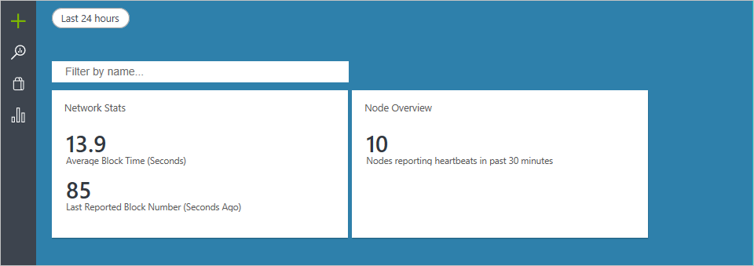

Selecting **Node Overview**  shows you per-node infrastructure statistics.

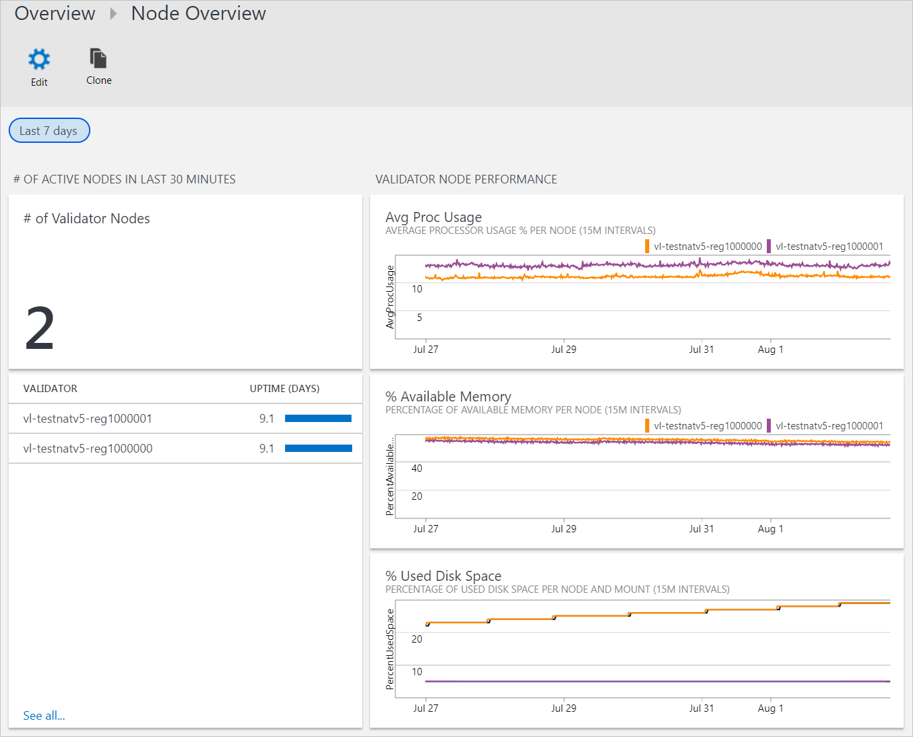

Selecting **Network Stats** shows you Ethereum network statistics.

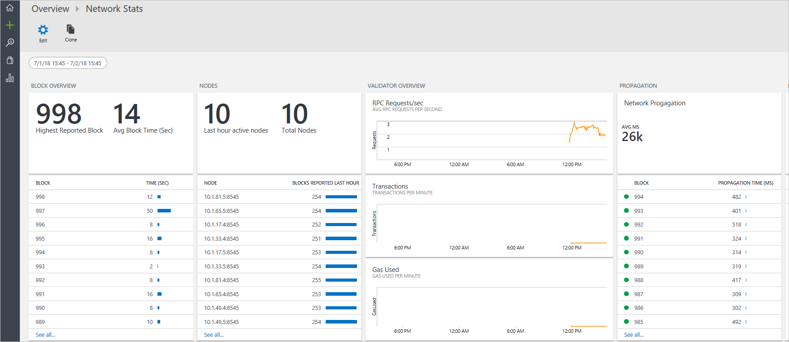

### Sample Kusto queries

You can query the monitoring logs to investigate failures or setup threshold alerting. The following queries are examples you can run in the *Log Search* tool:

#### Lists blocks that have been reported by more than one validator

Useful to help find chain forks.

```sql
MinedBlock_CL
| summarize DistinctMiners = dcount(BlockMiner_s) by BlockNumber_d, BlockMiner_s
| where DistinctMiners > 1
```

#### Get average peer count for a specified validator node averaged over 5-minute buckets

```sql
let PeerCountRegex = @"Syncing with peers: (\d+) active, (\d+) confirmed, (\d+)";
ParityLog_CL
| where Computer == "vl-devn3lgdm-reg1000001"
| project RawData, TimeGenerated
| where RawData matches regex PeerCountRegex
| extend ActivePeers = extract(PeerCountRegex, 1, RawData, typeof(int))
| summarize avg(ActivePeers) by bin(TimeGenerated, 5m)
```

## SSH access

For security reasons, the SSH port access is denied by a network group security rule by default. To access the virtual machine instances in the PoA network, you need to change the following security is rule to *Allow*.

1. Go to the **Overview** section of the deployed resource group in the Azure portal.

    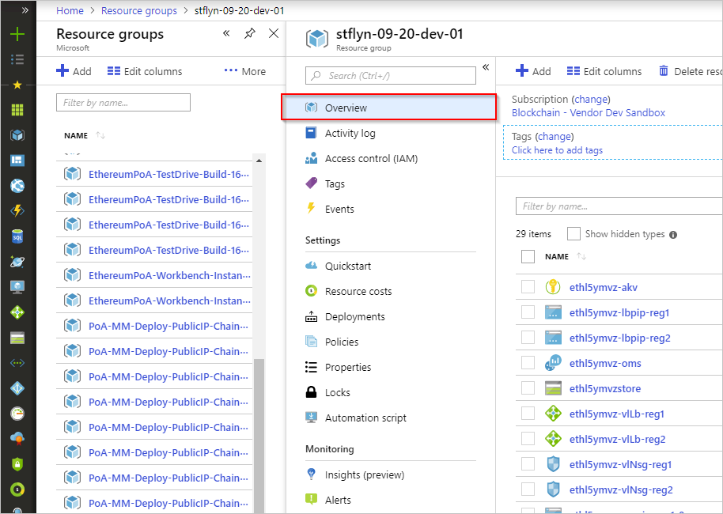

1. Select the **Network Security Group** for the region of the VM you are want to access.

    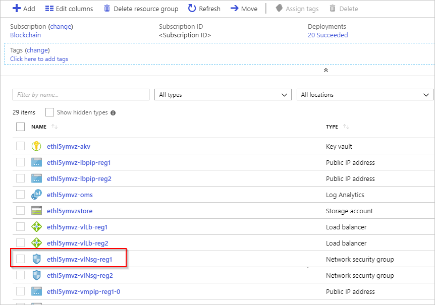

1. Select the **allow-ssh** rule.

    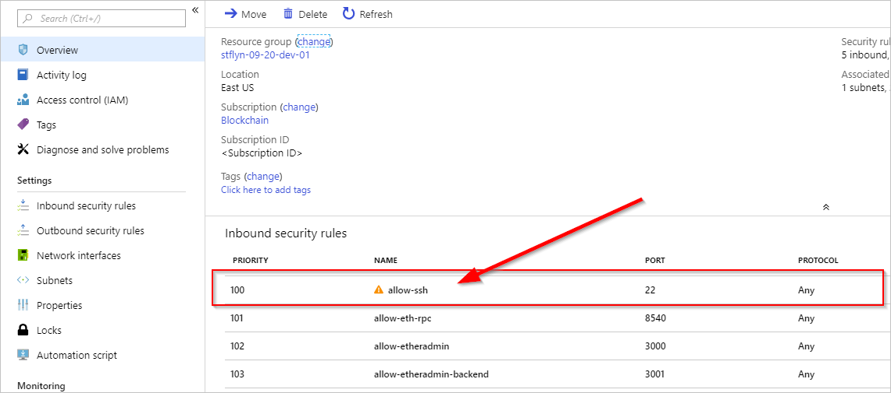

1. Change **Action** to **Allow**

    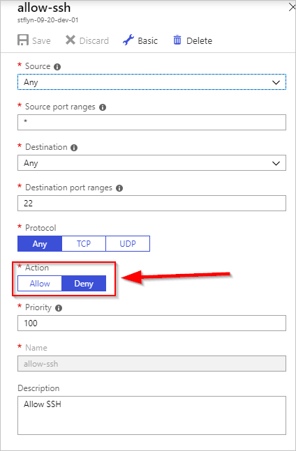

1. Select **Save**. Changes may take a few minutes to apply.

You can remotely connect to the virtual machines for the validator nodes via SSH with your provided admin username and password/SSH key. The SSH command to access the first validator node is listed in the template deployment output. For example:

``` bash
ssh -p 4000 poaadmin\@leader4vb.eastus.cloudapp.azure.com.
```

To get to additional transaction nodes, increment the port number by one.

If you deployed to more than one region, change the command to the DNS name or IP address of the load balancer in that region. To find the DNS name or IP address of the other regions, find the resource with the naming convention **\*\*\*\*\*-lbpip-reg\#** and view its DNS name and IP address properties.

## Azure Traffic Manager load balancing

Azure Traffic Manager can help reduce downtime and improve responsiveness of the PoA network by routing incoming traffic across multiple deployments in different regions. Built-in health checks and automatic rerouting help ensure high availability of the RPC endpoints and the Governance DApp. This feature is useful if you have deployed to multiple regions and are production ready.

Use Traffic Manager to improve PoA network availability with automatic failover. You can also use Traffic Manager to increase your networks responsiveness by routing end users to the Azure location with lowest network latency.

If you decide to create a Traffic Manager profile, you can use the DNS name of the profile to access your network. Once
other consortium members have been added to the network, the Traffic Manager can also be used to load balance across their deployed validators.

### Creating a Traffic Manager profile

1. In the [Azure portal](https://portal.azure.com), select **Create a resource** in the upper left-hand corner.
1. Search for **Traffic Manager profile**.

    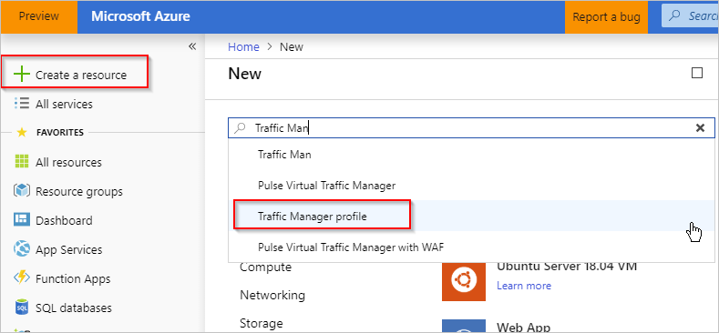

    Give the profile a unique name and select the Resource Group that was used for the PoA deployment.

1. Select **Create** to deploy.

    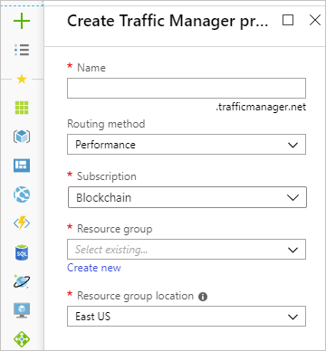

1. Once deployed, select the instance in the resource group. The DNS name to access the traffic manager can be found in the Overview tab.

    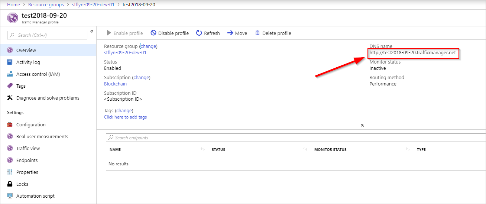

1. Choose the **Endpoints** tab and select the **Add** button. 
1. Give the endpoint a unique name.
1. For **Target resource type**, choose **Public IP address**.
1. Choose the public IP address of the first region's load balancer.

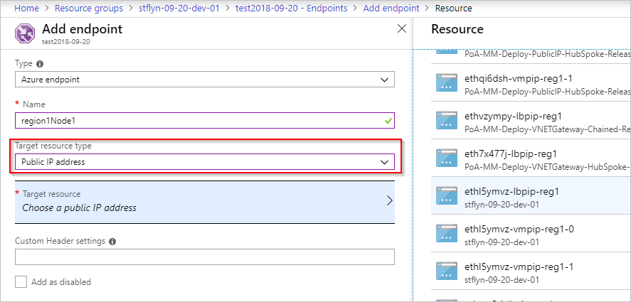

Repeat for each region in the deployed network. Once the endpoints are in the **enabled** status, they are automatically load and region balanced at the DNS name of the traffic manager. You can now use this DNS name in place of the [CONSORTIUM_DATA_URL] parameter in other steps of the article.

## Data API

Each consortium member hosts the necessary information for others to connect to the network. To enable the ease of connectivity, each member hosts a set of connection information at the data API endpoint.

The existing member provides the [CONSORTIUM_DATA_URL] before the member's deployment. Upon deployment, a joining member will retrieve information from the JSON interface at the following endpoint:

`<CONSORTIUM_DATA_URL>/networkinfo`

The response contains information useful for joining members (Genesis block, Validator Set contract ABI, bootnodes) and
information useful to the existing member (validator addresses). You can use this standardization to extend the consortium across cloud providers. This API returns a JSON formatted response with the following structure:

```json
{
  "$id": "",
  "type": "object",
  "definitions": {},
  "$schema": "https://json-schema.org/draft-07/schema#",
  "properties": {
    "majorVersion": {
      "$id": "/properties/majorVersion",
      "type": "integer",
      "title": "This schema’s major version",
      "default": 0,
      "examples": [
        0
      ]
    },
    "minorVersion": {
      "$id": "/properties/minorVersion",
      "type": "integer",
      "title": "This schema’s minor version",
      "default": 0,
      "examples": [
        0
      ]
    },
    "bootnodes": {
      "$id": "/properties/bootnodes",
      "type": "array",
      "items": {
        "$id": "/properties/bootnodes/items",
        "type": "string",
        "title": "This member’s bootnodes",
        "default": "",
        "examples": [
          "enode://a348586f0fb0516c19de75bf54ca930a08f1594b7202020810b72c5f8d90635189d72d8b96f306f08761d576836a6bfce112cfb6ae6a3330588260f79a3d0ecb@10.1.17.5:30300",
          "enode://2d8474289af0bb38e3600a7a481734b2ab19d4eaf719f698fe885fb239f5d33faf217a860b170e2763b67c2f18d91c41272de37ac67386f80d1de57a3d58ddf2@10.1.17.4:30300"
        ]
      }
    },
    "valSetContract": {
      "$id": "/properties/valSetContract",
      "type": "string",
      "title": "The ValidatorSet Contract Source",
      "default": "",
      "examples": [
        "pragma solidity 0.4.21;\n\nimport \"./SafeMath.sol\";\nimport \"./Utils.sol\";\n\ncontract ValidatorSet …"
      ]
    },
    "adminContract": {
      "$id": "/properties/adminContract",
      "type": "string",
      "title": "The AdminSet Contract Source",
      "default": "",
      "examples": [
        "pragma solidity 0.4.21;\nimport \"./SafeMath.sol\";\nimport \"./SimpleValidatorSet.sol\";\nimport \"./Admin.sol\";\n\ncontract AdminValidatorSet is SimpleValidatorSet { …"
      ]
    },
    "adminContractABI": {
      "$id": "/properties/adminContractABI",
      "type": "string",
      "title": "The Admin Contract ABI",
      "default": "",
      "examples": [
        "[{\"constant\":false,\"inputs\":[{\"name\":\"proposedAdminAddress\",\"type\":\"address\"},…"
      ]
    },
    "paritySpec": {
      "$id": "/properties/paritySpec",
      "type": "string",
      "title": "The Parity client spec file",
      "default": "",
      "examples": [
        "\n{\n \"name\": \"PoA\",\n \"engine\": {\n \"authorityRound\": {\n \"params\": {\n \"stepDuration\": \"2\",\n \"validators\" : {\n \"safeContract\": \"0x0000000000000000000000000000000000000006\"\n },\n \"gasLimitBoundDivisor\": \"0x400\",\n \"maximumExtraDataSize\": \"0x2A\",\n \"minGasLimit\": \"0x2FAF080\",\n \"networkID\" : \"0x9a2112\"\n }\n }\n },\n \"params\": {\n \"gasLimitBoundDivisor\": \"0x400\",\n \"maximumExtraDataSize\": \"0x2A\",\n \"minGasLimit\": \"0x2FAF080\",\n \"networkID\" : \"0x9a2112\",\n \"wasmActivationTransition\": \"0x0\"\n },\n \"genesis\": {\n \"seal\": {\n \"authorityRound\": {\n \"step\": \"0x0\",\n \"signature\": \"0x0000000000000000000000000000000000000000000000000000000000000000000000000000000000000000000000000000000000000000000000000000000000\"\n }\n },\n \"difficulty\": \"0x20000\",\n \"gasLimit\": \"0x2FAF080\"\n },\n \"accounts\": {\n \"0x0000000000000000000000000000000000000001\": { \"balance\": \"1\", \"builtin\": { \"name\": \"ecrecover\", \"pricing\": { \"linear\": { \"base\": 3000, \"word\": 0 } } } },\n \"0x0000000000000000000000000000000000000002\": { \"balance\": \"1\", \"builtin\": { \"name\": \"sha256\", \"pricing\": { \"linear\": { \"base\": 60, \"word\": 12 } } } },\n \"0x0000000000000000000000000000000000000003\": { \"balance\": \"1\", \"builtin\": { \"name\": \"ripemd160\", \"pricing\": { \"linear\": { \"base\": 600, \"word\": 120 } } } },\n \"0x0000000000000000000000000000000000000004\": { \"balance\": \"1\", \"builtin\": { \"name\": \"identity\", \"pricing\": { \"linear\": { \"base\": 15, \"word\": 3 } } } },\n \"0x0000000000000000000000000000000000000006\": { \"balance\": \"0\", \"constructor\" : \"…\" }\n }\n}"
      ]
    },
    "errorMessage": {
      "$id": "/properties/errorMessage",
      "type": "string",
      "title": "Error message",
      "default": "",
      "examples": [
        ""
      ]
    },
    "addressList": {
      "$id": "/properties/addressList",
      "type": "object",
      "properties": {
        "addresses": {
          "$id": "/properties/addressList/properties/addresses",
          "type": "array",
          "items": {
            "$id": "/properties/addressList/properties/addresses/items",
            "type": "string",
            "title": "This member’s validator addresses",
            "default": "",
            "examples": [
              "0x00a3cff0dccc0ecb6ae0461045e0e467cff4805f",
              "0x009ce13a7b2532cbd89b2d28cecd75f7cc8c0727"
            ]
          }
        }
      }
    }
  }
}

```

## Governance DApp

At the heart of proof-of-authority is decentralized governance. Since proof-of-authority relies upon a permitted list of network authorities to keep the network healthy, it's important to provide a fair mechanism to make modifications to this permission list. Each deployment comes with a set of smart-contracts and portal for on-chain governance of this permitted list. Once a proposed change reaches a majority vote by consortium members, the change is enacted. This allows new consensus participants to be added or compromised participants to be removed in a transparent way that encourages an honest network.

The governance DApp is a set of pre-deployed [smart contracts](https://github.com/Azure-Samples/blockchain/tree/master/ethereum-on-azure/) and a web application that are used to govern the authorities on the network. Authorities are broken up into admin identities and validator nodes.
Admins have the power to delegate consensus participation to a set of validator nodes. Admins also may vote other admins into or out of the network.


* **Decentralized Governance:** Changes in network authorities are administered through on-chain voting by select administrators.
* **Validator Delegation:** Authorities can manage their validator nodes that are set up in each PoA deployment.
* **Auditable Change History:** Each change is recorded on the blockchain providing transparency and auditability.

### Getting started with governance

To perform any kind of transactions through the Governance DApp, you need to use an Ethereum wallet. The most straightforward approach is to use an in-browser wallet such as [MetaMask](https://metamask.io); however, because these are smart contracts deployed on the network you may also automate your interactions to the Governance contract.

After installing MetaMask, navigate to the Governance DApp in the browser.  You can locate the URL in the deployment confirmation email or through Azure portal in the deployment output.  If you don't have an in-browser wallet installed you won't be able to perform any actions; however, you can view the administrator state.  

### Becoming an admin

If you're the first member that deployed on the network, then you automatically become an admin and your parity nodes are listed as validators. If you're joining the network, you need to get voted in as an admin by a majority (greater than 50%) of the existing admin set. If you choose not to become an admin, your nodes still sync and validate the blockchain; however, they don't participate in the block creation process. To start the voting process to become an admin, select **Nominate** and enter your Ethereum address and alias.


### Candidates

Selecting the **Candidates** tab shows you the current set of candidate administrators.  Once a candidate reaches a majority vote by the current admins, the candidate gets promoted to an admin.  To vote on a candidate, select the row and select **Vote in**. If you change your mind on a vote, select the candidate and select **Rescind vote**.


### Admins

The **Admins** tab shows the current set of admins and provides you the ability to vote against.  Once an admin loses more than 50% support, they are removed as an admin on the network. Any validator nodes that the admin owns lose validator status and become transaction nodes on the network. An admin may be removed for any number of reasons; however, it's up to the consortium to agree on a policy in advance.


### Validators

Selecting the **Validators** tab displays the current deployed parity nodes for the instance and their current status (Node type). Each consortium member has a different set of validators in this list, since this view represents the current deployed consortium member. If this is a newly deployed instance and you haven't added your validators, you get the option to **Add Validators**. Adding validators automatically chooses a regionally balanced set of parity nodes and assigns them to your validator set. If you have deployed more nodes than the allowed capacity, the remaining nodes become transaction nodes on the network.

The address of each validator is automatically assigned via the [identity store](#identity-store) in Azure.  If a node goes down, it relinquishes its identity, allowing another node in your deployment to take its place. This ensures that your consensus participation is highly available.


### Consortium name

Any admin may update the consortium name.  Select the gear icon in the top left to update the consortium name.

### Account menu

On the top-right, is your Ethereum account alias and identicon.  If you're an admin, you have the ability to update your alias.


## Tutorials

To compile, deploy, and test smart contracts, the Truffle Suite is a good option for Ethereum development. For more information, see [Truffle Suite](https://www.trufflesuite.com/docs/truffle/overview) documentation.

### Programmatically interacting with a smart contract

> [!WARNING]
> Never send your Ethereum private key over the network! Ensure that each transaction is signed locally first and the signed transaction is sent over the network.

In the following example, you use *ethereumjs-wallet* to generate an Ethereum address, *ethereumjs-tx* to sign locally, and *web3* to send the raw transaction to the Ethereum RPC endpoint.

You use this simple Hello-World smart contract for the example:

```javascript
pragma solidity ^0.4.11;
contract postBox {
    string message;
    function postMsg(string text) public {
        message = text;
    }
    function getMsg() public view returns (string) {
        return message;
    }
}
```

This example assumes the contract is already deployed. You can use *solc* and *web3* for deploying a contract programmatically. First, install the following node modules:

``` bash
sudo npm install web3@0.20.2
sudo npm install ethereumjs-tx@1.3.6
sudo npm install ethereumjs-wallet@0.6.1
```

Run the nodeJS script to perform the following:

* Construct a raw transaction: postMsg
* Sign the transaction using the generated private key
* Submit the signed transaction to the Ethereum network

``` javascript
var ethereumjs = require('ethereumjs-tx')
var wallet = require('ethereumjs-wallet')
var Web3 = require('web3')

// TODO Replace with your contract address
var address = "0xfe53559f5f7a77125039a993e8d5d9c2901edc58";
var abi = [{"constant": false,"inputs": [{"name": "text","type": "string"}],"name": "postMsg","outputs": [],"payable": false,"stateMutability": "nonpayable","type": "function"},{"constant": true,"inputs": [],"name": "getMsg","outputs": [{"name": "","type": "string"}],"payable": false,"stateMutability": "view","type": "function"}];

// Generate a new Ethereum account
var account = wallet.generate();
var accountAddress = account.getAddressString()
var privateKey = account.getPrivateKey();

// TODO Replace with your RPC endpoint
var web3 = new Web3(new Web3.providers.HttpProvider(
    "http://testzvdky-dns-reg1.eastus.cloudapp.azure.com:8545"));

// Get the current nonce of the account
web3.eth.getTransactionCount(accountAddress, function (err, nonce) {
   var data = web3.eth.contract(abi).at(address).postMsg.getData("Hello World");
   var rawTx = {
     nonce: nonce,
     gasPrice: '0x00',
     gasLimit: '0x2FAF080',
     to: address,
     value: '0x00',
     data: data
   }
   var tx = new ethereumjs(rawTx);

   tx.sign(privateKey);

   var raw = '0x' + tx.serialize().toString('hex');
   web3.eth.sendRawTransaction(raw, function (txErr, transactionHash) {
     console.log("TX Hash: " + transactionHash);
     console.log("Error: " + txErr);
   });
 });
```

### Deploy smart contract with Truffle

First, install the necessary libraries.

```javascript
npm init

npm install truffle-hdwallet-provider --save
```

In `truffle.js`, add following code to unlock your MetaMask account and configure the PoA node as entry point by providing the mnemonic phrase (MetaMask / Settings / Reveal Seed Words)

```javascript
var HDWalletProvider = require("truffle-hdwallet-provider");

var rpc_endpoint = "XXXXXX";
var mnemonic = "twelve words you can find in metamask/settings/reveal seed words";

module.exports = {
  networks: {
    development: {
      host: "localhost",
      port: 8545,
      network_id: "*" // Match any network id
    },
    poa: {
      provider: new HDWalletProvider(mnemonic, rpc_endpoint),
      network_id: 3,
      gasPrice : 0
    }
  }
};

```

Next, deploy to PoA network.

```javascript
$ truffle migrate --network poa
```

### Debug smart contract with Truffle

Truffle has a local develop network that is available for debugging
smart contract. You can find the full tutorial
[here](https://truffleframework.com/tutorials/debugging-a-smart-contract).

## WebAssembly (WASM) support

WebAssembly support is already enabled for you on newly deployed PoA networks. It allows for smart-contract development in any language that transpiles to Web-Assembly (Rust, C, C++). For more information, see: [Parity Overview of WebAssembly](https://wiki.parity.io/WebAssembly-Home) and [Tutorial from Parity Tech](https://github.com/paritytech/pwasm-tutorial)

## FAQ

### I notice there are many transactions on the network that I didn't send. Where are these coming from?

It is insecure to unlock the [personal API](https://web3js.readthedocs.io/en/v1.2.0/web3-eth-personal.html). Bots listen for unlocked Ethereum accounts and attempt to drain the funds. The bot assumes these accounts contain real-ether and attempt to be the first to siphon the balance. Do not enable the personal API on the network. Instead pre-sign the transactions either manually using a wallet like MetaMask or programmatically.

### How to SSH onto a VM?

The SSH port is not exposed for security reasons. Follow [this guide to enable the SSH port](#ssh-access).

### How do I set up an audit member or transaction nodes?

Transaction nodes are a set of Parity clients that are peered with the network but are not participating in consensus. These nodes can still be used to submit Ethereum transactions and read the smart contract state. This works well as a mechanism for providing auditability to non-authority consortium members on the network. To achieve this follow the steps in [Growing the Consortium](#growing-the-consortium).

### Why are MetaMask transactions taking a long time?

To ensure transactions are received in the correct order, each Ethereum transaction comes with an incrementing nonce. If you've used an account in MetaMask on a different network, you need to reset the nonce value. Click on the settings icon (3-bars), Settings, Reset Account. The transaction history will be cleared and now you can resubmit the transaction.

### Do I need to specify gas fee in MetaMask?

Ether doesn't serve a purpose in proof-of-authority consortium. Hence, there is no need to specify gas fee when submitting transactions in MetaMask.

### What should I do if my deployment fails due to failure to provision Azure OMS?

Monitoring is an optional feature. In some rare cases where your deployment fails because of inability to successfully provision Azure Monitor resource, you can redeploy without Azure Monitor.

### Are public IP deployments compatible with private network deployments?

No. Peering requires two-way communication so the entire network must either be public or private.

### What is the expected transaction throughput of Proof-of-Authority?

The transaction throughput will be highly dependent upon the types of transactions and the network topology. Using simple transactions, we've benchmarked an average of 400 transactions per second with a network deployed across multiple regions.

### How do I subscribe to smart contract events?

Ethereum Proof-of-Authority now supports web-sockets.  Check your deployment email or deployment output to locate the web-socket URL and port.

## Next steps

For more Azure Blockchain solutions, see the [Azure Blockchain documentation](https://docs.microsoft.com/azure/blockchain/).
