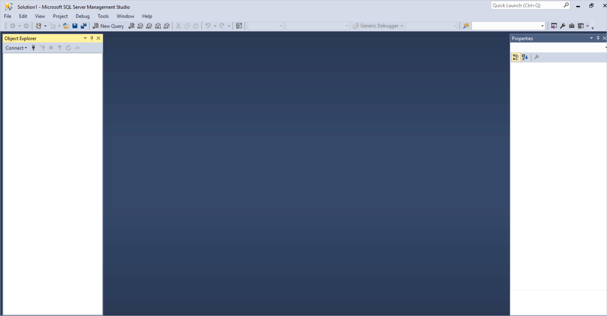
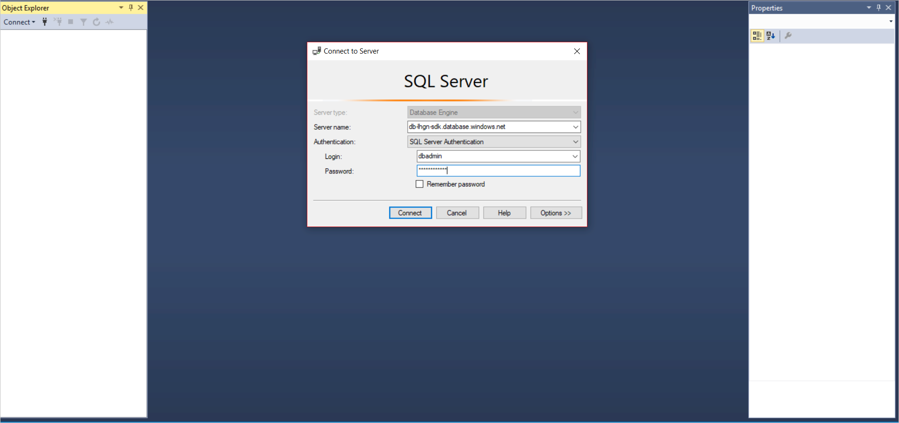
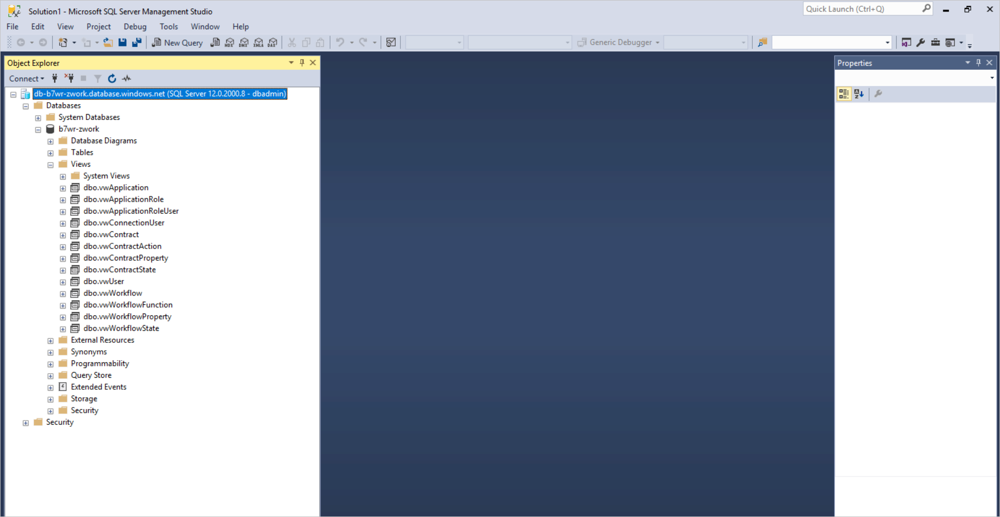

# Using Azure Blockchain Workbench data with SQL Server Management Studio

Microsoft SQL Server Management Studio provides the ability to rapidly
write and test queries against Azure Blockhain Workbench's SQL DB. This section contains a step by step walkthrough of how to connect to Azure Blockchain Workbench's SQL Database from within SQL Server Management Studio.

## Prerequisites

* Download [SQL Server Management Studio](https://docs.microsoft.com/sql/ssms/download-sql-server-management-studio-ssms?view=sql-server-2017).

## Connecting SQL Server Management Studio to data in Azure Blockchain Workbench

1. Open the SQL Server Management Studio and select **Connect**.
2. Select **Database Engine**.

    

3. In the **Connect to Server** dialog, enter the server name and your
database credentials.

    If you are using the credentials created by the Azure Blockchain Workbench deployment process, the username will be **dbadmin** and the password will be the one you provided during deployment.

    

 4. SQL Server Management Studio displays the list of databases, database views, and stored procedures in the Azure Blockchain Workbench database.

    

5. To view the data associated with any of the database views, you can automatically generate a select statement using the following steps.
6. Right click on any of the database views in the Object Explorer.
7. Select **Script View as**.
8. Choose **SELECT to**.
9. Select **New Query Editor Window**.
10. A new query can be created by selecting **New Query**.

## Next steps

> [!div class="nextstepaction"]
> [Database views in Azure Blockchain Workbench](database-views.md)