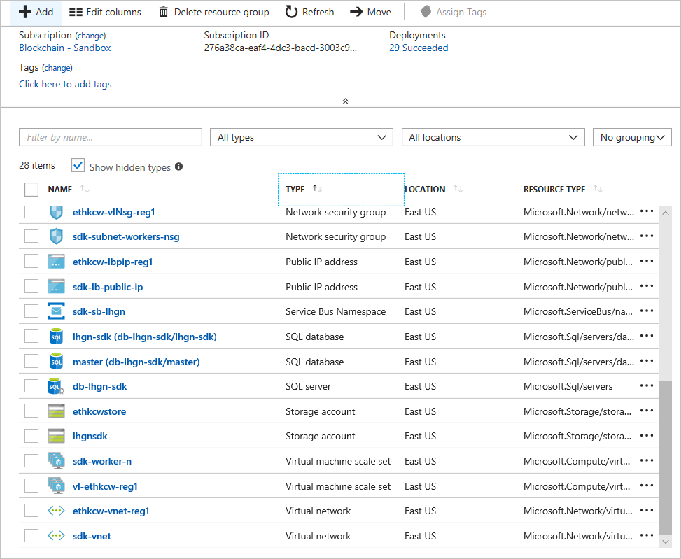
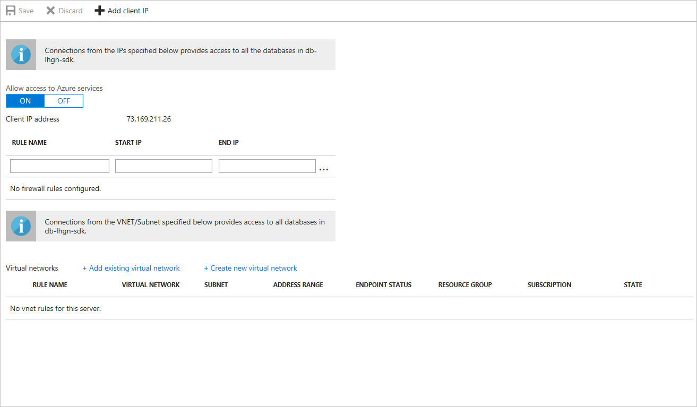

# Configure the Azure Blockchain Workbench Preview database firewall

This article shows how to configure a firewall rule using the Azure portal. Firewall rules let external clients or applications connect to your Azure Blockchain Workbench database.

## Connect to the Blockchain Workbench database

To connect to the database where you want to configure a rule:

1. Sign in to the Azure Portal with an account that has **Owner**     permissions for the Azure Blockchain Workbench resources.
2. In the left navigation pane, choose **Resource groups**.
3. Choose the name of the resource group for your Blockchain Workbench deployment.
4. Select **Type** to sort the list of resources, and then choose your **SQL server**.
5. The resource list example in the following screen capture shows two databases: *master* and *lsgn-sdk*. You configure the firewall rule on  *lsgn-sdk*.

## Create a database firewall rule

To create a firewall rule:

1. Choose the link to the "lsgn-sdk" database.
2. On the menu bar, select **Set server firewall**.

   

3. To create a rule for your organization:

   * Enter a **RULE NAME**
   * Enter an IP address for the **START IP** of the address range
   * Enter an IP address for the **END IP** of the address range

   

    > [!NOTE]
    > If you only want to add the IP address of your computer, choose **+ Add client IP**.
        
1. To save your firewall configuration, select **Save**.
2. Test the IP address range you configured for the database by connecting from an application or tool. For example, SQL
    Server Management Studio.

## Next steps

> [!div class="nextstepaction"]
> [Database views in Azure Blockchain Workbench](database-views.md)