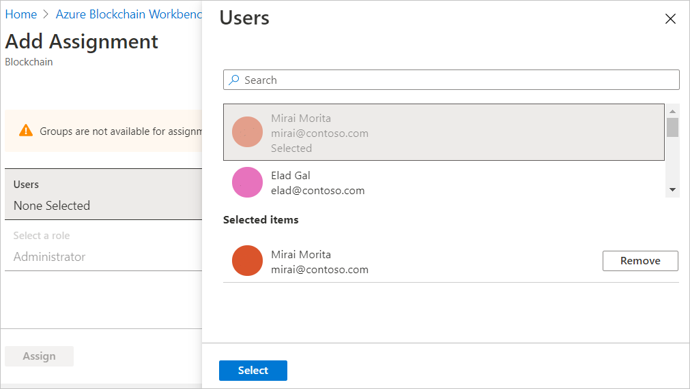
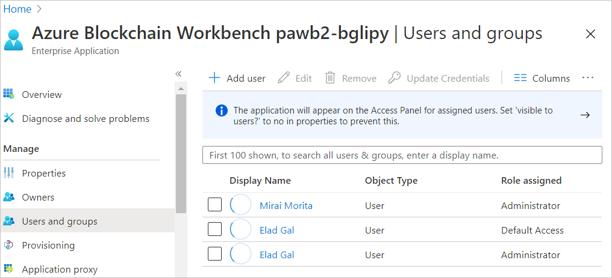
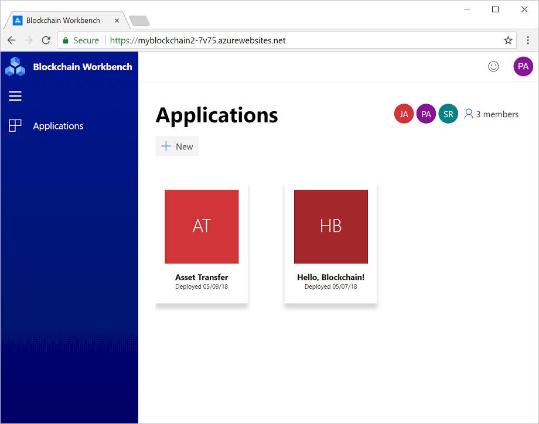
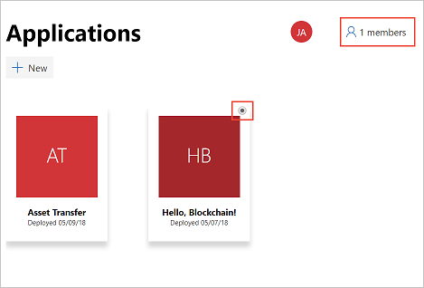
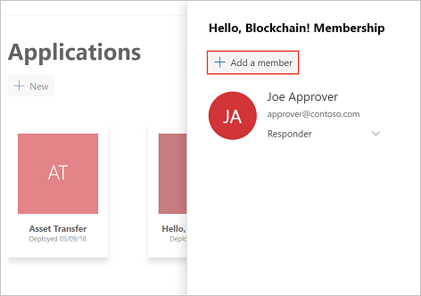
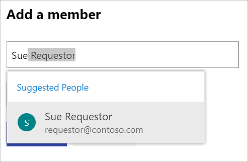
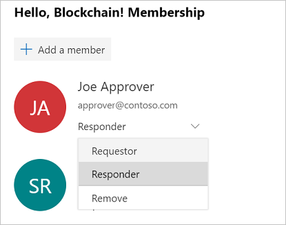
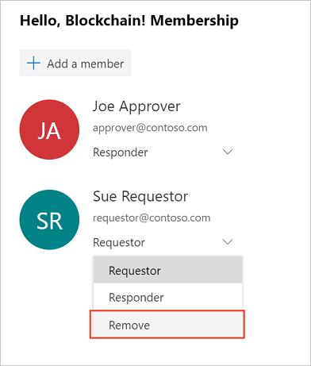
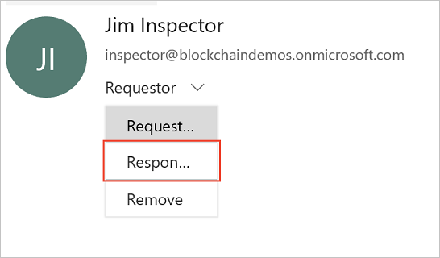

# Manage Users in Azure Blockchain Workbench

Azure Blockchain Workbench includes user management for people and organizations that are part of your consortium.

## Prerequisites

A Blockchain Workbench deployment is required. See [Azure Blockchain Workbench deployment](../../blockchain-workbench/blockchain-workbench-deploy.md) for details on deployment.

## Add Azure AD users

The Azure Blockchain Workbench uses Azure Active Directory (Azure AD) for authentication, access control, and roles. Users in the Blockchain Workbench Azure AD tenant can authenticate and use Blockchain Workbench. Add users to the Administrator application role to interact and perform actions.

Blockchain Workbench users need to exist in the Azure AD tenant before you can assign them to applications and roles. To add users to Azure AD, use the following steps:

1.  Sign in to the [Azure portal](https://portal.azure.com).
2.  Select your account in the top right corner, and switch to the Azure AD tenant associated to Blockchain Workbench.
3.  Select **Azure Active Directory > Users**. You see a list of users in your directory.
4.  To add users to the directory, select **New user**. For external users, select **New guest user**.

    

5.  Complete the required fields for the new user. Select **Create**.

Visit [Azure AD](../../active-directory/fundamentals/add-users-azure-active-directory.md) documentation for more details on how to manage users within Azure AD.

## Manage Blockchain Workbench administrators

Once users have been added to the directory, the next step is to choose which users are Blockchain Workbench administrators. Users in the **Administrator** group are associated with the **Administrator application role** in Blockchain Workbench. Administrators can add or remove users, assign users to specific scenarios, and create new applications.

To add users to the **Administrator** group in the Azure AD directory:

1.  Sign in to the [Azure portal](https://portal.azure.com).
2.  Verify you are in the Azure AD tenant associated to Blockchain Workbench by selecting your account in the top right corner.
3.  Select **Azure Active Directory >  Enterprise applications**.
4.  Select the Azure AD client application for Blockchain Workbench
    
    

5.  Select **Users and groups > Add user**.
6.  In **Add Assignment**, select **Users**. Choose or search for the user you want to add as an administrator. Click **Select** when finished choosing.

    

9.  Verify **Role** is set to **Administrator**
10. Select **Assign**. The added users are displayed in the list with the administrator role assigned.

    

## Managing Blockchain Workbench members

Use the Blockchain Workbench application to manage users and organizations that are part of your consortium. You can add or remove users to applications and roles.

1. [Open the Blockchain Workbench](../../blockchain-workbench/blockchain-workbench-deploy.md#blockchain-workbench-web-url) in your browser and sign in as an administrator.

    

    Members are added to each application. Members can have one or more application roles to initiate contracts or take actions.

2. To manage members for an application, select an application tile in the **Applications** pane.

    The number of members associated to the selected application is reflected in the members tile.

    

#### Add member to application

1. Select the member tile to display a list of the current members.
2. Select **Add members**.

    

3. Search for the user's name.  Only Azure AD users that exist in the Blockchain Workbench tenant are listed. If the user is not found, you need to [Add Azure AD users](#add-azure-ad-users).

    

4. Select a **Role** from the drop-down.

    

5. Select **Add** to add the member with the associated role to the application.

#### Remove member from application

1. Select the member tile to display a list of the current members.
2. For the user you want to remove, choose **Remove** from the role drop-down.

    

#### Change or add role

1. Select the member tile to display a list of the current members.
2. For the user you want to change, click the drop-down and select the new role.

    

## Next steps

In this how-to article, you have learned how to manage users for Azure Blockchain Workbench. To learn how to create a blockchain application, continue to the next how-to article.

> [!div class="nextstepaction"]
> [Create a blockchain application in Azure Blockchain Workbench](create-app.md)
