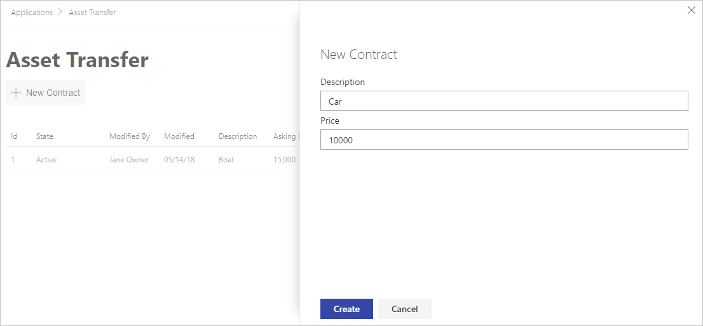
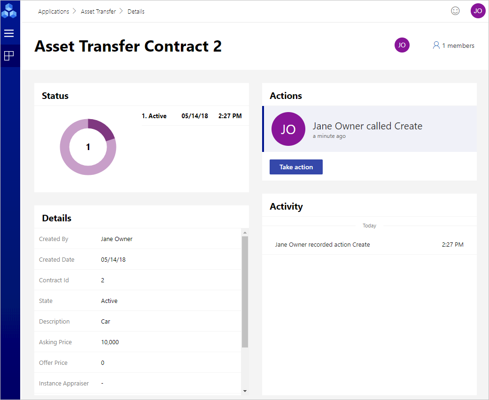
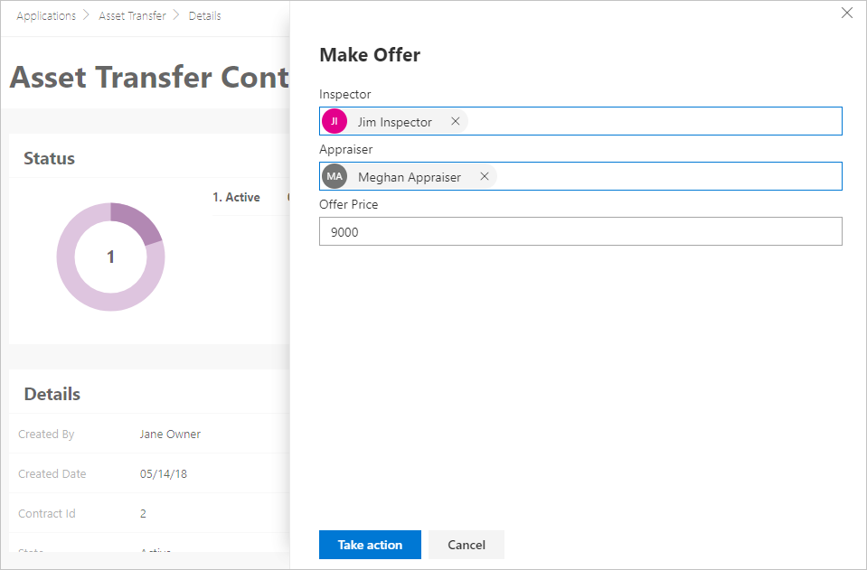

# Tutorial: Using applications in Azure Blockchain Workbench Preview

You can use Blockchain Workbench to create and take actions on contracts. You can also view contract details such as status and transaction history.

You'll learn how to:

> [!div class="checklist"]
> * Create a new contract
> * Take an action on a contract

[!INCLUDE [quickstarts-free-trial-note](../../../includes/quickstarts-free-trial-note.md)]

## Prerequisites

* A Blockchain Workbench deployment. For more information, see [Azure Blockchain Workbench deployment](deploy.md) for details on deployment
* A deployed blockchain application in Blockchain Workbench. See [Create a blockchain application in Azure Blockchain Workbench](create-app.md)

[Open the Blockchain Workbench](deploy.md#blockchain-workbench-web-url) in your browser.

You need to sign in as a member of the Blockchain Workbench. If there are no applications listed, you are a member of Blockchain Workbench but not a member of any applications. The Blockchain Workbench administrator can assign members to applications.

## Create new contract

To create a new contract, you need to be a member specified as a contract **initiator**. For information defining application roles and initiators for the contract, see [workflows in the configuration overview](configuration.md#workflows). For information on assigning members to application roles, see [add a member to application](manage-users.md#add-member-to-application).

1. In Blockchain Workbench application section, select the application tile that contains the contract you want to create. A list of active contracts is displayed.

2. To create a new contract, select **New contract**.

    

3. The **New contract** pane is displayed. Specify the initial parameters values. Select **Create**.

    

    The newly created contract is displayed in the list with the other active contracts.

    

## Take action on contract

Depending on the state the contract is in, members can take actions to transition to the next state of the contract. Actions are defined as [transitions](configuration.md#transitions) within a [state](configuration.md#states). Members belonging to an allowed application or instance role for the transition can take the action. 

1. In Blockchain Workbench application section, select the application tile that contains the contract to take the action.
2. Select the contract in the list. Details about the contract are displayed in different sections. 

    

    | Section  | Description  |
    |---------|---------|
    | Status | Lists the current progress within the contract stages |
    | Details | The current values of the contract |
    | Action | Details about the last action |
    | Activity | Transaction history of the contract |
    
3. In the **Action** section, select **Take action**.

4. The details about the current state of the contract are displayed in a pane. Choose the action you want to take in the drop-down. 

    

5. Select **Take action** to initiate the action.
6. If parameters are required for the action, specify the values for the action.

    

7. Select **Take action** to execute the action.

## Next steps

> [!div class="nextstepaction"]
> [Azure Blockchain Workbench application versioning](version-app.md)
