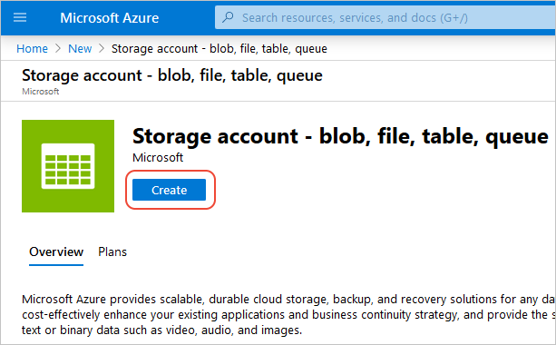
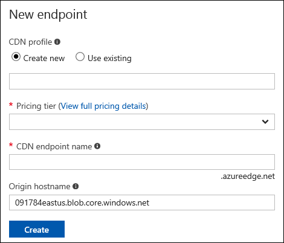
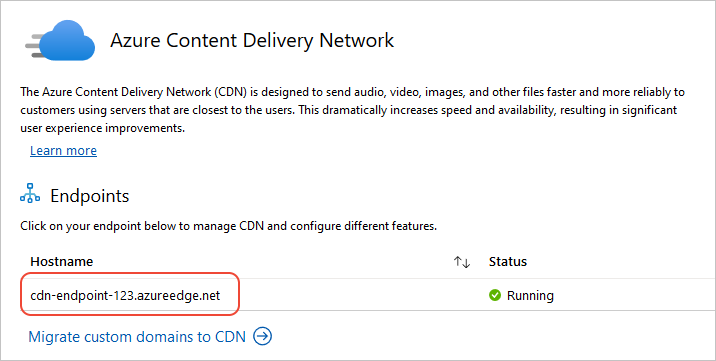
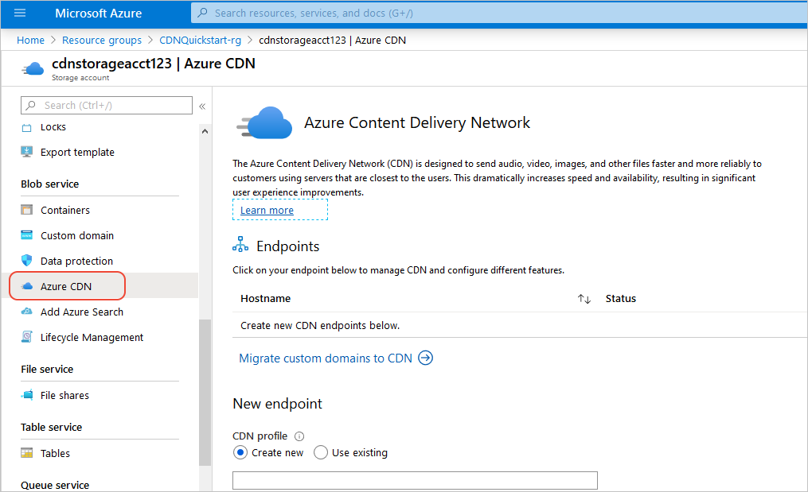

# Quickstart: Integrate an Azure storage account with Azure CDN
In this quickstart, you enable [Azure Content Delivery Network (CDN)](cdn-overview.md) to cache content from Azure storage. Azure CDN offers developers a global solution for delivering high-bandwidth content. It can cache blobs and static content of compute instances at physical nodes in the United States, Europe, Asia, Australia, and South America.

[!INCLUDE [quickstarts-free-trial-note](../../includes/quickstarts-free-trial-note.md)]

## Log in to the Azure portal
Log in to the [Azure portal](https://portal.azure.com) with your Azure account.

## Create a storage account
Use the following procedure to create a new storage account for an Azure subscription. A storage account gives access to Azure Storage services. The storage account represents the highest level
of the namespace for accessing each of the Azure Storage service components: Azure Blob, Queue, and Table storage. For more information, see [Introduction to Microsoft Azure Storage](../storage/common/storage-introduction.md).

To create a storage account, you must be either the service administrator or a coadministrator for the associated subscription.

You can use several methods to create a storage account, including the Azure portal and PowerShell. This quickstart demonstrates how to use the Azure portal.   

**To create a storage account for an Azure subscription**

1. In the Azure portal, in the upper left, select **Create a resource**. 

    The **New** pane appears.

2. Select **Storage**, then select **Storage account - blob, file, table, queue**.
	
    

	The **Create storage account** pane appears.   

    

3. In the **Name** box, enter a subdomain name. This entry can contain 3-24 lowercase letters and numbers.
   
    This value becomes the host name within the URI that's used to address blob, queue, or table resources for the subscription. To address a container resource in Blob storage, use a URI in the following format:
   
    http://*&lt;StorageAcountLabel&gt;*.blob.core.windows.net/*&lt;mycontainer&gt;*

    where *&lt;StorageAccountLabel&gt;* refers to the value you entered in the **Name** box.
   
    > [!IMPORTANT]    
    > The URL label forms the subdomain of the storage account URI and must be unique among all hosted services in Azure.
   
    This value is also used as the name of the storage account in the portal or when you're accessing this account programmatically.
    
4. For the remainder of the settings, use the values specified in the following table:

    | Setting  | Value |
    | -------- | ----- |
    | **Deployment model** | Use the default value. |
    | **Account kind** | Use the default value. |
    | **Location**    | Select **Central US** from the drop-down list. |
    | **Replication** | Use the default value. |
    | **Performance** | Use the default value. |
    | **Secure transfer required** | Use the default value. |
    | **Subscription** | Select an Azure subscription from the drop-down list. |
    | **Resource group** | Select **Create new** and enter *my-resource-group-123* for your resource group name. This name must be globally unique. If it is already in use, you may enter a different name or you can select **Use existing** and select **my-resource-group-123** from the drop-down list.  For information about resource groups, see [Azure Resource Manager overview](../azure-resource-manager/resource-group-overview.md#resource-groups).| 
    | **Configure virtual networks** | Use the default value. |  
    
5. Select **Pin to dashboard** to save the storage account to your dashboard after it is created.
    
6. Select **Create**. Creating the storage account might take several minutes to finish.

## Enable Azure CDN for the storage account

You can enable Azure CDN for your storage account directly from your storage account. If you want to specify advanced configuration settings for your CDN endpoint, such as the optimization type, you can instead use the [Azure CDN extension](cdn-create-new-endpoint.md) to create a CDN profile or a CDN endpoint.

1. Select a storage account from the dashboard, then select **Azure CDN** from the left pane. If the **Azure CDN** button is not immediately visible, you can enter CDN in the **Search** box of the left pane to find it.
	
	The **Azure CDN** page appears.

	
	
2. Create a new endpoint by entering the required information specified in the following table:

    | Setting  | Value |
    | -------- | ----- |
    | **CDN profile** | Select **Create new** and enter *my-cdn-profile-123* for your profile name. This name must be globally unique; if it is already in use, you may enter a different name.  |
    | **Pricing tier** | Select **Standard Verizon** from the drop-down list. |
	| **CDN endpoint name** | Enter *my-endpoint-123* for your endpoint hostname. This name must be globally unique; if it is already in use, you may enter a different name. This name is used to access your cached resources at the domain _&lt;endpoint name&gt;_.azureedge.net. By default, a new CDN endpoint uses the hostname of your storage account as the origin server.|

3. Select **Create**. After the endpoint is created, it appears in the endpoint list.

	

## Enable additional CDN features
From the storage account **Azure CDN** page, select the CDN endpoint from the list to open the CDN endpoint configuration page. From this page, you can enable additional CDN features for your delivery, such as compression, query string, and geo filtering. You can also add custom domain mapping to your CDN endpoint and enable custom domain HTTPS.
	

## Access CDN content
To access cached content on the CDN, use the CDN URL provided in the portal. The address for a cached blob has the following format:

http://<*EndpointName*\>.azureedge.net/<*myPublicContainer*\>/<*BlobName*\>

> [!NOTE]
> After you enable Azure CDN access to a storage account, all publicly available objects are eligible for CDN POP caching. If you modify an object that's currently cached in the CDN, the new content will not be available via Azure CDN until Azure CDN refreshes its content after the time-to-live period for the cached content expires.

## Remove content from Azure CDN
If you no longer want to cache an object in Azure CDN, you can take one of the following steps:

* Make the container private instead of public. For more information, see [Manage anonymous read access to containers and blobs](../storage/blobs/storage-manage-access-to-resources.md).
* Disable or delete the CDN endpoint by using the Azure portal.
* Modify your hosted service to no longer respond to requests for the object.

An object that's already cached in Azure CDN remains cached until the time-to-live period for the object expires or until the endpoint is purged. When the time-to-live period expires, Azure CDN determines whether the CDN endpoint is still valid and the object is still anonymously accessible. If they are not, the object will no longer be cached.

## Clean up resources
In the preceding steps, you created a CDN profile and an endpoint in a resource group. Save these resources if you want to go to [Next steps](#next-steps) and learn how to add a custom domain to your endpoint. However, if you don't expect to use these resources in the future, you can delete them by deleting the resource group, thus avoiding additional charges:

1. From the left-hand menu in the Azure portal, select **Resource groups** and then select **my-resource-group-123**.

2. On the **Resource group** page, select **Delete resource group**, enter *my-resource-group-123* in the text box, then select **Delete**.

    This action will delete the resource group, profile, and endpoint that you created in this quickstart.

3. To delete your storage account, select it from the dashboard, then select **Delete** from the top menu.

## Next steps
To learn about adding a custom domain to your CDN endpoint, see the following tutorial:

> [!div class="nextstepaction"]
> [Tutorial: Add a custom domain to your Azure CDN endpoint](cdn-map-content-to-custom-domain.md)

