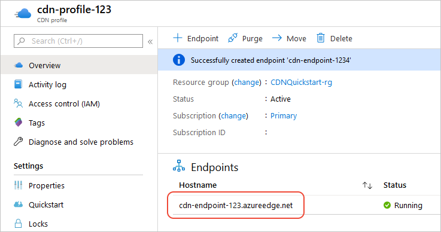

# Quickstart: Create an Azure CDN profile and endpoint
In this article, you enable Azure Content Delivery Network (CDN) by creating a new CDN profile and CDN endpoint. 

[!INCLUDE [quickstarts-free-trial-note](../../includes/quickstarts-free-trial-note.md)]

## Log in to the Azure portal
Log in to the [Azure portal](https://portal.azure.com) with your Azure account.

[!INCLUDE [cdn-create-profile](../../includes/cdn-create-profile.md)]

## Create a new CDN endpoint

1. In the [Azure portal](https://portal.azure.com), navigate to your CDN profile. You may have pinned it to the dashboard in the previous step. If not, you can find it by selecting **All services**, then selecting **CDN profiles**. In the **CDN profiles** pane, select the profile to which you plan to add your endpoint. 
   
    The CDN profile pane appears.

2. Select **Endpoint**.
   
    
   
    The **Add an endpoint** pane appears.

    Use the settings specified in the table following the image.
   
    

    | Setting | Suggested value | Description |
    | ------- | --------------- | ----------- |
    | **Name** | Enter a unique name for the new CDN endpoint. |This name is used to access your cached resources at the domain `<endpointname>.azureedge.net`.|
    | **Origin type** | Select **Custom origin**. | You can choose one of the following origin types:  - **Storage** for an Azure Storage account  - **Cloud service** for an Azure Cloud Service  - **Web App** for an Azure Web App  - **Custom origin** for any other publicly accessible web server origin (hosted in Azure or elsewhere) |
    | **Origin hostname** | Enter a unique host name. | The drop-down lists all available origins of the origin type you specified. If you select **Custom origin** as your origin type, you must enter the domain of your custom origin. |
    | **Origin path** | Leave blank. | Specifies the path to the resources that you want to cache. To allow caching of any resource at the specified domain, leave it blank.|
    | **Origin host header** | Leave the default value. | Specifies the host header you want Azure CDN to send with each request. Some types of origins, such as Azure Storage and Web Apps, require the host header to match the domain of the origin. Unless you have an origin that requires a host header different from its domain, you should leave the default value. | 
    | **Protocol** | Leave the HTTP and HTTPS protocols selected. | The protocols used to access your resources at the origin. At least one protocol (HTTP or HTTPS) must be selected. Use the CDN-provided domain (`<endpointname>.azureedge.net`) to access HTTPS content.  When you access CDN content by using HTTPS, Azure CDN has the following constraints:  - You must use the SSL certificate provided by the CDN. Third-party certificates are not supported.  - HTTPS support for Azure CDN custom domains is available only with **Azure CDN from Verizon** products. It is not supported on **Azure CDN from Akamai** products. For more information, see [Configure HTTPS on an Azure CDN custom domain](cdn-custom-ssl.md).|
    | **Origin port** | Leave the default port values. | The port used to access your resources at the origin. The endpoint itself is available only to end clients on the default HTTP and HTTPS ports (80 and 443), regardless of the **Origin port** value.  Endpoints in **Azure CDN from Akamai** profiles do not allow the full TCP port range for origin ports. For a list of origin ports that are not allowed, see [Azure CDN from Akamai Allowed Origin Ports](https://msdn.microsoft.com/library/mt757337.aspx). |  
    
3. Select **Add** to create the new endpoint.
   
   After the endpoint is created, it appears in the list of endpoints for the profile.
    
   
    
   Because it takes time for the registration to propagate, the endpoint isn't immediately available for use. For **Azure CDN from Akamai** profiles, propagation usually completes within one minute. For **Azure CDN from Verizon** profiles, propagation usually completes within 90 minutes, but in some cases can take longer.
   
   If you attempt to use the CDN domain name before the endpoint configuration has propagated to the POPs, you might receive an HTTP 404 response status. If it's been several hours since you created your endpoint and you're still receiving a 404 response status, see [Troubleshooting CDN endpoints returning 404 statuses](cdn-troubleshoot-endpoint.md).

## Clean up resources
To delete a profile or endpoint when it is no longer needed, select it and then select **Delete**. 

## Next steps
In this quickstart, you’ve created a CDN profile and an endpoint. To learn about custom domains, continue to the tutorial for adding a custom domain to your CDN endpoint.

> [!div class="nextstepaction"]
> [Add a custom domain](cdn-map-content-to-custom-domain.md)

## See Also
* [Controlling caching behavior of requests with query strings](cdn-query-string.md)
* [How to Map CDN Content to a Custom Domain](cdn-map-content-to-custom-domain.md)
* [Pre-load assets on an Azure CDN endpoint](cdn-preload-endpoint.md)
* [Purge an Azure CDN Endpoint](cdn-purge-endpoint.md)
* [Troubleshooting CDN endpoints returning 404 statuses](cdn-troubleshoot-endpoint.md)

