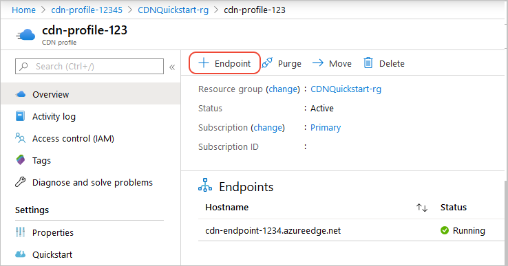
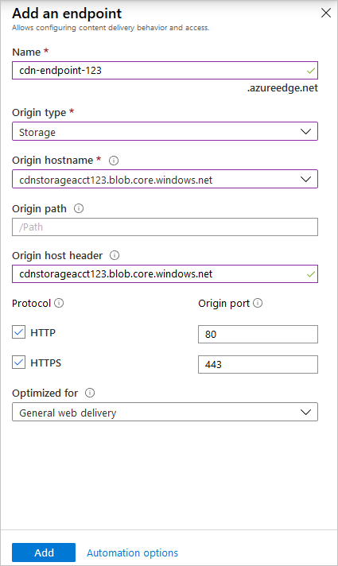

# Quickstart: Create an Azure CDN profile and endpoint
In this quickstart, you enable Azure Content Delivery Network (CDN) by creating a new CDN profile and CDN endpoint. After you have created a profile and an endpoint, you can start delivering content to your customers.

[!INCLUDE [quickstarts-free-trial-note](../../includes/quickstarts-free-trial-note.md)]

## Prerequisites
For the purposes of this quickstart, you must have created a storage account named *mystorageacct123*, which you use for the origin hostname. For more information, see [Integrate an Azure storage account with Azure CDN](cdn-create-a-storage-account-with-cdn.md)

## Log in to the Azure portal
Log in to the [Azure portal](https://portal.azure.com) with your Azure account.

[!INCLUDE [cdn-create-profile](../../includes/cdn-create-profile.md)]

## Create a new CDN endpoint

After you've created a CDN profile, you can use it to create an endpoint.

1. In the Azure portal, select in your dashboard the CDN profile that you created. If you can't find it, select **All services**, then select **CDN profiles**. In the **CDN profiles** page, select the profile that you want to use. 
   
    The CDN profile page appears.

2. Select **Endpoint**.
   
    
   
    The **Add an endpoint** page appears.

    Use the settings specified in the table following the image.
   
    

    | Setting | Value |
    | ------- | ----- |
    | **Name** | Enter *my-endpoint-123* for your endpoint name. This name must be globally unique; if it is already in use, you may enter a different one. This name is used to access your cached resources at the domain `<endpointname>.azureedge.net`.|
    | **Origin type** | Select **Storage**. | 
    | **Origin hostname** | Enter *mystorageacct123.blob.core.windows.net* for your hostname. This name must be globally unique; if it is already in use, you may enter a different one |
    | **Origin path** | Leave blank. |
    | **Origin host header** | Leave the default generated value. |  
    | **Protocol** | Leave the default **HTTP** and **HTTPS** options selected. |
    | **Origin port** | Leave the default port values. | 
    | **Optimized for** | Leave the default selection, **General web delivery**. |
    
3. Select **Add** to create the new endpoint.
   
   After the endpoint is created, it appears in the list of endpoints for the profile.
    
   
    
   Because it takes time for the registration to propagate, the endpoint isn't immediately available for use. 

## Clean up resources
In the preceding steps, you created a CDN profile and an endpoint in a resource group. Save these resources if you want to go to [Next steps](#next-steps) and learn how to add a custom domain to your endpoint. However, if you don't expect to use these resources in the future, you can delete them by deleting the resource group, thus avoiding additional charges:

1. From the left-hand menu in the Azure portal, select **Resource groups** and then select **my-resource-group-123**.

2. On the **Resource group** page, select **Delete resource group**, enter *my-resource-group-123* in the text box, then select **Delete**.

    This action will delete the resource group, profile, and endpoint that you created in this quickstart.

## Next steps
To learn about adding a custom domain to your CDN endpoint, see the following tutorial:

> [!div class="nextstepaction"]
> [Add a custom domain](cdn-map-content-to-custom-domain.md)

