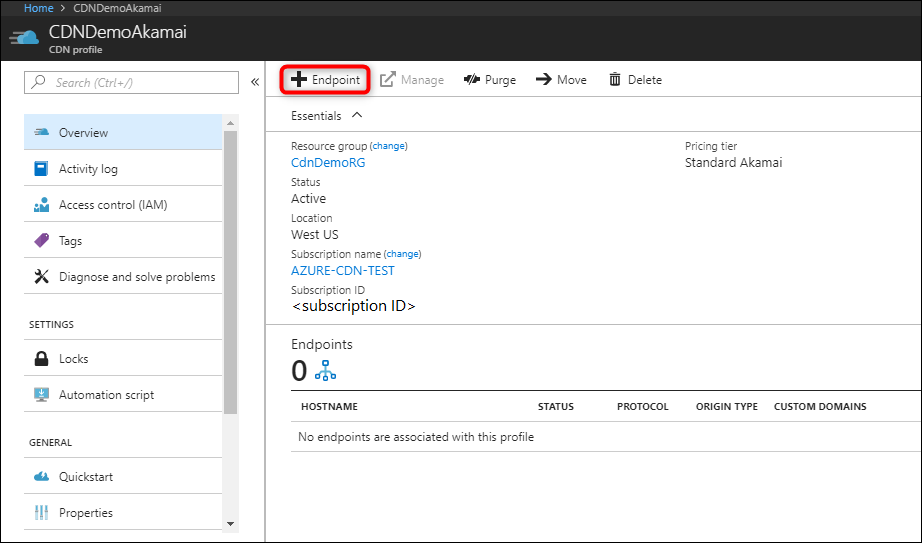
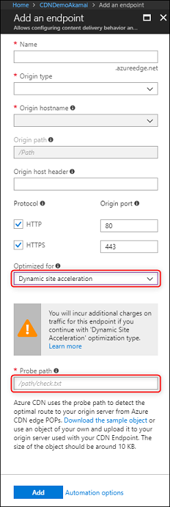

# Dynamic site acceleration via Azure CDN

With the explosion of social media, electronic commerce, and the hyper-personalized web, a rapidly increasing percentage of the content served to end users is generated in real time. Users expect a fast, reliable, and personalized web experience, independent of their browser, location, device, or network. However, the very innovations that make these experiences so engaging also slow page downloads and put the quality of the consumer experience at risk. 

Standard CDN capability includes the ability to cache files closer to end users to speed up delivery of static files. However, with dynamic web applications, caching that content in edge locations isn't possible because the server generates the content in response to user behavior. Speeding up the delivery of such content is more complex than traditional edge caching and requires an end-to-end solution that finely tunes each element along the entire data path from inception to delivery. With Azure CDN dynamic site acceleration (DSA) optimization, the performance of web pages with dynamic content is measurably improved.

**Azure CDN from Akamai** and **Azure CDN from Verizon** both offer DSA optimization through the **Optimized for** menu during endpoint creation.

> [!Important]
> For **Azure CDN from Akamai** profiles, you can change the optimization of a CDN endpoint after it has been created.
>   
> For **Azure CDN from Verizon** profiles, it is not possible to change the optimization of a CDN endpoint after it has been created.

## Configuring CDN endpoint to accelerate delivery of dynamic files

To configure a CDN endpoint to optimize delivery of dynamic files, you can either use the Azure portal, the REST APIs, or any of the client SDKs to do the same thing programmatically. 

**To configure a CDN endpoint for DSA optimization by using the Azure portal:**

1. In the **CDN profile** page, select **Endpoint**.

    

   The **Add an endpoint** pane appears.

2. Under **Optimized for**, select **Dynamic site acceleration**.

    

3. For **Probe path**, enter a valid path to a file.

    Probe path is a feature specific to DSA, and a valid path is required for creation. DSA uses a small *probe path* file placed on the origin server to optimize network routing configurations for the CDN. For the probe path file, you can download and upload the sample file to your site, or use an existing asset on your origin that is about 10 KB in size.

4. Enter the other required endpoint options (for more information, see [Create a new CDN endpoint](cdn-create-new-endpoint#create-a-new-cdn-endpoint)), then select **Add**.

   After the CDN endpoint is created, it applies the DSA optimizations for all files that match certain criteria. 

> [!Note]
> DSA incurs extra charges. For more information, see [Content Delivery Network pricing](https://azure.microsoft.com/pricing/details/cdn/).

**To configure an existing endpoint for DSA (Azure CDN from Akamai profiles only):**

1. In the **CDN profile** page, select the endpoint you want to modify.

2. From the left pane, select **Optimization**. 

3. Under **Optimized for**, select **Dynamic site acceleration**, then select **Save**.

## DSA Optimization using Azure CDN

Dynamic Site Acceleration on Azure CDN speeds up delivery of dynamic assets by using the following techniques:

-	[Route optimization](#route-optimization)
-	[TCP optimizations](#tcp-optimizations)
-	[Object prefetch (Azure CDN from Akamai only)](#object-prefetch-azure-cdn-from-akamai-only)
-   [Adaptive image compression (Azure CDN from Akamai only)](#adaptive-image-compression-azure-cdn-from-akamai-only)

### Route Optimization

Route optimization is important because the Internet is a dynamic place, where traffic and temporarily outages are constantly changing the network topology. The Border Gateway Protocol (BGP) is the routing protocol of the Internet, but there may be faster routes via intermediary Point of Presence (PoP) servers. 

Route optimization chooses the most optimal path to the origin so that a site is continuously accessible and dynamic content is delivered to end users via the fastest and most reliable route possible. 

The Akamai network uses techniques to collect real-time data and compare various paths through different nodes in the Akamai server, as well as the default BGP route across the open Internet to determine the fastest route between the origin and the CDN edge. These techniques avoid Internet congestion points and long routes. 

Similarly, the Verizon network uses a combination of Anycast DNS, high capacity support PoPs, and health checks, to determine the best gateways to best route data from the client to the origin.
 
As a result, fully dynamic and transactional content is delivered more quickly and more reliably to end users, even when it is uncacheable. 

### TCP Optimizations

Transmission Control Protocol (TCP) is the standard of the Internet protocol suite used to deliver information between applications on an IP network.  By default, several back-and-forth requests are required to set up a TCP connection, as well as limits to avoid network congestions, which result in inefficiencies at scale. **Azure CDN from Akamai** handles this problem by optimizing in three areas: 

 - [Eliminating TCP slow start](#eliminating-tcp-slow-start)
 - [Leveraging persistent connections](#leveraging-persistent-connections)
 - [Tuning TCP packet parameters](#tuning-tcp-packet-parameters)

#### Eliminating TCP slow start

TCP *slow start* is an algorithm of the TCP protocol that prevents network congestion by limiting the amount of data sent over the network. It starts off with small congestion window sizes between sender and receiver until the maximum is reached or packet loss is detected.

 Both **Azure CDN from Akamai** and **Azure CDN from Verizon** eliminate TCP slow start with the following three steps:

1. Health and bandwidth monitoring is used to measure the bandwidth of connections between edge PoP servers.
2. The metrics are shared between edge PoP servers so that each server is aware of the network conditions and server health of the other PoPs around them.  
3. The CDN edge servers can make assumptions about some transmission parameters, such as what the optimal window size should be when communicating with other CDN edge servers in its proximity. This step means that the initial congestion window size can be increased if the health of the connection between the CDN edge servers is capable of higher packet data transfers.  

#### Leveraging persistent connections

Using a CDN, fewer unique machines connect to your origin server directly compared with users connecting directly to your origin. Azure CDN also pools user requests together to establish fewer connections with the origin.

As previously mentioned, several handshake requests are required to establish a TCP connection. Persistent connections, also known as *HTTP Keep-Alive*, reuse existing TCP connections for multiple HTTP requests to save round-trip times and speed up delivery. 

**Azure CDN from Verizon** also sends periodic keep-alive packets over the TCP connection to prevent an open connection from being closed.

#### Tuning TCP packet parameters

**Azure CDN from Akamai** tunes the parameters that govern server-to-server connections and reduces the amount of long-haul round trips required to retrieve content embedded in the site by using the following techniques:

1.	Increasing the initial congestion window so that more packets can be sent without waiting for an acknowledgement.
2.	Decreasing the initial retransmit timeout so that a loss is detected, and retransmission occurs more quickly.
3.	Decreasing the minimum and maximum retransmit timeout to reduce the wait time before assuming packets were lost in transmission.

### Object prefetch (**Azure CDN from Akamai** only)

Most websites consist of an HTML page, which references various other resources such as images and scripts. Typically, when a client requests a webpage, the browser first downloads and parses the HTML object, and then makes additional requests to linked assets that are required to fully load the page. 

*Prefetch* is a technique to retrieve images and scripts embedded in the HTML page while the HTML is served to the browser, and before the browser even makes these object requests. 

With the **prefetch** option turned on at the time when the CDN serves the HTML base page to the client’s browser, the CDN parses the HTML file and make additional requests for any linked resources and store it in its cache. When the client makes the requests for the linked assets, the CDN edge server already has the requested objects and can serve them immediately without a round trip to the origin. This optimization benefits both cacheable and non-cacheable content.

### Adaptive image compression (**Azure CDN from Akamai** only)

Some devices, especially mobile ones, experience slower network speeds from time to time. In these scenarios, it is more beneficial for the user to receive smaller images in their webpage more quickly rather than waiting a long time for full resolution images.

This feature automatically monitors network quality, and employs standard JPEG compression methods when network speeds are slower to improve delivery time.

Adaptive Image Compression | File Extensions  
--- | ---  
JPEG compression | .jpg, .jpeg, .jpe, .jig, .jgig, .jgi

## Caching

With DSA, caching is turned off by default on the CDN, even when the origin includes `Cache-Control` or `Expires` headers in the response. DSA is typically used for dynamic assets that should not be cached because they are unique to each client. Caching can break this behavior.

If you have a website with a mix of static and dynamic assets, it is best to take a hybrid approach to get the best performance. 

For **Azure CDN from Verizon Premium** profiles, you can turn on caching for specific cases by using the ADN rules engine. A rule that is created with the ADN rules engine affects only those endpoints of your profile that are optimized for DSA. 

To access the ADN rules engine:
  1. From the **CDN profile** page, select **Manage**.  
  2. From the CDN management portal, select **ADN**, then select **Rules Engine**. 

Alternatively, you can use two CDN endpoints: one endpoint optimized with DSA to deliver dynamic assets and another endpoint optimized with a static optimization type, such as general web delivery, to delivery cacheable assets. Modify your webpage URLs to link directly to the asset on the CDN endpoint you plan to use. 

For example: 
`mydynamic.azureedge.net/index.html` is a dynamic page and is loaded from the DSA endpoint.  The html page references multiple static assets such as JavaScript libraries or images that are loaded from the static CDN endpoint, such as `mystatic.azureedge.net/banner.jpg` and `mystatic.azureedge.net/scripts.js`. 

For an example about how to use controllers in an ASP.NET web application to serve content through a specific CDN URL, see [Serve content from controller actions through Azure CDN](https://docs.microsoft.com/azure/cdn/cdn-cloud-service-with-cdn#controller).

