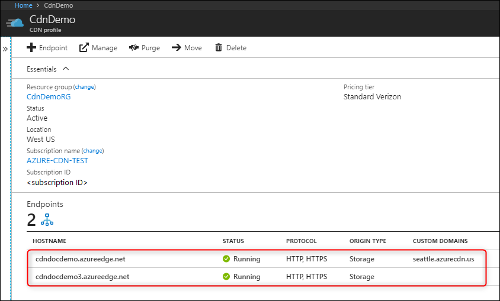
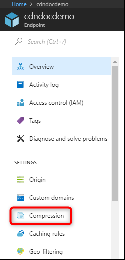
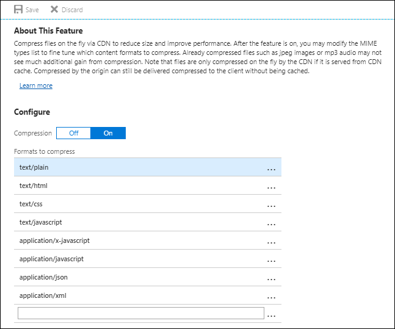
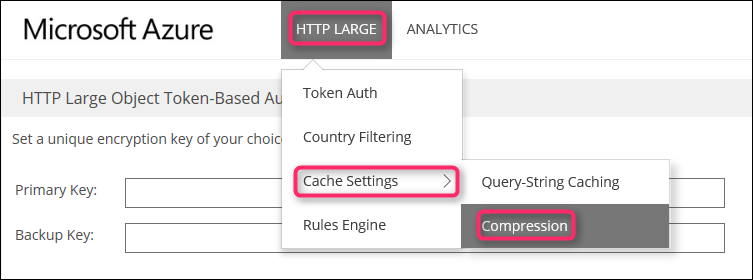

# Improve performance by compressing files in Azure CDN
Compression is a simple and effective method to improve file transfer speed and increase page load performance by reducing file size before it is sent from the server. It reduces bandwidth costs and provides a more responsive experience for your users.

There are two ways to enable compression:

* Enable compression on your origin server. In this case, the CDN passes through the compressed files and delivers them to clients that request them.
* Enable compression directly on the CDN edge servers. In this case, the CDN compresses the files and serves them to end users, even if they are not compressed by the origin server.

> [!IMPORTANT]
> CDN configuration changes can take some time to propagate through the network. For <b>Azure CDN from Akamai</b> profiles, propagation usually completes in under one minute.  For <b>Azure CDN from Verizon</b> profiles, propagation usually completes within 90 minutes. If you're setting up compression for the first time for your CDN endpoint, consider waiting 1-2 hours before you troubleshoot to ensure the compression settings have propagated to the POPs.
> 
> 

## Enabling compression
The Standard and Premium CDN tiers provide the same compression functionality, but the user interface differs. For more information about the differences between Standard and Premium CDN tiers, see [Azure CDN Overview](cdn-overview.md).

### Standard tier
> [!NOTE]
> This section applies to **Azure CDN Standard from Verizon** and **Azure CDN Standard from Akamai** profiles.
> 
> 

1. From the CDN profile page, select the CDN endpoint you want to manage.
   
    
   
    The CDN endpoint page opens.
2. Select **Compression**.

    
   
    The compression page opens.
3. Select **On** to turn on compression.
   
    
4. Use the default format types, or modify the list by adding or removing format types.
   
   > [!TIP]
   > Although it is possible, it is not recommended to apply compression to compressed formats. For example, ZIP, MP3, MP4, or JPG.
   > 
 
5. After making your changes, select **Save**.

### Premium tier
> [!NOTE]
> This section applies only to **Azure CDN Premium from Verizon** profiles.
> 
> 

1. From the CDN profile page, select **Manage**.
   
    
   
    The CDN management portal opens.
2. Hover over the **HTTP Large** tab, then hover over the **Cache Settings** flyout. Select **Compression**.

    
   
    Compression options are displayed.
   
    
3. Enable compression by selecting **Compression Enabled**. Enter the MIME types you want to compress as a comma-delimited list (no spaces) in the **File Types** box.
   
   > [!TIP]
   > Although it is possible, it is not recommended to apply compression to compressed formats. For example, ZIP, MP3, MP4, or JPG.
   > 
    
4. After making your changes, select **Update**.

## Compression rules

### Azure CDN from Verizon profiles (both standard and premium)

For **Azure CDN from Verizon** profiles, only eligible files are compressed. To be eligible for compression, a file must:
- Be larger than 128 bytes.
- Be smaller than 1 MB.
 
These profiles support **gzip** (GNU zip), **deflate**, **bzip2**, or **br** (Brotli) encoding. If the request supports more than one compression type, those compression types take precedence over Brotli compression.

When a request for an asset specifies Brotli encoding (includes the HTTP header `Accept-Encoding: br`) and the request results in a cache miss, Azure CDN performs Brotli compression of the asset on the origin server. Afterward, the compressed file is served directly from the cache.

### Azure CDN from Akamai profiles

For **Azure CDN from Akamai** profiles, all files are eligible for compression. However, a file must be of a MIME type that has been [configured for compression](#enabling-compression).

These profiles support only **gzip** encoding. When a profile endpoint requests **gzip** encoded files, they are always requested from the origin, regardless of the client request. 

## Compression behavior tables
The following tables describe Azure CDN compression behavior for every scenario:

### Compression is disabled or file is ineligible for compression
| Client-requested format (via Accept-Encoding header) | Cached-file format | The CDN response to the client | Notes&nbsp;&nbsp;&nbsp;&nbsp;&nbsp;&nbsp;&nbsp;&nbsp;&nbsp;&nbsp;&nbsp;&nbsp;&nbsp;&nbsp;&nbsp;&nbsp;&nbsp;&nbsp;&nbsp;&nbsp;&nbsp;&nbsp;&nbsp;&nbsp;&nbsp;&nbsp;&nbsp;&nbsp;&nbsp;&nbsp;&nbsp;&nbsp;&nbsp;&nbsp;&nbsp;&nbsp;&nbsp;&nbsp;&nbsp;&nbsp;&nbsp;&nbsp;&nbsp;&nbsp;&nbsp;&nbsp;&nbsp;&nbsp;&nbsp;&nbsp;&nbsp;&nbsp;&nbsp;&nbsp;&nbsp;&nbsp;&nbsp;&nbsp; |
| --- | --- | --- | --- |
| Compressed |Compressed |Compressed | |
| Compressed |Uncompressed |Uncompressed | |
| Compressed |Not cached |Compressed or Uncompressed |Depends on the origin response |
| Uncompressed |Compressed |Uncompressed | |
| Uncompressed |Uncompressed |Uncompressed | |
| Uncompressed |Not cached |Uncompressed | |

### Compression is enabled and file is eligible for compression
| Client-requested format (via Accept-Encoding header) | Cached-file format | CDN response to the client | Notes |
| --- | --- | --- | --- |
| Compressed |Compressed |Compressed |CDN transcodes between supported formats |
| Compressed |Uncompressed |Compressed |CDN performs compression |
| Compressed |Not cached |Compressed |CDN performs a compression if the origin returns an uncompressed file.  **Azure CDN from Verizon** passes the uncompressed file on the first request and then compresses and caches the file for subsequent requests. Files with the Cache-Control: no-cache header are never compressed. |
| Uncompressed |Compressed |Uncompressed |CDN performs decompression |
| Uncompressed |Uncompressed |Uncompressed | |
| Uncompressed |Not cached |Uncompressed | |

## Media Services CDN Compression
For endpoints enabled for Media Services CDN streaming, compression is enabled by default for the following MIME types: 
- application/vnd.ms-sstr+xml 
- application/dash+xml
- application/vnd.apple.mpegurl
- application/f4m+xml. 

## See also
* [Troubleshooting CDN file compression](cdn-troubleshoot-compression.md)    

