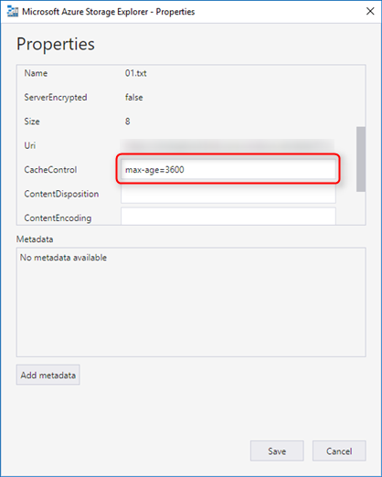

# Manage expiration of Azure Blob storage in Azure Content Delivery Network
> [!div class="op_single_selector"]
> * [Azure web content](cdn-manage-expiration-of-cloud-service-content.md)
> * [Azure Blob storage](cdn-manage-expiration-of-blob-content.md)
> 
> 

The [Blob storage service](../storage/common/storage-introduction.md#blob-storage) in Azure Storage is one of several Azure-based origins integrated with Azure Content Delivery Network (CDN). Any publicly accessible blob content can be cached in Azure CDN until its time-to-live (TTL) elapses. The TTL is determined by the `Cache-Control` header in the HTTP response from the origin server. This article describes several ways that you can set the `Cache-Control` header on a blob in Azure Storage.

You can also control cache settings from the Azure portal by setting [CDN caching rules](#setting-cache-control-headers-by-using-caching-rules). If you create a caching rule and set its caching behavior to **Override** or **Bypass cache**, the origin-provided caching settings discussed in this article are ignored. For information about general caching concepts, see [How caching works](cdn-how-caching-works.md).

> [!TIP]
> You can choose to set no TTL on a blob. In this case, Azure CDN automatically applies a default TTL of seven days, unless you have set up caching rules in the Azure portal. This default TTL applies only to general web delivery optimizations. For large file optimizations, the default TTL is one day, and for media streaming optimizations, the default TTL is one year.
> 
> For more information about how Azure CDN works to speed up access to blobs and other files, see [Overview of the Azure Content Delivery Network](cdn-overview.md).
> 
> For more information about Azure Blob storage, see [Introduction to Blob storage](https://docs.microsoft.com/azure/storage/blobs/storage-blobs-introduction).
 

## Setting Cache-Control headers by using caching rules
You can use caching rules in the Azure portal to set a blob's `Cache-Control` header. For more information, see [CDN caching rules](cdn-caching-rules.md).

To update Cache-Control headers using caching rules:
1. Open the Azure portal, select a CDN profile, then select an endpoint.

2. In the left pane under Settings, click **Caching rules**.

   

3. Under **Global caching rules**, set **Query string caching behavior** to **Ignore query strings**.

4. Set **Caching behavior** to **Override**.
       
5. For **Cache expiration duration**, enter 3600 in the **Seconds** field. 


## Setting Cache-Control headers by using Azure PowerShell
[Azure PowerShell](/powershell/azure/overview) is one of the quickest and most powerful ways to administer your Azure services. Use the `Get-AzureStorageBlob` cmdlet to get a reference to the blob, then set the `.ICloudBlob.Properties.CacheControl` property. 

For example:

```powershell
# Create a storage context
$context = New-AzureStorageContext -StorageAccountName "<storage account name>" -StorageAccountKey "<storage account key>"

# Get a reference to the blob
$blob = Get-AzureStorageBlob -Context $context -Container "<container name>" -Blob "<blob name>"

# Set the CacheControl property to expire in 1 hour (3600 seconds)
$blob.ICloudBlob.Properties.CacheControl = "max-age=3600"

# Send the update to the cloud
$blob.ICloudBlob.SetProperties()
```

> [!TIP]
> You can also use PowerShell to [manage your CDN profiles and endpoints](cdn-manage-powershell.md).
> 
>

## Setting Cache-Control headers by using .NET
To set a blob's `Cache-Control` header by using .NET code, use the [Azure Storage Client Library for .NET](../storage/blobs/storage-dotnet-how-to-use-blobs.md) to set the [CloudBlob.Properties.CacheControl](https://msdn.microsoft.com/library/microsoft.windowsazure.storage.blob.blobproperties.cachecontrol.aspx) property.

For example:

```csharp
class Program
{
    const string connectionString = "<storage connection string>";
    static void Main()
    {
        // Retrieve storage account information from connection string
        CloudStorageAccount storageAccount = CloudStorageAccount.Parse(connectionString);

        // Create a blob client for interacting with the blob service.
        CloudBlobClient blobClient = storageAccount.CreateCloudBlobClient();

        // Create a reference to the container
        CloudBlobContainer container = blobClient.GetContainerReference("<container name>");

        // Create a reference to the blob
        CloudBlob blob = container.GetBlobReference("<blob name>");

        // Set the CacheControl property to expire in 1 hour (3600 seconds)
        blob.Properties.CacheControl = "max-age=3600";

        // Update the blob's properties in the cloud
        blob.SetProperties();
    }
}
```

> [!TIP]
> There are more .NET code samples available in [Azure Blob Storage Samples for .NET](https://azure.microsoft.com/documentation/samples/storage-blob-dotnet-getting-started/).
> 

## Setting Cache-Control headers by using other methods

### Azure Storage Explorer
With [Azure Storage Explorer](https://azure.microsoft.com/en-us/features/storage-explorer/), you can view and edit your blob storage resources, including properties such as the *CacheControl* property. 

To update the *CacheControl* property of a blob with Azure Storage Explorer:
   1. Select a blob, then select **Properties** from the context menu. 
   2. Scroll down to the *CacheControl* property.
   3. Enter a value, then click **Save**.




### Azure Command-Line Interface
With the [Azure Command-Line Interface](https://docs.microsoft.com/cli/azure/overview?view=azure-cli-latest) (CLI), you can manage Azure blob resources from the command line. To set the cache-control header when you upload a blob with the Azure CLI, set the *cacheControl* property by using the `-p` switch. The following example shows how to set the TTL to one hour (3600 seconds):
  
```azurecli
azure storage blob upload -c <connectionstring> -p cacheControl="max-age=3600" .\test.txt myContainer test.txt
```

### Azure storage services REST API
You can use the [Azure storage services REST API](https://msdn.microsoft.com/library/azure/dd179355.aspx) to explicitly set the *x-ms-blob-cache-control* property by using the following operations on a request:
  
   - [Put Blob](https://msdn.microsoft.com/en-us/library/azure/dd179451.aspx)
   - [Put Block List](https://msdn.microsoft.com/en-us/library/azure/dd179467.aspx)
   - [Set Blob Properties](https://msdn.microsoft.com/library/azure/ee691966.aspx)

## Testing the Cache-Control header
You can easily verify the TTL settings of your blobs. With your browser's [developer tools](https://developer.microsoft.com/microsoft-edge/platform/documentation/f12-devtools-guide/), test that your blob includes the `Cache-Control` response header. You can also use a tool such as [Wget](https://www.gnu.org/software/wget/), [Postman](https://www.getpostman.com/), or [Fiddler](http://www.telerik.com/fiddler) to examine the response headers.

## Next Steps
* [Learn how to manage expiration of Cloud Service content in Azure CDN](cdn-manage-expiration-of-cloud-service-content.md)
* [Learn about caching concepts](cdn-how-caching-works.md)

