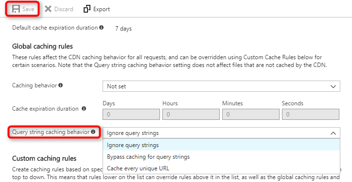

# Control Azure Content Delivery Network caching behavior with query strings
> [!div class="op_single_selector"]
> * [Standard](cdn-query-string.md)
> * [Azure CDN Premium from Verizon](cdn-query-string-premium.md)
> 

## Overview
Query string caching controls how files are cached when a request contains query strings. For example, http:\//www.domain.com/content.mov?data=true. If there is more than one query string in a request, the order of the query strings does not matter.

> [!IMPORTANT]
> The standard and premium CDN products provide the same query string caching functionality, but the user interface differs.  This article describes the interface for **Azure CDN Standard from Akamai** and **Azure CDN Standard from Verizon**. For query string caching with **Azure CDN Premium from Verizon**, see [Controlling caching behavior of CDN requests with query strings - Premium](cdn-query-string-premium.md).

Three query string modes are available:

- **Ignore query strings**: Default mode. In this mode, the CDN edge node passes the query strings from the requestor to the origin on the first request and caches the asset. All subsequent requests for the asset that are served from the edge node ignore the query strings until the cached asset expires.
- **Bypass caching for query strings**: In this mode, requests with query strings are not cached at the CDN edge node. The edge node retrieves the asset directly from the origin and passes it to the requestor with each request.
- **Cache every unique URL**: In this mode, each request with a query string is treated as a unique asset with its own cache.  For example, the response from the origin for a request for *foo.ashx?q=bar* is cached at the edge node and returned for subsequent caches with the same query string. A request for *foo.ashx?q=somethingelse* is cached as a separate asset with its own time-to-live setting.

## Changing query string caching settings for standard CDN profiles
1. Select a CDN profile, then select the CDN endpoint you want to manage.
   
   
   
   The CDN endpoint blade opens.
2. Under Settings, click **Cache**.
   
    
   
   The CDN cache blade opens.
3. In the **Query string caching behavior** list, select a query string mode, then click **Save**.
   
  <!--- Replace screen shot after general caching goes live  --->

> [!IMPORTANT]
> Because it takes time for the registration to propagate through the CDN, cache string settings changes might not be immediately visible. For **Azure CDN from Akamai** profiles, propagation usually completes within one minute. For **Azure CDN from Verizon** profiles, propagation usually completes within 90 minutes, but in some cases can take longer.

