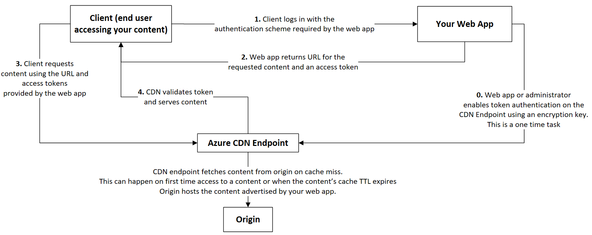
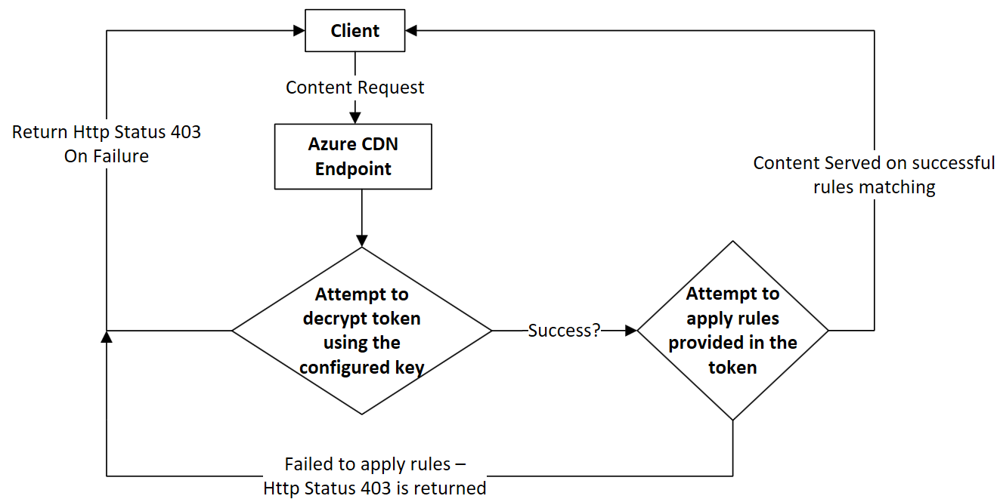
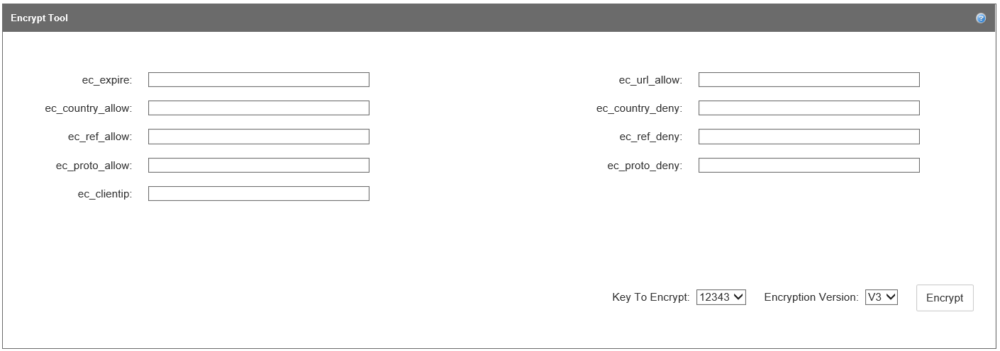

# Securing Azure Content Delivery Network assets with token authentication

[!INCLUDE [cdn-premium-feature](../../includes/cdn-premium-feature.md)]

## Overview

Token authentication is a mechanism that allows you to prevent the Azure Content Delivery Network (CDN) from serving assets to unauthorized clients. Token authentication is typically done to prevent "hotlinking" of content, in which a different website, often a message board, uses your assets without permission. Hotlinking can have an impact on your content delivery costs. By enabling this feature on CDN, requests are authenticated by CDN edge POPs before the CDN delivers the content. 

## How it works

Token authentication verifies requests are generated by a trusted site by requiring requests to contain a token value that holds encoded information about the requester. Content is served to a requester only if the encoded information meets the requirements; otherwise, requests are denied. You can set up the requirements by using one or more of the following parameters:

- Country: allow or deny requests that originated from specified countries.  [List of valid country codes.](https://msdn.microsoft.com/library/mt761717.aspx) 
- URL: only allow specified asset or path to request.  
- Host: allow or deny requests using specified hosts in the request header.
- Referrer: allow or deny specified referrer to request.
- IP address: only allow requests that originated from specific IP address or IP subnet.
- Protocol: allow or block requests based on the protocol used to request the content.
- Expiration time: assign a date and time period to ensure that a link only remains valid for a limited time period.

For more information, see the detailed configuration examples for each parameter in [Setting up token authentication](#setting-up-token-authentication).

After you generate an encrypted token, you append it as a query string to the end of the file URL path. For example, `http://www.domain.com/content.mov?a4fbc3710fd3449a7c99986b`.

## Reference architecture

The following workflow diagram describes how the CDN uses token authentication to work with your web application.

## Token validation logic on CDN endpoint
	
The following flowchart describes how Azure CDN validates client request when token authentication is configured on CDN endpoint.

## Setting up token authentication

1. From the [Azure portal](https://portal.azure.com), browse to your CDN profile, and then click **Manage** to launch the supplemental portal.

	

2. Hover over **HTTP Large**, and then click **Token Auth** in the flyout. You set up the encryption key and encryption parameters in this tab.

	1. Enter a unique encryption key for **Primary Key**.  Enter another for **Backup Key**

		
	
	2. Set up encryption parameters with the encrypt tool. With the encrypt tool, you can allow or deny requests based on expiration time, country, referrer, protocol, and client IP (in any combination).

		

       The encrypt tool has The following parameters:

		- ec_expire: Assigns an expiration time of a token after a specified time period. Requests submitted after the expiration time are denied. This parameter uses Unix timestamp (based on seconds since standard epoch of 1/1/1970 00:00:00 GMT. You can use online tools to provide conversion between standard time and Unix time.) For example, if you want to set up the token to expire at `12/31/2016 12:00:00 GMT`, use the Unix timestamp value, `1483185600`, as follows.
	
		  
	
	    - ec_url_allow: Allows you to tailor tokens to a particular asset or path. It restricts access to requests whose URL start with a specific relative path. You can input multiple paths separating each path with a comma. URLs are case-sensitive. Depending on the requirement, you can set up different value to provide different level of access. For example:
		
		  If you have a URL: http://www.mydomain.com/pictures/city/strasbourg.png. See input value "" and its access level accordingly

			1. Input value "/": all requests are allowed
			2. Input value "/pictures": all the following requests are allowed
			
				- http://www.mydomain.com/pictures.png
				- http://www.mydomain.com/pictures/city/strasbourg.png
				- http://www.mydomain.com/picturesnew/city/strasbourgh.png
			3. Input value "/pictures/": only requests for /pictures/ are allowed
			4. Input value "/pictures/city/strasbourg.png": only allows request for this asset
	
		   
	
	    - ec_country_allow: Allows only requests that originate from one or more specified countries. Requests that originate from all other countries are denied. Use country code to set up the parameters and separating each country code with a comma. For example, If you want to allow access from United States and France, input US, FR in the column as follows.  
		
		  

		- ec_country_deny: Denies requests that originate from one or more specified countries. Requests that originate from all other countries are allowed. Use country code to set up the parameters and separating each country code with a comma. For example, If you want to deny access from United States and France, input US, FR in the column.
	
		- ec_ref_allow: Allows requests from the specified referrer only. A referrer identifies the URL of the web page that is linked to the resource being requested. Do not include the protocol in the referrer parameter value. The following types of input are allowed for the parameter value:
		   - A hostname or a hostname and a path.
		   - Multiple referrers. To add multiple referrers, separate each referrer with a comma. If you specify a referrer value, but the referrer information is not sent in the request due to the browser configuration, those requests are denied by default. 
		   - Requests with missing referrer information. To allow these types of requests, enter the text "missing" or enter a blank value. 
		   - Subdomains. To allow subdomains, enter an asterisk (*). For example, to allow all subdomains of `consoto.com` enter `*.consoto.com`. 
		   
          The following example shows the input to allow access for requests from `www.consoto.com`, all subdomains under `consoto2.com`, and requests with blank or missing referrers.
		
		  
	
		- ec_ref_deny: Denies requests from the specified referrer. Refer to details and example in "ec_ref_allow" parameter.
		 
		- ec_proto_allow: Allows requests from the specified protocol only. For example, http or https.
		
		  
			
		- ec_proto_deny: Denies requests from the specified protocol. For example, HTTP or HTTPS.
	
		- ec_clientip: Restricts access to the specified requester's IP address. Both IPV4 and IPV6 are supported. You can specify single request IP address or IP subnet.
			
		  
		
	3. You can test your token with the description tool.

	4. You can also customize the type of response that is returned when a request is denied. By default, response code 403 is used.

3. Click **Rules Engine** under **HTTP Large**. You use the rules engine to define paths to apply the feature, enable the token authentication feature, and enable additional token authentication-related capabilities.

	- Use the "IF" column to define the asset or path that you want to apply token authentication. 
	- To enable token authentication, select **Token Auth** from the **Features** dropdown.
		
	

4. In the rules engine, there are a few additional capabilities you can enable:
	
	- Token auth denial code: Determines the type of response that is returned to a user when a request is denied. Rules set up here override the denial code setting in the token auth tab.
	- Token auth ignore: Determines whether the URL used to validate the token is case-sensitive.
	- Token auth parameter: Renames the token auth query string parameter that appears in the requested URL. 
		
	

5. You can customize your token, which is an application that generates token for token-based authentication features. Source code can be accessed in [GitHub](https://github.com/VerizonDigital/ectoken).
Available languages include:
	
	- C
	- C#
	- PHP
	- Perl
	- Java
	- Python	

## Azure CDN features and provider pricing

For information, see [CDN Overview](cdn-overview.md).
