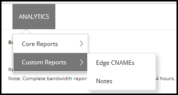

# Custom Reports from Verizon

[!INCLUDE[cdn-verizon-only](../../includes/cdn-verizon-only.md)]

By using Verizon Custom Reports via the Manage portal for Verizon profiles, you can define the type of data to be collected for edge CNAMEs reports.

## Accessing Verizon Custom Reports
1. From the CDN profile blade, click the **Manage** button.
   
    
   
    The CDN management portal opens.
2. Hover over the **Analytics** tab, then hover over the **Custom Reports** flyout. Click **Edge CNAMEs**.
   
    

## Edge CNAMES
The Edge CNAMES custom report provides hits and data-transferred statistics for edge CNAMEs on which custom report logging has been enabled. An edge CNAME is a user-friendly URL, which can be used instead of a CDN URL. 

Custom report data logging begins one hour after you enable an edge CNAME's custom reporting capability. You can view report data by generating an Edge CNAMEs report for a specific platform or for all platforms. The coverage for this report is limited to the edge CNAMEs for which custom report data was collected during the specified time period. The edge CNAMEs report consists of a graph and data table for the top 10 edge CNAMEs according to the metric defined in the Metrics option. 

Generate a custom report by defining the following report options:

- Metrics: The following options are supported:

   - Hits: Indicates the total number of requests that are directed to an edge CNAME on which the custom reporting capability is enabled. This metric does not include the status code returned to the client.

   - Data Transferred: Indicates the total amount of data transferred from the edge servers to the HTTP clients (for example, web browsers) for requests that are directed to an edge CNAME on which the custom reporting capability is enabled. The amount of data transferred is calculated by adding HTTP response headers to the response body. As a result, the amount of data transferred for each asset is greater than its actual file size.

- Groupings: Determines the type of statistics that are shown below the bar chart. The following options are supported:

   - HTTP Response Codes: Organizes statistics by HTTP response code (for example, 200, 403, etc.) returned to the client. 

   - Cache Status: Organizes statistics by cache status.

Select a date range, such as **Today** or **This Week**, from the drop-down list or enter a custom date range. Click **Go** to generate the report.

You can export the data in Excel format by clicking the Excel symbol to the right of the **Go** button.

## Considerations
Reports can be generated only within the last 18 months.

