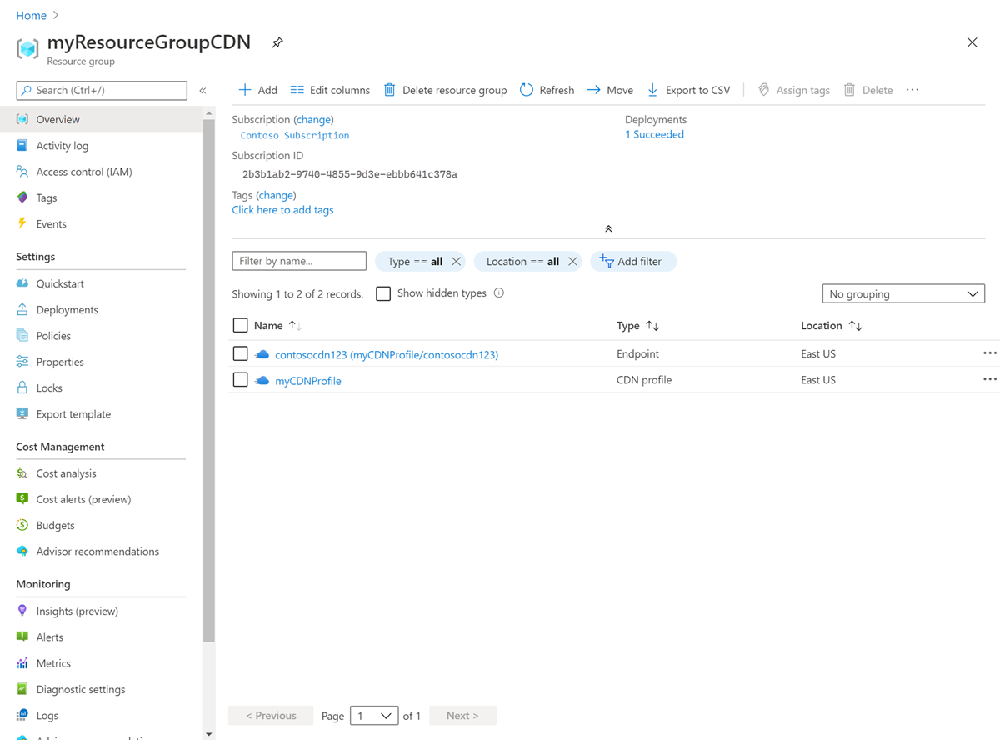

# Quickstart: Create an Azure CDN profile and endpoint - Resource Manager template

Get started with Azure CDN by using an Azure Resource Manager Template.  This template deploys a profile and endpoint.

[!INCLUDE [quickstarts-free-trial-note](../../includes/quickstarts-free-trial-note.md)]

## Create CDN profile and endpoint

This template is configured to create a:

* Profile
* Endpoint

### Review the template

The template used in this quickstart is from [Azure Quickstart templates](https://raw.githubusercontent.com/Azure/azure-quickstart-templates/master/101-cdn-with-custom-origin/azuredeploy.json)

:::code language="json" source="~/quickstart-templates/101-cdn-with-custom-origin/azuredeploy.json" range="1-125" highlight="46-117":::


One Azure resource is defined in the template:

**Microsoft.Cdn**

* **[Microsoft.Cdn/profiles](https://docs.microsoft.com/azure/templates/microsoft.cdn/profiles)**

### Deploy the template

**Azure CLI**

```azurecli-interactive
read -p "Enter the location (i.e. westcentralus): " location
resourceGroupName="myResourceGroupCDN"
templateUri="https://raw.githubusercontent.com/Azure/azure-quickstart-templates/master/101-cdn-with-custom-origin/azuredeploy.json" 

az group create \
--name $resourceGroupName \
--location $location

az group deployment create \
--resource-group $resourceGroupName \
--template-uri  $templateUri
```

**Azure PowerShell**

```azurepowershell-interactive
$location = Read-Host -Prompt "Enter the location (i.e. westcentralus)"
$templateUri = "https://raw.githubusercontent.com/Azure/azure-quickstart-templates/master/101-cdn-with-custom-origin/azuredeploy.json"

$resourceGroupName = "myResourceGroupCDN"

New-AzResourceGroup -Name $resourceGroupName -Location $location
New-AzResourceGroupDeployment -ResourceGroupName $resourceGroupName -TemplateUri $templateUri
```

**Azure portal**

[](https://portal.azure.com/#create/Microsoft.Template/uri/https%3A%2F%2Fraw.githubusercontent.com%2FAzure%2Fazure-quickstart-templates%2Fmaster%2F101-cdn-with-custom-origin%2Fazuredeploy.json)

## Review deployed resources

1. Sign in to the [Azure portal](https://portal.azure.com).

2. Select **Resource groups** from the left pane.

3. Select the resource group that you created in the previous section. The default resource group name is **myResourceGroupCDN**

4. Verify the following resources were created in the resource group:

    

## Clean up resources

**Azure CLI**

When no longer needed, you can use the [az group delete](/cli/azure/group#az-group-delete) command to remove the resource group and all resources contained within.

```azurecli-interactive 
  az group delete \
    --name myResourceGroupCDN
```

**Azure PowerShell**

When no longer needed, you can use the [Remove-AzResourceGroup](https://docs.microsoft.com/powershell/module/az.resources/remove-azresourcegroup?view=latest) command to remove the resource group and all resources contained within.

```azurepowershell-interactive 
Remove-AzResourceGroup -Name myResourceGroupCDN
```

**Azure portal**

When no longer needed, delete the resource group, CDN profile, and all related resources. Select the resource group **myResourceGroupCDN** that contains the CDN profile and endpoint, and then select **Delete**.

## Next steps

In this quickstart, you created a:

* CDN Profile
* Endpoint

To learn more about Azure CDN and Azure Resource Manager, continue to the articles below.

* Read an [Overview of Azure CDN](cdn-overview.md)
* Learn more about [Azure Resource Manager](../azure-resource-manager/management/overview.md)