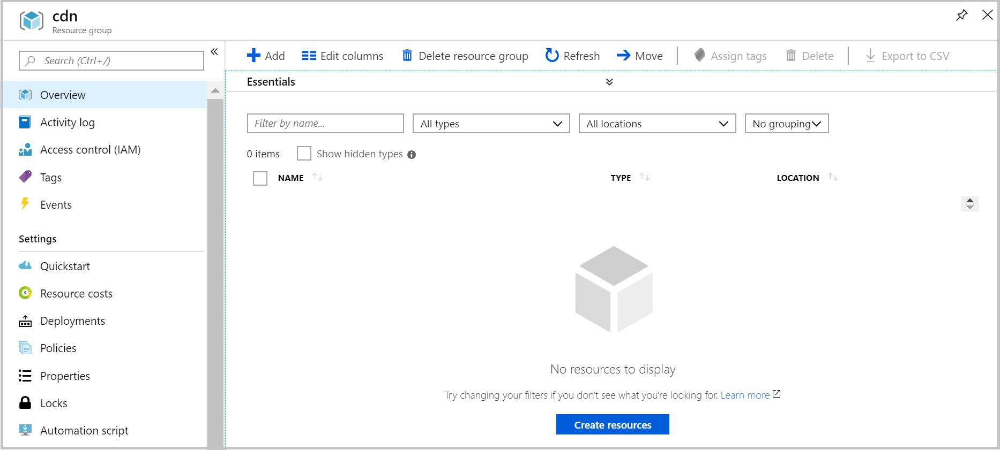

# Quickstart: Create an Azure CDN profile and endpoint - Resource Manager template

Get started with Azure CDN by using an Azure Resource Manager Template.  This template deploys a profile and endpoint.

[!INCLUDE [quickstarts-free-trial-note](../../includes/quickstarts-free-trial-note.md)]

If you don't have an Azure subscription, create a [free account](https://azure.microsoft.com/free/?WT.mc_id=A261C142F) before you begin.

## Create CDN profile and endpoint

This template is configured to create a:

* Profile
* Endpoint

### Review the template

The template used in this quickstart is from [Azure Quickstart templates](https://raw.githubusercontent.com/Azure/azure-quickstart-templates/master/101-nat-gateway-1-vm/azuredeploy.json)

## References

* CDN Profile - [Azure Resource Manager Template Reference](https://docs.microsoft.com/azure/templates/microsoft.cdn/2017-10-12/profiles)
* CDN Endpoint - [Azure Resource Manager Template Reference Documentation](https://docs.microsoft.com/azure/templates/microsoft.cdn/2017-10-12/profiles/endpoints)

## Next steps

To learn about adding a custom domain to your CDN endpoint, see the following tutorial:

> [!div class="nextstepaction"]
> [Tutorial: Add a custom domain to your Azure CDN endpoint](cdn-map-content-to-custom-domain.md)
