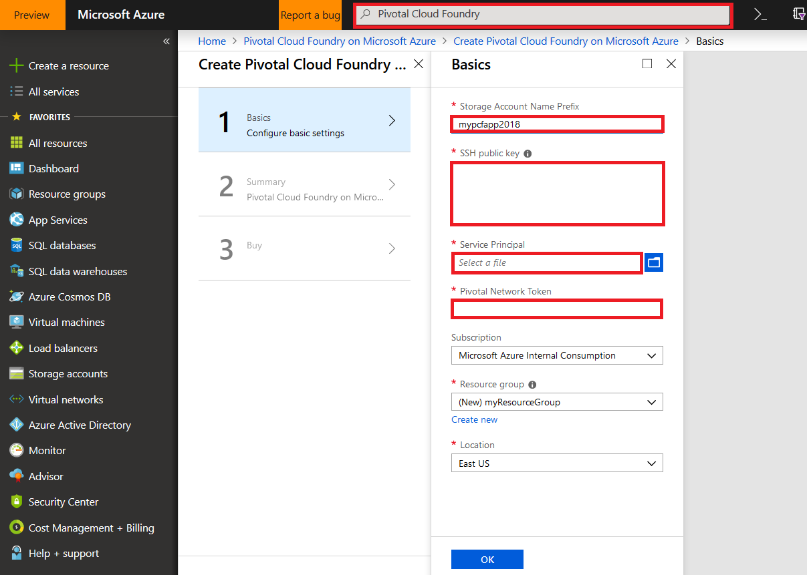
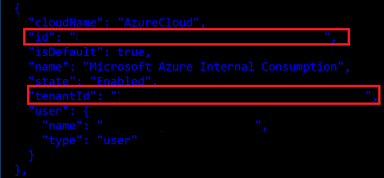
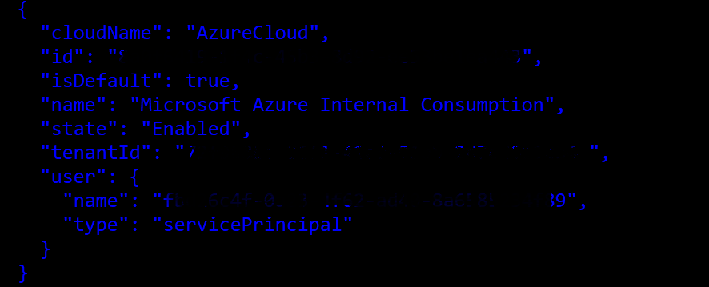
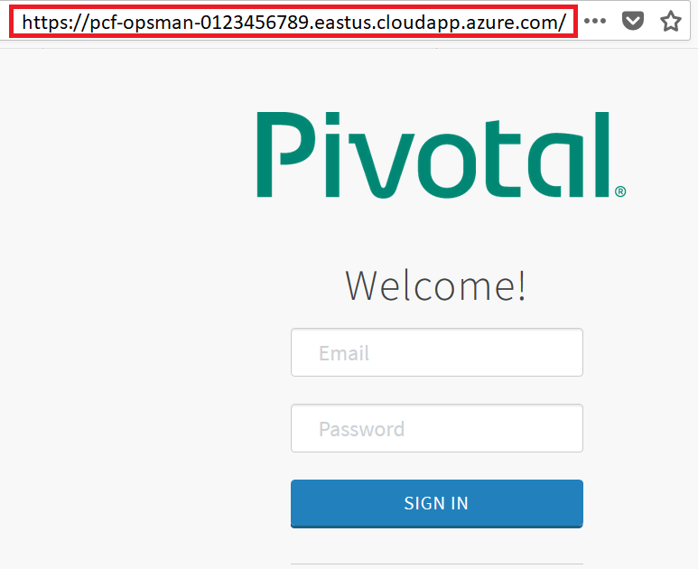
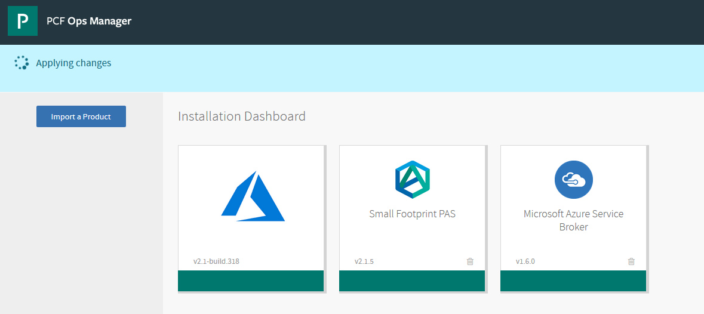

# Provision Cloud Foundry on Azure

This tutorial provides quick steps on creating and generated parameters needed to provision a Pivotal Cloud Foundry PCF cluster on Azure.  The Pivotal Cloud Foundry solution can be found by performing a search on Azure [MarketPlace](https://azuremarketplace.microsoft.com/marketplace/apps/pivotal.pivotal-cloud-foundry).




## Generate an SSH public key

There are several ways to generate a public SSH key using Windows, Mac or Linux.

```Bash
ssh-keygen -t rsa -b 2048
```
- Click here to see [instructions]( https://docs.microsoft.com/azure/virtual-machines/linux/ssh-from-windows) for your environment.

## Create a Service Principal

> [!NOTE]
>
> Creating a service principal requires an owner account permission.  In addition, you can write a script to automate creating the Service Principal. For example, using Azure CLI [az ad sp create-for-rbac](https://docs.microsoft.com/cli/azure/ad/sp?view=azure-cli-latest).

1. Log into your Azure account.

`az login`


 
Copy the “id” value as your **subscription ID** and the **tenantId** value to be used later.

2. Set your default subscription for this configuration.

`az account set -s {id}`

3. Create an AAD application for your PCF and specify a unique alpha-numeric password.  Store the password as your **clientSecret** to be used later.

`az ad app create --display-name "Svc Prinicipal for OpsManager" --password {enter-your-password} --homepage "{enter-your-homepage}" --identifier-uris {enter-your-homepage}`

The copy “appId” value in the output as your **ClientID** to be used later.


> [!NOTE]
>
> Choose your own application homepage and identifier URI.  e.g. http://www.contoso.com.

4. Create a service principal with your new “appId”.

`az ad sp create --id {appId}`

5. Set the permission role of your service principal as a **Contributor**.

`az role assignment create --assignee “{enter-your-homepage}” --role “Contributor” `

Or you can also use…

`az role assignment create --assignee {service-princ-name} --role “Contributor” `



6. Verify that you can successfully log into your Service Principal using the appId, password & tenantId.

`az login --service-principal -u {appId} -p {your-passward}  --tenant {tenantId}`

7. Create a .json file in the following format using Use all the above **subscription ID**, **tenantId**, **clientID** and **clientSecret** values you’ve copied above.  Save the file.
{
```json
{
    "subscriptionID": "{enter-your-subscription-Id-here}",
    "tenantID": "{enter-your-tenant-Id-here}",
    "clientID": "{enter-your-app-Id-here}",
    "clientSecret": "{enter-your-key-here}"
}
```

## Get the Pivotal Network Token

1. Register or log into your [Pivotal Network](https://network.pivotal.io) account.
2. Click on your profile name on the top upper right-hand side of the page, the select **Edit Profile”.
3. Scroll to the bottom of the page and copy the **LEGACY API TOKEN** value.  This is your **Pivotal Network Token** value that will be used later.

## Provision your PCF cluster
1. Now you have all the parameters needed to provision your [Pivotal Cloud Foundry on Azure](https://azuremarketplace.microsoft.com/marketplace/apps/pivotal.pivotal-cloud-foundry) cluster.
2. Enter the parameters and create your PCF cluster.

## Verify the deployment and log into the Pivotal Ops Manager

1. Your PCF cluster should show a deployment status.


2. Click on the **Deployments** link on the left-hand navigation to get credentials to your PCF Ops Manager, then click on the **Deployment Name** on the next page.
3. On the left-hand navigation, click on the **Outputs** link to display the URL, Username and Password to the PCF Ops Manager.  The “OPSMAN-FQDN” value is the URL.
 

 
4. Launch the URL in a web browser and enter the credentials from the previous step to login.


         
> [!NOTE]
>
> If Internet Explorer browser fails due to site not secure warning message, click on “More information” and “Go on to the webpage.  For Firefox, click on Advance and add the certification to proceed.

5. Your PCF Ops Manager should display the deployed Azure instances. Now you can start deploying and managing your applications here!
               

 
