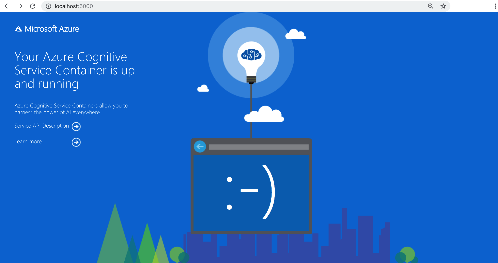

# Deploy an Anomaly Detector module to IoT Edge

Learn how to deploy the Cognitive Services [Anomaly Detector](../anomaly-detector-container-howto.md) module to an IoT Edge device. Once it's deployed into IoT Edge, the module runs in IoT Edge together with other modules as container instances. It exposes the exact same APIs as an Anomaly Detector container instance running in a standard docker container environment. 

## Prerequisites

* Use an Azure subscription. If you don't have an Azure subscription, create a [free account](https://azure.microsoft.com/free) before you begin.
* Install the [Azure CLI](/cli/azure/install-azure-cli?view=azure-cli-latest).
* An [IoT Hub](https://docs.microsoft.com/azure/iot-hub/iot-hub-create-through-portal) and an [IoT Edge](https://docs.microsoft.com/azure/iot-edge/quickstart-linux) device.

[!INCLUDE [Create a Cognitive Services Anomaly Detector resource](../includes/create-anomaly-detector-resource.md)]

## Deploy the Anomaly Detection module to the edge

1. In the Azure portal, enter **Anomaly Detector on IoT Edge** into the search and open the Azure Marketplace result.
2. It will take you to the Azure portal's Target Devices for IoT Edge Module page. Provide the following required information.

a. Select your subscription.

b. Select your IoT Hub.

c. Select **Find device** and find an IoT Edge device.

4. Select the **Create** button.

5. Select the **AnomalyDetectoronIoTEdge** module.

    :::image type="content" source="../media/deploy-anomaly-detection-on-iot-edge/iot-edge-modules.png" alt-text="Image of IoT Edge Modules user interface with AnomalyDetectoronIoTEdge link highlighted with a red box to indicate that this is the item to select.":::

6. Navigate to Environment Variables and provide the following information.

    a.  Keep the value accept for Eula.

    b. Fill out Billing with your Cognitive Services endpoint.

    c. Fill out ApiKey with your Cognitive Services API key.

    :::image type="content" source="../media/deploy-anomaly-detection-on-iot-edge/environment-variables.png" alt-text="Environment variables with red boxes around the areas that need values to be filled in for endpoint and API key":::

7. Select **Update**

8. Select **Next: Routes** to define your route. You define all messages from all modules to go to Azure IoT Hub.

9. Select **Next: Review + create**. You can preview the JSON file that defines all the modules that get deployed to your IoT Edge device.
    
10. Select Create to start the module deployment.

11. After you complete module deployment, you'll go back to the IoT Edge page of your IoT hub. Select your device from the list of IoT Edge devices to see its details.

12. Scroll down and see the modules listed. Check that the runtime status is running for your new module. 

To troubleshoot the runtime status of your IoT Edge device, consult the [troubleshooting guide](https://docs.microsoft.com/azure/iot-edge/troubleshoot)

## Test Anomaly Detector on an IoT Edge device

You'll make an HTTP call to the Azure IoT Edge device that has the Azure Cognitive Services container running. The container provides REST-based endpoint APIs. Use the host, `http://<your-edge-device-ipaddress>:5000`, for module APIs.

If your edge device does not already allow inbound communication on port 5000, you will need to create a new **inbound port rule**. 

For an Azure VM, this can set under **Virtual Machine** > **Settings** > **Networking** > **Inbound port rule** > **Add inbound port rule**.

There are several ways to validate that the module is running. Locate the *External IP* address and exposed port of the edge device in question, and open your favorite web browser. Use the various request URLs below to validate the container is running. The example request URLs listed below are `http://<your-edge-device-ipaddress:5000`, but your specific container may vary. Keep in mind that you need to use your edge device's *External IP* address.

| Request URL | Purpose |
|--|--|
| `http://<your-edge-device-ipaddress>:5000/` | The container provides a home page. |
| ``http://<your-edge-device-ipaddress>:5000/status` | Also requested with GET, this verifies if the api-key used to start the container is valid without causing an endpoint query. This request can be used for Kubernetes [liveness and readiness probes](https://kubernetes.io/docs/tasks/configure-pod-container/configure-liveness-readiness-probes/). |
| `http://<your-edge-device-ipaddress>:5000/swagger` | The container provides a full set of documentation for the endpoints and a **Try it out** feature. With this feature, you can enter your settings into a web-based HTML form and make the query without having to write any code. After the query returns, an example CURL command is provided to demonstrate the HTTP headers and body format that's required. |

## Next steps

* Review [Install and run containers](../anomaly-detector-container-configuration.md) for pulling the container image and run the container
* Review [Configure containers](../anomaly-detector-container-configuration.md) for configuration settings
* [Learn more about Anomaly Detector API service](https://go.microsoft.com/fwlink/?linkid=2080698&clcid=0x409)