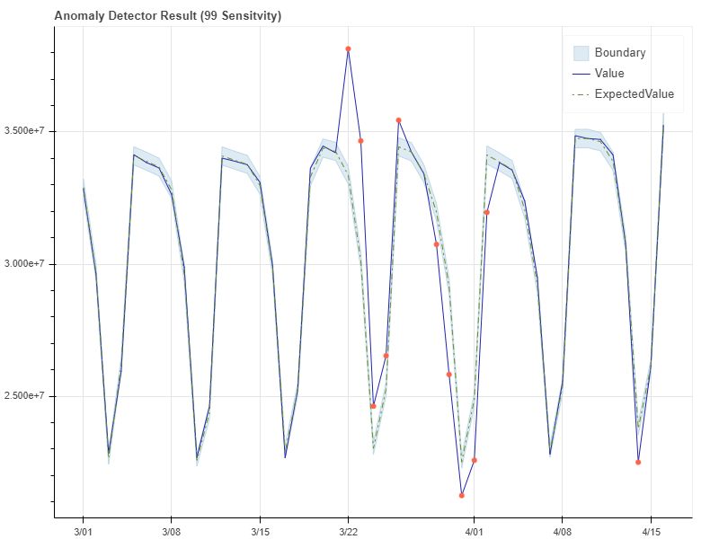
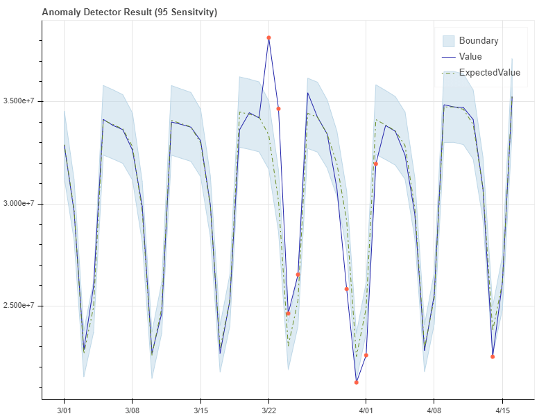

## How to: Use the Anomaly Detector API on your time series data  

Using the [Anomaly Detector API](https://westus2.dev.cognitive.microsoft.com/docs/services/AnomalyFinderV2/operations/post-timeseries-entire-detect), you can select the most appropriate method to match your scenario. The detection model returns anomaly results along with expectedValue, upperMargin and lowerMargin. ExpectedValue, UpperMargin and LowerMargin can be used to generate a band around actual time series to visualize the range of normal values in the client's side. Any values out of the boundary are detected aas anomalies. 

## Anomaly Detector modes

The Anomaly Detector API provides detection modes: batch and streaming.

> [!NOTE]
> The following request URLs must be combined with the appropriate endpoint for your subscription. For example:
> `https://westus2.api.cognitive.microsoft.com/anomalydetector/v1.0/timeseries/entire/detect`

### Batch detection

To detect anomalies throughout a batch of data points over a given time range, use the following request URL with your time series data: `/timeseries/entire/detect`. By sending your time series data at once, the API will generate a model using the entire series, and analyze each data point with it.  

### Streaming detection

To continuously detect anomalies on streaming data, use the following request URL with your latest data point: `/timeseries/last/detect'`. By sending new data points as you generate them, you can monitor your data in real-time. A model will be generated with the data points you send, and the API will determines if the target point is an anomaly.

## Adjusting lower and upper anomaly detection boundaries

By default, the upper and lower boundaries for anomaly detection are calculated using `ExpectedValue`, `UpperMargin`, and `LowerMargin`. If you require different boundaries, we recommend applying a `MarginScale` to `UpperMargin` or `LowerMargin`. The boundaries would be calculated as follows:

|Boundary  |Calculation  |
|---------|---------|
|`UpperMargin`     | `ExpectedValue + (100 - MarginScale) * UpperMargin`        |
|`LowerMargin`     |  `ExpectedValue - (100 - MarginScale) * LowerMargin`       |

By adjusting the boundaries of the model, you can change it's sensitivity for data anomalies.

default results on whether a data point is anomaly or not, and the upper and lower bound can be calculated from ExpectedValue and UpperMargin/LowerMargin. Default values work fine for most cases. However, some scenarios require different bounds than the default ones. The recommend practice is applying a MarginScale on the UpperMargin or LowerMargin to adjust the dynamic bounds. UpperBoundary equals to ExpectedValue + (100 - MarginScale)\*UpperMargin, lowerBoundary equals to ExpectedValue - (100 - MarginScale)\*LowerMargin

### Examples with 99/95/85 as sensitivity

## How to use the APIs to do continuous monitoring 

Anomaly finder APIs is a stateless services. To enable contious monitoring on streaming data, for example, in the following scenario, your have KPIs such as "Daily active users" to monitor, you have to post to the API endpoint a window of time series of DAU and get a response on whether the latest point is an anomaly or not. When a new data point is available, you complete the API post again with a moving window of time series to get the response. When this process is repeated every time a new data point is available to detect, continous monitoring is achieved on streaming data.

This applies not only to daily time series like DAU, but also to time series with hourly or minute level intervals.
