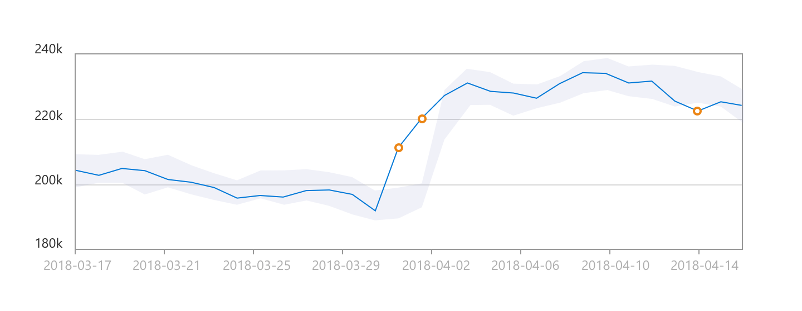

--- 
title: What is the Anomaly Detector API? | Microsoft Docs 
titleSuffix: Azure Cognitive Services
description: Use the Anomaly Detector API's advanced algorithms to identify anomalies in your time series data. 
services: cognitive-services 
author: aahill
ms.service: cognitive-services 
ms.subservice: anomaly-detection 
ms.topic: article
ms.date: 02/26/2019 
ms.author: aahi
--- 
 
# What is the Anomaly Detector API?

The Anomaly Detector API enables you to monitor and detect abnormalities in your time series data with machine learning. The Anomaly Detector API adapts by automatically identifying and applying the best fitting statistical models to your data, regardless of industry, scenario, or data volume. Using your time series data, the API determines boundaries for anomaly detection, expected values, and which data points are anomalies.

Using the Anomaly Detector doesn't require any prior experience in machine learning, and the RESTful API enables you to easily integrate the service into your applications and processes.

## Features

With the Anomaly Detector, you can automatically detect anomalies throughout your time series data, or as they occur in real-time. 

|Feature  |Description  |
|---------|---------|
|Detect anomalies as they occur in real-time. | Detect anomalies in your streaming data by using previously seen data points to determine if your latest one is an anomaly. This operation generates a model using the data points you send, and determines if the target point is an anomaly. By calling the API with each new data point you generate, you can monitor your data as it's created. |
|Detect anomalies throughout your data set as a batch. | Use your time series to detect any anomalies that might exist throughout your data. This operation generates a model using your entire time series data, with each point analyzed with the same model.         |
| Get additional information about your data. | Get useful details about your data and any observed anomalies, including expected values, anomaly boundaries and positions. |
| Adjust anomaly detection boundaries. | The Anomaly Detector API automatically creates boundaries for anomaly detection. Adjust these boundaries to increase or decrease the API's sensitivity to data anomalies, and better fit your data. |

## Demo

To quickly begin using the Anomaly Detector API, try an [online demo](https://notebooks.azure.com/AzureAnomalyDetection/projects/anomalydetector) that can be run in your browser. This demo runs in a web-hosted Jupyter notebook and shows you how to send an API request, and visualize the result.

To run the demo, complete the following steps:

1. Get a valid Anomaly Detector API subscription key. The section below has instructions for signing up.  
2. Sign in, and click Clone, in the upper right corner.
3. Click **Run on free compute**
4. Select one of the notebooks for this sample.
5. Add your valid Anomaly Detector API subscription key to the `subscription_key` variable.
6. On the top menu bar, click **Cell**, then **Run All**.

## Workflow

The Anomaly Detector API is a RESTful web service, making it easy to call from any programming language that can make HTTP requests and parse JSON. Use [best practices](concepts/anomaly-detection-best-practices.md) when using the API for the best results for your data.

[!INCLUDE [cognitive-services-anomaly-detector-data-requirements](../../../includes/cognitive-services-anomaly-detector-data-requirements.md)]

1. Create a [Cognitive Services API account](https://docs.microsoft.com/azure/cognitive-services/cognitive-services-apis-create-account) with access to the Anomaly Detector API. If you don't have an Azure subscription, you can [create an account](https://azure.microsoft.com/try/cognitive-services/) for free.
2. Send a request to the API, with your data.
3. Process the API response by parsing the returned JSON message.

[!INCLUDE [cognitive-services-anomaly-detector-signup-requirements](../../../includes/cognitive-services-anomaly-detector-signup-requirements.md)]

## Next steps

* [Quickstart: Detect anomalies in your time series data using the Anomaly Detector REST API](quickstarts/detect-data-anomalies-chsarp.md)
* The Anomaly Detector API [online demo](https://notebooks.azure.com/AzureAnomalyDetection/projects/anomalydetector)
* The Anomaly Detector [REST API reference](https://westus2.dev.cognitive.microsoft.com/docs/services/AnomalyDetector/operations/post-timeseries-entire-detect)