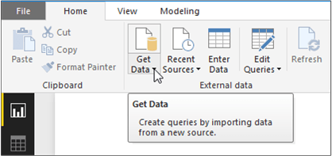
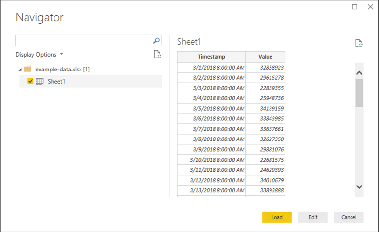
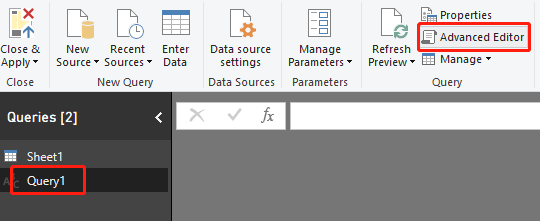

# Tutorial: Vizualize anomalies as a batch using Power BI

In this tutorial, you'll learn how to:

* Use Power BI Desktop to import and transform time series data
* Integrate Power BI Desktop with the Anomaly Detector API for batch anomaly detection
* Visualize anomalies found within your data, including expected and seen values, and anomaly detection boundaries.

## Prerequisites

* [Microsoft Power BI Desktop](https://powerbi.microsoft.com/get-started/), available for free.
* A JSON file containing time series data points. The example data for this quickstart can be found on GitHub

[!INCLUDE [cognitive-services-anomaly-detector-data-requirements](../../../../includes/cognitive-services-anomaly-detector-data-requirements.md)]

[!INCLUDE [cognitive-services-anomaly-detector-signup-requirements](../../../../includes/cognitive-services-anomaly-detector-signup-requirements.md)]

## Load and format the time series data

To get started, open Power BI Desktop and load the the time series data you downloaded in the prerequisites. This excel file contains a series of Coordinated Universal Time (UTC) timestamp and value pairs.  

> [!NOTE]
> Power BI can use data from a wide variety of sources, such as .csv files, SQL databases, Azure blob storage, and more.  

In the main Power BI Desktop window, click the **Home** ribbon. In the **External data** group of the ribbon, open the **Get Data** drop-down menu and click **Excel**.



After the dialog appears, navigate to the folder where you downloaded the example .xlsx file and select it. After the **Navigator** dialogue appears, click **Sheet1**, and then **Edit**.



Power BI will convert the timestamps in the first column to a `Date/Time` data type. These timestamps must be converted to text in order to be sent to the Anomaly Detector API. To do this, In Power Query Editor click the **Transform** ribbon. in the **Any Column** group, click **Text**


## Create a function to send the data and format the response

To format and send the data file to the Anomaly Detector API, you can invoke a query on the table created above. In the Power Query Editor. From the **Home** ribbon, click the drop-down menu for **New Source**. Then click **Blank Query** 

Make sure your new query is selected, then click **Advanced Editor**. 



Within the Advanced Editor, use the following Power Query M snippet to extract the columns from the table and send it to the API. Afterwards, the query will create a table from the JSON response, and return it. Replace the `apiKey` variable with your valid Anomaly Detector API key, and `endpoint` with your endpoint. After you've entered the query into the Advanced Editor, click **Done**.

```Power Query M
(table as table) => let

    apikey     = "your api key",
    endpoint   = "https://westus2.api.cognitive.microsoft.com/anomalyfinder/v2.0/timeseries/entire/detect",
    inputTable = Table.TransformColumnTypes(table,{{"Timestamp", type text},{"Value", type number}}),
    jsontext   = Text.FromBinary(Json.FromValue(inputTable)),
    jsonbody   = "{ ""Granularity"": ""daily"", ""Sensitivity"": 80, ""Series"": "& jsontext &" }",
    bytesbody  = Text.ToBinary(jsonbody),
    headers    = [#"Content-Type" = "application/json", #"Ocp-Apim-Subscription-Key" = apikey],
    bytesresp  = Web.Contents(endpoint, [Headers=headers, Content=bytesbody]),
    jsonresp   = Json.Document(bytesresp),

    respTable  = Table.FromColumns({
                     Table.Column(inputTable, "Timestamp")
                     , Table.Column(inputTable, "Value")
                     , Record.Field(jsonresp, "IsAnomaly") as list
                     , Record.Field(jsonresp, "ExpectedValues") as list
                     , Record.Field(jsonresp, "UpperMargins")as list
                     , Record.Field(jsonresp, "LowerMargins") as list
                     , Record.Field(jsonresp, "IsPositiveAnomaly") as list
                     , Record.Field(jsonresp, "IsNegativeAnomaly") as list
                  }, {"Timestamp", "Value", "IsAnomaly", "ExpectedValues", "UpperMargin", "LowerMargin", "IsPositiveAnomaly", "IsNegativeAnomaly"}
               ),
    
    respTable1 = Table.AddColumn(respTable , "UpperMargins", (row) => row[Value] + row[UpperMargin]),
    respTable2 = Table.AddColumn(respTable1 , "LowerMargins", (row) => row[Value] -  row[LowerMargin]),
    respTable3 = Table.RemoveColumns(respTable2, "UpperMargin"),
    respTable4 = Table.RemoveColumns(respTable3, "LowerMargin"),

    results = Table.TransformColumnTypes(
                respTable4,
                {{"Timestamp", type datetime}, {"Value", type number}, {"IsAnomaly", type logical}, {"IsPositiveAnomaly", type logical}, {"IsNegativeAnomaly", type logical},
                 {"ExpectedValues", type number}, {"UpperMargins", type number}, {"LowerMargins", type number}}
              )
 in results
```

Invoke the query on your data sheet by selecting `Sheet1` below **Enter Paramter**, and click **Invoke**.


## Privacy and authentication

If you get a warning message to specify how you connect to the API, click **Edit Credentials**. In the windows that appears, click **Anonymous** and apply it to the Anomaly Detector URL.


If you see the message even after choosing anonymous access, you may have forgotten to paste your API key into the code above. Because the function created earlier transfers data to the API, you may appear asking you to provide information about your data sources' privacy. Click **Continue** and choose `Public` for each of the data sources in the dialog. Then click Save.


Selecting the privacy levels should let your function be invoked on the time series data. Click **Close and upload**

## Visualize the Anomaly Detector API response