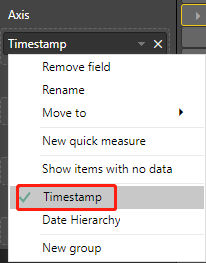
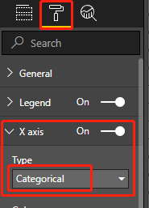
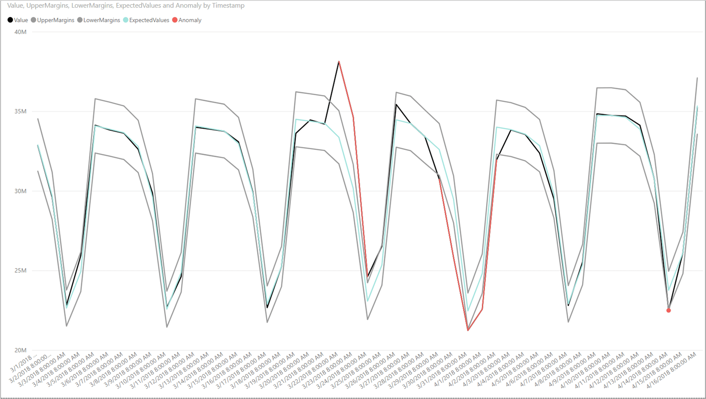

# Tutorial: Visualize anomalies using batch detection and Power BI

Use this this tutorial to find anomalies within a time series data set as a batch. Using Power BI desktop, you will take an Excel file, prepare the data for the Anomaly Detector API, and visualize statistical anomalies throughout it.

In this tutorial, you'll learn how to:

> [!div class="checklist"]
> * Use Power BI Desktop to import and transform a time series data set
> * Integrate Power BI Desktop with the Anomaly Detector API for batch anomaly detection
> * Visualize anomalies found within your data, including expected and seen values, and anomaly detection boundaries.

## Prerequisites

* [Microsoft Power BI Desktop](https://powerbi.microsoft.com/get-started/), available for free.
* An excel file (.xlsx) containing time series data points. The example data for this quickstart can be found on [GitHub](https://go.microsoft.com/fwlink/?linkid=2090962)

[!INCLUDE [cognitive-services-anomaly-detector-data-requirements](../../../../includes/cognitive-services-anomaly-detector-data-requirements.md)]

[!INCLUDE [cognitive-services-anomaly-detector-signup-requirements](../../../../includes/cognitive-services-anomaly-detector-signup-requirements.md)]

## Load and format the time series data

To get started, open Power BI Desktop and load the time series data you downloaded from the prerequisites. This excel file contains a series of Coordinated Universal Time (UTC) timestamp and value pairs.  

> [!NOTE]
> Power BI can use data from a wide variety of sources, such as .csv files, SQL databases, Azure blob storage, and more.  

In the main Power BI Desktop window, click the **Home** ribbon. In the **External data** group of the ribbon, open the **Get Data** drop-down menu and click **Excel**.


After the dialog appears, navigate to the folder where you downloaded the example .xlsx file and select it. After the **Navigator** dialogue appears, click **Sheet1**, and then **Edit**.


Power BI will convert the timestamps in the first column to a `Date/Time` data type. These timestamps must be converted to text in order to be sent to the Anomaly Detector API. If the Power Query editor doesn't automatically open, click **Edit Queries** on the home tab. 

Click the **Transform** ribbon in the Power Query Editor. In the **Any Column** group, open the **Data Type:** drop-down menu, and select **Text**.


When you get a notice about changing the column type, click **Replace Current**. Afterwards, click **Close & Apply** or **Apply** in the **Home** ribbon. 

## Create a function to send the data and format the response

To format and send the data file to the Anomaly Detector API, you can invoke a query on the table created above. In the Power Query Editor, from the **Home** ribbon, open the **New Source** drop-down menu and click **Blank Query**.

Make sure your new query is selected, then click **Advanced Editor**. 


Within the Advanced Editor, use the following Power Query M snippet to extract the columns from the table and send it to the API. Afterwards, the query will create a table from the JSON response, and return it. Replace the `apiKey` variable with your valid Anomaly Detector API key, and `endpoint` with your endpoint. After you've entered the query into the Advanced Editor, click **Done**.

```M
(table as table) => let

    apikey      = "[Placeholder: Your Anomaly Detector resource access key]",
    endpoint    = "[Placeholder: Your Anomaly Detector resource endpoint]/anomalydetector/v1.0/timeseries/entire/detect,
    inputTable = Table.TransformColumnTypes(table,{{"Timestamp", type text},{"Value", type number}}),
    jsontext    = Text.FromBinary(Json.FromValue(inputTable)),
    jsonbody    = "{ ""Granularity"": ""daily"", ""Sensitivity"": 95, ""Series"": "& jsontext &" }",
    bytesbody   = Text.ToBinary(jsonbody),
    headers     = [#"Content-Type" = "application/json", #"Ocp-Apim-Subscription-Key" = apikey],
    bytesresp   = Web.Contents(endpoint, [Headers=headers, Content=bytesbody]),
    jsonresp    = Json.Document(bytesresp),

    respTable = Table.FromColumns({
                    
                     Table.Column(inputTable, "Timestamp")
                     ,Table.Column(inputTable, "Value")
                     , Record.Field(jsonresp, "IsAnomaly") as list
                     , Record.Field(jsonresp, "ExpectedValues") as list
                     , Record.Field(jsonresp, "UpperMargins")as list
                     , Record.Field(jsonresp, "LowerMargins") as list
                     , Record.Field(jsonresp, "IsPositiveAnomaly") as list
                     , Record.Field(jsonresp, "IsNegativeAnomaly") as list

                  }, {"Timestamp", "Value", "IsAnomaly", "ExpectedValues", "UpperMargin", "LowerMargin", "IsPositiveAnomaly", "IsNegativeAnomaly"}
               ),
    
    respTable1 = Table.AddColumn(respTable , "UpperMargins", (row) => row[ExpectedValues] + row[UpperMargin]),
    respTable2 = Table.AddColumn(respTable1 , "LowerMargins", (row) => row[ExpectedValues] -  row[LowerMargin]),
    respTable3 = Table.RemoveColumns(respTable2, "UpperMargin"),
    respTable4 = Table.RemoveColumns(respTable3, "LowerMargin"),

    results = Table.TransformColumnTypes(

                respTable4,
                {{"Timestamp", type datetime}, {"Value", type number}, {"IsAnomaly", type logical}, {"IsPositiveAnomaly", type logical}, {"IsNegativeAnomaly", type logical},
                 {"ExpectedValues", type number}, {"UpperMargins", type number}, {"LowerMargins", type number}}
              )

 in results
```

Invoke the query on your data sheet by selecting `Sheet1` below **Enter Parameter**, and click **Invoke**. 


## Data source privacy and authentication

> [!NOTE]
> Be aware of your organization's policies for data privacy and access. See [Power BI Desktop privacy levels](https://docs.microsoft.com/power-bi/desktop-privacy-levels) for more information.

You may get a warning message when you attempt to run the query since it utilizes an external data source. 


To fix this, click **File**, and **Options and settings**. Then click **Options**. Below **Current File**, select **Privacy**, and **Ignore the Privacy Levels and potentially improve performance**. 

Additionally, you may get a message asking you to specify how you want to connect to the API.


To fix this, Click **Edit Credentials** in the message. After the dialogue box appears, select **Anonymous** to connect to the API anonymously. Then click **Connect**. 

Afterwards, click **Close & Apply** in the **Home** ribbon to apply the changes.

## Visualize the Anomaly Detector API response

In the main Power BI screen, begin using the queries created above to visualize the data. First select **Line Chart** in **Visualizations**. Then add the timestamp from the invoked function to the line chart's **Axis**. Right-click on it, and select **Timestamp**. 



Add the following fields from the **Invoked Function** to the chart's **Values** field. Use the below screenshot to help build your chart.

    * Value
    * UpperMargins
    * LowerMargins
    * ExpectedValues


After adding the fields, click on the chart and resize it to show all of the data points. Your chart will look similar to the below screenshot:


### Display anomaly data points

On the right side of the Power BI window, below the **FIELDS** pane, right-click on **Value** under the **Invoked Function query**, and click **New quick measure**.


On the screen that appears, select **Filtered value** as the calculation. Set **Base value** to `Sum of Value`. Then drag `IsAnomaly` from the **Invoked Function** fields to **Filter**. Select `True` from the **Filter** drop-down menu.


After clicking **Ok**, you will have a `Value for True` field, at the bottom of the list of your fields. Right-click it and rename it to **Anomaly**. Add it to the chart's **Values**. Then select the **Format** tool, and set the X-axis type to **Categorical**.



Apply colors to your chart by clicking on the **Format** tool and **Data colors**. Your chart should look something like the following:



## Next steps

> [!div class="nextstepaction"]
>[Streaming anomaly detection with Azure Databricks](anomaly-detection-streaming-databricks.md)
