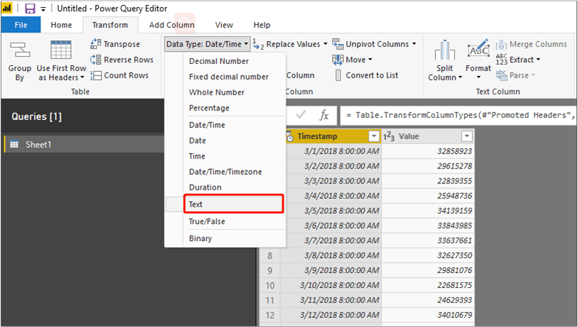
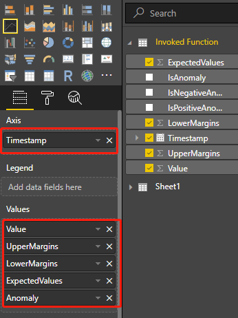
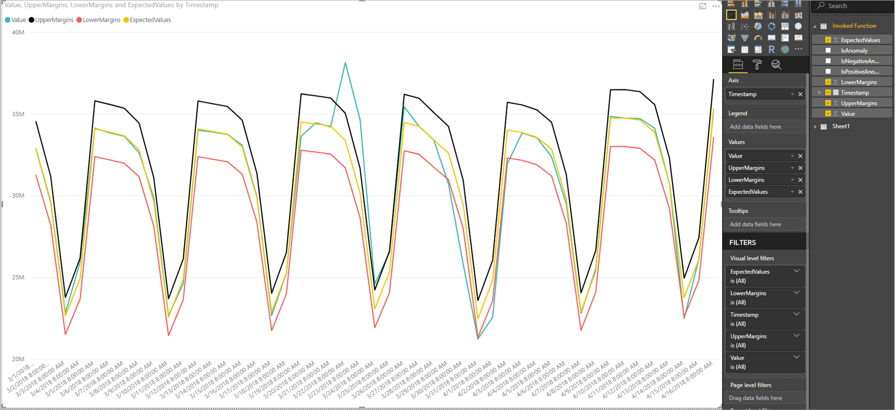
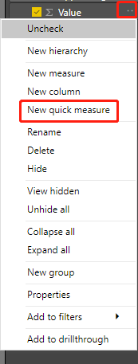
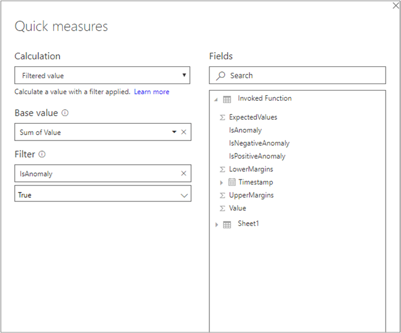

# Tutorial: Visualize anomalies as a batch using Power BI

In this tutorial, you'll learn how to:

* Use Power BI Desktop to import and transform time series data
* Integrate Power BI Desktop with the Anomaly Detector API for batch anomaly detection
* Visualize anomalies found within your data, including expected and seen values, and anomaly detection boundaries.

## Prerequisites

* [Microsoft Power BI Desktop](https://powerbi.microsoft.com/get-started/), available for free.
* A JSON file containing time series data points. The example data for this quickstart can be found on GitHub

[!INCLUDE [cognitive-services-anomaly-detector-data-requirements](../../../../includes/cognitive-services-anomaly-detector-data-requirements.md)]

[!INCLUDE [cognitive-services-anomaly-detector-signup-requirements](../../../../includes/cognitive-services-anomaly-detector-signup-requirements.md)]

## Load and format the time series data

To get started, open Power BI Desktop and load the time series data you downloaded from the prerequisites. This excel file contains a series of Coordinated Universal Time (UTC) timestamp and value pairs.  

> [!NOTE]
> Power BI can use data from a wide variety of sources, such as .csv files, SQL databases, Azure blob storage, and more.  

In the main Power BI Desktop window, click the **Home** ribbon. In the **External data** group of the ribbon, open the **Get Data** drop-down menu and click **Excel**.


After the dialog appears, navigate to the folder where you downloaded the example .xlsx file and select it. After the **Navigator** dialogue appears, click **Sheet1**, and then **Edit**.


Power BI will convert the timestamps in the first column to a `Date/Time` data type. These timestamps must be converted to text in order to be sent to the Anomaly Detector API. To do this, click the **Transform** ribbon in the Power Query Editor. in the **Any Column** group, click **Text**



## Create a function to send the data and format the response

To format and send the data file to the Anomaly Detector API, you can invoke a query on the table created above. In the Power Query Editor. From the **Home** ribbon, click the drop-down menu for **New Source**. Then click **Blank Query** 

Make sure your new query is selected, then click **Advanced Editor**. 


Within the Advanced Editor, use the following Power Query M snippet to extract the columns from the table and send it to the API. Afterwards, the query will create a table from the JSON response, and return it. Replace the `apiKey` variable with your valid Anomaly Detector API key, and `endpoint` with your endpoint. After you've entered the query into the Advanced Editor, click **Done**.

```M
(table as table) => let

    apikey     = "your api key",
    endpoint   = "https://westus2.api.cognitive.microsoft.com/anomalyfinder/v2.0/timeseries/entire/detect",
    inputTable = Table.TransformColumnTypes(table,{{"Timestamp", type text},{"Value", type number}}),
    jsontext   = Text.FromBinary(Json.FromValue(inputTable)),
    jsonbody   = "{ ""Granularity"": ""daily"", ""Sensitivity"": 80, ""Series"": "& jsontext &" }",
    bytesbody  = Text.ToBinary(jsonbody),
    headers    = [#"Content-Type" = "application/json", #"Ocp-Apim-Subscription-Key" = apikey],
    bytesresp  = Web.Contents(endpoint, [Headers=headers, Content=bytesbody]),
    jsonresp   = Json.Document(bytesresp),

    respTable  = Table.FromColumns({
                     Table.Column(inputTable, "Timestamp")
                     , Table.Column(inputTable, "Value")
                     , Record.Field(jsonresp, "IsAnomaly") as list
                     , Record.Field(jsonresp, "ExpectedValues") as list
                     , Record.Field(jsonresp, "UpperMargins")as list
                     , Record.Field(jsonresp, "LowerMargins") as list
                     , Record.Field(jsonresp, "IsPositiveAnomaly") as list
                     , Record.Field(jsonresp, "IsNegativeAnomaly") as list
                  }, {"Timestamp", "Value", "IsAnomaly", "ExpectedValues", "UpperMargin", "LowerMargin", "IsPositiveAnomaly", "IsNegativeAnomaly"}
               ),
    
    respTable1 = Table.AddColumn(respTable , "UpperMargins", (row) => row[Value] + row[UpperMargin]),
    respTable2 = Table.AddColumn(respTable1 , "LowerMargins", (row) => row[Value] -  row[LowerMargin]),
    respTable3 = Table.RemoveColumns(respTable2, "UpperMargin"),
    respTable4 = Table.RemoveColumns(respTable3, "LowerMargin"),

    results = Table.TransformColumnTypes(
                respTable4,
                {{"Timestamp", type datetime}, {"Value", type number}, {"IsAnomaly", type logical}, {"IsPositiveAnomaly", type logical}, {"IsNegativeAnomaly", type logical},
                 {"ExpectedValues", type number}, {"UpperMargins", type number}, {"LowerMargins", type number}}
              )
 in results
```

Invoke the query on your data sheet by selecting `Sheet1` below **Enter Parameter**, and click **Invoke**.


You may get a warning message when you attempt to run the query because Power BI doesn't let you combine an external data source with another query. 


To fix this, click **File**, and **Options and settings**. Then click **Options**. Below **Current File**, select **Privacy**, and **Ignore the Privacy Levels and potentially improve performance**. 

> [NOTE]
> Be aware of your organization's policies for data privacy and access. See [Power BI Desktop privacy levels](https://docs.microsoft.com/en-us/power-bi/desktop-privacy-levels) for more information.

## Visualize the Anomaly Detector API response

Use the screenshot below to help build your chart.

1. Select the line chart visualization.

2. Add the `day` field from **Timestamp**, **Date Hierarchy** to the line chart's **Axis**.

3. Add the following fields to the chart's **Values**. 
    * Value
    * UpperMargins
    * LowerMargins
    * ExpectedValues
 


Your chart will look similar to the below screenshot:



### Display data anomaly points

On the right side of the screen, below **Fields**, right-click on **Value**. Select **New Quick Measure**.



On the screen that appears, select **Filtered value** as the calculation. Set **Base value** to `Sum of Value`. Then drag `IsAnomaly` from the fields in the invoked function.  



After clicking **Ok**, you will have a `Value for True` field, at the bottom of the list of your fields. Add it to the chart's **Values**. Then select the **Format** tool, and set the X-axis type to **Categorical**.


Apply colors to your chart by clicking on the **Format** tool and **Data colors**. Your chart should look something like the following:


