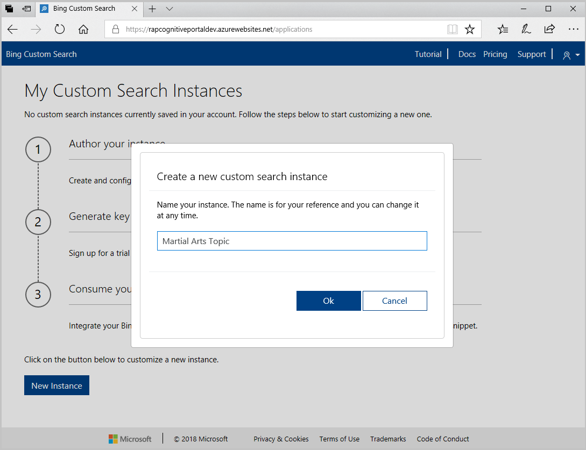
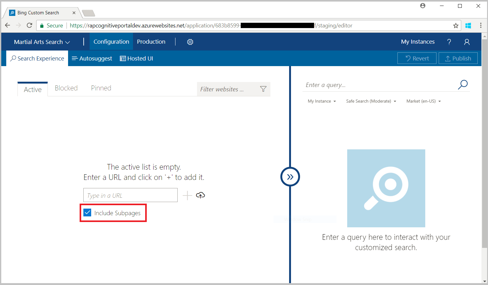
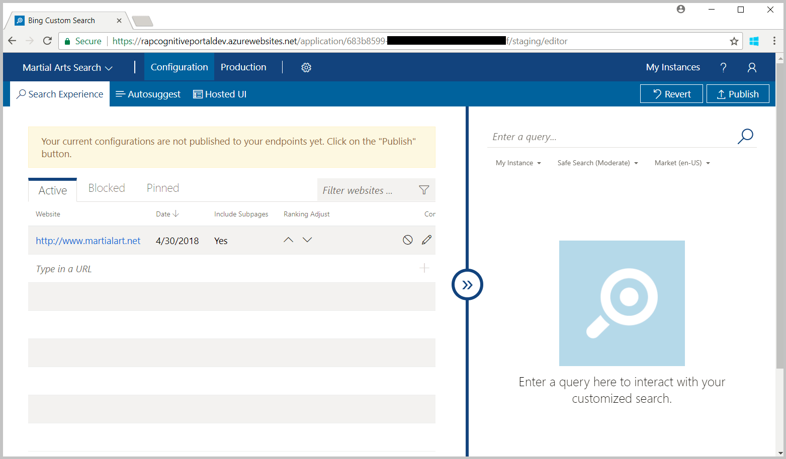
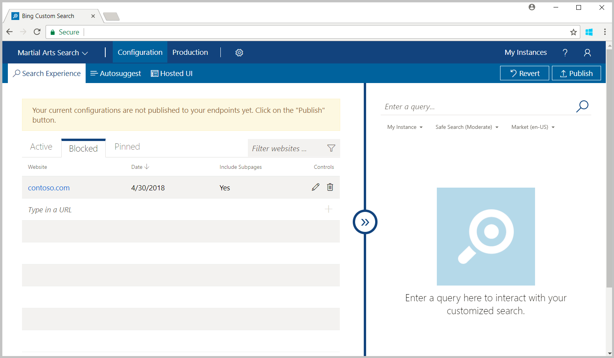

# Build a Custom Search web page
Bing Custom Search enables you to create tailored search experiences for topics that you care about. For example, if you own a martial arts website that provides a search experience, you can specify the domains, subsites, and webpages that Bing searches. Your users see search results tailored to the content they care about instead of paging through general search results that may contain irrelevant content. 

This tutorial demonstrates how to configure a custom search instance and integrate it into a new web page.

The tasks covered are:

> [!div class="checklist"]
> - Create a custom search instance
> - Add active entries
> - Add blocked entries
> - Add pinned entries
> - Integrate custom search into a web page

## Prerequisites
- To follow along with the tutorial, you need a subscription key for the Bing Custom Search API.  To get a key see [Try Cognitive Services](https://azure.microsoft.com/try/cognitive-services/?api=bing-custom-search).
- If you don’t already have Visual Studio 2017 installed, you can download and use the **free** [Visual Studio 2017 Community Edition](https://www.visualstudio.com/downloads/).

## Create a custom search instance
To create a Bing Custom Search instance:

1.  Open an internet browser.
2.  Navigate to custom search [portal](https://customsearch.ai).
3.  Sign in to the portal using a Microsoft account (MSA). If you don’t have an MSA, click **Create a Microsoft account**. If it’s your first time using the portal, it will ask for permissions to access your data. Click **Yes**.
4.  After signing in, click **New custom search**. In the **Create a new custom search instance** window, enter a name that’s meaningful and describes the type of content the search returns. You can change the name at any time.
 
    

5.  Click OK, specify a URL and whether to include subpages of the base page:

    

## Add active entries
To include results from specific sites or URLs add them to the **Active** tab.

1.	In the **Definition Editor**, click the **Active** tab and enter the URL of one or more sites you want to include in your search.

    

2.	To confirm that your instance returns results, enter a query in the preview pane on the right. Bing returns results only for public sites that it has indexed.

## Add blocked entries
To exclude results from specific sites or URLs, add them to the **Blocked** tab.

1. In the **Definition Editor**, click the **Blocked** tab and enter the URL of one or more sites you want to exclude from your search.

    


2. To confirm that your instance doesn't return results from the blocked sites, enter a query in the preview pane on the right. 

## Add pinned entries
To pin a specific webpage to the top of the search results, add the webpage and query term to the **Pinned** tab.  The **Pinned** tab contains a list of webpage and query term pairs that specify the webpage that appears as the top result for a specific query. The user’s query term must exactly match the pinned query term for the webpage to be pinned to the top.

1. In the **Definition Editor**, click the **Pinned** tab and enter the webpage and query term of the webpage that should return as the top result.

    

2. To confirm that your instance returns the specified webpage as the top result, enter the query term you pinned in the preview pane on the right.

## Configure Hosted UI
Custom Search provides a hosted UI to render the JSON response of your custom search instance.  To define your UI experience:

1. Click the **Hosted UI** tab.
2. Select a layout.

    

3. Select a color theme.

    

4. Specify additional configuration options.

    

5. Paste your **Subscription key**. See [Try Cognitive Services](https://azure.microsoft.com/try/cognitive-services/?api=bing-custom-search-api).

    

6. Click **Save**.
 
    

<a name="consuminghostedui"></a>
## Consuming Hosted UI
There are two ways to consume the hosted UI.  

- Option 1: Integrate the provided JavaScript snippet into your application.
- Option 2: Use the HTML Endpoint provided.

The remainder of this tutorial illustrates **Option 1: Javascript snippet**.  

## Set up your Visual Studio solution
1. Open **Visual Studio** on your computer.
2. On the **File** menu, select **New**, and then choose **Project**.
3. In the **New Project** window, select **Visual C# / Web / ASP.NET Core Web Application**, name your project, and then click **OK**.
   
    

4. In the **New ASP.NET Core Web Application** window, select **Web Application** and click **OK**.
    
    

## Edit index.cshtml
1. In the **Solution Explorer**, expand **Pages** and double-click **index.cshtml** to open the file.

    

2. In index.cshtml, delete everything starting from line 7 and below.
    
    ``` razor
    @page
    @model IndexModel
    @{
        ViewData["Title"] = "Home page";
    }    
    ```

3. Add a line break element and a div to act as a container.

    ``` html
    @page
    @model IndexModel
    @{
        ViewData["Title"] = "Home page";
    }
    <br />
    <div id="customSearch"></div>
    ```

4. From the **Hosted UI** tab, scroll down to the section titled **Consuming the UI**. Copy the JavaScript snippet.

    

5. Paste the script element into the container you added.

    ``` html
    @page
    @model IndexModel
    @{
        ViewData["Title"] = "Home page";
    }
    <br />
    <div id="customSearch">
        <script type="text/javascript"
                id="bcs_js_snippet"
                src="https://ui.customsearch.ai/api/ux/render?customConfig=<YOUR-CUSTOM-CONFIG-ID>&market=en-US&safeSearch=Moderate">
        </script>
    </div>
    ```

6. In the **Solution Explorer**, right click on **wwwroot** and click **View in Browser**.

    

Your new custom search web page should look similar to this:


Performing a search renders results like this.


## Next steps
In this tutorial, you've done the following:

> [!div class="checklist"]
> - Created a custom search instance
> - Added active entries
> - Added blocked entries
> - Added pinned entries
> - Integrated custom search into a web page

You can now proceed to calling Bing Custom Search endpoints programmatically.

> [!div class="nextstepaction"]
> [Call Bing Custom Search endpoint (C#)](../call-endpoint-csharp.md)