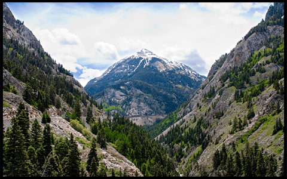
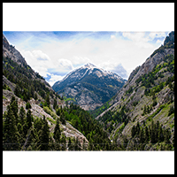
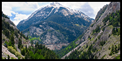

# Resize and crop thumbnail images

Some responses from the Bing Search APIs will include URLs to thumbnail images served by Bing, which you can resize and crop. If you display a subset of these thumbnails, provide an option to view the remaining images.

> [!NOTE]
> Be sure that cropping and resizing thumbnail images will provide a search scenario that respects third party rights, as required by the Bing Search API [use and display requirements](use-display-requirements.md).

## Resize a thumbnail 

To resize an image, you can specify either of the `w` (width) or `h` (height) query parameters in the thumbnail's URL. Specify the width and height in pixels. 

The following example resizes an image to `200x200` pixels:  
  
`https://<host>/th?id=JN.5l3yzwy%2f%2fHj59U6XhssIQ&pid=Api&w=200&h=200`  
  
If you specify only the height or width of a thumbnail, the image's original aspect ratio will be maintained. If you specify both parameters, and the aspect ratio isn't maintained, Bing will add white padding to the border of the image.

For example, if you resize a 480x359 image to 200x200 without cropping, the full width will contain the image but the height will contain 25 pixels of white padding at the top and bottom of the image. The same would be true if the image was 359x480 except the left and right borders would contain white padding. If you crop the image, white padding is not added.  

The following picture shows the original size of a thumbnail image (480x300).  
  
  
  
The following picture shows the image resized to 200x200. The aspect ratio is maintained and the top and bottom borders are padded with white (the black border here is included to show the padding).  
  
  

If you specify dimensions that are greater than the image’s original width and height, the image will be padded with white on the left and top borders.  

## Crop a thumbnail 

To crop an image, include the `c` (crop) query parameter. You can use the following values:
  
- `4` &mdash; Blind Ratio  
- `7` &mdash; Smart Ratio  

### Smart Ratio cropping

If you request Smart Ratio cropping (by setting the `c` parameter to `7`), the image is cropped from the center of the image’s region of interest outward while maintaining the image’s aspect ratio. The region of interest is the area of the image that Bing determines contains the most import parts. The following shows an example region of interest.  
  

If you resize an image and request Smart Ratio cropping, the image is reduced to the requested size while maintaining the aspect ratio. The image is then cropped based on the resized dimensions. For example, if the resized width is less than or equal to the height, the image is cropped to the left and right of the center of the region of interest. Otherwise, the image is cropped to the top and bottom of the center of the region of interest.  
  
 
The following shows the image reduced to 200x200 using Smart Ratio cropping.  
  

  
The following shows the image reduced to 200x100 using Smart Ratio cropping.  
   

  
The following shows the image reduced to 100x200 using Smart Ratio cropping.  
  

If Bing cannot determine the image’s region of interest, the service will use Blind Ratio cropping.  

### Blind Ratio cropping

If you request Blind Ratio cropping (by setting the `c` parameter to `4`), Bing uses the following rules to crop the image.  
  
- If `(Original Image Width / Original Image Height) < (Requested Image Width / Requested Image Height)`, the image is measured from top left corner and cropped at the bottom.  
- If `(Original Image Width / Original Image Height) > (Requested Image Width / Requested Image Height)`, the image is measured from the center and cropped to the left and right.  

The following shows a portrait image that’s 225x300.  
  

  
The following shows the image reduced to 200x200 using Blind Ratio cropping. The image is measured from the top left corner resulting in the bottom part of the image being cropped.  
  

  
The following shows the image reduced to 200x100 using Blind Ratio cropping. The image is measured from the top left corner resulting in the bottom part of the image being cropped.  
  

  
The following shows the image reduced to 100x200 using Blind Ratio cropping. The image is measured from the center resulting in the left and right parts of the image being cropped.  
  

## Thumbnail images from the Bing Image Search API

Use the following information when using thumbnails from the [Bing Image search API](../bing-image-search/overview.md).

If the user clicks the thumbnail or hovers over it, you can use [contentUrl](https://docs.microsoft.com/rest/api/cognitiveservices-bingsearch/bing-images-api-v7-reference#image-contenturl) to display the full-size image. Be sure to attribute the image if you expand it. For example, by extracting the host from [hostPageDisplayUrl](https://docs.microsoft.com/rest/api/cognitiveservices-bingsearch/bing-images-api-v7-reference#image-hostpagedisplayurl) and displaying it below the image.

If `shoppingSourcesCount` or `recipeSourcesCount` are greater than zero, add badging, such as a shopping cart, to the thumbnail to indicate that shopping or recipes exist for the item in the image.

To get insights about the image, such as web pages that include the image or people that were recognized in the image, use [imageInsightsToken](https://docs.microsoft.com/rest/api/cognitiveservices-bingsearch/bing-images-api-v7-reference#image-imageinsightstoken). See the Bing Image Search API's [Image Insights](../bing-image-search/image-insights.md) article for details.

## Next steps

* [What are the Bing Search APIs?](bing-api-comparison.md)
* [Bing Search API use and display requirements](use-display-requirements.md)
