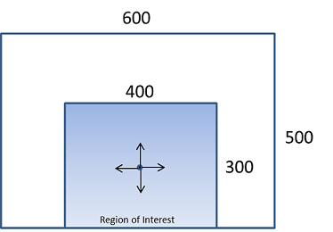

# Resize and crop thumbnail images

Some answers from the Bing Search APIs include URLs to thumbnail images served by Bing, which you can resize and crop, and may contain query parameters. For example:

`https://<host>/th?id=AMMS_92772df988...&w=110&h=73&rs=1&qlt=80&cdv=1&pid=16.1`

If you display a subset of these thumbnails, provide an option to view the remaining images.

> [!NOTE]
> Be sure that cropping and resizing thumbnail images will provide a search scenario that respects third party rights, as required by the Bing Search API [use and display requirements](use-display-requirements.md).

## Resize a thumbnail 

To resize a thumbnail, Bing recommends that you specify only one the `w` (width) or `h` (height) query parameters in the thumbnail's URL. Specifying only the height or width lets Bing maintain the image's original aspect. Specify the width and height in pixels. 

For example, if the original thumbnail is 480x620:

`https://<host>/th?id=JN.5l3yzwy%2f%2fHj59U6XhssIQ&pid=Api&w=480&h=620`

And you want to decrease its size, set the `w` parameter to a new value (for example `336`), and remove the `h`  parameter:

`https://<host>/th?id=JN.5l3yzwy%2f%2fHj59U6XhssIQ&pid=Api&w=336`

If you specify both parameters without maintaining the aspect ratio, Bing will add white padding to the image’s border

If you specify only the height or width of a thumbnail, the image's original aspect ratio will be maintained. If you specify both parameters, and the aspect ratio isn't maintained, Bing will add white padding to the border of the image.

For example, if you resize a 480x359 image to 200x200 without cropping, the full width will contain the image but the height will contain 25 pixels of white padding at the top and bottom of the image. The same is if the image was 359x480 except the left and right borders would contain white padding. If you crop the image, white padding is not added.  

The following picture shows the original size of a thumbnail image (480x300).  
  
  
  
The following picture shows the image resized to 200x200. The aspect ratio is maintained and the top and bottom borders are padded with white (the black border here is included to show the padding).  
  
  

If you specify dimensions that are greater than the image’s original width and height, Bing will add white padding to the left and top borders.  

## Request different thumbnail sizes

To request a different thumbnail image size, remove all query parameters from the thumbnail's URL, except the `id` and `pid` parameters. Then add either the `&w` (width) or `&h` (height) query parameter with the desired image size in pixels, but not both. Bing will maintain the image's original aspect ratio. 

To increase the width of the image specified by the above URL to 165 pixels, you would use the following URL:

`https://<host>/th?id=AMMS_92772df988...&w=165&pid=16.1`

If you request an image that’s larger than the image’s original size, Bing adds white padding around the image as needed. For example, if the image’s original size is 474x316 and you set `&w` to 500, Bing will return a 500x333 image. This image will have 8.5 pixels of white padding along the top and bottom edges, and 13 pixels of padding on the left and right edges.

To prevent Bing from adding white padding if the requested size is greater than the image’s original size, set the `&p` query parameter to 0. For example, if you include the `&p=0` parameter in the above URL, Bing will return a 474x316 image instead of a 500x333 image:

`https://<host>/th?id=AMMS_92772df988...&w=500&p=0&pid=16.1`

If you specify both `&w` and `&h` query parameters, Bing will maintain the image’s aspect ratio and adds white padding as needed. For example, if the image’s original size is 474x316 and you set the width and height parameters to 200x200 (`&w=200&h=200`), Bing returns an image that contains 33 pixels of white padding on the top and bottom. If you include the `&p` query parameter, Bing returns an 200x134 image.

## Crop a thumbnail 

To crop an image, include the `c` (crop) query parameter. You can use the following values:
  
- `4` &mdash; Blind Ratio  
- `7` &mdash; Smart Ratio  

### Smart Ratio cropping

If you request Smart Ratio cropping (by setting the `c` parameter to `7`), Bing will crop an image from the center of its region of interest outward, while maintaining the image’s aspect ratio. The region of interest is the area of the image that Bing determines contains the most import parts. The following shows an example region of interest.  
  

If you resize an image and request Smart Ratio cropping, Bing reduces the image to the requested size while maintaining the aspect ratio. Bing then crops the image based on the resized dimensions. For example, if the resized width is less than or equal to the height, Bing will crop the image to the left and right of the center of the region of interest. Otherwise, Bing will crop it to the top and bottom of the center of the region of interest.  
  
 
The following shows the image reduced to 200x200 using Smart Ratio cropping. Because Bing measures the image from the top left corner, the bottom part of the image is cropped. 
  
 
  
The following shows the image reduced to 200x100 using Smart Ratio cropping. Because Bing measures the image from the top left corner, the bottom part of the image is cropped. 
   

  
The following shows the image reduced to 100x200 using Smart Ratio cropping. Because Bing measures the image from the center, the left and right parts of the image are cropped.
  
 

If Bing cannot determine the image’s region of interest, the service will use Blind Ratio cropping.  

### Blind Ratio cropping

If you request Blind Ratio cropping (by setting the `c` parameter to `4`), Bing uses the following rules to crop the image.  
  
- If `(Original Image Width / Original Image Height) < (Requested Image Width / Requested Image Height)`, the image is measured from top left corner and cropped at the bottom.  
- If `(Original Image Width / Original Image Height) > (Requested Image Width / Requested Image Height)`, the image is measured from the center and cropped to the left and right.  

The following shows a portrait image that’s 225x300.  
  

  
The following shows the image reduced to 200x200 using Blind Ratio cropping. The image is measured from the top left corner resulting in the bottom part of the image being cropped.  
  

  
The following shows the image reduced to 200x100 using Blind Ratio cropping. The image is measured from the top left corner resulting in the bottom part of the image being cropped.  
  

  
The following shows the image reduced to 100x200 using Blind Ratio cropping. The image is measured from the center resulting in the left and right parts of the image being cropped.  
  

## Next steps

* [What are the Bing Search APIs?](bing-api-comparison.md)
* [Bing Search API use and display requirements](use-display-requirements.md)
