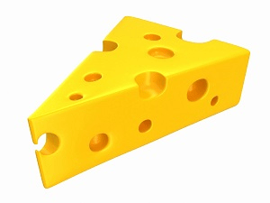
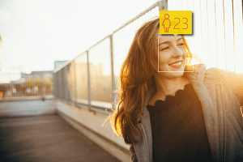

# What is Computer Vision API Version 1.0?

> [!IMPORTANT]
> A new version of Computer Vision API is now available, see:
>- [Overview](https://docs.microsoft.com/azure/cognitive-services/computer-vision/home)
>- [Computer Vision API Version 2.0](https://westus.dev.cognitive.microsoft.com/docs/services/5adf991815e1060e6355ad44)

The cloud-based Computer Vision API provides developers with access to advanced algorithms for processing images and returning information. By uploading an image or specifying an image URL, Microsoft Computer Vision algorithms can analyze visual content in different ways based on inputs and user choices. With the Computer Vision API users can analyze images to:
* [Tag images based on content.](#Tagging)
* [Categorize images.](#Categorizing)
* [Identify the type and quality of images.](#Identifying)
* [Detect human faces and return their coordinates. ](#Faces)
* [Recognize domain-specific content.](#Domain-Specific)
* [Generate descriptions of the content.](#Descriptions)
* [Use optical character recognition to identify printed text found in images.](#OCR)
* [Recognize handwritten text.](#RecognizeText)
* [Distinguish color schemes.](#Color)
* [Flag adult content.](#Adult)
* [Crop photos to be used as thumbnails.](#Thumbnails)

## Requirements
* Supported input methods: Raw image binary in the form of an application/octet stream or image URL.
* Supported image formats: JPEG, PNG, GIF, BMP.
* Image file size: Less than 4 MB.
* Image dimension: Greater than 50 x 50 pixels.

## Tagging Images
Computer Vision API returns tags based on more than 2000 recognizable objects, living beings, scenery, and actions. When tags are ambiguous or not common knowledge, the API response provides 'hints' to clarify the meaning of the tag in context of a known setting. Tags are not organized as a taxonomy and no inheritance hierarchies exist. A collection of content tags forms the foundation for an image 'description' displayed as human readable language formatted in complete sentences. Note, that at this point English is the only supported language for image description.

After uploading an image or specifying an image URL, Computer Vision API's algorithms output tags based on the objects, living beings, and actions identified in the image. Tagging is not limited to the main subject, such as a person in the foreground, but also includes the setting (indoor or outdoor), furniture, tools, plants, animals, accessories, gadgets etc.

### Example
 '

```json
Returned Json
{
   'tags':[
      {
         "name":"grass",
         "confidence":0.999999761581421
      },
      {
         "name":"outdoor",
         "confidence":0.999970674514771
      },
      {
         "name":"sky",
         "confidence":999289751052856
      },
      {
         "name":"building",
         "confidence":0.996463239192963
      },
      {
         "name":"house",
         "confidence":0.992798030376434
      },
      {
         "name":"lawn",
         "confidence":0.822680294513702
      },
      {
         "name":"green",
         "confidence":0.641222536563873
      },
      {
         "name":"residential",
         "confidence":0.314032256603241
      },
   ],
}
```
## Categorizing Images
In addition to tagging and descriptions, Computer Vision API returns the taxonomy-based categories defined in previous versions. These categories are organized as a taxonomy with parent/child hereditary hierarchies. All categories are in English. They can be used alone or with our new models.

### The 86-category concept
Based on a list of 86 concepts seen in the following diagram, visual features found in an image can be categorized ranging from broad to specific. For the full taxonomy in text format, see [Category Taxonomy](https://docs.microsoft.com/azure/cognitive-services/computer-vision/category-taxonomy).


Image		                                           | Response
------------------------------------------------------ | ----------------
                 | people
             | people_crowd
                     | animal_dog
       | outdoor_mountain
       | food_bread

## Identifying Image Types
There are several ways to categorize images. Computer Vision API can set a boolean flag to indicate whether an image is black and white or color. It can also set a flag to indicate whether an image is a line drawing or not. It can also indicate whether an image is clip art or not and indicate its quality as such on a scale of 0-3.

### Clip-art type
Detects whether an image is clip art or not.  

Value | Meaning
----- | --------------
0     | Non-clip-art
1     | ambiguous
2     | normal-clip-art
3     | good-clip-art

Image|Response
----|----
|3 good-clip-art
|0 Non-clip-art

### Line drawing type
Detects whether an image is a line drawing or not.

Image|Response
----|----
|True
|False

### Faces
Detects human faces within a picture and generates the face coordinates, the rectangle for the face, gender, and age. These visual features are a subset of metadata generated for face. For more extensive metadata generated for faces (facial identification, pose detection, and more), use the Face API.  

Image|Response
----|----
 | [ { "age": 23, "gender": "Female", "faceRectangle": { "left": 1379, "top": 320, "width": 310, "height": 310 } } ]
 | [ { "age": 28, "gender": "Female", "faceRectangle": { "left": 447, "top": 195, "width": 162, "height": 162 } }, { "age": 10, "gender": "Male", "faceRectangle": { "left": 355, "top": 87, "width": 143, "height": 143 } } ]
 | [ { "age": 11, "gender": "Male", "faceRectangle": { "left": 113, "top": 314, "width": 222, "height": 222 } }, { "age": 11, "gender": "Female", "faceRectangle": { "left": 1200, "top": 632, "width": 215, "height": 215 } }, { "age": 41, "gender": "Male", "faceRectangle": { "left": 514, "top": 223, "width": 205, "height": 205 } }, { "age": 37, "gender": "Female", "faceRectangle": { "left": 1008, "top": 277, "width": 201, "height": 201 } } ]


## Domain-Specific Content

In addition to tagging and top-level categorization, Computer Vision API also supports specialized (or domain-specific) information. Specialized information can be implemented as a standalone method or with the high-level categorization. It functions as a means to further refine the 86-category taxonomy through the addition of domain-specific models.

Currently, the only specialized information supported are celebrity recognition and landmark recognition. They are domain-specific refinements for the people and people group categories, and landmarks around the world.

There are two options for using the domain-specific models:

### Option One - Scoped Analysis
Analyze only a chosen model, by invoking an HTTP POST call. For this option, if you know which model you want to use, you specify the model's name, and you only get information relevant to that model. For example, you can use this option to only look for celebrity-recognition. The response contains a list of potential matching celebrities, accompanied by their confidence scores.

### Option Two - Enhanced Analysis
Analyze to provide additional details related to categories from the 86-category taxonomy. This option is available for use in applications where users want to get generic image analysis in addition to details from one or more domain-specific models. When this method is invoked, the 86-category taxonomy classifier is called first. If any of the categories match that of known/matching models, a second pass of classifier invocations follows. For example, if 'details=all' or "details" include 'celebrities', the method calls the celebrity classifier after the 86-category classifier is called. The result includes tags starting with 'people_'.

## Generating Descriptions 
Computer Vision API's algorithms analyze the content in an image. This analysis forms the foundation for a 'description' displayed as human-readable language in complete sentences. The description summarizes what is found in the image. Computer Vision API's algorithms generate various descriptions based on the objects identified in the image. The descriptions are each evaluated and a confidence score generated. A list is then returned ordered from highest confidence score to lowest. An example of a bot that uses this technology to generate image captions can be found [here](https://github.com/Microsoft/BotBuilder-Samples/tree/master/CSharp/intelligence-ImageCaption).  

### Example Description Generation
 '
```json
 Returned Json

'description':{
   "captions":[
      {
         "type":"phrase",
         'text':'a black and white photo of a large city',
         'confidence':0.607638706850331
      }
   ]   
   "captions":[
      {
         "type":"phrase",
         'text':'a photo of a large city',
         'confidence':0.577256764264197
      }
   ]   
   "captions":[
      {
         "type":"phrase",
         'text':'a black and white photo of a city',
         'confidence':0.538493271791207
      }
   ]   
   'description':[
      "tags":{
         "outdoor",
         "city",
         "building",
         "photo",
         "large",
      }
   ]
}
```

## Perceiving Color Schemes
The Computer Vision algorithm extracts colors from an image. The colors are analyzed in three different contexts: foreground, background, and whole. They are grouped into twelve 12 dominant accent colors. Those accent colors are black, blue, brown, gray, green, orange, pink, purple, red, teal, white, and yellow. Depending on the colors in an image, simple black and white or accent colors may be returned in hexadecimal color codes.

Image                                                       | Foreground |Background| Colors
----------------------------------------------------------- | --------- | ------- | ------
            | Black     | Black   | White
               | Black     | White   | White, Black, Green
 | Black     | Black   | Black

### Accent color
Color extracted from an image designed to represent the most eye-popping color to users via a mix of dominant colors and saturation.

Image                                                       | Response
----------------------------------------------------------- | ----
            | #BC6F0F
               | #CAA501
 | #484B83


### Black & White
Boolean flag that indicates whether an image is black&white or not.

Image                                                      | Response
---------------------------------------------------------- | ----
      | True
      | False

## Flagging Adult Content
Among the various visual categories is the adult and racy group, which enables detection of adult materials and restricts the display of images containing sexual content. The filter for adult and racy content detection can be set on a sliding scale to accommodate the user's preference.

## Optical Character Recognition (OCR)
OCR technology detects text content in an image and extracts the identified text into a machine-readable character stream. You can use the result for search and numerous other purposes like medical records, security, and banking. It automatically detects the language. OCR saves time and provides convenience for users by allowing them to take photos of text instead of transcribing the text.

OCR supports 25 languages. These languages are: Arabic, Chinese Simplified, Chinese Traditional, Czech, Danish, Dutch, English, Finnish, French, German, Greek, Hungarian, Italian, Japanese, Korean, Norwegian, Polish, Portuguese, Romanian, Russian, Serbian (Cyrillic and Latin), Slovak, Spanish, Swedish, and Turkish.

If needed, OCR corrects the rotation of the recognized text, in degrees, around the horizontal image axis. OCR provides the frame coordinates of each word as seen in below illustration.


Requirements for OCR:
- The size of the input image must be between 40 x 40 and 3200 x 3200 pixels.
- The image cannot be bigger than 10 megapixels.

Input image can be rotated by any multiple of 90 degrees plus a small angle of up to '40 degrees.

The accuracy of text recognition depends on the quality of the image. An inaccurate reading may be caused by the following situations:
- Blurry images.
- Handwritten or cursive text.
- Artistic font styles.
- Small text size.
- Complex backgrounds, shadows, or glare over text or perspective distortion.
- Oversized or missing capital letters at the beginnings of words
- Subscript, superscript, or strikethrough text.

Limitations: On photos where text is dominant, false positives may come from partially recognized words. On some photos, especially photos without any text, precision can vary a lot depending on the type of image.

## Recognize Handwritten Text
This technology allows you to detect and extract handwritten text from notes, letters, essays, whiteboards, forms, etc. It works with different surfaces and backgrounds, such as white paper, yellow sticky notes, and whiteboards.

Handwritten text recognition saves time and effort and can make you more productive by allowing you to take images of text, rather than having to transcribe it. It makes it possible to digitize notes. This digitization allows you to implement quick and easy search. It also reduces paper clutter.

Input requirements:
- Supported image formats: JPEG, PNG, and BMP.
- Image file size must be less than 4 MB.
- Image dimensions must be at least 40 x 40, at most 3200 x 3200.

Note: this technology is currently in preview and is only available for English text.

## Generating Thumbnails
A thumbnail is a small representation of a full-size image. Varied devices such as phones, tablets, and PCs create a need for different user experience (UX) layouts and thumbnail sizes. Using smart cropping, this Computer Vision API feature helps solve the problem.

After uploading an image, a high-quality thumbnail gets generated and the Computer Vision API algorithm analyzes the objects within the image. It then crops the image to fit the requirements of the 'area of interest'. The output gets displayed within a special framework as seen in below illustration. The generated thumbnail can be presented using an aspect ration that is different from the aspect ratio of the original image to accommodate a user's needs.

The thumbnail algorithm works as follows:

1. Removes distracting elements from the image and recognizes the main object, the 'area of interest'.
2. Crops the image based on the identified area of interest.
3. Changes the aspect ratio to fit the target thumbnail dimensions.


