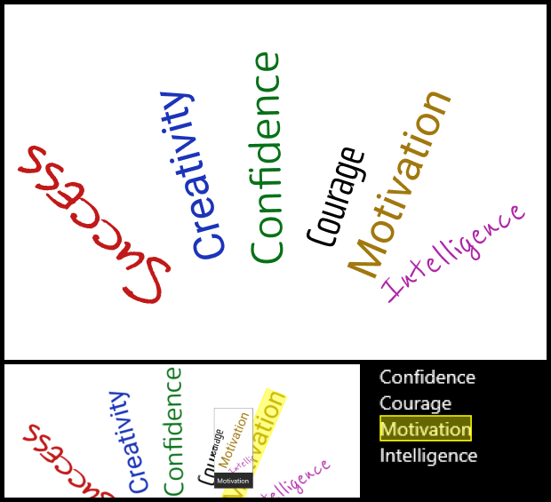
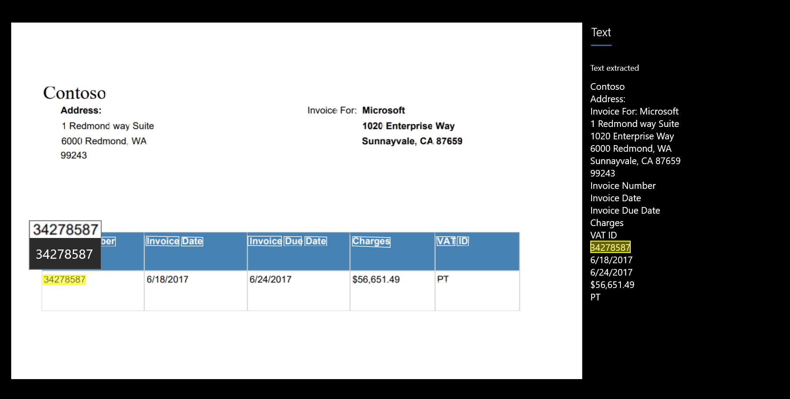
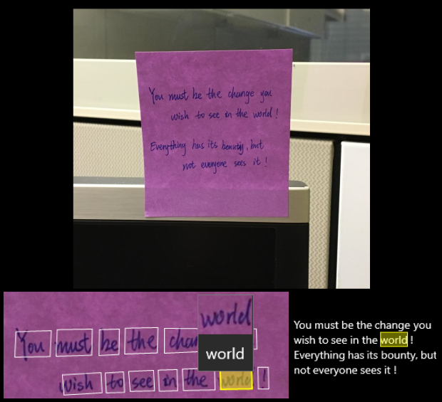

# Optical Character Recognition (OCR)

Azure's Computer Vision API includes Optical Character Recognition (OCR) capabilities that extract printed or handwritten text from images. You can extract text from images, such as photos of license plates or containers with serial numbers, as well as from documents - invoices, bills, financial reports, articles, and more.

## Read API 

The Computer Vision Read API is Azure's latest OCR technology ([learn what's new](./whats-new#read-api-v31-public-preview-adds-simplified-chinese-support)) that extracts printed text (in several languages), handwritten text (English only), digits, and currency symbols from images and multi-page PDF documents. It's optimized to extract text from text-heavy images and multi-page PDF documents with mixed languages. It supports detecting both printed and handwritten text in the same image or document.


### Input requirements
The Read API's **Read** operation takes images and documents as its input. They have the following requirements:

* Supported file formats: JPEG, PNG, BMP, PDF, and TIFF
* For PDF and TIFF files, up to 2000 pages (only first two pages for the free tier) are processed.
* The file size must be less than 50 MB (4 MB for the free tier) and dimensions at least 50 x 50 pixels and at most 10000 x 10000 pixels. 
* The PDF dimensions must be at most 17 x 17 inches, corresponding to legal or A3 paper sizes and smaller.

> [!NOTE]
> **Language input** 
>
> The [Read operation](https://westcentralus.dev.cognitive.microsoft.com/docs/services/computer-vision-v3-ga/operations/5d986960601faab4bf452005) has an optional request parameter for language. This is the BCP-47 language code of the text in the document. Read supports auto language identification and multilingual documents, so only provide a language code if you would like to force the document to be processed as that specific language.

### The Read operation

The [Read operation](https://westcentralus.dev.cognitive.microsoft.com/docs/services/computer-vision-v3-ga/operations/5d986960601faab4bf452005) takes an image or PDF document as the input and extracts text asynchronously. The call returns with a response header field called `Operation-Location`. The `Operation-Location` value is a URL that contains the Operation ID to be used in the next step.

|Response header| Result URL |
|:-----|:----|
|Operation-Location | `https://cognitiveservice/vision/v3.0/read/analyzeResults/49a36324-fc4b-4387-aa06-090cfbf0064f` |

> [!NOTE]
> **Billing** 
>
> The [Computer Vision pricing](https://azure.microsoft.com/pricing/details/cognitive-services/computer-vision/) page includes the pricing tier for Read. Each analyzed image or page is one transaction. If you call the operation with a PDF or TIFF document containing 100 pages, the Read operation will count it as 100 transactions and you will be billed for 100 transactions. if you made 50 calls to the operation and each call submitted a document with 100 pages, you will be billed for 50 X 100 = 5000 transactions.

### The Get Read Results operation

The second step is to call the [Get Read Results](https://westcentralus.dev.cognitive.microsoft.com/docs/services/computer-vision-v3-ga/operations/5d9869604be85dee480c8750) operation. This operation takes as input the operation ID that was created by the Read operation. It returns a JSON response that contains a **status** field with the following possible values. You call this operation iteratively until it returns with the **succeeded** value. Use an interval of 1 to 2 seconds to avoid exceeding the requests per second (RPS) rate.

|Field| Type | Possible values |
|:-----|:----:|:----|
|status | string | notStarted: The operation has not started. |
| |  | running: The operation is being processed. |
| |  | failed: The operation has failed. |
| |  | succeeded: The operation has succeeded. |

> [!NOTE]
> The free tier limits the request rate to 20 calls per minute. The paid tier allows 10 requests per second (RPS) that can be increased upon request. Use the Azure support channel or your account team to request a higher request per second (RPS) rate.

When the **status** field has the **succeeded** value, the JSON response contains the extracted text content from your image or document. The JSON response maintains the original line groupings of recognized words. It includes the extracted text lines and their bounding box coordinates. Each text line includes all extracted words with their coordinates and confidence scores.

### Sample JSON output

See the following example of a successful JSON response:

```json
{
  "status": "succeeded",
  "createdDateTime": "2020-05-28T05:13:21Z",
  "lastUpdatedDateTime": "2020-05-28T05:13:22Z",
  "analyzeResult": {
    "version": "3.0.0",
    "readResults": [
      {
        "page": 1,
        "language": "en",
        "angle": 0.8551,
        "width": 2661,
        "height": 1901,
        "unit": "pixel",
        "lines": [
          {
            "boundingBox": [
              67,
              646,
              2582,
              713,
              2580,
              876,
              67,
              821
            ],
            "text": "The quick brown fox jumps",
            "words": [
              {
                "boundingBox": [
                  143,
                  650,
                  435,
                  661,
                  436,
                  823,
                  144,
                  824
                ],
                "text": "The",
                "confidence": 0.958
              }
            ]
          }
        ]
      }
    ]
  }
}
```
### Get started with SDK and API quickstarts
Get started with the [Computer Vision OCR SDK quickstarts](./quickstarts-sdk/client-library?pivots=programming-language-csharp) and the [Read REST API quickstarts](./QuickStarts/CSharp-hand-text.md) to start integrating OCR capabilities into your applications.

### Supported languages for print text
The [Read 3.0 API](https://westcentralus.dev.cognitive.microsoft.com/docs/services/computer-vision-v3-ga/operations/5d986960601faab4bf452005) supports extracting printed text in English, Spanish, German, French, Italian, Portuguese, and Dutch languages. 

The [Read 3.1 API public preview](https://westus.dev.cognitive.microsoft.com/docs/services/computer-vision-v3-1-preview-1/operations/5d986960601faab4bf452005) adds support for Simplified Chinese. If your scenario requires supporting more languages, see the [OCR API](#ocr-api) section. 

See the [Supported languages](https://docs.microsoft.com/azure/cognitive-services/computer-vision/language-support#optical-character-recognition-ocr) for the full list of OCR-supported languages.

### Supported languages for handwritten text
The Read operation currently supports extracting handwritten text exclusively in English.

### Integrate with the REST API or SDK
The [Read 3.x REST API](./QuickStarts/CSharp-hand-text.md) is the preferred option for most customers because of ease of integration and fast productivity out of the box. Azure and the Computer Vision service handle scale, performance, data security, and compliance needs while you focus on meeting your customers' needs.

### Integrate on-premise wtih Docker containers
The [Read 2.0 Docker container (preview)](https://docs.microsoft.com/azure/cognitive-services/computer-vision/computer-vision-how-to-install-containers) enables you to deploy the new OCR capabilities in your own local environment. Containers are great for specific security and data governance requirements.

### Text from images

The following Read API output shows the extracted text from an image with different text angles, colors, and fonts.



### Text from documents

Read API can also take PDF documents as input.



### Handwritten text

The Read operation extracts handwritten text from images (currently only in English).



### Printed text

The Read operation can extract printed text in several different languages.


### Mixed language documents

The Read API supports images and documents that contain multiple different languages, commonly known as mixed language documents. It works by classifying each text line in the document into the detected language before extracting its text contents.


## OCR API

The [OCR API](https://westus.dev.cognitive.microsoft.com/docs/services/5adf991815e1060e6355ad44/operations/56f91f2e778daf14a499e1fc) uses an older recognition model, supports only images, and executes synchronously, returning immediately with the detected text. See the [OCR supported languages](https://docs.microsoft.com/azure/cognitive-services/computer-vision/language-support#optical-character-recognition-ocr) then Read API.

## Data privacy and security

As with all the cognitive services, developers using the Read/OCR services should be aware of Microsoft policies on customer data. See the Cognitive Services page on the [Microsoft Trust Center](https://www.microsoft.com/trust-center/product-overview) to learn more.

> [!NOTE]
> The Computer Vison 2.0 RecognizeText operations are in the process of getting deprecated in favor of the new Read API covered in this article. Existing customers should [transition to using Read operations](upgrade-api-versions.md).

## Next steps

- Get started with the [Computer Vision Read 3.0 SDK quickstarts](./quickstarts-sdk/client-library?pivots=programming-language-csharp) in C#, Java, JavaScript, or Python.
- Use the [Read 3.0 REST API quickstarts](./QuickStarts/CSharp-hand-text.md) in C#, Java, JavaScript, or Python to learn how to use the REST APIs.
- Learn about the [Read 3.0 REST API](https://westcentralus.dev.cognitive.microsoft.com/docs/services/computer-vision-v3-ga/operations/5d986960601faab4bf452005).
- Learn about the [Read 3.1 public preview REST API](https://westus.dev.cognitive.microsoft.com/docs/services/computer-vision-v3-1-preview-1/operations/5d986960601faab4bf452005) with added support for Simplified Chinese.
