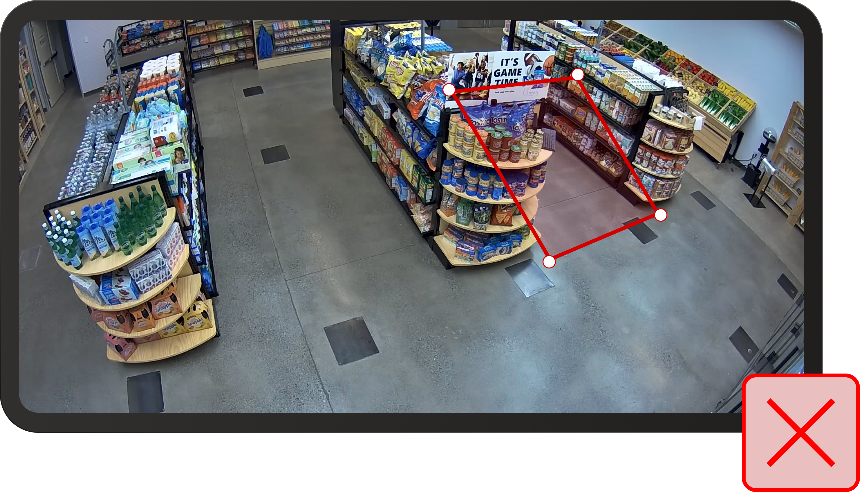

# Zone and Line Placement Guide

## In this article

This article provides guidelines for how to define zones and lines for Spatial Analysis operations to achieve accurate analysis of peoples movements in a space. This applies to **cognitiveservices.vision.spatialanalysis-personcrossingpolygon**, **cognitiveservices.vision.spatialanalysis-personcrossingline**, **cognitiveservices.vision.spatialanalysis-personcount**, and **cognitiveservices.vision.spatialanalysis-persondistance**. 

Zones and lines are defined using the JSON SPACEANALYSIS_CONFIG parameter. See the [Spatial Analytics operations](spatial-analytics-operations.md) article for more information.

## Guidelines for drawing zones

Remember that every space is different; you'll need to update the position or size depending on your needs.

If you want to see a specific section of your camera view, create the largest zone that you can, covering the specific floor area that you're interested in but not including other areas that you're not interested in. This increases the accuracy of the data collected and prevents false positives from areas you don't want to track. Be careful when placing the corners of your polygon and make sure they're not outside the area you want to track.  

### Example of a well-shaped zone

The zone should be big enough to accommodate three people standing along each edge and focused on the area of interest. Spatial Analysis will identify people whose feet are placed in the zone, so when drawing zones on the 2D image, imagine the zone as a carpet laying on the floor.

### Examples of zones that aren't well-shaped

The following examples show poorly shaped zones. In these examples, the area of interest is the space in from of the **It's Game Time** display.

**Zone is not on the floor.**

 

**Zone is too small.**

**Zone doesn't fully capture the area around the display.**

**Zone is too close to the edge of the camera image and doesn't capture the right display.**

**Zone is partially blocked by the shelf, so people and floor aren't fully visible.**

### Example of a well-shaped line

The line should be long enough to accommodate the entire entrance. Spatial Analysis will identify people whose feet cross the line, so when drawing lines on the 2D image imagine you're drawing them as if they lie on the floor. 

If possible, extend the line wider than the actual entrance. If this will not result in extra crossings (as in the image below when the line is against a wall) then extend it.

### Examples of lines that aren't well-shaped

The following examples show poorly defined lines.

**Line doesn't cover the entire entry way on the floor.**

**Line is too high and doesn't cover the entirety of the door.**

## Next steps
